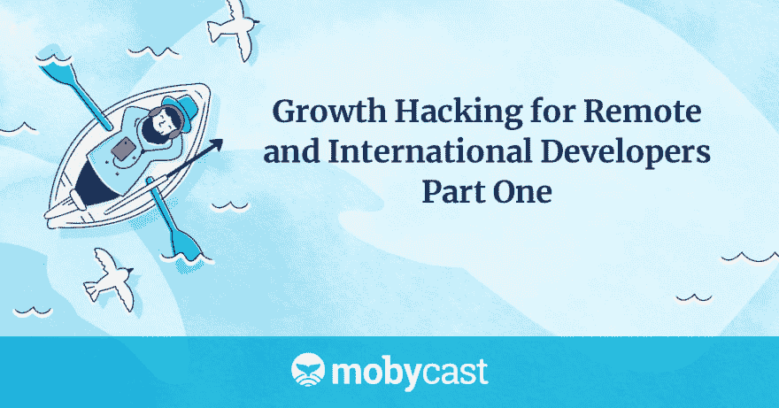

# 远程和国际开发人员的增长黑客-第 1 部分

> 原文：<https://dev.to/jonxtensen/growth-hacking-for-remote-and-international-developers-part-1-1i4i>

凯尔萨斯的克里斯·希克曼和乔恩·克里斯滕森，以及 Secret Stache 的 Rich Staats，讨论了与远程和国际工程团队合作时学到的经验教训。

该节目的一些亮点包括:

*   Jon 的优秀经历:他职业生涯的大部分时间都在与国际团队成员一起工作，有些人后来成为了首席技术官(CTO)和首席架构师
*   国际机遇:乔恩加入了班加罗尔的行列，自愿去印度帮助雇佣一个团队
*   两个团队，混合的结果:一个高绩效团队，一个非常低绩效团队
*   克里斯出现了:他已经在美国和其他地方为高绩效团队工作并管理过；现在在凯尔萨斯被称为“运输安全管理局随机通信员”
*   两大挑战:成为虚拟团队和与非美国开发者打交道
*   我们与他们的心态:如果你雇用一个远程或国际团队，离岸，近岸，或其他，它的成本更低，但它不是那么好
*   朋友还是敌人？第一次与团队成员面对面，了解他们以建立关系；
*   尽管存在文化差异，公司仍然需要高绩效的团队
*   成功的最佳指标:一个人是否拥有软件技能取决于他们在高绩效团队中花费了多少时间

*转录*
里奇:在 Mobycast 的第 71 集，乔恩和克里斯讨论了与远程和国际工程团队合作时学到的经验教训。欢迎来到 Mobycast，这是一个关于云原生开发、AWS 和构建分布式系统的每周对话。让我们直接开始吧。

乔恩:欢迎，克里斯和里奇。又是一集 Mobycast。

嘿，回来真好。

乔恩:很高兴你回来了。今天，我想我们将直接进入主题，因为今天的节目不太讲细节，更多的是讲故事。我们想了解 Chris 在职业生涯中经历的一些转变，开始与 Kelsus 合作，开始与远程和海外团队合作。Rich，你看我们的一些分析比我看得多，但我认为我们的许多听众来自海外，可能远程工作，这就是我们正在与之交谈的观众。我想我们今天想直接为你工作。对吗，瑞奇？

里奇:我其实不知道。我可能会发现，因为我们通过这个，但这是一个很好的问题。

Jon:好吧，也许我对分析的关注比我表现出来的要多。是真的。

里奇:好吧。

乔恩:你好，国际听众。感谢您的聆听。我的职业生涯主要是在国际团队中完成的，从 2001 年开始，我在一家名为 StorePerform 的公司工作。我们有一个美国团队，这是一个非常高效的团队。这个团队中的一些人现在是大型对冲基金的首席技术官，你们可能听说过，他们是纳斯达克的首席架构师。这些人非常优秀。

其中一个是 Twitter 的首席架构师，他们是我 2001 年工作过的团队中非常优秀的开发人员。当我在那里的时候，公司的领导层是印度人，那个人[…]决定他想在印度有一个团队，因为他来自那里，他只是想从他来的地方回报一点点，我自愿去那里雇佣一个团队。

2001 年，在班加罗尔这样做还为时过早。当我参观的时候，我没有看到其他人在做和我一样的事情，而且很容易找到人。两年后，也就是 2003 年，我回去了，但情况完全不是那样。从那以后我再也没有回去过，但是我想如果我现在去那里，我甚至会认不出那个地方。它将会是印度的硅谷。

无论如何，我不想把我自己的故事写得太长，但我想说的是，在我雇佣了印度的那个团队后，我们发现我们有两个完全不同的团队。我们有一支高水平的团队和一支非常优秀的团队。我不是在责怪印度的团队；这只是事实。我们经历了一个好的和一个坏的。

从那以后，我和世界各地的不同团队合作过。我曾与尼泊尔、泰国和南美的团队合作过，最终我来到了 Kelsus，并组建了一支我与之共事了 11 年的团队，我称之为高绩效团队。他们是一个非常好的团队。Chris 几年前来到这里，他的整个职业生涯都在为高绩效的[…]工作，并管理高绩效的团队。

对他来说，这是一个旅程，从在美国团队内部工作转换到与一个远程团队合作，他在带领 Kelsus 团队从中级到高级再到极高性能方面发挥了重要作用。Chris，我只想和你谈谈那段经历，谈谈从美国团队转到 Kelsus 工作的经历。我想，让我先问一个问题，当你第一次加入我们的时候，你期望什么？你的期望是什么？

克里斯:只是 TLDR 会，我预料到了意想不到的，真的。我真的不知道会发生什么，这是一次新的经历。这两种方式:一种是完全虚拟的公司，对我来说有点新鲜。我以前在完全虚拟的公司工作过。我的 bootstrap 初创公司是一家虚拟公司，但那都是和我以前一起工作过的人，所以有点不同。

乔恩:你为凯尔萨斯工作吗，克里斯？我们不是一家完全虚拟的公司。我们在阿根廷的 Resistencia 有一个实际的办公室，每天都有人来，在阿根廷的 Corrientes 也有一个办公室。

克里斯:对我来说是虚拟的。从我的角度来看，对吗？只是看什么镜头的问题。但是绝对的，是的。我们确实有租约和实际办公空间。

乔恩:我刚才提出来是因为根据我自己的经验，我想我已经去过这些办公室两次了。当我去那里的时候，它让我大吃一惊。就像，“什么？我 11 年前创立的这家公司有办公室吗？”好吧，我想我们有办公室了。总是让人惊喜。去吧。

Chris:这是作为虚拟团队的一个主要区别，另一方面是与非美国开发人员打交道。我有一些这方面的经验，但更切题的是，就像我说的。我在几家公司工作过。我为一家移动软件开发公司工作，它对我来说更大。我加入的时候大概有 600-700 人，最近才上市。他们仍然是一家非常年轻的公司，但发展很快。当我加入他们的办公室时，工程团队可能有 20-30 人，但事实证明，我们在印度实际上有一个完整的离岸开发团队，而且实际上还在增长，但对我来说，这有点像黑箱。这一直是个谜。

乔恩:这太典型了。所以很多时候公司只是把团队分开，“哦，是的。在海外的其他地方有一个黑马团队，“或者在东欧，或者在印度，或者在[…]或者其他一些地方，中国和美国的开发者甚至不知道该做什么。我认为这有点可怕。

乔恩:对。对我来说这不是一次好的经历。在这种模式下，我没有很高的能力，因为我不知道他们在做什么，为什么要这么做，而且他们的工作时间完全不同。就好像，我早上来，看到前一天晚上发生的事情的结果，现在构建失败了。只是代码中的主要拼写错误，就像这样，“这是怎么回事？我们真的要为此付钱吗？这看起来并不是什么大不了的事情。”

乔恩:再次打断你，那也是我在 StorePerform 的最初经历。尽管我加入了创意团队，但我认为公司内部比我职位高的人，如工程副总裁或首席技术官或其他人，都试图照顾我们这些不希望这个团队存在的开发人员的感受，他们对此颇有微词，所以他们只是说，“是的，乔恩。你做印度的事情，并确保它不会对美国的事情产生太大影响。把它们分开就行了。”那是我的工作。我可以说，它就是不起作用，这已经是一个教训。如果你要这样做，在你的远程团队中创造我们对他们的情况是一个失败的好方法。

克里斯:是的，当然。我认为这肯定触及了一个非常现实的问题，这是行业本身的问题，尤其是美国开发商的问题。有种感觉，“我们是世界上最好的。我们是唯一的世界级开发商，我们最值得投资。我们有最好的薪水，最高的税率。”如果你去雇用一个远程团队或国际团队，离岸，近岸，或任何它花费更少，它不是那么好。

我认为，就像我所说的，你所描述的整个心态就像是处理和管理。管理层认为或担心美国团队会有一些士气问题，只是对其他团队所做工作的看法问题。没有整合。它试图在他们之间建起那堵墙。就像是，“别担心。这里什么也没有发生。”

Jon:没错，但企业并不这么认为，所以这是不正确的。

克里斯:对。

乔恩:那会给你留下不好的印象。我特别记得的另一个经历是，我们很早就开始合作，当时贵公司是 Kelsus 的客户，而不是直接客户。凯尔萨斯是另一家公司的分包商，我就不说了。你和我一起工作。我特别记得你给我发了一封电子邮件或信息，说，“嘿，这个代码怎么了？”这是我得到的代码，仍然适用于 Kelsus，事实上我已经写了。它就像一行 100 个字符长的奇怪的节点检查之类的东西，读起来很难看。我只记得我当时想，“哦，克里斯在读我们的代码。这是怎么回事？”这对凯尔萨斯来说是独一无二的。你还记得吗？

克里斯:对。我觉得可能发生过几次。我的角色是，我是你和那个团队的主要接口。我在编写大部分后端服务和 API，而你的团队在构建移动客户端，所以在一天结束时，我必须确保整个事情端到端地工作，对吗？一部分原因是我做了大量的测试和应用程序的使用。获得它的新版本，查看它，当然，我们可以访问代码库。直到今天，我对所有通过的代码进行代码审查，但肯定会很快地查看[……]。

乔恩:你就像凯尔萨斯的运输安全管理局随机信号员。

克里斯:对。这是其中的一件事，有些事情总是会突出。在你谈论的那个特定案例中，我认为实际上是一个错误导致了一个问题，然后我去看了看[…]，当我看到时，我就想，“哦，得了吧。这样不好。”

乔恩:[……]五年前。我只记得看到它的时候，“哇。”因为(一)我知道你不是 iOS 开发者，所以我真的没想到你会看 iOS 代码。另一件事有点像，“哈，我甚至都没有回顾[……]我自己。”我只是做了一些测试，一些黑盒测试，但我没有看它的代码。就像，“来吧，乔恩。你知道得更清楚。你应该帮助[……]团队中的其他人查看他们的代码，并给出要做什么的例子。”在我以前的经验中，我看到每当我写代码时，或者有另一个人，我们与凯文·巴恩斯一起工作了很多，每当他写代码时，突然之间，团队其他人的代码会开始看起来很像我的或凯文的。

我当时想，“好吧。团队正在以身作则。”突然，Chris 加入进来，他就像一个新的例子，他对 Objective-C 这种相当晦涩难懂的语言的快速掌握让我震惊。如果你从来没有看过 Objective-C，而你第一次看它，你甚至很难说出什么是函数调用。首先是他很快掌握了这一点，其次是他真的很注意我们的质量。我知道我们可以让尼克和克里斯在队里即兴表演。那一刻最终导致克里斯加入凯尔萨斯。如果你没有那样做，我想我们永远不会在一起工作。那不是很疯狂吗？

克里斯:对。毫无疑问。你永远不知道你要走的路，不知道有什么背景。

乔恩:对。是你做了一些反馈，并最终创造了这种伟大的尊重。克里斯真的很在行。然后你加入了我们，正如你已经说过的，你知道期待意想不到的事情。我认为你和我们一起工作的第一次经历是和每个人见面。这对你有什么影响？你从中得到了什么？

克里斯:时机把握得很好。我是在一月份加入的，我花了几周的时间在团队中安顿下来，在虚拟团队中建立联系，并通过视频电话每天与这个在阿根廷的团队进行互动，但大约两三周后，我们进行了一次异地面对面的交流，但我们都在乌拉圭见面，我在那里面对面地与每个人见面，并花了一周时间与他们的家人相处，了解他们和他们的家人，等等。从时间的角度来看，非常偶然。它有助于建立联系和关系，理解一些细微差别、文化差异等等。毫无疑问，这对我来说是一次很棒的经历。

乔恩:我记得你告诉我的一件事，也许你只是对新老板好，因为那是我们一起工作的开始。你对我说了一些或多或少类似的话，“我以前真的没有过喜欢花时间和同事在一起的经历。”你能详细说明一下吗？

克里斯:是的，我完全是在撒谎。不，我是认真的。我认为这真的有很大的优势，我已经开始欣赏与国际团队合作，特别是我们在阿根廷的团队是文化差异。在美国，我曾在压力很大、高性能、高要求的团队中工作过，在那里你要和你的开发伙伴竞争。这可是真金白银。你的职业生涯岌岌可危，股票期权，奖金。你们在互相争斗，所以这真的创造了这种让你们互相争斗的文化。你处在一个非常紧张、疯狂的环境中。我最不想做的事就是在电影院或类似的地方和这种人出去玩。这有点阻碍了情感联系和共鸣。它非常劝阻。

乔恩:对。在这样的球队中，真正的球员会创造紧密的联系，然后互相削弱。

克里斯:暗箭伤人者。就这些，对吧？

乔恩:是的。

克里斯:你可以玩政治游戏，我不只是擅长这个。这么做感觉很不对。随着速度的到来，主要是在阿根廷队，真正让我震惊的是，“这不是他们的文化。”这是一种“我们”而不是“我”的哲学。他们喜欢和彼此在一起，一起工作，胜利是作为集体胜利而不是个人胜利来庆祝的。他们不把对方视为对手。他们真的把自己看作一群人，在很大程度上，朋友比工作更重要。这并不是说他们不努力工作，也不是说他们的思维定势非常高。他们喜欢学习和合作。这只是一种不同的文化感觉。

Jon:你刚才提到了庆祝团队胜利，实际上今天，我刚刚和[…]聊了聊，我想，他们正在为 ZooPix 制作一个直接消息功能，这将非常棒。对于 ZooPix 的人来说，能够在公众视野之外相互交谈是一件很酷的事情，但这是一场空，我知道这对每个人来说都是一种拖累，所以我想，“[…]，当你完成这一切时，也许你应该为团队庆祝一下。”然后我突然想到，我想，“哦，也许你应该把公司里的其他人也包括进来。”[……]就像是，“那太棒了，”然后就像是，“是的，当然，你必须包括整个公司，因为这就是它的工作方式。”你不能让 ZooPix 团队独自庆祝。这是公司的胜利。

克里斯:对。

乔恩:好的。我意识到我打断了你，我不记得你到底想说什么，但是我们在讨论你对这个团队的第一印象以及他们的团队精神。我想回顾一下我对这个团队的第一印象，因为我在你之前的许多年同时遇到了这个团队的所有核心成员。我只想很快地讲述这个故事，因为对我来说这是一个类似的故事。

我是一名个体承包商，和我的妻子住在乌拉圭。我之前在丹佛的创业公司做业务开发和产品管理。我们在乌拉圭呆了一年，只是为了好玩，我的客户任务邀请我，不幸的是，这已经不存在了，但他们让我去阿根廷雇佣一个团队。其实我会很具体的。Roshan Cholas 仍在团队中，她是[…]创始人之一的嫂子，当时她正从圣地亚哥搬到阿根廷居住。她要嫁给[…]，他们结婚至今，他要成为阿根廷一个团队的成员和[…]的软件开发人员，他们要做 Flex，Adobe Flex。

然后 Kevin 说，“Jon，去阿根廷雇佣一个 Flex 开发团队，”因为 Roshan 是一名土木工程师，不具备雇佣团队的技能。我从蒙得维的亚飞到阿根廷的里斯蒂西亚，并且[……]在这所大学——里斯蒂西亚的国立技术大学——贴了一份职位说明，并说我可以参加面试。

我采访的第一个人——也许不是第一个——但我认为费德里科·图基是我采访的第一个人。我就想，“哇，太酷了。这家伙真热情。他具备成为软件开发人员所需的基础知识。”当然，他不知道 Flex，他的工作经历是他为某个公司或政府实体开发的这个糟糕透顶的 Java 程序。太糟糕了。就像，“哇，我从大学开始就没见过这么差的软件。”

然后费德让他所有的朋友也去采访。有[…]、劳尔·赫尔曼、罗德里戈·贝沙拉和乔纳森·迪亚兹。所有被采访的人。[……]已不在凯尔萨斯工作，因为他去了爱尔兰。我在爱尔兰得到了一份非常棒的工作，为世界上最大的会议之一工作，但是其他人——约翰尼、劳尔和罗德里戈——仍然和我们在一起。其实我一开始没选罗德里戈。我可以说这真的伤害了费德的感情，我没有选择罗德里戈，这是一个错误，因为罗德里戈是我们最好的人之一。我只是在那次面试中看不到他对软件开发的奉献和热情，所以我决定不和他一起去，而费德说，“不，罗德里戈是最好的之一。你应该雇用他。”后来我们做到了。

你刚刚谈到这个团队似乎互相关心，真的，我不太愿意说家人，因为这有一种负面的含义，特别是在美国，说你的团队是一个家庭，这违反了美国的规则，但这是我的感觉。

克里斯:对。这绝对是我在乌拉圭亲自见到他们时感受到的氛围。一些小事让我震惊。比如坐在餐桌旁，有人注意到某人的杯子没满，于是又给他们的杯子倒满水。只是互相看着对方，这对我来说太令人兴奋了。

乔恩:没错。我们已经确定，在阿根廷有这种不同的文化，也许只是阿根廷的北部，也许只是这种特殊的人群，但我认为关键是不同的地方有不同的文化。最终，仍然需要一个有特定需求的高性能软件开发团队。要成为一个高性能的软件开发团队，你必须做一些事情，尽管你的文化对此并不重要。你还是要做那些事情。

克里斯:对。这肯定不是所有的玫瑰，对不对？就像我对美国团队与国际团队之间的差异的一些初步印象是真实的。有很多积极的方面让我感到惊讶。资产，可以利用的优势，但是再看看工具和技术，人们用来开发软件的过程，它肯定不在我习惯的水平上。肯定有一些挑战，比如，“好吧，我们如何升级？我们如何结合两全其美？”成为一个高绩效的团队，而不是一群以自我为中心的混蛋。

乔恩:我想强调这一点，因为我认为这强调了我们为什么要讨论这个问题。这是我的经验，也是我们的理论，我认为在高性能团队中度过的时间是软件技能的最佳指标。不仅仅是你上了什么大学。它比你的 GitHub 存储库中有更多。比你参加的 Udacity 和 Udemy 课程都多。事实上，这些有时甚至会让你变得更糟。衡量一个人是否有很多软件技能的最佳指标是他们在高绩效团队中花了多少时间。同意吗，克里斯？

克里斯:我认为这绝对是一个非常好的指标，因为就本质而言，高绩效团队如果有人表现不佳或不在同一水平，他们会很快被淘汰，自然减员就会发生。如果你是一个高绩效团队的一员，并且你一直呆在那里，这意味着你可能是一个有价值的贡献者，并且你的表现处于同一水平。如果你没有，如果这是一个招聘错误，或者你只是不能在那个水平上表现，或者躲在别人的工作后面，人们会闻到这一点，他们知道这一点。游戏中也会出现怨恨。如果你加入了一个高绩效的团队，并且已经在这个高绩效的团队呆了一段时间，这是一个很好的迹象。

乔恩:对，这是我们的理论，然后你走进来，看到这群人喜欢一起工作，喜欢互相帮助，本质上你想做的是你想把你在高绩效团队中学到的东西应用到这个团队中，对吗？

克里斯:当然。是啊。

乔恩:里奇，我们已经谈了多久了？

里奇:持续大约 30 分钟。

乔恩:在这一点上，我们已经奠定了基础，我们知道你来自哪里，你的期望是什么，我认为这只是一个有趣的故事。我认为我们应该做的是结束这个故事，如果我们应该讲述这个故事的其他部分，也许下周我们可以谈论，“好了，足够的故事时间，你如何建立一个高绩效的团队。”

克里斯:我想我们已经涵盖了那里的风景。这是典型的美国团队，期望，文化和人们的工作方式，这是对离岸远程团队的偏见，因为他们更便宜，质量没有那么高，不能做更重的事情，这肯定不是必须的。在 Kelsus，我们很幸运地利用了来自远程国际团队的一些优势和资产，然后通过指导、辅导、成长黑客和成长心态来提升并成为一个高绩效的团队。你是怎么做到的？我们仍在旅程中。我们已经走了很长一段路。下一次我们可以讨论一些实际问题。

乔恩:是的，我想我们就这么做吧。为了结束这个故事，我想我还想讲另一个故事来说明关于高绩效团队的另一个观点。这是一个关于一小群聪明人在短时间内不做正确的事情也能产生高绩效团队的故事，有人必须讲述这个故事，因为这是不一样的。

这是一个假的高绩效团队。几年前，在 2015 年底和 2016 年初，我们与英特尔的一个团队合作，为英特尔在消费电子产品展 CES 上的主题演讲制作音乐体验，这是世界上最大的会议，拉斯维加斯的 20 家酒店有 60 万人参加。太可笑了，这么大。他们做了一个主题演讲，我甚至不知道有多少个主题演讲，是主要的还是有 500 个主题演讲。我只知道这是英特尔的主题演讲，它是大会上的第一个主题演讲之一，对我来说很重要。

当我们加入那个团队时，我发现他们基本上是一群非常聪明的人，被一种以自我为中心的领导者所驱使，他们只会不断地添加，直到为时已晚。这就是他的心态，“我能把什么塞进这个东西，我还能给它增加多少，直到它基本上是表演的时候了？”我就想，“这是怎么回事？我认为我们确实使用了 Git，但它甚至不是 Intel one。这是我以前合作过的一些聪明的开发者，我们最好使用存储库。

然后我们没有交流，但是同一个开发者说，“我刚刚做了我自己的[…]”我当时想，“真的吗？”他就像这样，“让我们有这个照明功能。让我们有这个新的配置。让我们建立一个监控系统。”我们只是不停地说，“好吧，我们只是试着添加它，一层又一层地添加更多的功能，直到为了完成任务，每个人都必须留在拉斯维加斯。幸运的是，威尼斯人在 CES 上领先了 14 天。整整 14 天，这 14 天里我们每天至少工作 12 个小时，感谢上帝凯尔萨斯是按小时收费的。

就这样，费德和我在拉斯维加斯尽我们最大的努力拯救世界，并英勇地完成任务。最后，它爆炸了。我不能说它一帆风顺，但我们做了表演，基调或多或少是成功的。我认为如果再多一点纪律，它可能会成功，但这只是高绩效团队的替代品。这是一个由聪明人组成的团队，他们在很短的时间内完成了大量的工作。当我们谈论高绩效团队时，我们谈论的不是这个。一个高绩效的团队能够保持高绩效，你只能在短时间内做到我所说的。

克里斯:对。你也在掷骰子。你不会像在那种特殊的情况下那样，它进行得很好，但它可能很容易走向另一条路，并可能成为一场灾难。

乔恩:是的，没错。我们下周再详谈。这将是我们谈论过的使一个伟大的软件开发人员的一些事情，但更具体地说是远程和独立的开发人员。人们独自在外为凯尔萨斯做事。很期待。

克里斯:当然。下周见。

乔恩:好的，下周再聊，克里斯。谢了。

里奇:以后吧。

乔恩:再见，里奇。

亲爱的听众，你坚持到了最后。感谢您抽出时间，并邀请您继续与我们在线交流。这一集，以及显示笔记和其他宝贵的资源可在 mobycast.fm/71.如果你有任何问题或额外的见解，我们鼓励你给我们留下评论。谢谢你，我们下周再见。