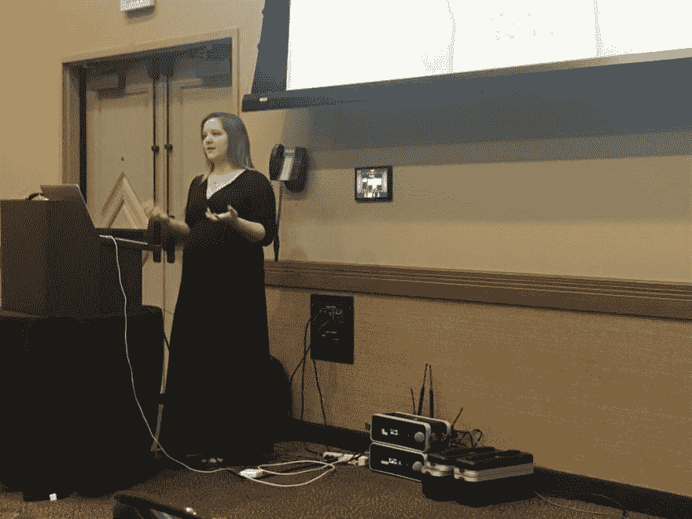

# 冒名顶替综合症、焦虑和我

> 原文：<https://dev.to/kaydacode/imposter-syndrome-anxiety-me-5372>

嘿，是我。自从我发帖以来已经有相当一段时间了，所以我想借此机会倾倒很多想法，挣扎和脆弱。请善良，因为这主要是我内心的声音，试图帮助你内心的声音:)。

## 怀孕工程师？

如果你在推特上关注我，那么你应该知道发生了什么。如果你没做好，惊喜吧！对我来说，怀孕 6 个月左右，也就是 1 月，事情开始变得缓慢。事实是——作为一名怀孕的开发人员是完全不舒服的。我摇摇摆摆地参加会议，不得不把肚子埋在桌子底下，或者在肩膀的高度打字，不得不在脸上掩饰被捅到肝脏的疼痛..让我告诉你如何尝试用怀孕大脑编码。

如果没听说过孕脑，本质上是认知能力下降。没有研究支持这种现象，所以很明显这只是孕妇们一起密谋的事情。；)所以怀孕的大脑让生产变得非常非常困难。怀孕前，我一直在努力与自己和自己能够生产的东西竞争。尽管我的经理和团队非常支持我，但我无法摆脱让人们失望的感觉..不管这是不是真的。

在我整个怀孕期间，焦虑一直伴随着我，随着预产期的临近，焦虑变得更加严重。当我不在的时候，焦虑会错过，当身体跟不上的时候，我会高效地向前推进。医生的预约，我的情况所需要的额外测试，这一切都是为了在一个永远发展的领域中保持领先。

<figure>

<figcaption>Non-Stress Tests 2x a week for the last 12 weeks, meaning 💩 could have hit the fan at any minute, and these were supposed to help detect it. Not stressful.. what so ever. 😶</figcaption>

</figure>

## 怀孕的演讲者？

此外，我被允许在 Codemash 演讲！在 Codemash 演讲是我过去几年的一个目标。进入其中，我很兴奋能以不同的角度代表科技领域的女性，我做到了(顺便说一句，我成功了)。看看这张第一排的照片和我尴尬的句子中间的照片，把 krakens 从演讲中提出来。

在这次经历中，我真正没有预料到的是一直困扰我的冒名顶替综合症(和焦虑)的感觉。“我忘了练过的东西怎么办？”，“说错话后有人叫我出来怎么办？”(嘿怀孕的大脑)，“如果 Xcode 认为它已经受够了怎么办”，以及最糟糕的一个“我对 iOS 的了解足够多吗？”。是啊，六年多过去了，这个想法仍然在我脑海中萦绕。可笑不是吗？

## 你不在的时候..

休产假带来了很多情绪和想法。首先，休假时间的长短。我正在利用 Expedia 为初为人父母者提供的一项非常慷慨的政策，而仅仅 6 周和 8 周后就重返工作岗位更符合行业标准！不是太友好，但我怀孕前的衣服在 8 周时都不合身。还有荷尔蒙..当你因为代码出错而在洗手间哭泣时，公司怎么能指望你不仅高效，而且表现正常呢？

我跑题了。我远离代码、工作、成人日程以及这两者之间的一切的停机时间给了我很多时间来反思过去的经历。顺利的事情和不顺利的事情。我非常想与你分享这些想法，写博客并帮助他人。说实话，在过去的一个月里，我已经写了大约 10 篇博客，但由于冒名顶替综合症，我已经把它们删除了。“谁想听这些废话”和“你是谁？”。冒名顶替综合症只会让我止步不前。我在对抗它方面做得很好，但它总能找到办法把我吸回来。最近，它和我的焦虑一起真正上演了一场秀。

此外，我有时间思考我的职业发展方向。当我回去工作时，我非常想从我离开的地方重新开始，重新开始，就像我从来没有出去过一样。我知道那不可行。六月有一部 WWDC，我还没看完。今年秋天将会有新的 Xcode 和 Swift 以及其他各种框架。还会有我错过的所有功能和工作，我需要加速。这真的只是表面，我相信还有很多我现在还不知道的东西需要我去弥补，嘿，开发者社区！

## 外卖

与你们分享这一切，有几点我想大声说出来

*   每个人都会经历冒名顶替综合症，不管你有多有经验
*   给自己或家人留点时间没关系，当你回来的时候，世界还会在这里
*   提醒自己^^^是很重要的
*   有精神疾病真的很难控制。它对我职业生涯的阻碍大于帮助，如果你也有同样的情况，我希望你能找到应对或克服的方法。
*   如果你累了，趁早休息一下。虽然我不愿意承认，但我已经准备好离开科技行业，但有时间专注于个人事务让我感觉精力充沛，精神焕发，并准备好应对接下来的事情。
*   如果你因为个人原因需要离开，你会得到比你意识到的更多的支持。给自己留些时间，因为如果你感觉不到自己的最佳状态，你就无法发挥出自己的最佳水平。

感谢您抽出时间阅读或浏览。我希望分享这些脆弱的想法能让我自己重新写博客，也希望能帮助其他处于同样处境的人。