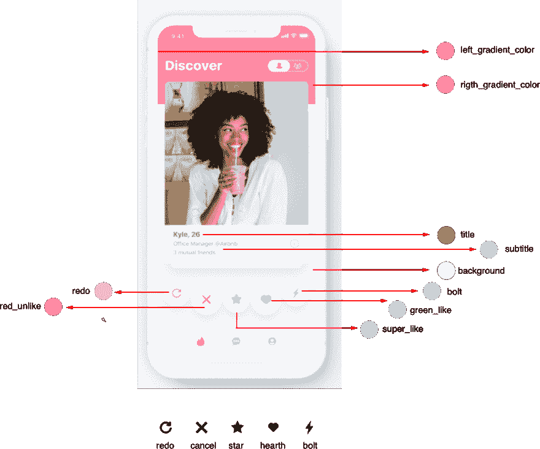
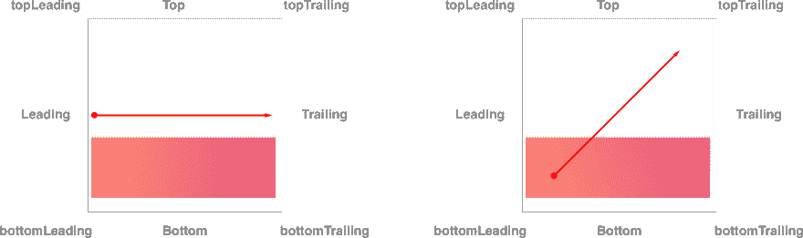
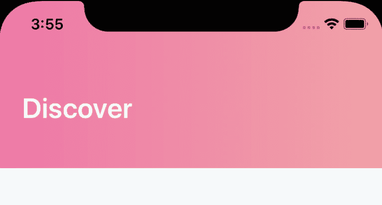
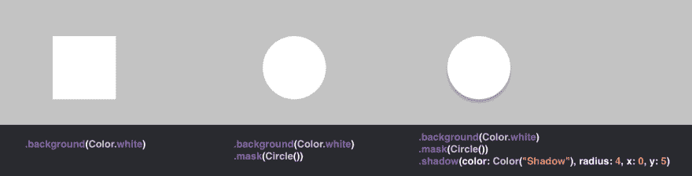
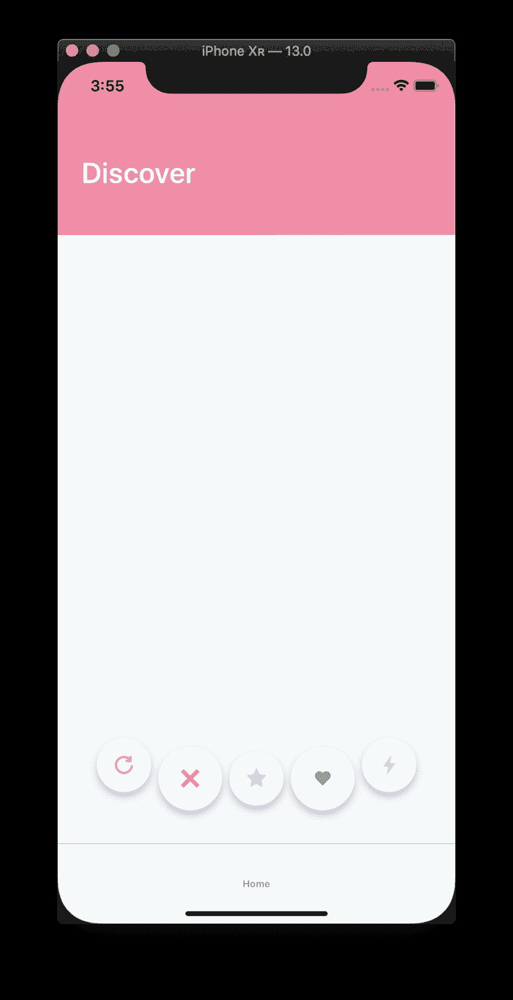

# 在 SwiftUI 中创建 tinder ui 第一部分:渐变和按钮

> [https://dev . to/transmission/creating-ui-al-tinder-in-swiftui-part-I-gradients-y-buttons-57cm](https://dev.to/transmigrado/creando-ui-al-estilo-tinder-en-swiftui-parte-i-gradientes-y-botones-57cm)【传输/创建-ui-al-tinder-in-swiftui-part-I-gradients-y-button-57cm】

这是我第一篇关于移动开发的文章，我的目标是演示如何创建复杂的界面，即它们具有微交互、手势交互、动画等。

在此例中，我们将演示如何安装 Tinder 中央界面，您将在其中通过给出 like 或 unlike 来游泳申请者的脸

我假设你对 Swift 有所了解，而且你已经知道它是 SwiftUI，所以不要解释语言细节，也不要深入讨论 swift ui，此外，在那里已经有很多帖子发展了苹果公司开发的这一精彩框架的基础知识。

* * *

### 堆栈

**Xcode**11.0 Beta 4(11m 374 r)
T3】MAC OS Catalinaversión 10.15 Beta(19a 512 f)
**Swift**5.0

* * *

我们要做的第一件事是复习我们的原型，提取它们的主要颜色和资产，并将其添加到我们的 **Assets.xcassets** 及其相应名称。

[](https://res.cloudinary.com/practicaldev/image/fetch/s--cr4pEBGY--/c_limit%2Cf_auto%2Cfl_progressive%2Cq_auto%2Cw_880/https://thepracticaldev.s3.amazonaws.com/i/dy23qwtetobhtl6pgge3.png)

### 建造封头

swiftui 为我们提供了一种使用梯度的简单方法:lineargradient、radialgradient 和 anglong gradients。这次，我们将采用线性梯度工作，即要求我们采用一种**梯度**和两种**单位点**的结构，开始和结束。

渐变提示我们一个颜色矩阵，在我们的例子中，就是上面描述的左右渐变

```
Gradient(colors: [Color("left_gradient_color"), Color("rigth_gradient_color")]) 
```

单位点是一个点，可以想象一个具有 x 和 y 坐标的笛卡尔平面。你可以这样初始化:

```
UnitPoint(x: 0.0, y: 0.0) 
```

但你也可以访问常数

```
UnitPoint.bottom
UnitPoint.bottomLeading
UnitPoint.bottomTrailing
UnitPoint.center
UnitPoint.leading
UnitPoint.top
UnitPoint.topLeading
UnitPoint.topTrailing
UnitPoint.trailing
UnitPoint.zero 
```

如果您想要从左到右的梯度，您可以使用“leading”和“trailing”的梯度，这些常数通常适用于大多数您想要使用梯度的情况，但您仍然可以初始化“T4”

[](https://res.cloudinary.com/practicaldev/image/fetch/s--dfgLn2Rc--/c_limit%2Cf_auto%2Cfl_progressive%2Cq_auto%2Cw_880/https://thepracticaldev.s3.amazonaws.com/i/oe7jsog1lbfsssgpx4ps.png)T3】

```
 import SwiftUI

struct GradientHeader: View {
    var body: some View {
          VStack{
           Text("Discover")
               .font(.system(size: 30))
               .bold()
               .foregroundColor(.white)
               .offset(x:25, y: 25)

          }
          .frame(minWidth:0, maxWidth: .infinity, alignment: .leading)
          .frame(height: 180)
          .background(LinearGradient(gradient: Gradient(colors: [Color("left_gradient_color"),Color("rigth_gradient_color")]), startPoint: .leading, endPoint: .trailing))

    }
} 
```

以上代码的结果将使我们得到以下结果

[](https://res.cloudinary.com/practicaldev/image/fetch/s--sknCuwtq--/c_limit%2Cf_auto%2Cfl_progressive%2Cq_auto%2Cw_880/https://thepracticaldev.s3.amazonaws.com/i/qa2d7mc6ofepevi04pm2.png)

## 按钮

SwiftUI 中的按钮非常简单地声明[

```
 Button("Click Me"){
//tap action
}
.frame(width:60, height:60) 
```

另一种说法是

```
 Button(action:{
//tap action
}){
Text("Click Me")
}
.frame(width:60, height:60) 
```

以上形式使我们能够添加更多的东西，如图像、**堆栈、**等

本图显示了一个按钮的修改，该按钮的每一行代码都向视图中添加了一个新修改器。

[](https://res.cloudinary.com/practicaldev/image/fetch/s--4Fq5Tv1K--/c_limit%2Cf_auto%2Cfl_progressive%2Cq_auto%2Cw_880/https://thepracticaldev.s3.amazonaws.com/i/pzv2o0uswyxqaggtndhn.png)T3】

```
 Button("Click Me"){
//tap action
}
.frame(width:60, height:60)
.background(Color.white)
.mask(Circle())
.shadow(color: Color("Shadow"), radius: 4, x: 0, y: 5) 
```

对按钮进行排序的一种更高级的方法是生成 ButtonStyle 派生的样式，这样我们就可以通过引用按钮的样式名称轻松地将样式注入到按钮中。

```
//button+styles.swift
import Foundation
import SwiftUI

public struct Rounded : ButtonStyle {
    public func body(configuration: Button<Self.Label>, isPressed: Bool) -> some View {
        configuration
            .background(Color.white)
            .mask(Circle())
            .shadow(color: Color("Shadow"), radius: 4, x: 0, y: 5)

    }
}

public struct Big : ButtonStyle {
    public func body(configuration: Button<Self.Label>, isPressed: Bool) -> some View {
        configuration
            .frame(width: 60, height: 60)
    }

}

extension StaticMember where Base : ButtonStyle {
    public static var rounded: Rounded.Member {
        StaticMember<Rounded>(Rounded())
    }
    public static var big: Big.Member {
       StaticMember<Big>(Big())
   }
} 
```

如上所述，通过隔离我们的样式，我们有了更干净的按钮组成，加上我们可以合并样式的附加优势，您可以在这里看到我们如何将大按钮的样式与圆形按钮的样式组合在一起。

```
//Crea un nuevo Documento SwiftUI
import SwiftUI

struct ContentView: View {

    var body: some View {
        Button("Click Me!"){
          //Tap Code!! 
        }
        .buttonStyle(.rounded)
        .buttonStyle(.big)

    }
} 
```

一旦我们对按钮进行了编码，我们将创建一个包含所有按钮的视图，如我们的原型所示，将小按钮和大按钮合并在一起，边上的按钮将稍微向上偏移。

```
 //Buttons.swift

import SwiftUI

struct Buttons: View {

    var body: some View {

          HStack(alignment: .center){

             Button(action:{}){
               Image("redo")
                 .resizable()
                 .frame(width: 22, height: 22)
                 .foregroundColor(Color("redo"))
              }
              .buttonStyle(.rounded)
              .buttonStyle(.small)
              .offset(y:-14.0)

              // Agregar los otros 4 botones, intercalando .small y .big 
              // solo los botones de los costados tienen offset y : -14
           }
           .padding(.bottom, 35)
           .frame(minWidth:0, maxWidth:.infinity)
    }
} 
```

以这种方式生成按钮的结果

[](https://res.cloudinary.com/practicaldev/image/fetch/s--VEYPI1-f--/c_limit%2Cf_auto%2Cfl_progressive%2Cq_auto%2Cw_880/https://thepracticaldev.s3.amazonaws.com/i/qa1ehbe0i2jatn96gd7x.png)

### 结论

使用 SwiftUI 开发视图非常简单，Swift 的开发者“**t1]”将感谢 swift 以一致的方式利用语言的强大功能及其新功能。一件有趣的事情是，对于来自这个世界的开发者来说，react native 看起来很熟悉接口的构造方式；也许这是探索本土发展世界的绝佳机会。**

除了与对移动发展感兴趣的开发人员分享邮件之外，我们还感谢他们可能提出的任何批评。

将 Github 项目附加到教程内容:

[Repositorio Github](https://github.com/Transmigrado/TinderUI-SwiftUI)

[贴上标签](https://github.com/Transmigrado/TinderUI-SwiftUI/releases/tag/v0.1)

## 快乐编码！！！