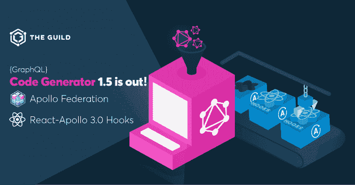

# GraphQL 代码生成器 1.5 出来了！

> 原文：<https://dev.to/bnevilleoneill/graphql-code-generator-1-5-is-out-5b61>

### 你现在可以生成阿波罗联邦解析器和完全类型化的 React-Apollo 3.0 钩子

[](https://res.cloudinary.com/practicaldev/image/fetch/s--ha2_6k1C--/c_limit%2Cf_auto%2Cfl_progressive%2Cq_auto%2Cw_880/https://thepracticaldev.s3.amazonaws.com/i/hokog9jz3436glveayhs.png)

我很高兴地宣布一个新版本的 GraphQL 代码生成器！

新版本有很多修正和新特性(你可以在这里查看完整的变更日志)！

GraphQL 代码生成器是由公会维护的[越来越多的开源库的一部分。如果你仔细研究这些图书馆，你会发现它们很少出现问题，而且维护得非常好。](https://github.com/the-guild-org/Stack)

这要归功于[公会](https://github.com/the-guild-org)的独特工作模式和我们的连接构建系统——在这个系统中，我们的一些用户可以将他们的构建管道连接到我们的库，我们确保他们保持更新和工作(如果你想加入，你可以[直接联系](https://github.com/urigo))。

## 阿波罗联邦支持

GraphQL 代码生成器总是支持为后端解析器生成类型，这是最常用的特性之一。

最近我们收到了[一份支持阿波罗联盟的请求](https://github.com/dotansimha/graphql-code-generator/issues/2086)。我们开始研究如何做到这一点， [Kamil Kisiela](https://github.com/kamilkisiela/) 在短短几天内就开始在 GCG 版本 1.5 中实现对阿波罗联邦的支持！

现在，您的 Apollo 联邦服务可以在类型脚本和流中拥有强类型解析器，只需在 codegen [config](https://graphql-code-generator.com/docs/getting-started/config-field) :
中启用一个标志

```
federation: true 
```

Enter fullscreen mode Exit fullscreen mode

除了 TypeScript 和 JavaScript，我们还为更多的后端语言生成输出，比如 Java。如果您也想测试这些语言的生成器，请[联系](https://github.com/urigo)。

## React-阿波罗 3.0 钩子

几个月来，我们不仅支持生成[全类型 react-apollo HOC](https://graphql-code-generator.com/docs/plugins/typescript-react-apollo#withhoc-boolean-default-value-true) 和[查询组件](https://graphql-code-generator.com/docs/plugins/typescript-react-apollo#withcomponent-boolean-default-value-true)，还支持生成由 [react-apollo-hooks 库](https://github.com/trojanowski/react-apollo-hooks/)创建的全类型钩子。

因此，对我们来说，支持基于 react-apollo-hooks 库的新的 [react-apollo 3.0 hooks](https://blog.apollographql.com/apollo-client-now-with-react-hooks-676d116eeae2) 是一个简单的更新。在测试期间，我们也支持测试版的 react-apollo。

不要只生成 TypeScript 类型，而是生成完全类型化的、随时可以使用的钩子。为自己节省大量代码和潜在的错误(比如打字错误或使用错误的接口)，并确保团队中的每个人都具有强类型。

在 [react-apollo 部分](https://graphql-code-generator.com/docs/plugins/typescript-react-apollo)阅读我们[网站](https://graphql-code-generator.com/)上的相关文档，并尝试我们的[全栈 WhatsApp 克隆教程](https://www.tortilla.academy/Urigo/WhatsApp-Clone-Tutorial/master)！

## 使用阿波罗 codegen？

如果您现在使用的是 [Apollo codegen](https://www.apollographql.com/docs/angular/features/developer-tooling/#apollo-codegen) ，那么迁移到 GraphQL 代码生成器是很容易的。

我们的默认生成输出与 Apollo 的不同，但是因为很多人从 Apollo 迁移到我们的 codegen，我们已经创建了一些配置标志( [near-operation-file](https://graphql-code-generator.com/docs/presets/near-operation-file#docsNav) ，preResolveTypes)，使人们更容易逐渐迁移到最佳实践。

但是你为什么要从阿波罗代码中迁移出来呢？

*   GraphQL 代码生成器得到了更好的维护，尽管我们有了更多的特性，但问题却更少了
*   您可以为前端和后端生成类型
*   有许多语言和不同想法的社区生成器
*   您不仅可以生成类型，还可以生成全功能的 UI 组件
*   GraphQL 代码生成器有一个易于使用的插件系统。我们看到许多团队为他们的产品需求编写他们自己的定制逻辑

## 谢谢

感谢社区中的每一个人，他们一直在推动我们，与我们合作，连接到我们的互联构建，提交问题、建议、pr 和纯粹的爱！

下一个版本再见！

行会

* * *

## Plug: [LogRocket](https://logrocket.com/signup/) ，一款适用于网络应用的 DVR

[](https://res.cloudinary.com/practicaldev/image/fetch/s--6FG5kvEL--/c_limit%2Cf_auto%2Cfl_progressive%2Cq_auto%2Cw_880/https://i2.wp.com/blog.logrocket.com/wp-content/uploads/2017/03/1d0cd-1s_rmyo6nbrasp-xtvbaxfg.png%3Fresize%3D1200%252C677%26ssl%3D1)

[log rocket](https://logrocket.com/signup/)是一个前端日志工具，让你重放问题，就像它们发生在你自己的浏览器中一样。LogRocket 不需要猜测错误发生的原因，也不需要向用户询问截图和日志转储，而是让您重放会话以快速了解哪里出错了。它可以与任何应用程序完美配合，不管是什么框架，并且有插件可以记录来自 Redux、Vuex 和@ngrx/store 的额外上下文。

除了记录 Redux 动作和状态，LogRocket 还记录控制台日志、JavaScript 错误、stacktraces、带有头+体的网络请求/响应、浏览器元数据、自定义日志。它还使用 DOM 来记录页面上的 HTML 和 CSS，甚至为最复杂的单页面应用程序重新创建像素级完美视频。

[免费试用](https://logrocket.com/signup/)。

* * *

文章 [GraphQL 代码生成器 1.5 出来了！](https://blog.logrocket.com/graphql-code-generator-1-5-is-out/)最早出现在 [LogRocket 博客](https://blog.logrocket.com)上。