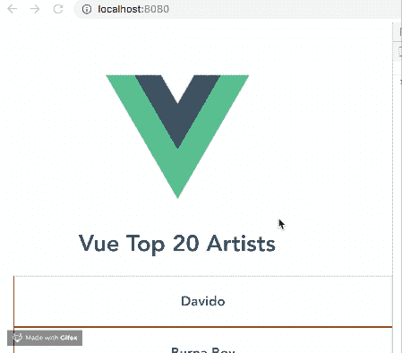
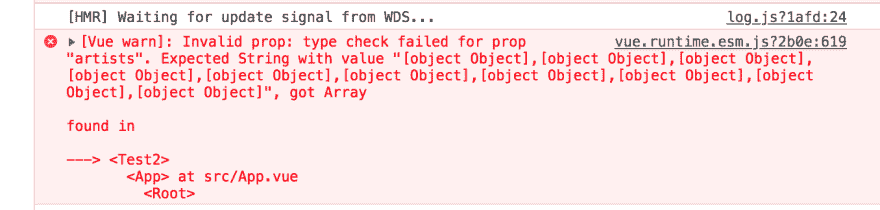

# 如何使用 props 将数据传递给 Vue JS 中的子组件

> 原文：<https://dev.to/bnevilleoneill/how-to-use-props-to-pass-data-to-child-components-in-vue-js-381b>

**由[nwo se lotana](https://blog.logrocket.com/author/nwoselotanna/)撰写**

在这篇文章中，我们将看看在 Vue JS 中数据是如何从父组件传递到子组件的。

## 开始前

这篇文章适合所有阶段的开发者，包括初学者。在阅读本文之前，这里有一些你应该已经具备的东西。

您需要在您的电脑中安装以下设备:

*   已安装 node . js 10 . x 及以上版本。您可以通过在终端/命令提示符下运行以下命令来验证是否已经安装了它:

```
node -v 
```

<svg width="20px" height="20px" viewBox="0 0 24 24" class="highlight-action crayons-icon highlight-action--fullscreen-on"><title>Enter fullscreen mode</title></svg> <svg width="20px" height="20px" viewBox="0 0 24 24" class="highlight-action crayons-icon highlight-action--fullscreen-off"><title>Exit fullscreen mode</title></svg>

*   代码编辑器:强烈推荐使用 Visual Studio 代码
*   [Vue 的最新版本](https://vuejs.org/)，全球安装在您的机器上
*   安装在您机器上的 Vue CLI 3.0。为此，请先卸载旧版本的 CLI:

```
npm uninstall -g vue-cli 
```

<svg width="20px" height="20px" viewBox="0 0 24 24" class="highlight-action crayons-icon highlight-action--fullscreen-on"><title>Enter fullscreen mode</title></svg> <svg width="20px" height="20px" viewBox="0 0 24 24" class="highlight-action crayons-icon highlight-action--fullscreen-off"><title>Exit fullscreen mode</title></svg>

然后安装新的:

```
npm install -g @vue/cli 
```

<svg width="20px" height="20px" viewBox="0 0 24 24" class="highlight-action crayons-icon highlight-action--fullscreen-on"><title>Enter fullscreen mode</title></svg> <svg width="20px" height="20px" viewBox="0 0 24 24" class="highlight-action crayons-icon highlight-action--fullscreen-off"><title>Exit fullscreen mode</title></svg>

*   在这里下载一个 Vue starter 项目
*   解压缩下载的项目
*   导航到解压缩后的文件，并运行命令以保持所有依赖项最新:

```
npm install 
```

<svg width="20px" height="20px" viewBox="0 0 24 24" class="highlight-action crayons-icon highlight-action--fullscreen-on"><title>Enter fullscreen mode</title></svg> <svg width="20px" height="20px" viewBox="0 0 24 24" class="highlight-action crayons-icon highlight-action--fullscreen-off"><title>Exit fullscreen mode</title></svg>

## 效率问题

如果您有一个数据对象(比如 Billboard top 10 artists list ),您希望以两种不同的方式显示这两个不同的组件，第一反应将是创建这两个独立的组件，将数组添加到数据对象中，然后在模板中显示它们。

这个解决方案确实很棒，但是随着组件的增加，它就变成了一个低效的解决方案。让我们用您在 VS 代码中打开的 starter 项目来演示这一点。

## 演示

打开 test.vue 文件，复制下面的代码块:

```
<template>
  <div>
    <h1>Vue Top 20 Artists</h1>
    <ul>
      <li v-for="(artist, x) in artists" :key="x">
      <h3>{{artist.name}}</h3>
      </li>
    </ul>
  </div>
</template>
<script>
export default {
  name: 'Test',
  data (){
    return {
      artists: [
       {name: 'Davido', genre: 'afrobeats', country: 'Nigeria'},
       {name: 'Burna Boy', genre: 'afrobeats', country: 'Nigeria'},
       {name: 'AKA', genre: 'hiphop', country: 'South-Africa'},
       {name: 'Sarkodie', genre: 'hiphop', country: 'Ghana'},
       {name: 'Stormzy', genre: 'hiphop', country: 'United Kingdom'},
       {name: 'Lil Nas', genre: 'Country', country: 'United States'},
       {name: 'Nasty C', genre: 'hiphop', country: 'South-Africa'},
       {name: 'Shatta-walle', genre: 'Reagae', country: 'Ghana'},
       {name: 'Khalid', genre: 'pop', country: 'United States'},
       {name: 'ed-Sheeran', genre: 'pop', country: 'United Kingdom'}
      ]
    }
  }
}
</script> 
```

<svg width="20px" height="20px" viewBox="0 0 24 24" class="highlight-action crayons-icon highlight-action--fullscreen-on"><title>Enter fullscreen mode</title></svg> <svg width="20px" height="20px" viewBox="0 0 24 24" class="highlight-action crayons-icon highlight-action--fullscreen-off"><title>Exit fullscreen mode</title></svg>

在 components 文件夹中创建一个新文件，将其命名为 test2.vue，并将下面的代码块粘贴到其中:

```
<template>
  <div>
    <h1>Vue Top Artist Countries</h1>
    <ul>
      <li v-for="(artist, x) in artists" :key="x">
      <h3>{{artist.name}} from {{artist.country}}</h3>
      </li>
    </ul>
  </div>
</template>
<script>
export default {
  name: 'Test2',
  data (){
    return {
      artists: [
       {name: 'Davido', genre: 'afrobeats', country: 'Nigeria'},
       {name: 'Burna Boy', genre: 'afrobeats', country: 'Nigeria'},
       {name: 'AKA', genre: 'hiphop', country: 'South-Africa'},
       {name: 'Sarkodie', genre: 'hiphop', country: 'Ghana'},
       {name: 'Stormzy', genre: 'hiphop', country: 'United Kingdom'},
       {name: 'Lil Nas', genre: 'Country', country: 'United States'},
       {name: 'Nasty C', genre: 'hiphop', country: 'South-Africa'},
       {name: 'Shatta-walle', genre: 'Reagae', country: 'Ghana'},
       {name: 'Khalid', genre: 'pop', country: 'United States'},
       {name: 'ed-Sheeran', genre: 'pop', country: 'United Kingdom'}
      ]
    }
  }
}
</script>
<style scoped>
li{
    height: 40px;
    width: 100%;
    padding: 15px;
    border: 1px solid saddlebrown;
    display: flex;
    justify-content: center;
    align-items: center;
  }  
a {
  color: #42b983;
}
</style> 
```

<svg width="20px" height="20px" viewBox="0 0 24 24" class="highlight-action crayons-icon highlight-action--fullscreen-on"><title>Enter fullscreen mode</title></svg> <svg width="20px" height="20px" viewBox="0 0 24 24" class="highlight-action crayons-icon highlight-action--fullscreen-off"><title>Exit fullscreen mode</title></svg>

要注册您刚刚创建的新组件，请打开 App.vue 文件，并将下面的代码复制到其中:

```
<template>
  <div id="app">
    
    <Test/>
    <test2/>
  </div>
</template>
<script>
import Test from './components/Test.vue'
import Test2 from './components/Test2'
export default {
  name: 'app',
  components: {
    Test, Test2
  }
}
</script> 
```

<svg width="20px" height="20px" viewBox="0 0 24 24" class="highlight-action crayons-icon highlight-action--fullscreen-on"><title>Enter fullscreen mode</title></svg> <svg width="20px" height="20px" viewBox="0 0 24 24" class="highlight-action crayons-icon highlight-action--fullscreen-off"><title>Exit fullscreen mode</title></svg>

在 VS 代码终端中使用以下命令在开发环境中提供应用程序:

```
npm run serve 
```

<svg width="20px" height="20px" viewBox="0 0 24 24" class="highlight-action crayons-icon highlight-action--fullscreen-on"><title>Enter fullscreen mode</title></svg> <svg width="20px" height="20px" viewBox="0 0 24 24" class="highlight-action crayons-icon highlight-action--fullscreen-off"><title>Exit fullscreen mode</title></svg>

它应该是这样的:

[](https://res.cloudinary.com/practicaldev/image/fetch/s--3vVbQhoH--/c_limit%2Cf_auto%2Cfl_progressive%2Cq_66%2Cw_880/https://i2.wp.com/blog.logrocket.com/wp-content/uploads/2019/08/top20artists.gif%3Fresize%3D449%252C394%26ssl%3D1)

您会看到，如果您有大约五个以上的组件，您将不得不继续复制每个组件中的数据。想象一下，如果有一种方法可以在父组件中定义数据，然后用属性名将它带到每个需要它的子组件中。

[](https://logrocket.com/signup/)

## 解决方案:视图干净

Vue 团队提供了他们称之为道具的定制属性，你可以在任何组件上注册。它的工作方式是，在父组件上定义数据并赋予它一个值，然后转到需要该数据的子组件，并将该值传递给一个适当的属性，这样该数据就成为子组件中的一个属性。

语法如下:

```
Vue.component('blog-post', {
  props: ['title'],
  template: '<h3>{{ title }}</h3>'
}) 
```

<svg width="20px" height="20px" viewBox="0 0 24 24" class="highlight-action crayons-icon highlight-action--fullscreen-on"><title>Enter fullscreen mode</title></svg> <svg width="20px" height="20px" viewBox="0 0 24 24" class="highlight-action crayons-icon highlight-action--fullscreen-off"><title>Exit fullscreen mode</title></svg>

您可以使用根组件(App.vue)作为父组件，存储数据，然后注册 props 以从任何需要的组件动态访问这些数据。

## 定义父组件中的数据

既然您已经选择了根组件作为您的父组件，那么您必须首先定义您想要在根组件中动态共享的数据对象。如果您从一开始就关注了这篇文章，请打开您的 app.vue 文件，并将数据对象代码块复制到脚本部分:

```
<script>
import Test from './components/Test.vue'
import Test2 from './components/Test2'
export default {
  name: 'app',
  components: {
    Test, Test2
  },
  data (){
    return {
      artists: [
       {name: 'Davido', genre: 'afrobeats', country: 'Nigeria'},
       {name: 'Burna Boy', genre: 'afrobeats', country: 'Nigeria'},
       {name: 'AKA', genre: 'hiphop', country: 'South-Africa'},
       {name: 'Sarkodie', genre: 'hiphop', country: 'Ghana'},
       {name: 'Stormzy', genre: 'hiphop', country: 'United Kingdom'},
       {name: 'Lil Nas', genre: 'Country', country: 'United States'},
       {name: 'Nasty C', genre: 'hiphop', country: 'South-Africa'},
       {name: 'Shatta-walle', genre: 'Reagae', country: 'Ghana'},
       {name: 'Khalid', genre: 'pop', country: 'United States'},
       {name: 'Ed Sheeran', genre: 'pop', country: 'United Kingdom'}
      ]
    }
  }
}
</script> 
```

<svg width="20px" height="20px" viewBox="0 0 24 24" class="highlight-action crayons-icon highlight-action--fullscreen-on"><title>Enter fullscreen mode</title></svg> <svg width="20px" height="20px" viewBox="0 0 24 24" class="highlight-action crayons-icon highlight-action--fullscreen-off"><title>Exit fullscreen mode</title></svg>

## 接收道具

在定义数据之后，进入两个测试组件并删除其中的数据对象。要在组件中接收道具，您必须指定您想要在该组件中接收的道具。进入两个测试组件，在脚本部分添加规范，如下所示:

```
<script>
export default {
  name: 'Test',
  props: ['artists']
} 
```

<svg width="20px" height="20px" viewBox="0 0 24 24" class="highlight-action crayons-icon highlight-action--fullscreen-on"><title>Enter fullscreen mode</title></svg> <svg width="20px" height="20px" viewBox="0 0 24 24" class="highlight-action crayons-icon highlight-action--fullscreen-off"><title>Exit fullscreen mode</title></svg>

## 登记道具

为了让 Vue 引擎知道您有一些想要动态传递给一些子组件的道具，您必须在 Vue 实例中指明它。这是在模板部分完成的，如下所示:

```
<template>
  <div id="app">
    
    <Test v-bind:artists="artists"/>
    <test2 v-bind:artists="artists"/>
  </div>
</template> 
```

<svg width="20px" height="20px" viewBox="0 0 24 24" class="highlight-action crayons-icon highlight-action--fullscreen-on"><title>Enter fullscreen mode</title></svg> <svg width="20px" height="20px" viewBox="0 0 24 24" class="highlight-action crayons-icon highlight-action--fullscreen-off"><title>Exit fullscreen mode</title></svg>

这里，我们使用 v-bind 指令来绑定 artists 和 artists，artists 是脚本部分中数据对象数组的名称，而 artists 是测试组件中的属性名称，测试组件是您在上一部分中设置的。在这种情况下，如果不使用这样的指令来设置它:

```
 <Test artists="artists"/>
    <test2 artists="artists"/> 
```

<svg width="20px" height="20px" viewBox="0 0 24 24" class="highlight-action crayons-icon highlight-action--fullscreen-on"><title>Enter fullscreen mode</title></svg> <svg width="20px" height="20px" viewBox="0 0 24 24" class="highlight-action crayons-icon highlight-action--fullscreen-off"><title>Exit fullscreen mode</title></svg>

您将看不到任何输出，Vue 编译器甚至 ESLint 都不会将其标记为错误或警告，因此您需要注意并记住对每个动态绑定使用 v-bind。

## 使用道具

设置完 props 后，您就可以在您的组件中使用它了，就好像数据是在同一个组件中定义的一样。这意味着您可以设置方法调用，并在我们的演示案例中轻松访问`this.artists`。

## 强力打字道具

您还可以通过强类型化 props 来确保您的组件只接收您希望它接收的数据类型。例如，在我们的演示中，您可以通过如下设置认证来确保只有数组被传递到您的组件:

```
<script>
export default {
  name: 'Test',
  props: {
    artists: {
      type: Array
    }
  }
}
</script> 
```

<svg width="20px" height="20px" viewBox="0 0 24 24" class="highlight-action crayons-icon highlight-action--fullscreen-on"><title>Enter fullscreen mode</title></svg> <svg width="20px" height="20px" viewBox="0 0 24 24" class="highlight-action crayons-icon highlight-action--fullscreen-off"><title>Exit fullscreen mode</title></svg>

所以每当你添加一个错误的类型比如字符串，你会在控制台得到一个警告，告诉你它得到的类型不是它期望的类型。

[](https://res.cloudinary.com/practicaldev/image/fetch/s--o59nOCuX--/c_limit%2Cf_auto%2Cfl_progressive%2Cq_auto%2Cw_880/https://i2.wp.com/blog.logrocket.com/wp-content/uploads/2019/08/vue-warn-error.png%3Fresize%3D1356%252C324%26ssl%3D1)

你可以在这里获得本教程[的完整代码。](https://github.com/viclotana/vue-props)

## 结论

在这篇文章中，我们看了 Vue props，以及它们如何通过创建一个数据对象可重用性的平台来鼓励 DRY(不要重复自己)方法。我们还学习了如何在您的 Vue 项目中设置道具。黑客快乐！

* * *

**编者按:**看到这个帖子有问题？你可以在这里找到正确的版本。

## Plug: [LogRocket](https://logrocket.com/signup/) ，一款适用于网络应用的 DVR

[](https://res.cloudinary.com/practicaldev/image/fetch/s--6FG5kvEL--/c_limit%2Cf_auto%2Cfl_progressive%2Cq_auto%2Cw_880/https://i2.wp.com/blog.logrocket.com/wp-content/uploads/2017/03/1d0cd-1s_rmyo6nbrasp-xtvbaxfg.png%3Fresize%3D1200%252C677%26ssl%3D1)

[log rocket](https://logrocket.com/signup/)是一个前端日志工具，让你重放问题，就像它们发生在你自己的浏览器中一样。LogRocket 不需要猜测错误发生的原因，也不需要向用户询问截图和日志转储，而是让您重放会话以快速了解哪里出错了。它可以与任何应用程序完美配合，不管是什么框架，并且有插件可以记录来自 Redux、Vuex 和@ngrx/store 的额外上下文。

除了记录 Redux 动作和状态，LogRocket 还记录控制台日志、JavaScript 错误、stacktraces、带有头+体的网络请求/响应、浏览器元数据、自定义日志。它还使用 DOM 来记录页面上的 HTML 和 CSS，甚至为最复杂的单页面应用程序重新创建像素级完美视频。

[免费试用](https://logrocket.com/signup/)。

* * *

帖子[如何使用 props 将数据传递给 Vue JS](https://blog.logrocket.com/how-to-use-props-to-pass-data-to-child-components/) 中的子组件最先出现在 [LogRocket 博客](https://blog.logrocket.com)上。