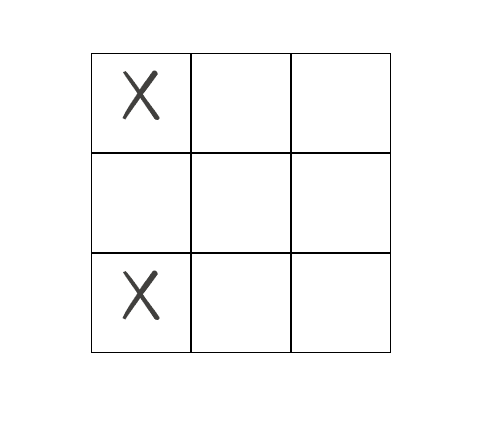
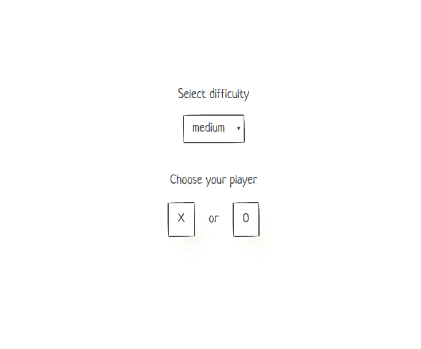
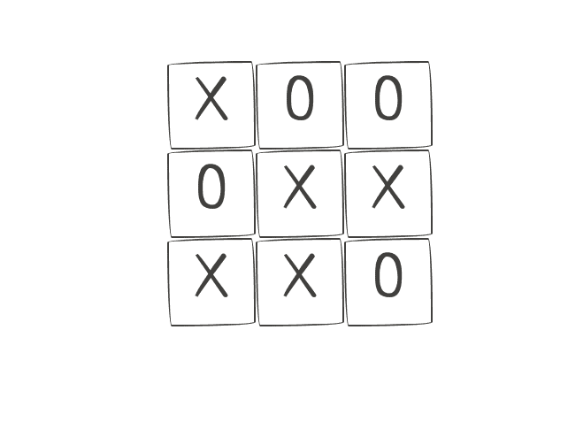
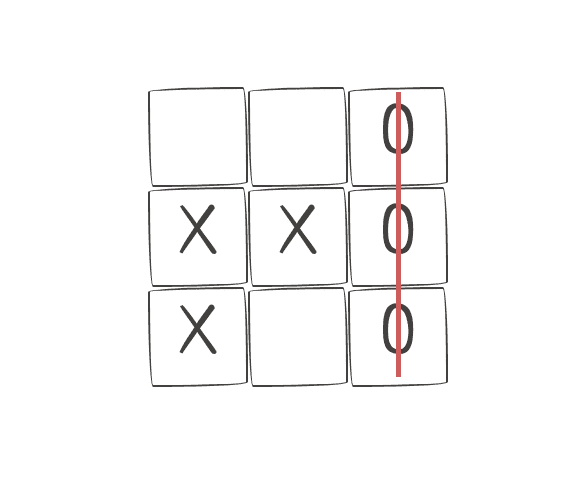

# 用 React 钩子和风格化组件构建您自己的无与伦比的井字游戏

> 原文：<https://dev.to/clarity89/build-your-own-unbeatable-tic-tac-toe-with-react-hooks-and-styled-components-4j1e>

*这篇文章最初发表在我的[个人博客](https://claritydev.net/blog/making-tic-ta-toe-with-react-hooks-and-styled-comp)T3 上。*

在与 React 合作了几年之后，我意识到我只使用这个框架来开发网站和移动应用程序。随着[钩子](https://reactjs.org/docs/hooks-intro.html)的加入，我认为制作一个小游戏会很有趣，可以更深入地了解 React lifecycle 是如何工作的。对于游戏选择，我决定转换一个 jQuery 版本的 Tic Tac Toe，这是我几年前构建的，以作出反应，这最终证明比我预期的更具挑战性。游戏的最终版本可以在[这里](https://clarity-89.github.io/React_tic_tac_toe/)找到，代码可以在 [Github](https://github.com/Clarity-89/React_tic_tac_toe) 上找到，如果你想直接进入游戏的话。

#### 设置

为了设置游戏，我们将使用[创建-反应-应用](https://facebook.github.io/create-react-app/)。除了 React 之外，我们将使用[风格的组件](https://www.styled-components.com/)，一个 CSS 框架 [papercss](https://www.getpapercss.com/) ，它将赋予游戏很酷的简约风格(我的网站也使用 papercss)，以及 [React-modal](https://github.com/reactjs/react-modal) 来显示游戏结果。我们将从创建空项目和安装必要的依赖项开始。
T9】

```
 npx create-react-app tic_tac_toe
    cd tic_tac_toe
    npm i styled-components papercss react-modal 
```

在项目建立之后，我们可以开始修改 **App.js 到**包括主要的游戏组件和 **papercss** 样式。

```
 // App.js

    import React from "react";
    import styled from "styled-components";
    import TicTacToe from "./TicTacToe";
    import "papercss/dist/paper.min.css";

    function App() {
      return (
        <Main>
          <TicTacToe />
        </Main>
      );
    }

    const Main = styled.main`
      display: flex;
      justify-content: center;
      align-items: center;
      height: 100vh;
    `;

    export default App; 
```

这将使游戏组件在屏幕上居中。不相关的元素，比如`footer`，被省略了，这样我们就可以专注于最重要的部分。下一步是创建实际的 **TicTacToe** 组件。由于应用程序的大小相对较小，我们将把所有文件直接保存在 **src** 文件夹中。

首先让我们开始添加一些游戏的常数到一个单独的 **constants.js.**

```
 // Dimensions of the board (3x3 squares), game outcomes and players, 
    // and dimensions for the board squares, in pixels.

    export const DIMS = 3;
    export const DRAW = 0;
    export const PLAYER_X = 1;
    export const PLAYER_O = 2;
    export const SQUARE_DIMS = 100; 
```

现在，在新创建的 **TicTacToe.js** 中，我们可以开始设置和渲染游戏的网格。

```
 import React, { useState } from "react";
    import styled from "styled-components";
    import { DIMS, PLAYER_X, PLAYER_O, SQUARE_DIMS } from "./constants";

    const arr = new Array(DIMS ** 2).fill(null);

    const TicTacToe = () => {
      const [grid, setGrid] = useState(arr);
      const [players, setPlayers] = useState({
        human: PLAYER_X,
        computer: PLAYER_O
      });

      const move = (index, player) => {
        setGrid(grid => {
          const gridCopy = grid.concat();
          gridCopy[index] = player;
          return gridCopy;
        });
      };

      const humanMove = index => {
        if (!grid[index]) {
          move(index, players.human);
        }
      };

      return (
        <Container dims={DIMS}>
          {grid.map((value, index) => {
            const isActive = value !== null;

            return (
              <Square
                key={index}
                onClick={() => humanMove(index)}
              >
                {isActive && <Marker>{value === PLAYER_X ? "X" : "O"}</Marker>}
              </Square>
            );
          })}
        </Container>
      );
    };

    const Container = styled.div`
      display: flex;
      justify-content: center;
      width: ${({ dims }) => `${dims * (SQUARE_DIMS + 5)}px`};
      flex-flow: wrap;
      position: relative;
    `;

    const Square = styled.div`
      display: flex;
      justify-content: center;
      align-items: center;
      width: ${SQUARE_DIMS}px;
      height: ${SQUARE_DIMS}px;
      border: 1px solid black;

      &:hover {
        cursor: pointer;
      }
    `;

    const Marker = styled.p`
      font-size: 68px;
    `;

    export default TicTacToe; 
```

首先，我们从导入所有必需的依赖项并声明网格的默认数组开始。注意，我们使用的是 JavaScript 在 ES2016 中新增的[取幂运算符](https://developer.mozilla.org/en-US/docs/Web/JavaScript/Reference/Operators/Arithmetic_Operators#Exponentiation)，以及 ES2015/ES6 中的 [`Array.prototype.fill()`](https://developer.mozilla.org/en-US/docs/Web/JavaScript/Reference/Global_Objects/Array/fill) ，来创建一个长度为 9 的数组，并用`null`值填充。它是在组件外部声明的，所以当组件重新呈现时，它不会被重新创建。我们不是创建一个多维数组，然后递归地渲染它，而是渲染一个一维数组，并用 CSS 限制它的宽度。

`width: ${({ dims }) => `${dims * (SQUARE_DIMS + 5)}px`};`是 styled components 将变量传递给 component 的方式，也可以写成`width: ${(props) => `${props.dims * (SQUARE_DIMS + 5)}px`};`这里我们将容器的宽度限制为 3 个 100 像素的正方形(加上几个 px 以考虑边框)，并设置`flex-flow: wrap`，这将把多余的正方形推到下一行，以此类推，最终创建一个 3 x 3 的正方形网格。在运行`npm start`并进行一些移动之后，我们可以验证我们的网格功能是否正常。

[](https://res.cloudinary.com/practicaldev/image/fetch/s--DDUWVTcw--/c_limit%2Cf_auto%2Cfl_progressive%2Cq_auto%2Cw_880/https://i.imgur.com/0ELMJi1.png)

看起来不错，但是因为我们还没有设置计算机的移动，所以并不太令人兴奋。我们将通过添加`computerMove`函数来修复它。

```
 // utils.js

    // Get random integer in a range min-max
    export const getRandomInt = (min, max) => {
      min = Math.ceil(min);
      max = Math.floor(max);
      return Math.floor(Math.random() * (max - min + 1)) + min;
    };

    // TicTacToe.js

    // ...

    const computerMove = () => {
      let index = getRandomInt(0, 8);
      while (grid[index]) {
        index = getRandomInt(0, 8);
      }
      move(index, players.computer);
    };

    const humanMove = index => {
      if (!grid[index]) {
        move(index, players.human);
        computerMove();
      }
    }; 
```

现在游戏的互动性更强了。在人类玩家回合后，调用`computerMove`函数，基本上是对棋盘上的一个随机空方格进行移动。注意，我们还添加了一个 **utils.js** 文件到我们的项目中，所有的帮助器，比如用来获取一个范围内的随机数的帮助器，都将存储在这个文件中。

当然，这款游戏还远远不够完美，还存在一些问题。我们将开始改进它，增加三个游戏状态**未开始**、**进行中**和**结束。**当游戏处于第一状态时，我们将显示一个**选择玩家**屏幕，第二状态将呈现棋盘并允许玩家移动，最终状态将宣布游戏结果。
T9】

```
 // constants.js

    export const GAME_STATES = {
      notStarted: "not_started",
      inProgress: "in_progress",
      over: "over"
    }; 
```

现在我们可以在组件中使用它们来呈现不同的“屏幕”。

```
 // utils.js

    import { PLAYER_O, PLAYER_X } from "./constants";

    export const switchPlayer = player => {
      return player === PLAYER_X ? PLAYER_O : PLAYER_X;
    };

    // TicTacToe.js

    const TicTacToe = () => {
    //...
    const [players, setPlayers] = useState({ human: null, computer: null });
    const [gameState, setGameState] = useState(GAME_STATES.notStarted);

    //...
    const choosePlayer = option => {
      setPlayers({ human: option, computer: switchPlayer(option) });
      setGameState(GAME_STATES.inProgress);
    };

    return gameState === GAME_STATES.notStarted ? (
        <Screen>
          <Inner>
            <ChooseText>Choose your player</ChooseText>
            <ButtonRow>
              <button onClick={() => choosePlayer(PLAYER_X)}>X</button>
              <p>or</p>
              <button onClick={() => choosePlayer(PLAYER_O)}>O</button>
            </ButtonRow>
          </Inner>
        </Screen>
      ) : (
        <Container dims={DIMS}>
          {grid.map((value, index) => {
            const isActive = value !== null;

            return (
              <Square
                key={index}
                onClick={() => humanMove(index)}
              >
                {isActive && <Marker>{value === PLAYER_X ? "X" : "O"}</Marker>}
              </Square>
            );
          })}
        </Container>
      );
    };

    const ButtonRow = styled.div`
      display: flex;
      width: 150px;
      justify-content: space-between;
    `;

    const Screen = styled.div``;

    const Inner = styled.div`
      display: flex;
      flex-direction: column;
      align-items: center;
      margin-bottom: 30px;
    `;

    const ChooseText = styled.p``; 
```

#### 添加特效挂钩

以上改变允许选择一个球员。然而，由于我们不检查当前是谁的移动，人类玩家可以不按顺序进行几次移动。为了解决这个问题，我们将引入基于回合的移动，将轮到的玩家分配到下一个`nextMove.`

```
 //TicTacToe.js

     const [nextMove, setNextMove] = useState(null);

    //...

    const humanMove = index => {
      if (!grid[index] && nextMove === players.human) {
        move(index, players.human);
        setNextMove(players.computer);
      }
    };

    useEffect(() => {
      let timeout;
      if (
        nextMove !== null &&
        nextMove === players.computer &&
        gameState !== GAME_STATES.over
      ) {
        // Delay computer moves to make them more natural
        timeout = setTimeout(() => {
          computerMove();
        }, 500);
      }
      return () => timeout && clearTimeout(timeout);
    }, [nextMove, computerMove, players.computer, gameState]);

    const choosePlayer = option => {
      setPlayers({ human: option, computer: switchPlayer(option) });
      setGameState(GAME_STATES.inProgress);
      setNextMove(PLAYER_X); // Set the Player X to make the first move
    }; 
```

这里发生了很多事情。首先，我们将`nextMove`添加到`useEffect`的依赖数组中，这样当它改变时，效果内部的代码就会运行。为了实现这一点，在我们的`humanMove`函数中，我们不调用`computerMove`，而是将计算机设置为进行下一步动作的计算机。此外，我们将在允许行动之前检查是否真的轮到人类玩家了。作为一个增强，一个轻微的超时，使计算机移动非瞬间，被添加。还必须记住在效果的清理功能中移除超时。除了`nextMove`，我们还需要跟踪在效果内部访问的组件范围内的其他变量。考虑到`computerMove`在这里是一个函数，并且将在每次渲染时重新创建，我们将使用`useCallback`钩子来记忆它，并防止它发生变化，除非它的任何依赖关系发生变化。为了更深入地了解，本文提供了对效果挂钩的主要注意事项的极好概述。

```
 const computerMove = useCallback(() => {
      let index = getRandomInt(0, 8);
      while (grid[index]) {
        index = getRandomInt(0, 8);
      }

      move(index, players.computer);
      setNextMove(players.human);

    }, [move, grid, players]); 
```

既然我们在这里跟踪`move`函数，我们也需要记忆它。

```
 //TicTacToe.js

    const move = useCallback(
      (index, player) => {
        if (player && gameState === GAME_STATES.inProgress) {
          setGrid(grid => {
            const gridCopy = grid.concat();
            gridCopy[index] = player;
            return gridCopy;
          });
        }
      },
      [gameState]
    ); 
```

玩家现在可以行动了，游戏的流程看起来已经很自然了。然而，如果你运行游戏到最后，即填满所有可用的方块，它将陷入无限循环。原因是`computerMove`中的`while`循环在网格上没有空方块后没有终止条件。如果到目前为止，我们解决了一个问题后，又出现了一些新问题，坚持住，我们很快就能解决所有问题了！

#### 添加`Board`类

如果你仔细观察代码，你会发现我们实际上并没有在游戏的任何时候将游戏状态设置为**而不是**。但在此之前，我们需要找到游戏的赢家。这似乎是创建一个单独的`Board`类的好机会，它将封装所有与渲染无关的电路板逻辑。

```
 // Board.js

    import { DIMS, DRAW } from "./constants";

    export default class Board {
      constructor(grid) {
        this.grid = grid || new Array(DIMS ** 2).fill(null);
      }

      // Collect indices of empty squares and return them
      getEmptySquares = (grid = this.grid) => {
        let squares = [];
        grid.forEach((square, i) => {
          if (square === null) squares.push(i);
        });
        return squares;
      };

      isEmpty = (grid = this.grid) => {
        return this.getEmptySquares(grid).length === DIMS ** 2;
      };

      getWinner = (grid = this.grid) => {
        const winningCombos = [
          [0, 1, 2],
          [3, 4, 5],
          [6, 7, 8],
          [0, 3, 6],
          [1, 4, 7],
          [2, 5, 8],
          [0, 4, 8],
          [2, 4, 6]
        ];
        let res = null;
        winningCombos.forEach((el, i) => {
          if (
            grid[el[0]] !== null &&
            grid[el[0]] === grid[el[1]] &&
            grid[el[0]] === grid[el[2]]
          ) {
            res = grid[el[0]];
          } else if (res === null && this.getEmptySquares(grid).length === 0) {
            res = DRAW;
          }
        });
        return res;
      };

      clone = () => {
        return new Board(this.grid.concat());
      };
    } 
```

这个类本身非常简单。我们添加了一个方法来获取所有空方块的索引，一个实用方法来检查棋盘是否为空，能够复制棋盘，最后添加了`getWinner`方法，该方法将通过检查棋盘的当前状态是否有任何获胜的组合来返回游戏的结果，硬编码在该方法中。除了用一个空网格初始化棋盘之外，我们还将允许它的方法接受一个网格作为可选参数，这样我们就可以将它们应用到游戏组件的网格中。

好了，现在我们有办法知道游戏的赢家了。让我们用它来表示游戏何时结束，同时我们将添加一个方法来实际设置游戏结果的状态，这样我们就可以在之后显示它。每次移动后检查游戏是否已经到达终点是有意义的，所以我们将引入另一个`useEffect`钩子来跟踪这些变化。

```
 //TicTactToe.js

    import Board from "./Board";

    const board = new Board();

    const TicTacToe = () => {
      //...
      const [winner, setWinner] = useState(null);

      //...

      useEffect(() => {
        const winner = board.getWinner(grid);
        const declareWinner = winner => {
          let winnerStr;
          switch (winner) {
            case PLAYER_X:
              winnerStr = "Player X wins!";
              break;
            case PLAYER_O:
              winnerStr = "Player O wins!";
              break;
            case DRAW:
            default:
              winnerStr = "It's a draw";
          }
          setGameState(GAME_STATES.over);
          setWinner(winnerStr);
        };

        if (winner !== null && gameState !== GAME_STATES.over) {
          declareWinner(winner);
        }
      }, [gameState, grid, nextMove]);

    } 
```

现在，我们可以将结果消息与一个**新游戏**按钮一起呈现，该按钮基本上会重置网格状态，并将游戏设置为**未开始**。

```
 //TicTacToe.js

    const startNewGame = () => {
      setGameState(GAME_STATES.notStarted);
      setGrid(arr);
    };

    switch (gameState) {
      case GAME_STATES.notStarted:
      default:
        return (
          <Screen>
            <Inner>
              <ChooseText>Choose your player</ChooseText>
              <ButtonRow>
                <button onClick={() => choosePlayer(PLAYER_X)}>X</button>
                <p>or</p>
                <button onClick={() => choosePlayer(PLAYER_O)}>O</button>
              </ButtonRow>
            </Inner>
          </Screen>
        );
      case GAME_STATES.inProgress:
        return (
          <Container dims={DIMS}>
            {grid.map((value, index) => {
              const isActive = value !== null;

              return (
                <Square
                  key={index}
                  onClick={() => humanMove(index)}
                >
                  {isActive && <Marker>{value === PLAYER_X ? "X" : "O"}</Marker>}
                </Square>
              );
            })}
          </Container>
        );
      case GAME_STATES.over:
        return (
          <div>
            <p>{winner}</p>
            <button onClick={startNewGame}>Start over</button>
          </div>
        );
    } 
```

#### 介绍 Minimax

有了这些改变，我们现在有了一个合适的井字游戏。但是仍然缺少一点:计算机随机移动，这使得它很容易被击败。我们可以通过引入 [Minimax](https://en.wikipedia.org/wiki/Minimax) 算法为计算机计算最佳走法来扭转这种局面。如果实施得当，这将使游戏不可战胜，人类玩家能指望的最好结果就是平局。关于算法的内部工作方式，我不会讲得太深入，网上已经有很多关于它的文章了。基本上，Minimax 所做的是根据最终的游戏结果，为每一步棋赋予价值。得分最高的棋被选为最佳棋。为了做到这一点，算法需要递归地计算棋盘当前状态的所有移动。考虑到在井字游戏中可能的移动次数相对较少，该算法运行速度相当快。

```
 // constants.js

    export const SCORES = {
      1: 1,
      0: 0,
      2: -1
    };

    // minimax.js

    import { SCORES } from "./constants";
    import { switchPlayer } from "./utils";

    export const minimax = (board, player) => {
      const mult = SCORES[player];
      let thisScore;
      let maxScore = -1;
      let bestMove = null;

      if (board.getWinner() !== null) {
        return [SCORES[board.getWinner()], 0];
      } else {
        for (let empty of board.getEmptySquares()) {
          let copy = board.clone();
          copy.makeMove(empty, player);
          thisScore = mult * minimax(copy, switchPlayer(player))[0];

          if (thisScore >= maxScore) {
            maxScore = thisScore;
            bestMove = empty;
          }
        }

        return [mult * maxScore, bestMove];
      }
    }; 
```

为了让算法工作，我们需要在我们的 board 类中添加`makeMove`方法，这将把当前玩家放在棋盘上。

```
 // Board.js

    makeMove = (square, player) => {
      if (this.grid[square] === null) {
        this.grid[square] = player;
      }
    }; 
```

我们不仅仅使用来自`TicTacToe`组件的`move`函数的原因是因为在 minimax 的循环中触发它会改变组件的状态并导致大量的重新渲染，这将很快导致堆栈溢出。

最后，我们实际上可以让计算机对手做出“聪明”的举动。

```
 // TicTacToe.js

    import {minimax} from './minimax';

    //...

    const computerMove = useCallback(() => {
      const board = new Board(grid.concat());
      const index = board.isEmpty(grid)
            ? getRandomInt(0, 8)
            : minimax(board, players.computer)[1];

      if (!grid[index]) {
        move(index, players.computer);
        setNextMove(players.human);
      }
    }, [move, grid, players]); 
```

将`grid`的副本传递给`Board`构造函数很重要，这样`minimax`就不会改变`TicTacToe`组件中使用的实际网格。

[`concat`](https://developer.mozilla.org/en-US/docs/Web/JavaScript/Reference/Global_Objects/Array/concat) 调用一个没有参数的数组将返回该数组的副本。用 [`grid.slice()`](https://developer.mozilla.org/en-US/docs/Web/JavaScript/Reference/Global_Objects/Array/slice) 或者使用 [JS 数组展开语法](https://developer.mozilla.org/en-US/docs/Web/JavaScript/Reference/Operators/Spread_syntax) : `[...grid]`也可以达到同样的效果。

接下来，如果轮到计算机时棋盘是空的，这意味着计算机正在进行第一步，我们将让计算机进行随机移动，以大大加快极大极小值计算的速度。

#### 增加难度等级

在这一点上，基本游戏已经准备好了，但是我们仍然可以改进它一点。虽然随机电脑版太容易了，但 minimax 版太难了，基本上不会让人类玩家获胜。我们可以把它们结合起来，增加一个“中等”水平，其中一半的移动是随机的，另一半是极小最大。当我们这样做的时候，让我们也添加已经开发的“简单”和“困难”级别。为此，我们将把`mode`引入组件状态。玩家将能够在每场游戏开始时选择所需的游戏模式，并且必须修改`computerMove`功能以适应该选择。

```
 // constants.js

    // ...
    export const GAME_MODES = {
      easy: "easy",
      medium: "medium",
      difficult: "difficult"
    };

    // TicTacToe.js

    import {GAME_MODES /* ... */} from './constants';

    const TicTacToe = () => {
      // ...
      const [mode, setMode] = useState(GAME_MODES.medium);

      // ...

      const computerMove = useCallback(() => {
        // Important to pass a copy of the grid here
        const board = new Board(grid.concat());
        const emptyIndices = board.getEmptySquares(grid);
        let index;

        switch (mode) {
          case GAME_MODES.easy:
            index = getRandomInt(0, 8);
            while (!emptyIndices.includes(index)) {
              index = getRandomInt(0, 8);
            }
            break;
          case GAME_MODES.medium:
            // Medium level is basically ~half of the moves are minimax and the other ~half random
            const smartMove = !board.isEmpty(grid) && Math.random() < 0.5;
            if (smartMove) {
              index = minimax(board, players.computer)[1];
            } else {
              index = getRandomInt(0, 8);
              while (!emptyIndices.includes(index)) {
                index = getRandomInt(0, 8);
              }
            }
            break;
          case GAME_MODES.difficult:
          default:
            index = board.isEmpty(grid)
              ? getRandomInt(0, 8)
              : minimax(board, players.computer)[1];
        }
        if (!grid[index]) {
          move(index, players.computer);
          setNextMove(players.human);
        }
      }, [move, grid, players, mode]);

      const changeMode = e => {
        setMode(e.target.value);
      };

      switch (gameState) {
        case GAME_STATES.notStarted:
        default:
          return (
            <Screen>
              <Inner>
                <ChooseText>Select difficulty</ChooseText>
                <select onChange={changeMode} value={mode}>
                  {Object.keys(GAME_MODES).map(key => {
                    const gameMode = GAME_MODES[key];
                    return (
                      <option key={gameMode} value={gameMode}>
                        {key}
                      </option>
                    );
                  })}
                </select>
              </Inner>
              <Inner>
                <ChooseText>Choose your player</ChooseText>
                <ButtonRow>
                  <button onClick={() => choosePlayer(PLAYER_X)}>X</button>
                  <p>or</p>
                  <button onClick={() => choosePlayer(PLAYER_O)}>O</button>
                </ButtonRow>
              </Inner>
            </Screen>
          );
        case GAME_STATES.inProgress:
        // ...
    } 
```

现在我们迎来了更新的开始屏幕，默认选择了**中等**游戏难度。

[](https://res.cloudinary.com/practicaldev/image/fetch/s--v1hGJPu9--/c_limit%2Cf_auto%2Cfl_progressive%2Cq_auto%2Cw_880/https://i.imgur.com/LlcJDBD.png)

#### 包装完毕

在这个可选部分，我们将为最终的 Tic Tact Toe 体验添加一些收尾工作:显示游戏结果模式，调整网格的边界样式，并为获胜的组合添加 strike through 样式。第一项任务是最容易的，所以让我们从它开始。

```
 // ResultModal.js

    import React from "react";
    import styled from "styled-components";
    import Modal from "react-modal";

    const customStyles = {
      overlay: {
        backgroundColor: "rgba(0,0,0, 0.6)"
      }
    };

    export const ResultModal = ({ isOpen, close, startNewGame, winner }) => {
      return (
        <StyledModal isOpen={isOpen} onRequestClose={close} style={customStyles}>
          <ModalWrapper>
            <ModalTitle>Game over</ModalTitle>
            <ModalContent>{winner}</ModalContent> 
            <ModalFooter>
              <Button onClick={close}>Close</Button>
              <Button onClick={startNewGame}>Start over</Button>
            </ModalFooter>
          </ModalWrapper>
        </StyledModal>
      );
    };

    const StyledModal = styled(Modal)`
      display: flex;
      flex-direction: column;
      height: 300px;
      position: relative;
      margin: 0 auto;
      top: 10%;
      right: auto;
      bottom: auto;
      width: 320px;  
    `;

    const ModalWrapper = styled.div`
      display: flex;
      flex-direction: column;
      padding: 24px;
      background-color: #fff;
      max-height: 100%;
      height: 100%;
      align-items: center;
      backface-visibility: hidden;
      padding: 1.25rem;
      border: 1px solid black;
    `;

    const ModalTitle = styled.p`
      display: flex;
      align-items: center;
      margin-bottom: 20px;
      font-size: 24px;
      font-weight: bold;
      text-transform: uppercase;
    `;

    const ModalContent = styled.p`
      flex: 1 1 auto;
      text-align: center;
    `;

    const ModalFooter = styled.div`
      display: flex;
      justify-content: space-between;
      flex: 0 0 auto;
      width: 100%;
    `;

    const Button = styled.button`
      font-size: 16px;
    `; 
```

为了定制模态叠加的样式，我们将根据包文档使用`customStyles`对象。模型的其他元素我们将使用样式化组件进行样式化。

有了样式之后，让我们在主要组件中导入模态，并在游戏结束时显示它。

```
 // TicTacToe.js

    import { ResultModal } from "./ResultModal";

    const TicTacToe = () => {
      // ...
      const [modalOpen, setModalOpen] = useState(false);

      // ... 

      useEffect(() => {
        const winner = board.getWinner(grid);
        const declareWinner = winner => {
          let winnerStr;
          switch (winner) {
            case PLAYER_X:
              winnerStr = "Player X wins!";
              break;
            case PLAYER_O:
              winnerStr = "Player O wins!";
              break;
            case DRAW:
            default:
              winnerStr = "It's a draw";
          }
          setGameState(GAME_STATES.over);
          setWinner(winnerStr);
          // Slight delay for the modal so there is some time to see the last move
          setTimeout(() => setModalOpen(true), 300);
        };

        if (winner !== null && gameState !== GAME_STATES.over) {
          declareWinner(winner);
        }
      }, [gameState, grid, nextMove]);

      const startNewGame = () => {
        setGameState(GAME_STATES.notStarted);
        setGrid(arr);
        setModalOpen(false); // Close the modal when new game starts
      };

      return gameState === GAME_STATES.notStarted ? (
        <Screen>
          <Inner>
            <ChooseText>Select difficulty</ChooseText>
            <select onChange={changeMode} value={mode}>
              {Object.keys(GAME_MODES).map(key => {
                const gameMode = GAME_MODES[key];
                return (
                  <option key={gameMode} value={gameMode}>
                    {key}
                  </option>
                );
              })}
            </select>
          </Inner>
          <Inner>
            <ChooseText>Choose your player</ChooseText>
            <ButtonRow>
              <button onClick={() => choosePlayer(PLAYER_X)}>X</button>
              <p>or</p>
              <button onClick={() => choosePlayer(PLAYER_O)}>O</button>
            </ButtonRow>
          </Inner>
        </Screen>
      ) : (
        <Container dims={DIMS}>
          {grid.map((value, index) => {
            const isActive = value !== null;

            return (
              <Square
                key={index}
                onClick={() => humanMove(index)}
              >
                {isActive && <Marker>{value === PLAYER_X ? "X" : "O"}</Marker>}
              </Square>
            );
          })}

          <ResultModal
            isOpen={modalOpen}
            winner={winner}
            close={() => setModalOpen(false)}
            startNewGame={startNewGame}
          />
        </Container>
      ); 
```

是的，模态在那里。一个新游戏可以从这里开始，或者玩家可以关闭它再次看到最后的棋盘(在这种情况下，页面必须重新加载才能开始新游戏)。

[](https://res.cloudinary.com/practicaldev/image/fetch/s--fidlXrI2--/c_limit%2Cf_auto%2Cfl_progressive%2Cq_auto%2Cw_880/https://i.imgur.com/HHWNc10.png)

看着这些按钮，你会注意到它们有不规则形状的边框，这与应用程序的整体风格非常吻合。如果我们的网格正方形和结果模型有相似形状的边界不是很好吗？通过一点试验和调整，我们可以得出一个令人满意的样式，它将被添加到一个单独的 **styles.js** 文件中。

```
 // styles.js

    export const border = `
      border-bottom-left-radius: 15px 255px;
      border-bottom-right-radius: 225px 15px;
      border-top-left-radius: 255px 15px;
      border-top-right-radius: 15px 225px;
      border: 2px solid #41403e;
    `; 
```

这里我们只是将 CSS 样式声明为模板字符串，我们可以在组件中使用它。

```
 // TicTacToe.js

    import { border } from "./styles";

    // ...

    const Square = styled.div`
      display: flex;
      justify-content: center;
      align-items: center;
      width: ${SQUARE_DIMS}px;
      height: ${SQUARE_DIMS}px; ${border};                  // Adding new border styles

      &:hover {
        cursor: pointer;
      }
    `;

    // ResultModal.js

    import { border } from "./styles";

    // ...
    const ModalWrapper = styled.div`
      display: flex;
      flex-direction: column;
      padding: 24px;
      background-color: #fff;
      max-height: 100%;
      height: 100%;
      align-items: center;
      backface-visibility: hidden;
      padding: 1.25rem; ${border};                   // Adding new border styles
    `; 
```

请注意，向样式化组件添加可重用样式的语法是模板内的变量插值。经过这些改变后，网格看起来与整体风格更加一致。

[](https://res.cloudinary.com/practicaldev/image/fetch/s--jFHMc-aW--/c_limit%2Cf_auto%2Cfl_progressive%2Cq_auto%2Cw_880/https://i.imgur.com/pC6uQxl.png)

作为最后的润色，我们将添加一个醒目的样式来突出获胜的方块序列。一开始并不完全清楚如何最好地做到这一点，但是经过一些研究后，我确定了一种方法，即与游戏的获胜者一起，`Board`类将根据获胜的组合返回 strike through 的样式(除非游戏是平局)。为了获得所需的正确样式，需要进行大量的实验，但是最终结果是完全可以接受的。

```
 // Board.js

    export default class Board {
      constructor(grid) {
        // ...
        this.winningIndex = null; // track the index of winning combination
      }

     getWinner = (grid = this.grid) => {
        //...
        winningCombos.forEach((el, i) => {
          if (
            grid[el[0]] !== null &&
            grid[el[0]] === grid[el[1]] &&
            grid[el[0]] === grid[el[2]]
          ) {
            res = grid[el[0]];
            this.winningIndex = i;
          } else if (res === null && this.getEmptySquares(grid).length === 0) {
            res = DRAW;
            this.winningIndex = null;
          }
        });
        return res;
      };

     /**
       * Get the styles for strike through based on the combination that won
       */
     getStrikethroughStyles = () => {
        const defaultWidth = 285;
        const diagonalWidth = 400;
        switch (this.winningIndex) {
          case 0:
            return `
              transform: none;
              top: 41px;
              left: 15px;
              width: ${defaultWidth}px;
            `;
          case 1:
            return `
              transform: none;
              top: 140px;
              left: 15px;
              width: ${defaultWidth}px;
            `;
          case 2:
            return `
              transform: none;
              top: 242px;
              left: 15px;
              width: ${defaultWidth}px;
            `;
          case 3:
            return `
              transform: rotate(90deg);
              top: 145px;
              left: -86px;
              width: ${defaultWidth}px;
            `;
          case 4:
            return `
              transform: rotate(90deg);
              top: 145px;
              left: 15px;
              width: ${defaultWidth}px;
            `;
          case 5:
            return `
              transform: rotate(90deg);
              top: 145px;
              left: 115px;
              width: ${defaultWidth}px;
            `;
          case 6:
            return `
              transform: rotate(45deg);
              top: 145px;
              left: -44px;
              width: ${diagonalWidth}px;
            `;
          case 7:
            return `
              transform: rotate(-45deg);
              top: 145px;
              left: -46px;
              width: ${diagonalWidth}px;
            `;
          default:
            return null;
        }
      }; 
```

让我们给我们的主组件添加一个`Strikethrough`元素，看看样式是否有效。

```
 // TicTactToe.js

     // ...

    return gameState === GAME_STATES.notStarted ? (

     // ...

      <Strikethrough
        styles={
          gameState === GAME_STATES.over && board.getStrikethroughStyles()
        }
      />
      <ResultModal
        isOpen={modalOpen}
        winner={winner}
        close={() => setModalOpen(false)}
        startNewGame={startNewGame}
      /> 
      // ...

      const Strikethrough = styled.div`
        position: absolute; ${({ styles }) => styles} background-color: indianred;
        height: 5px;
        width: ${({ styles }) => !styles && "0px"};
      `; 
```

如果`board.getStrikethroughStyles()`返回样式，我们将它们应用到我们的元素中，否则它将通过使用`0px`的宽度来隐藏。

[](https://res.cloudinary.com/practicaldev/image/fetch/s--iWKmilmR--/c_limit%2Cf_auto%2Cfl_progressive%2Cq_auto%2Cw_880/https://i.imgur.com/hN4zB0f.png)

完美！现在，只要比赛有赢家，我们就会看到一个漂亮的好球。

这是一个总结。按照你自己的喜好自由调整和定制游戏！

对这篇文章有任何问题/评论或其他类型的反馈吗？请在评论中或在 [Twitter](https://mobile.twitter.com/Clarity_89) 上告诉我。