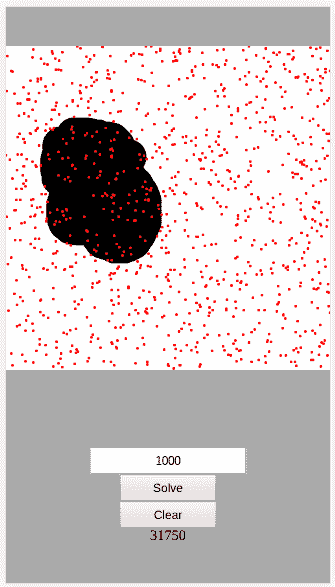

# 使用蒙特卡罗方法寻找区域

> 原文：<https://dev.to/victorqribeiro/finding-areas-using-the-monte-carlo-method-3h6b>

# 使用蒙特卡罗方法寻找区域

使用[蒙特卡罗方法](http://mathonweb.com/entrtain/monte/t_monte.htm)求绘制图像的面积。

现场版[此处](https://victorribeiro.com/monteCarlo)

## 关于

画一个图像，运行蒙特卡罗方法来计算它的面积。增加或减少模拟中使用的样本数。我已经写了一个类似的代码，运行模拟几次，并得到他们的意思。我更喜欢这个。画布为 500x500 像素。所以，如果你给它上色，然后点击“求解”,你会得到 250000 像素的结果。

## 如何使用

Canvas -绘制您想要计算面积的图像。

输入-在输入框中输入模拟中使用的样本数量。

求解-单击求解所绘制图像的近似区域。您可以多次单击求解以获得不同的结果。

清除-清除画布。

看一下这里的代码