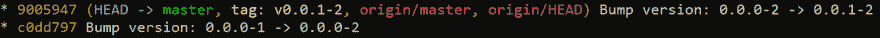

# 使用 Python 对任何应用程序进行版本控制

> 原文：<https://dev.to/feregri_no/versioning-any-app-with-python-bij>

我在这里并不是要说教使用 [SemVer](https://semver.org/) 的好处，是的，我知道 SemVer 对于没有公开公共 API 的应用程序来说并不是非常值得推荐的。然而，在这篇文章中，我将试着向你展示如何给你的 Xamarin 版本化。使用 Python 和 git 的表单应用程序。如果你没有编写 Xamarin 应用程序，我希望你继续阅读，因为你可以将这些原则应用到你使用的任何语言的任何其他应用程序中。

正如我所说的，我们将使用 git 和 Python，所以我假设您已经安装了 git 和 Python 以及 Pip。

### 首先我们的*【任意】* app

版本在 Android 中驻留的文件在`AndroidManifest.xml`文件中:

```
<?xml version="1.0" encoding="utf-8"?>
<manifest xmlns:android="http://schemas.android.com/apk/res/android" 
          android:versionCode="1" 
          android:versionName="0.0.0" 
          package="com.companyname.xamarinsemver">
    <uses-sdk android:minSdkVersion="21" android:targetSdkVersion="28" />
    <application android:label="XamarinSemVer.Android"></application>
    <uses-permission android:name="android.permission.ACCESS_NETWORK_STATE" />
</manifest> 
```

Enter fullscreen mode Exit fullscreen mode

你可以在应用版本的属性`android:versionName`和*“构建”*的属性`android:versionCode`中看到它们。

而在 iOS 中，版本存储在`Info.plist`文件:

```
<!-- ... -->
<key>CFBundleVersion</key>
<string>1</string>
<key>CFBundleShortVersionString</key>
<string>0.0.0</string>
<!-- ... --> 
```

Enter fullscreen mode Exit fullscreen mode

在这里，您可以将它们区分为跟在`CFBundleVersion`后面的*【构建】*的值和跟在`CFBundleShortVersionString`后面的【版本】的值。

对于这篇文章，我将它们都设置为`1`和`0.0.0`，如果你是从零开始真的没有关系，**，只要两个项目中的两个数字彼此匹配**。

一切都很好，都用了 Xamarin。表单应用程序。现在，Python 的部分。

### 实际 Python

现在，第一步是打开一个终端(我更喜欢 PowerShell)并安装软件包 **advbumpversion** 。

```
pip install advbumpversion 
```

Enter fullscreen mode Exit fullscreen mode

当然，如果你使用虚拟环境来做这件事会更好，[在 twitter 上问我如何做](https://twitter.com/feregri_no)。

### 配置版本

现在，我们必须将一个配置文件添加到我们的项目中，这个文件包含我们版本控制的元数据，以及我们刚刚安装的工具应该如何运行。这个文件被命名为`.bumpversion.cfg`，应该位于项目的根目录下。让我们深入了解它的内容:

```
[bumpversion]
current_version = 0.0.0-1
serialize = {major}.{minor}.{patch}-{build}
parse = (?P<major>\d+)\.(?P<minor>\d+)\.(?P<patch>\d+)-(?P<build>\d+)
commit = True
tag = True 
```

Enter fullscreen mode Exit fullscreen mode

让我们一行一行地来:

1.  `[bumpversion]`:仅表示配置从这里开始
2.  如其所述，这是当前版本，对于我在上面创建的应用程序，这从。现在，关键是这个数字不仅仅是*塞姆弗*，而是*塞姆弗*加上构建号，用连字符隔开。
3.  `serialize = {major}.{m...`:这一行指定了版本的每一部分对工具的意义
4.  这告诉 bumpversion 如何解析我们刚刚提供的版本号
5.  `commit = True`:一个布尔值，指示在碰撞版本时是否应该创建 git 提交
6.  `tag = True`:一个布尔值，指示在碰撞版本时是否应该创建一个标识当前版本的标签

至此，您应该能够执行`bump2version --dry-run --verbose`并得到如下结果:

```
Parsing version '0.0.0-1' using regexp '(?P<major>\d+)\.(?P<minor>\d+)\.(?P<patch>\d+)-(?P<build>\d+)'                                                                             
Parsed the following values: build=1, major=0, minor=0, patch=0 
```

Enter fullscreen mode Exit fullscreen mode

现在，轮到我们告诉工具在哪里搜索我们的源代码中的版本，以便为我们替换它们:

```
[bumpversion:file:XamarinSemVer\XamarinSemVer.iOS\Info.plist:0]
serialize = {major}.{minor}.{patch}
search = <string>{current_version}</string>
replace = <string>{new_version}</string> 
```

Enter fullscreen mode Exit fullscreen mode

同样，一行一行地:

1.  在这一行中，我们指定应该修改哪个文件...结尾那个`:0`？这仅仅意味着这不是我们唯一一次修改这个文件；你以后会明白的。
2.  `serialize = {major}.{minor}.{patch}`:这告诉 *bumpversion* 为了这个配置段的目的，版本只由*主要*、*次要*和*补丁*组成，将*构建*排除在外。
3.  `search = <string>{current_version}</string>`:要替换的字符串，在我们第一次执行时，工具会搜索 *" <字符串>0 . 0 . 0</字符串> "*
4.  `replace = <string>{new_version}</string>`:用来替换上述值的字符串，如果我们在增加主成分，那么替换将是这样的: *" <字符串>1 . 0 . 0</字符串> "*

让我们分析下一个配置

```
[bumpversion:file:XamarinSemVer\XamarinSemVer.iOS\Info.plist:1]
serialize = {build}
search = <string>{current_version}</string>
replace = <string>{new_version}</string> 
```

Enter fullscreen mode Exit fullscreen mode

这与之前的配置块只有几个不同之处:

*   正如我前面提到的，文件说明末尾的`:1`是必要的，它告诉工具这是我们第二次接触这个文件。
*   `serialize`的值，这次它被设置为 *build* ，因为在本节中我们只关心 *build* 号，现在不是搜索*"<string>0 . 0 . 0</string>"*，例如，该工具将搜索*"<string>1</string>"*。

几乎同样的配置也可以适用于 Android，我就不一行一行的赘述了，在这里就是:

```
[bumpversion:file:XamarinSemVer\XamarinSemVer.Android\Properties\AndroidManifest.xml:0]
serialize = {major}.{minor}.{patch}
search = android:versionName="{current_version}"
replace = android:versionName="{new_version}"

[bumpversion:file:XamarinSemVer\XamarinSemVer.Android\Properties\AndroidManifest.xml:1]
serialize = {build}
search = android:versionCode="{current_version}"
replace = android:versionCode="{new_version}" 
```

Enter fullscreen mode Exit fullscreen mode

最后，配置的一个关键部分。在 iOS 和 Android 的情况下，无论版本号如何，内部版本号都应该一直增加。默认情况下， *bumpversion* 会在我们每次增加 semver 中的任何其他数字时重置构建号，好消息是我们可以通过在配置文件中包含这些行来覆盖这个设置:

```
[bumpversion:part:build]
independent = True 
```

Enter fullscreen mode Exit fullscreen mode

### 碰撞版(终于！)

在经历了所有安装和配置的麻烦后，我们准备开始疯狂地修改版本，以使我们的软件更有条理。假设您刚刚修复了代码库中的一个 bug 你应该像下面这样做来修改版本:

```
bumpversion build --no-tag  
bumpversion patch  
git push --follow-tags 
```

Enter fullscreen mode Exit fullscreen mode

逐行:

1.  首先，我们增加构建，参数`--no-tag`将覆盖我们的配置，因为您可能不希望在碰撞构建号时创建标签。
2.  然后，我们在我们的 *semver* 方案中增加一个数字，这取决于我们所做的改变的类型。
3.  我们将文件和标签(带有`--follow-tags`)提交给我们的存储库...就是这样。

这将在我们的 repo 中生成两个提交和一个新标签，如下所示:

[](https://res.cloudinary.com/practicaldev/image/fetch/s--FqcCLsC5--/c_limit%2Cf_auto%2Cfl_progressive%2Cq_auto%2Cw_880/https://thepracticaldev.s3.amazonaws.com/i/c784wykevy23itlc0lx4.PNG)

### 锦上添花

每当你的应用程序中有一些有价值的变化时，你可以继续执行这三个命令...或者您可以使用一个 *Makefile* 来进一步自动化任务，或者防止标签被推送到除了*“主”*之外的其他分支。随意[偷看一下我做的 *Makefile*](https://github.com/ThatCSharpGuy/xamarin-semver/blob/master/Makefile) ，不然何乐而不为？到[满库](https://github.com/ThatCSharpGuy/xamarin-semver)。