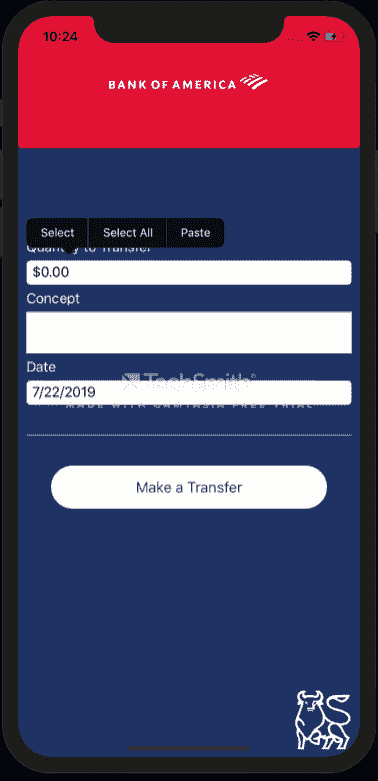

# Xamarin 中的 CurrencyConverter UI。形式

> 原文：<https://dev.to/luciomsp/currencyconverter-ui-in-xamarinforms-25ao>

通常，当我们与设计人员一起查看或支持应用程序流或某些需要立即开发的元素时，我们可能不会想到我们需要哪些组件才能在用户界面中完成客户要求的工作，而如果我们关注这些组件，我们可以做一些事情来改进这些组件

本文按照我的同行以前的文献中引用银行应用程序的模式，将会看到如何产生一种控制，使我们能够将一个 **Entry** 的数值转换为货币值。

我们开始

1-创建我们的解决方案后，我们将在我们的便携式项目中生成“**”类、转换器“**”和“**查看模型”(**)文件夹，在其中我们将添加与应用程序支持的需求相关的类。

2-我们从 Classes 文件夹开始，在其中添加一个名为:*【观察对象】* 的类，该类将检测我们条目中的所有权更改，代码为:

[https://gist . github . com/LucioMSP/188 a 756 f 6944 efdb 1 ef 80 db 3953 B9 b 39](https://gist.github.com/LucioMSP/188a756f6944efdb1ef80db3953b9b39)

3-在 Converter 文件夹中，我们将生成具有执行转换的所有逻辑的类，我们将其命名为 CurrencyConverter。

请注意，转换器不允许我们使用越来越多的值扩展模型，而是允许我们直接从 XAML 将值转换为其他值，例如:

[https://gist . github . com/LucioMSP/8 AFA 5 af deb 3 F5 c 190144 E3 a 229 ff 5b 72](https://gist.github.com/LucioMSP/8afa5afdeb3f5c190144e3a229ff5b72)

4-继续在文件夹中创建类的过程，在最后一个步骤(ViewModels)中，我们需要创建 MainPage 视图的 ViewModel，然后将其命名为:MainPageVM 并添加以下内容:

[https://gist . github . com/LucioMSP/d2b 56163 a 3975 a 6 f 71 c 3 b 9 BC 41 da 2 f 4 e](https://gist.github.com/LucioMSP/d2b56163a3975a6f71c3b9bc41da2f4e)

5-将转换器添加到 MainPage.xaml 视图中。

Converter 是继承自 ivalueConverter 接口的类，实现了 convert 和 ConvertBack 方法。要使用转换器，必须首先将定义为资源:

然后使用保留字 Converter 访问该文件:

< Entry x:Name = " numberto money " Keyboard = " Numeric "

Text="{Binding NumbertoMoney，Converter = { static resource currency Converter } } "/>

**注意**:转换器通常用于更复杂的转换。

**XAML 完成**:

[https://gist . github . com/LucioMSP/a9 bbee 13 a 1 a 3d 2 bfc 0 f 4 fdca 6429d 322](https://gist.github.com/LucioMSP/a9bbee13a1a3d2bfc0f4fdca6429d322)

6-最后，在我们的 MainPage.xaml.cs 中，我们调用先前创建的 ViewModel:

[https://gist . github . com/LucioMSP/f6e 312 ced 7d 49 EEC 7 e 23 BFA 054377 ff 2](https://gist.github.com/LucioMSP/f6e312ced7d49eec7e23bfa054377ff2)

到此为止，我们保存、汇编和测试。

**结果数据**

关于这篇文章

这是**# xampiranyjuly**的第 22 条，它基本上是一系列博客出版物，每年 7 月份，xamparen 社区的一名成员都会在其中发布关于 xamparen 和用户界面的博客。你可以在这里看到更多的信息:

descar ga El código complete de mi[GitHub](https://github.com/LucioMSP/Xamarin.Forms.Examples/tree/master/CurrencyUISample)。

编码快乐！

* * *