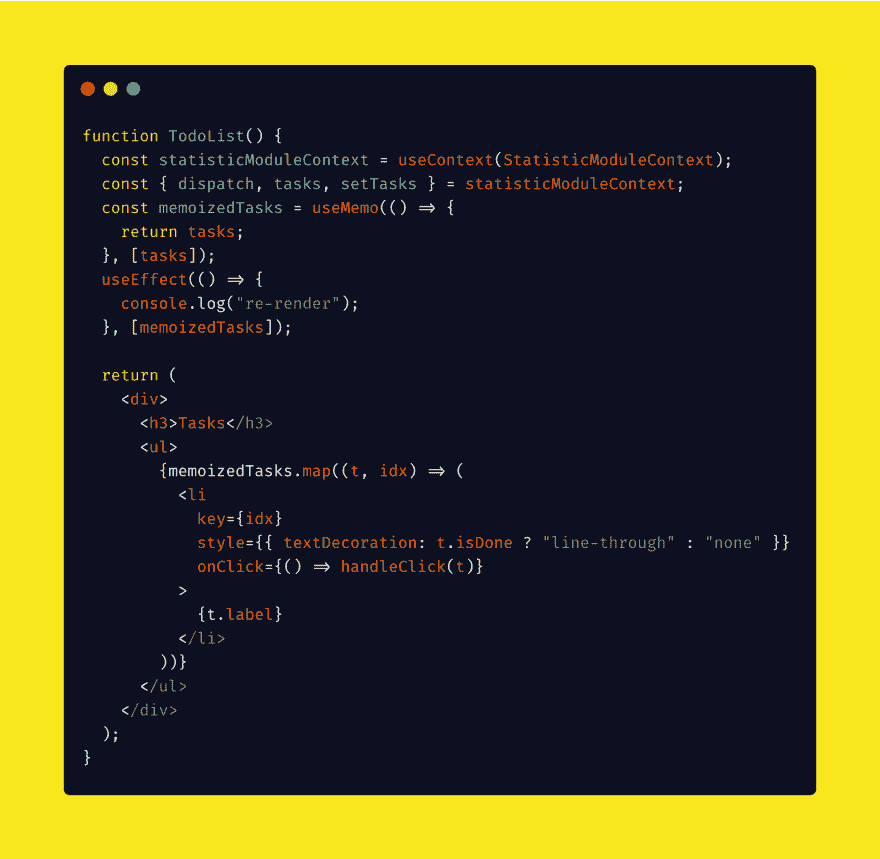
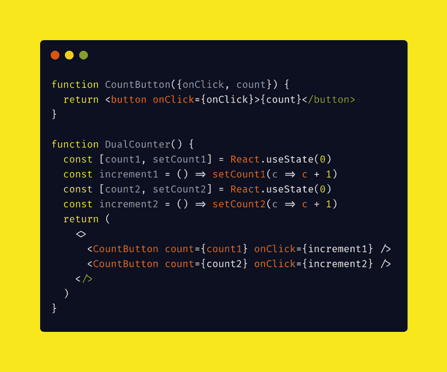
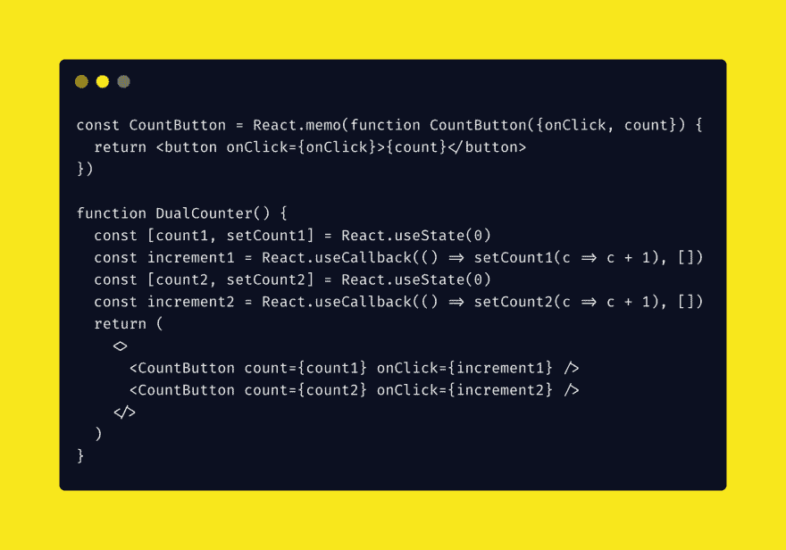

# React 中的性能优化

> 原文：<https://dev.to/aziziyazit/performance-optimizations-in-react-1aph>

> 在计算中，记忆化是一种优化技术，主要用于通过存储昂贵的函数调用的结果并在相同的输入再次出现时返回缓存的结果来加速计算机程序

React 使用虚拟 DOM 来减少浏览器回流，并使用称为“协调”的 diff 算法进行重画。“协调”很快，但是当我们有太多的时候(重新渲染)，代价太大，我们应该计划优化。

React 有两个内置钩子来防止依赖引用相等的组件中不必要的呈现。并避免重新计算昂贵计算。这些钩子是 useMemo 和 useCallback。

**引用相等**是指两个对象引用引用同一个底层对象。

一个有经验的 JavaScript 开发者知道下面的代码返回的是 **false**

```
{} === {} // false
[] === [] // false
() => {} === () => {} // false 
```

<svg width="20px" height="20px" viewBox="0 0 24 24" class="highlight-action crayons-icon highlight-action--fullscreen-on"><title>Enter fullscreen mode</title></svg> <svg width="20px" height="20px" viewBox="0 0 24 24" class="highlight-action crayons-icon highlight-action--fullscreen-off"><title>Exit fullscreen mode</title></svg>

**昂贵计算的例子**是检查质数

```
function isPrime (num) {
  if (num <= 1) {
    return true
  } else if (num <= 3) {
    return true
  } else if (num%2 === 0 || num%3 === 0) {
    return false
  }

  let i = 5
  while (i*i <= num) {
    if (num%i === 0 || num%(i+2) === 0) {
      return false
    }
    i += 6
  }
  return true
} 
```

<svg width="20px" height="20px" viewBox="0 0 24 24" class="highlight-action crayons-icon highlight-action--fullscreen-on"><title>Enter fullscreen mode</title></svg> <svg width="20px" height="20px" viewBox="0 0 24 24" class="highlight-action crayons-icon highlight-action--fullscreen-off"><title>Exit fullscreen mode</title></svg>

没有记忆化，我无法想象上面的函数运行/触发每一次渲染。

## useMemo hook

useMemo 将返回该值的记忆化版本(包括函数在内的所有类型)，该值仅在其中一个依赖关系发生变化时才会发生变化。

以下是 useMemo 的用例示例

[](https://res.cloudinary.com/practicaldev/image/fetch/s--3JUXuXkQ--/c_limit%2Cf_auto%2Cfl_progressive%2Cq_auto%2Cw_880/https://thepracticaldev.s3.amazonaws.com/i/vxk5thoeqns4zvycucol.png)

**memoizedTasks** 只有在 **tasks** 状态发生变化时才会触发渲染。只有当任务状态发生变化时，才会触发 console.log。

对 statisticModuleContext 中其他状态的任何更改都不会导致 TodoList 的重新呈现。

## 使用回调挂钩

useCallback 将返回回调的记忆化版本，该版本仅在其中一个依赖关系发生变化时才会发生变化。

useMemo 和 useCallback 的行为类似:

> useCallback(fn，deps)等价于 useMemo(() => fn，deps)。

但是，通常使用用于父子组件回调。

### 父子组件

当我们识别出一个很有可能重新渲染一个批次的父组件时，我们可以使用 useCallback 来防止子组件不必要的重新渲染。

考虑下面的代码示例(我从 Kent C Dodds 的文章中选取了这个示例，对我来说它是最清楚的示例)

[](https://res.cloudinary.com/practicaldev/image/fetch/s--CZ8aSd7F--/c_limit%2Cf_auto%2Cfl_progressive%2Cq_auto%2Cw_880/https://thepracticaldev.s3.amazonaws.com/i/7fnaiito8po13ri7urh8.png)

DualCounter 是将 CountButton 作为子级的父组件。当 DualCounter 重新呈现时，其函数(increment1 和 increment2)将被更新/重新初始化，并导致 CountButton 重新呈现。这是因为增量 1 和增量 2 是子**依赖关系**。

通过使用 useCallback，在不改变函数依赖关系的情况下，我们能够防止 CountButton 不必要的重新呈现，因为函数已经被记忆了。

[](https://res.cloudinary.com/practicaldev/image/fetch/s--k8oCjSC---/c_limit%2Cf_auto%2Cfl_progressive%2Cq_auto%2Cw_880/https://thepracticaldev.s3.amazonaws.com/i/mp05orc23dkliy5ys821.png)

请注意，优化是有代价的，应该只用于我们上面提到的有效用例。

> 反应非常快，我能想到很多事情让你利用你的时间去做，这比优化事情要好