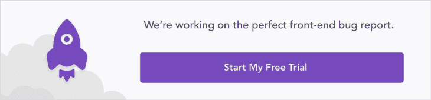
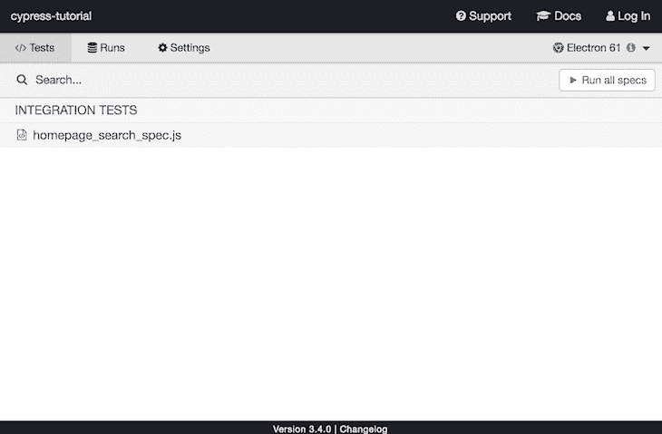
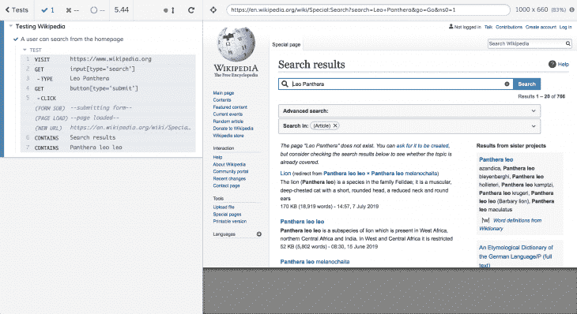

# 如何用 Cypress 编写有用的端到端测试

> 原文：<https://dev.to/bnevilleoneill/how-to-write-useful-end-to-end-tests-with-cypress-mmk>

[](https://res.cloudinary.com/practicaldev/image/fetch/s--v0zWgUM1--/c_limit%2Cf_auto%2Cfl_progressive%2Cq_auto%2Cw_880/https://thepracticaldev.s3.amazonaws.com/i/qmtjqq03gjttmsm3n2lf.jpg)

测试已经成为软件工程的一个重要方面，这也是有充分理由的。编写任何复杂程度的软件通常都是一项棘手的任务，当团队变大，越来越多的人开始在同一个代码库上工作时，情况只会变得更糟。

这个问题在前端开发中变得更加严重，因为有太多的活动部件，以至于编写单元和功能测试可能不足以验证应用程序的正确性。例如，您不能通过单元测试真正验证特定的用户流不会导致问题。

端到端测试允许您在应用程序上复制用户行为，并验证一切正常。如果您正在编写生产级的 web 应用程序，编写 e2e 测试是显而易见的。

在本文中，我们将看看如何使用 [Cypress](https://www.cypress.io/) 在前端编写有用的 e2e 测试。虽然还有其他 e2e 测试工具，如 [Selenium](https://www.seleniumhq.org/) 和 [Nightwatch.js](https://nightwatchjs.org/) ，但我们将重点放在 Cypress 上，因为它有一套功能，包括测试中的时间旅行、记录测试供以后回放等。

***注意:**要跟随本教程，您需要安装 Node.js。如果你没有，你可以在这里下载最新的稳定版本[。](https://nodejs.org/en/)*

[](https://logrocket.com/signup/)

## 树立柏树

让我们创建一个新项目并设置 Cypress，这样我们就可以开始了。

通过运行以下命令初始化一个新项目:

```
mkdir cypress-tutorial
cd cypress-tutorial
npm init -y 
```

将 Cypress 作为开发依赖项安装:

```
npm install --save-dev cypress 
```

通过打开`package.json`更新项目脚本，并将您的脚本更新为:

```
"scripts": {
    "test": "$(npm bin)/cypress run",
    "cypress:open": "$(npm bin)/cypress open"
  }, 
```

在根文件夹中创建一个名为`cypress.json`的文件。这就是如何为这个特定的项目定制 Cypress 的行为。在其中添加以下内容并保存。

```
{ "chromeWebSecurity": false } 
```

我们为什么这样做将在下面进一步解释，所以继续阅读。

## 编写我们的测试

用户故事(对于我们这些实践敏捷的人来说)通常遵循类似这样的格式:"**当**用户采取一个特定的动作，**然后**用户应该看到这个。"

分析这一点，你就可以决定如何为这个特定的故事写一个 e2e 测试。您所需要做的就是通过测试模拟采取用户期望采取的行动，然后断言应用程序状态与您期望的相匹配。

对于前端测试，这些步骤通常可以分为以下几个部分:

1.  访问应用程序中的页面
2.  查询该页面上的元素，例如按钮、下拉列表等。
3.  与元素交互，例如点击按钮、拖动 div 等。
4.  确认交互后的新状态是正确的

我们将编写三个测试来断言我们可以通过模仿用户的动作在 [Wikipedia](https://wikipedia.org) 上执行某些动作。对于每个测试，我们将在编写实际测试之前编写一个用户故事。

在我们开始编写测试之前，您必须创建一个特殊的文件夹来保存您的 Cypress 测试。在你的项目的根目录下，运行以下命令:

```
mkdir cypress && cd cypress
mkdir integration && cd integration 
```

我们所有的 Cypress 测试都将放在这个`/integration`文件夹中。不要担心文件夹的名称，因为您可以在这里存储任何类型的测试。

**注意:**不要在你不拥有的网站/应用程序上使用 Cypress。Cypress 仅仅是为了测试你自己的应用程序，而不是作为一个自动化你个人生活的工具。

## 测试 1:用户可以从主页执行搜索

> **当**用户访问主页，在搜索框中键入内容，然后点击搜索图标**，然后**用户应该会看到一个新页面，上面有他们的搜索结果。

用户故事非常简单:它只是由一个假设的用户在主页上声明一个搜索动作的正确行为。让我们为它编写测试。

在`/integration`文件夹中，创建一个名为`homepage_search_spec.js`的新文件，并在您喜欢的文本编辑器中打开它(我使用 Visual Studio 代码)。

```
describe('Testing Wikipedia', () => {
  it('I can search for content', () => {
    cy.visit('https://www.wikipedia.org');
    cy.get("input[type='search']").type('Leo Panthera');
    cy.get("button[type='submit']").click();
    cy.contains('Search results');
    cy.contains('Panthera leo leo');
  });
}); 
```

让我们检查一下测试，看看它如何与我们之前定义的步骤相匹配。

*   第 3 行:访问应用程序中的一个页面
*   第 4 行:查询页面上元素并与之交互
*   第 5 行:查询页面上一个元素并与之交互
*   第 6 行:确认交互后的新状态是正确的
*   第 7 行:确认交互后的新状态是正确的

您的大多数 e2e 测试将遵循上述格式，您可以开始看到用这种方式测试应用程序的好处。你不需要关心 app 在后台是如何处理这些动作的；你所关心的是你的应用程序应该为某个动作执行某个方式。

语法怎么样？我喜欢 Cypress 的一点是它的语法非常直观。它使用自然语言，使得非程序员也能轻松阅读和理解您的测试。

让我们进行测试。在您的终端中，运行`npm test`，Cypress 将查看`cypress/integration`文件夹，并在那里运行所有的测试。

但是这不是运行测试的唯一方法。您可以在 GUI 中运行它们，当 Cypress 根据您的测试规范操作应用程序时，您可以获得应用程序的实时视图。

在您的终端中，运行`npm run cypress:open`，应该会弹出一个如下所示的窗口:

[](https://res.cloudinary.com/practicaldev/image/fetch/s--Lh2iDJuh--/c_limit%2Cf_auto%2Cfl_progressive%2Cq_auto%2Cw_880/https://i1.wp.com/blog.logrocket.com/wp-content/uploads/2019/08/cypress-window.png%3Fresize%3D730%252C479%26ssl%3D1)

只需点击`homepage_search_spec.js`运行您的测试，您应该会看到另一个窗口弹出。

[](https://res.cloudinary.com/practicaldev/image/fetch/s--SDa51BHR--/c_limit%2Cf_auto%2Cfl_progressive%2Cq_auto%2Cw_880/https://i0.wp.com/blog.logrocket.com/wp-content/uploads/2019/08/testing-wikipedia-cypress.png%3Fresize%3D730%252C398%26ssl%3D1)

在窗口的左上角，您可以快速查看您的测试套件中有多少通过和失败的测试。在窗口的右边是如果用户以你在测试中指定的方式与你的应用程序交互，他们会看到什么。

左侧是大部分魔法发生的地方。在这里，您可以看到当前正在运行的测试、正在采取的操作以及这些操作的结果。

通过这个简单的测试，我们已经能够断言，无论是谁为维基百科开发搜索功能，都能够满足虚构的用户故事需求。

## 测试 2:用户可以从主页切换语言

> **当**用户访问主页，点击语言切换器，并选择一种新的语言，**然后**用户应该被重定向到所选语言的适当域。

在`/integration`文件夹中，创建一个名为`homepage_switch_language_spec.js`的新文件并打开它。

```
describe('Testing Wikipedia', () => {
  it('A user can switch languages', () => {
    cy.visit('https://wikipedia.org');
    cy.contains('Read Wikipedia in your language');
    cy.get('#js-lang-list-button').click();
    cy.contains('Yorùbá').click();
    cy.url().should(
      'equal',
      'https://yo.wikipedia.org/wiki/Oj%C3%BAew%C3%A9_%C3%80k%E1%BB%8D%CC%81k%E1%BB%8D%CC%81',
    );
    cy.contains('Ẹ kú àbọ̀');
  });
}); 
```

现在让我们讨论一些 Cypress 特有的语法。

在第 3 行，我们只是访问维基百科的主页。在第 4 行，我们通过确认页面包含文本“用你的语言阅读维基百科”来断言我们在我们想要在的页面上

在第 5 行，我们通过 id 查询语言切换器按钮，并模拟点击它。我知道这个 id，因为我在 Chrome 的 devtools 中检查过它。这让我想到了编写 Cypress 测试的一个重要概念:在 Cypress 上选择 DOM 元素有多种方法。你可以通过定位它的 id，它的类，甚至它的标签类型来实现。

在这个特定的测试中，我们的目标是按钮的 id，但是在之前的测试中，我们的目标是标签名称和属性。你可以在这里阅读选择 DOM 元素的不同方法。

在第 6 行，我们遇到了另一个常见的 Cypress 命令，您会注意到它在测试中出现了很多次。我们断言在 DOM 上有一个文本为“Yorù bá”的元素，然后我们模拟一次点击。

此操作将导致 Wikipedia 将您重定向到所选语言的相应域。在我们的例子中，我们选择了西非的 yorbá语言，通过查看当前页面的 URL，我们可以确认我们被重定向到了正确的页面。

在第 7 行，我们正是这样做的。通过调用`cy.url()`,我们以文本的形式获得当前页面的 URL，然后我们断言它应该等于 yorbá语言的适当域。在第 8 行，我们有一个额外的可选检查来查看页面上是否有 yorbá语言的内容。

额外事实:ẹ·库·àbọ̀在约尔巴语中是“欢迎”的意思，发音为:eh–koo–ahbuh。

按照我们之前运行测试的方式运行测试，应该会通过。

## 测试 3:用户可以在 Wiktionary 上查看一个词的定义

> **当**用户访问主页并点击链接到维基百科，**然后**用户应该被重定向到 wiktionary.org。
> 
> **当**wiktionary.org 上的用户通过在搜索栏中键入并点击 enter 键来搜索一个定义时，**然后**用户应该被重定向到一个带有该搜索词定义的页面。

另一个简单的用户故事。我们想在 wiki tionary 上查看单词“Svelte”的定义，但是我们将从 Wikipedia 的主页开始，在搜索单词之前导航到 wiki tionary。

在`/integration`文件夹中，创建一个名为`homepage_search_definition.js`的新文件并打开它。

```
describe('Testing Wikipedia', () => {
  it('A user can search for a word', () => {
    cy.visit('https://wikipedia.org');
    cy.get('.other-project-link')
      .eq(2)
      .click();
    cy.url().should('equal', 'https://www.wiktionary.org/');
    cy.get('#searchInput').type('Svelte{enter}');
    cy.contains('Etymology');
    cy.contains('svelte');
  });
}); 
```

让我们以与上一个测试相同的方式完成这个测试。

在第 3 行，我们像往常一样访问维基百科的主页。在第 4 行，我们以一个类名为目标，选择该类的第三个元素(不要忘记索引从 0 开始)，并模拟对该元素的单击。

在我们继续之前，有一点需要注意:如果您的代码依赖于自动生成的 CSS 类，通过类名定位元素可能会导致不一致的测试结果。在这种情况下，通过 id 或标签类型和属性来定位将是一种方法。

在第 7 行，我们通过使用`cy.url()`检查 URL 来断言我们在正确的域上。

另一个警告:如果你正在测试你自己的应用，导航到另一个域的需要可能很少，正因为如此，如果我们没有在我们的`cypress.json`配置中添加`"chromeWebSecurity": false`，这个测试就会失败。

在第 8 行，我们通过 id 定位搜索输入，然后通过键入“Svelte”并点击 enter 按钮(点击 enter 按钮由“{enter}”处理)来模拟一个更改事件。此操作将我们带到一个新页面，显示我们的查询结果。

然后，我们在第 9 行和第 10 行通过断言“词源”和“苗条”可以在页面上找到来确认我们在正确的页面上。

按照我们之前运行测试的方式运行测试，惊叹您的新技能吧！

## 结论

您已经看到了通过使用 Cypress 编写简单的 e2e 测试来验证 web 应用程序的正确性是多么容易。我们对 Cypress 的功能和它提供的一些特性还只是皮毛。

例如，您甚至可以通过在`cypress/videos`下查找来查看您的测试截图和观看录制的视频。您可以定义自定义命令来避免代码重复，使用 fixtures 模拟 API 响应数据，等等。

拥有编写良好的端到端测试可以节省您几个小时的开发时间，并且可以帮助您在合并到产品中之前发现错误和意外行为。从浏览 Cypress 文档开始，一直玩到你可以开始编写现场测试为止。

* * *

## Plug: [LogRocket](https://logrocket.com/signup/) ，一款适用于网络应用的 DVR

[](https://res.cloudinary.com/practicaldev/image/fetch/s--6FG5kvEL--/c_limit%2Cf_auto%2Cfl_progressive%2Cq_auto%2Cw_880/https://i2.wp.com/blog.logrocket.com/wp-content/uploads/2017/03/1d0cd-1s_rmyo6nbrasp-xtvbaxfg.png%3Fresize%3D1200%252C677%26ssl%3D1)

[log rocket](https://logrocket.com/signup/)是一个前端日志工具，让你重放问题，就像它们发生在你自己的浏览器中一样。LogRocket 不需要猜测错误发生的原因，也不需要向用户询问截图和日志转储，而是让您重放会话以快速了解哪里出错了。它可以与任何应用程序完美配合，不管是什么框架，并且有插件可以记录来自 Redux、Vuex 和@ngrx/store 的额外上下文。

除了记录 Redux 动作和状态，LogRocket 还记录控制台日志、JavaScript 错误、stacktraces、带有头+体的网络请求/响应、浏览器元数据、自定义日志。它还使用 DOM 来记录页面上的 HTML 和 CSS，甚至为最复杂的单页面应用程序重新创建像素级完美视频。

[免费试用](https://logrocket.com/signup/)。

* * *

帖子[如何用 Cypress](https://blog.logrocket.com/how-to-write-useful-end-to-end-tests-with-cypress/) 编写有用的端到端测试最先出现在[的 LogRocket 博客](https://blog.logrocket.com)上。