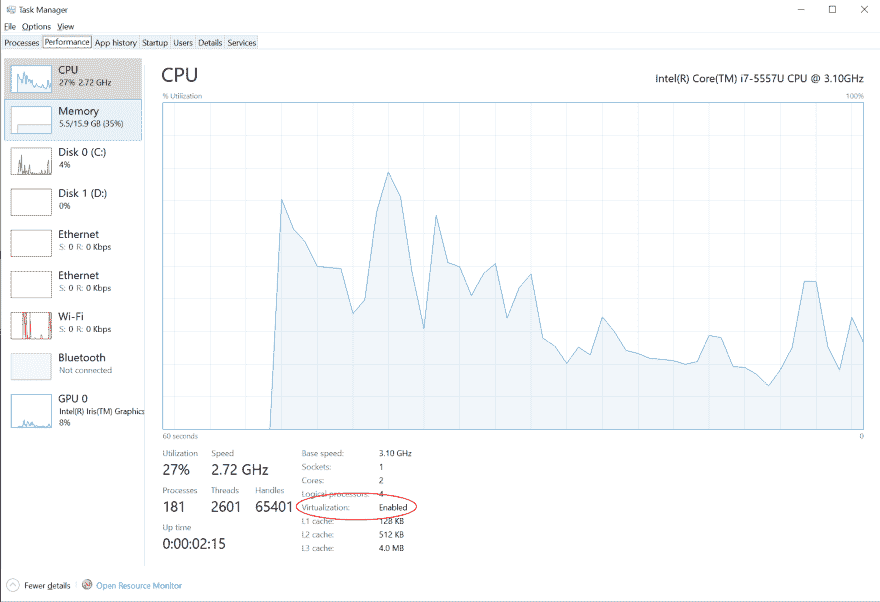
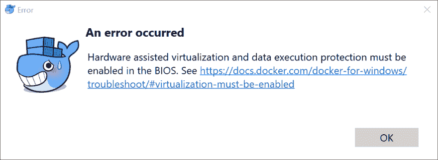
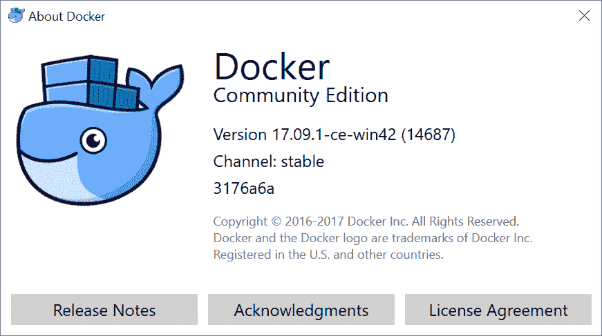
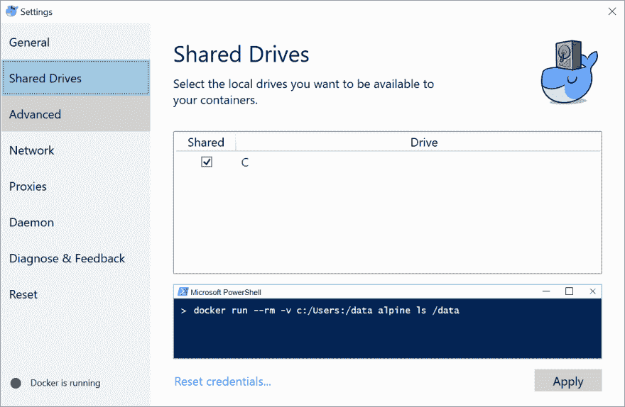
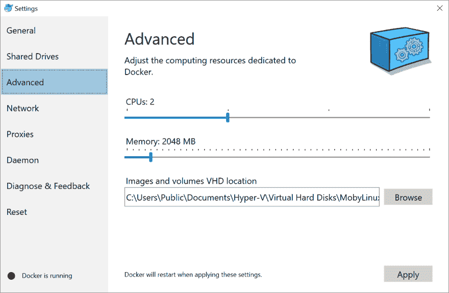
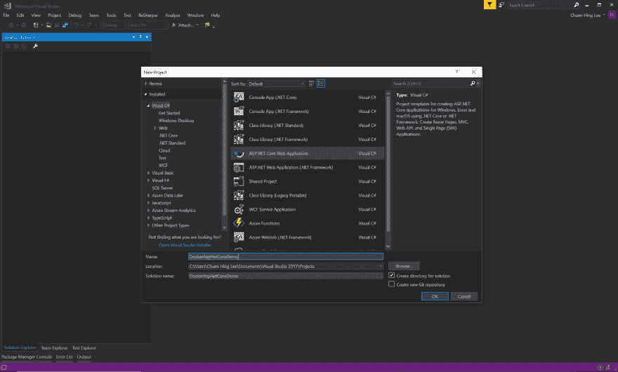
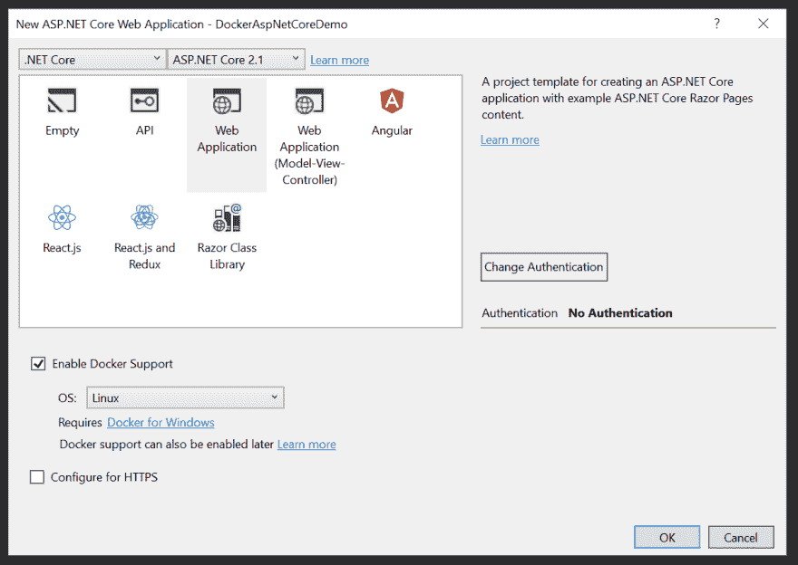
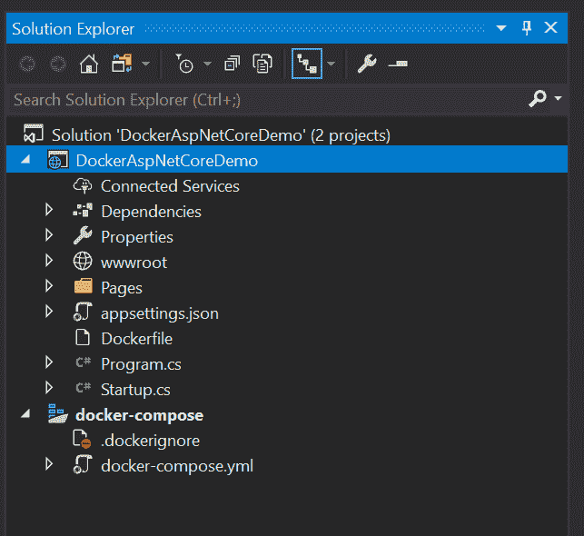

# C#开发人员 Docker 入门

> 原文：<https://dev.to/ch_lee/getting-started-with-docker-for-c-developers-45hc>

自从我在 2015 年第一次遇到 Docker 以来，它已经走过了漫长的道路，现在微软已经有了很多支持，并且在 Visual Studio 中添加了内置的 docker 工具，我认为是时候捡起它了。

## 简单来说 Docker 是什么？

我对 Docker 的解释简单来说就是:

Docker 是一个允许你构建、打包和部署应用程序的工具。

这种说法可能相当模糊，因为有许多工具可以实现同样的事情。不同之处在于，Docker 提供了一个平台，你可以在这个平台上将 WordPress、MySQL、Redis 或几乎任何应用程序(合理范围内，取决于应用程序)打包成所谓的*映像*。你可以把它想象成一个 iso 图像，或者一个类似的 zip 文件。然后，您可以将该映像传输到另一台运行 Docker 的机器上。然后你可以使用*主机*来执行或启动图像，这将依次启动应用程序，Docker 将在所谓的*容器*中运行它。这真的是它的要点。

您不必创建 Docker 映像。有许多 Docker 镜像已经存在并被打包，其中许多被托管在 [Docker hub](https://hub.docker.com/) 上。

我认为 Docker 可以分为两个部分:

1.  将应用程序打包成 docker 映像。这被称为“将应用归档”。
2.  部署和运行 docker 化的应用程序，即在容器中运行 docker 映像。

理解这一点最简单的方法也许是从演示开始。

## 为 Windows 安装 Docker

### 先决条件:

你将需要 **Windows 10 Pro** 、**企业**或**教育**——如[中所述在你安装 Docker](https://docs.docker.com/docker-for-windows/install/#what-to-know-before-you-install) 之前你需要知道的，它需要微软 Hyper-V 来运行。幸运的是，Windows 10 Pro、企业和教育版已经实现了这一点。如果你有 Windows 10 Home，你将不幸地不得不寻找替代品。

若要检查您是否安装了 Hyper-V，Windows 任务管理器将提供以下信息:

[](https://res.cloudinary.com/practicaldev/image/fetch/s--Dup39_4q--/c_limit%2Cf_auto%2Cfl_progressive%2Cq_auto%2Cw_880/https://thepracticaldev.s3.amazonaws.com/i/n8t8t9mygwb4qwib8z7q.png)

**旁注**:我有一台 Macbook Pro (2015 年款)，运行的是 Windows 的 Boot Camp，在安装 Docker 时，我遇到了一个问题，它抱怨虚拟化。错误信息是“必须在 BIOS 中启用硬件辅助虚拟化和数据执行保护”什么饼干？

[](https://res.cloudinary.com/practicaldev/image/fetch/s--F9RMHp3c--/c_limit%2Cf_auto%2Cfl_progressive%2Cq_auto%2Cw_880/https://thepracticaldev.s3.amazonaws.com/i/jpck4w7d2vxkqthtkn63.png)

谷歌了一下，我发现你需要重新启动到 Mac OS，然后重新启动到 Windows，tada，它的虚拟化已经启用。👍

对于任何故障排除，您可以访问[Docker For Windows Github Issues](https://github.com/docker/for-win/issues)

### 下载并安装

从 [Docker 商店](https://store.docker.com/editions/community/docker-ce-desktop-windows)免费下载 Docker。在撰写本文时，有两个版本，Docker CE(社区版)和 Docker EE(企业版)。Docker EE 提供商业支持和认证容器。Docker CE 是免费版本🙂也是我们需要的。

一旦安装，Docker 将在后台运行，可以在 Windows 任务托盘中找到，您应该有这样的东西:

[](https://res.cloudinary.com/practicaldev/image/fetch/s--ahWyJmGX--/c_limit%2Cf_auto%2Cfl_progressive%2Cq_auto%2Cw_880/https://thepracticaldev.s3.amazonaws.com/i/8kx19237ozaljvcg2xlj.png)

确保 C:驱动器已启用，如下所示:

[](https://res.cloudinary.com/practicaldev/image/fetch/s--ng6cDL0o--/c_limit%2Cf_auto%2Cfl_progressive%2Cq_auto%2Cw_880/https://thepracticaldev.s3.amazonaws.com/i/3lu3p6wr8yv6bdqikreq.png)

此外，在高级菜单中，您可以定制所需的计算资源:

[](https://res.cloudinary.com/practicaldev/image/fetch/s--FzfcjQyL--/c_limit%2Cf_auto%2Cfl_progressive%2Cq_auto%2Cw_880/https://thepracticaldev.s3.amazonaws.com/i/kkiioike08fr5atpf7gz.png)

## 对一个 ASP.NET 核心应用程序进行分类

我用的是 Visual Studio 2017 社区版 15.3，但是你需要的只是一个安装了 Docker Tools 的 Visual Studio 版本。

确保您正在管理员模式下运行。

### 创建新的 ASP.NET 核心项目

在 Visual Studio 中创建一个新的 ASP.NET 核心项目，并给它起一个合适的名字。

[](https://res.cloudinary.com/practicaldev/image/fetch/s--fF2oidF---/c_limit%2Cf_auto%2Cfl_progressive%2Cq_auto%2Cw_880/https://thepracticaldev.s3.amazonaws.com/i/yi6yfgggej9ybnzl56cl.png)

在下一个屏幕上，确保您..

*   选择“启用 Docker 支持”
*   选择 Docker 容器已设置到的相关操作系统。我选择了“Linux”。
*   不要选择“配置 HTTPS”-这让事情变得简单。

[](https://res.cloudinary.com/practicaldev/image/fetch/s--4LhU46X7--/c_limit%2Cf_auto%2Cfl_progressive%2Cq_auto%2Cw_880/https://thepracticaldev.s3.amazonaws.com/i/roeo5rxggc0kvgogrfp6.png)

然后，Visual Studio 将创建两个项目:

*   一个 ASP.NET 核心 web 项目，其中包括一个 Docker 文件。
*   Docker Compose 项目，指导 Visual Studio 如何在 Docker 容器中启动项目。

[](https://res.cloudinary.com/practicaldev/image/fetch/s--oboFPwfD--/c_limit%2Cf_auto%2Cfl_progressive%2Cq_auto%2Cw_880/https://thepracticaldev.s3.amazonaws.com/i/stu8ss5tvzaplqxww0ag.png)

确保 docker-compose 项目被标记为启动项目。为此，只需右键单击项目并选择“设置为启动项目”。

通过按 F5 或调试>开始调试来启动项目。

**旁注**
你可能会得到一个错误比如:
`'The DOCKER_REGISTRY variable is not set. Defaulting to a blank string.'`

如果是这样，请在管理员模式下重新启动 Visual Studio。

太好了！现在，您已经有了一个运行在 docker 容器中的标准示例 ASP.NET 核心网站。

**注意**您可以在 docker 模式或标准 IIS 模式下运行您的应用程序。只需将 web 项目设置为启动项目，以便在 IIS 模式下运行，并将 docker-compose 项目设置为启动项目，以便在 docker 模式下运行。

## 如何判断 Docker 是否真的在运行？

您可以通过启动您选择的命令提示符或终端来验证这一点，并键入:

`docker ps`

结果将类似于:

```
CONTAINER ID        IMAGE                      COMMAND               CREATED             STATUS              PORTS                   NAMES
8b49df34dd03        dockeraspnetcoredemo:dev   "tail -f /dev/null"   4 hours ago         Up 4 hours          0.0.0.0:32769->80/tcp   dockercompose8900117491649835616_dockeraspnetcoredemo_1 
```

Enter fullscreen mode Exit fullscreen mode

该命令列出正在运行的容器，并验证 ASP.NET 应用程序是否正在 docker 容器中运行。

令人惊奇的是，断点在 Visual Studio 中照常工作，您可以像以前一样单步执行代码！

您可以在 github 中查看代码示例:
[https://github.com/ch-lee/DockerAspNetCoreDemo](https://github.com/ch-lee/DockerAspNetCoreDemo)