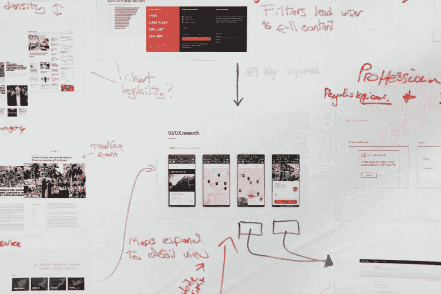

# 设计思维

> 原文：<https://dev.to/browserlondon/design-thinking-4439>

想出一个最初的想法很容易，对吗？但是你怎么知道哪些想法有真正的潜力，哪些应该尽快扔掉呢？

设计思维——有时被称为设计导向思维——为快速创造和测试这些最初的想法提供了一个框架，开启了各种可能性。尽管这种方法听起来似乎应该是创造性职业的专属领域，但当应用于解决与创造性相去甚远的复杂商业问题时，它可以发挥巨大的作用。

设计思维的哲学已经存在了几十年，但直到 2008 年由时任 IDEO 设计公司首席执行官兼总裁的 Tim Brown 在《哈佛商业评论》发表同名文章后，才真正开始在设计和创意社区之外流行。

11 年过去了，我们可以看到设计思维过程在为世界上一些最大、最成功的组织解决所有商业领域的问题。

## 流程

应用设计思维的过程非常简单；首先，需要清楚地暴露这些挑战，以便它们可以被完全解构、理解和定义。在这一阶段(这相当于传统的[发现阶段](https://www.browserlondon.com/services/research-analysis/))通常会咨询专家，这一过程的主要目的是与最终用户产生共鸣。

接下来是快速创新阶段，有时称为构思阶段，团队会提出各种解决方案。这里的目的是鼓励创造性，所以避免对提出的想法进行否定或质疑是很重要的。

从这里开始，团队选择最可行或最合适的解决方案，并进入第三阶段，在第三阶段，这些想法被快速加工成原型，并以最简单的形式部署。这种快速原型制作过程允许对每个解决方案进行检查，或者接受和改进，或者拒绝。这个测量、改进、再测量的迭代过程一直重复，直到期望的解决方案被认为“足够好”可以发布为止。

令人高兴的是，应用设计思维过程所需的技能通常已经存在于团队中，因此有了简单的规则手册，就有了运用创造力解决现实世界问题的巨大空间。当[为我们的客户设计和开发](https://www.browserlondon.com/services/design-development/)新的[数字产品](https://www.browserlondon.com/case-study/twine/)或[数字服务](https://www.browserlondon.com/case-study/lightning-api/)时，我们经常采用这一流程，体验[产品团队](https://dev.to/browserlondon/why-small-teams-are-mighty-16oj)(包括客户利益相关者)，抛开他们的先入之见，享受很快笼罩整个团队的活力，这是非常令人满意的。

## 应用设计思维时的挑战

我们已经注意到在应用设计思维方法时的两个主要挑战，并且在开始之前需要考虑每个挑战。首先，团队构思会议(或头脑风暴，或思想骤雨，或任何你喜欢称之为它们的东西)对于开发那些早期的解决方案至关重要，但许多人一开始觉得这种环境不舒服，需要严格的调节才能保持专注并使过程有效。

第二个挑战是在将早期的“蓝天”解决方案转换为测试和反馈的第一阶段原型时，保持团队的纪律性、开放性和客观性。原型需要快速地工作、评估、放弃或改进，以保持过程的进展，但是有时团队成员会陷入开发一个其他人可以看到是行不通的解决方案的困境。

然而，一旦掌握了，这个过程就变得非常自然，从我自己的经验来看，这是一个非常有效的方法来找到一个应对挑战的可靠答案。通常情况下，这个答案会在更早的时候找到，并且比我们在意识到一种不同的方法可能会更好之前就采用第一个听起来不错的想法并充分发展它花费的精力和金钱更少。

我写这篇文章是因为设计思维是每个人都可以并且(在我看来)应该实践的，无论他们是在构建一个数字产品，改变一个商业策略，还是组织一个团队。

敬请期待我的下一篇文章，在这篇文章中，我将更深入地探讨该过程的各个步骤，并分享我们的团队在应用设计思维方法期间开发的技巧和诀窍。

* * *

帖子[设计思维](https://www.browserlondon.com/blog/2019/08/06/design-thinking/)最早出现在[浏览器伦敦](https://www.browserlondon.com)上。