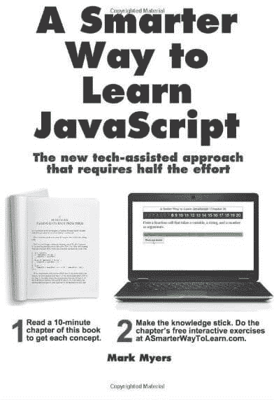
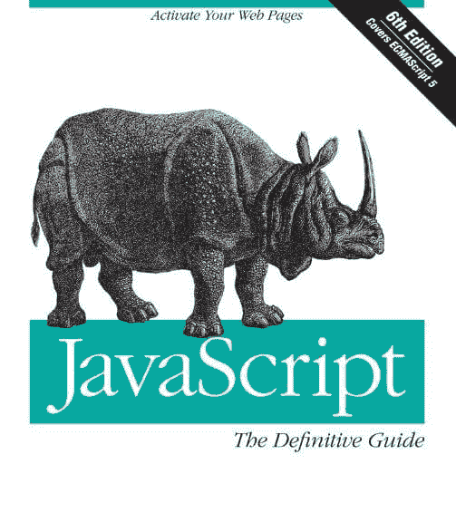

# 学习 JavaScript 的五大电子书

> 原文：<https://dev.to/techcoder/top-5-e-books-to-learn-javascript-237d>

JavaScript 于 1995 年底发布，现已成为最流行、最广泛使用的编程语言之一。自从 2000 年以来，随着许多虔诚的追随者使用这种语言，它的受欢迎程度一直在飙升。众所周知的名字，如微软、网飞、沃尔玛、易贝、脸书，只是在他们的系统中热情使用这种语言的一些公司的名字。

老实说，很难找到不使用 JavaScript 的公司名称。除了 JavaScript，其他最受欢迎的语言是 CSS 和 HTML。随着如此多的公司使用它，以及其他公司最终认识到 JavaScript 在其公司中的必要性，对 JavaScript 开发人员的需求不断增加。但是，即使对于那些想学英语的学生来说，有时也有一个关于找到正确来源的问题。

有的可以选择教程或者在线 JavaScript 课程。其中之一就是 **[【进阶 javascript 初学者】](http://bit.ly/2Kukcr1)** 轻松学习 JavaScript 的在线课程。本课程包括对象和函数、原型、继承、闭包、作用域链等等。

其他人更喜欢查阅一些关于 JavaScript 的博客，其他人可以选择传统的阅读方法，现在随着时代的变化，电子书是教育工具的最新趋势。市场上有很多书，但这些是最值得推荐给 JavaScript 学生的电子书。

# 1。[学习 JavaScript 的更聪明的方法:](https://www.amazon.com/Smarter-Way-Learn-JavaScript-technology-ebook/dp/B00H1W9I6C)新的技术辅助方法，事半功倍

 
学习一门新语言时，最大的挑战就是要记住这门知识，无论是编程还是外语。这本电子书附带了一大堆抽认卡，还有一些练习可以让你彻底掌握这门学科。对于初学者来说，一些高级的概念可能难以理解，但是这本电子书以一种新手能够容易理解的方式解释了这些术语。

# 2。[雄辩的 JavaScript，第三版:编程的现代介绍](https://eloquentjavascript.net/Eloquent_JavaScript.pdf)

这本电子书将帮助你写出同样高效的代码。这本电子书的作者使用了非常实用的例子，他也教初学者编程。电子书中的练习，你将能够立刻创建你自己的代码行。

# 3。[面向初学者的 JavaScript:开始编程的简单方法](https://www.amazon.com/Javascript-Beginners-Simple-Start-Programming-ebook/dp/B07HLT35B6)

有许多课程承诺在一周内教会你语言，尽管很少能达到效果。这本电子书并不像那些书一样声称是一本神奇的电子书，但它从基础开始教授 JavaScript。此外，这本电子书将指导你所有的基本工具。

# 4。[权威指南:激活你的网页](https://www.amazon.com/JavaScript-Definitive-Guide-Activate-Guides/dp/0596805527)

 
这本电子书是以编程语言作品闻名的奥莱利的作品。这本书类似于 JavaScript 的圣经。除此之外，它还有关于 HTML5 和 ECMAScript5 的章节。

# 5。[你不知道的 JS 系列](https://www.amazon.com/You-Dont-Know-JS-Performance-ebook/dp/B00TXVCJ7O/)

这本书仔细地涵盖了这种语言更复杂的方面，它还有一些特性和表现技巧，比如生成器和承诺。这些帮助您构建单页应用程序。

## **结论**

如果你觉得我们错过了一些其他流行的学习 JavaScript 的电子书，让我们知道你认为哪本电子书应该在这里。

查看 JavaScript 培训迷你 E-Degree 上的这个 [Kickstarter 活动！](https://www.kickstarter.com/projects/eduonix/javascript-bootcamp-build-apps-with-top-3-js-frameworks?ref=9gg30f)这是你大放异彩的时刻！在优惠消失之前，选择你最喜欢的早鸟优惠！数量有限，今天就承诺！