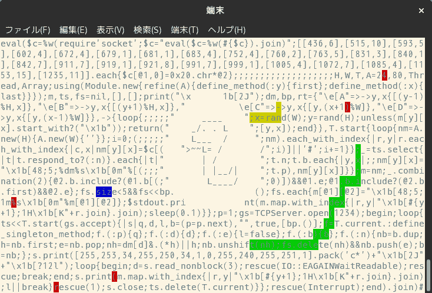

# 奎因蛇战

> 原文：<https://dev.to/hanachin/quine-snake-battle-bee>

我做了一个多人贪吃蛇游戏。
[https://github.com/hanachin/quine-snake](https://github.com/hanachin/quine-snake)

[](https://res.cloudinary.com/practicaldev/image/fetch/s--vBvHEnA2--/c_limit%2Cf_auto%2Cfl_progressive%2Cq_auto%2Cw_880/https://thepracticaldev.s3.amazonaws.com/i/n8l2ybv5n2bz0bqmrvtn.png)

> telnetで対戦游戏https://t.co/hYCRTGdtSE[できるquineなsnake](https://t.co/hYCRTGdtSE)T3】pic.twitter.com/aziv7ai6yB
> 
> — 𝓜𝓲𝔂𝓪𝓰𝓲 (@hanachin_) [August 4, 2019](https://twitter.com/hanachin_/status/1158109398025158657?ref_src=twsrc%5Etfw)

## 怎么玩

运行服务器(需要 ruby 2.7+)

```
$ ruby snake.rb 
```

然后远程登录

```
$ telnet 127.0.0.1 1234 
```