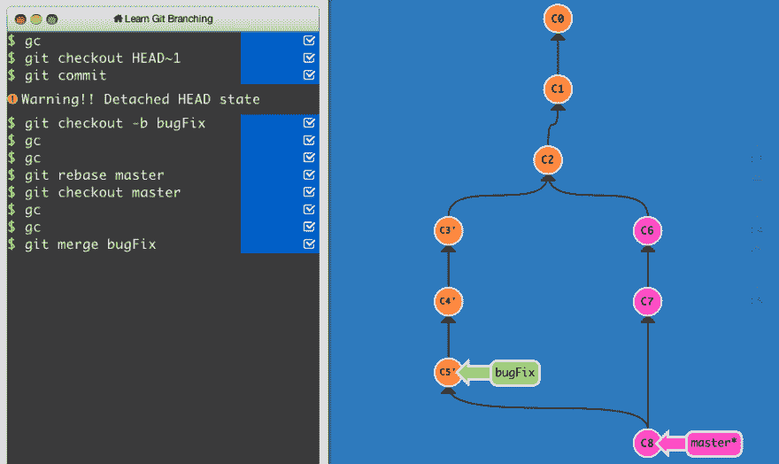
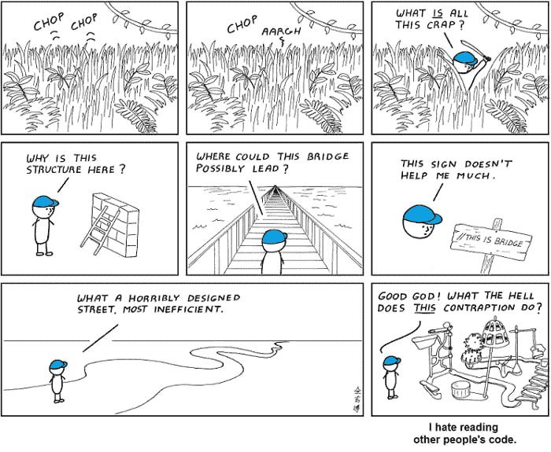
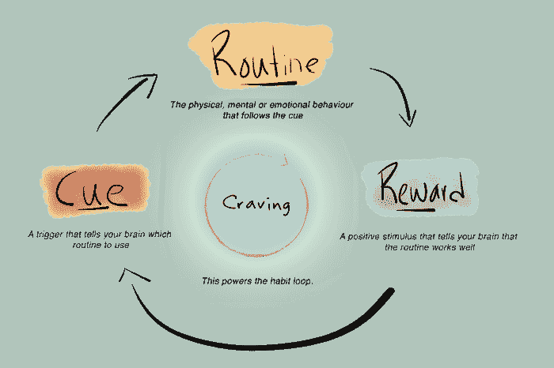

# 作为一名开发人员，我希望早点知道的关键习惯和事情

> 原文：<https://dev.to/rhamedy/key-habits-and-things-i-wish-i-knew-earlier-as-a-developer-2c97>

##### 列出了能帮助你成为更好的开发人员的关键习惯和技能

作为一名开发人员，有哪些事情是你希望早点知道的？有什么习惯，书，文章或者技巧吗？**请在评论区**分享。

# 总结

这里有一个习惯和事情的快速总结，在我看来，如果作为一名开发人员早点知道，会有很大的不同。当然，**永远不会太晚**

*   搜索引擎的有效使用
*   使用现代 IDE 提高生产力
*   学习 Linux
*   Learn Git
*   编码标准很重要
*   自学并跟随技术趋势
*   听技术播客
*   精通至少一门编程语言
*   专注于简单
*   学习设计模式
*   加入社区/论坛
*   创建专业档案
*   问，问，问
*   先在纸上求解，然后转换成代码
*   从一开始就记录和编写测试
*   定期解决难题/挑战
*   尽早开始白板演示
*   有效管理你的时间
*   保护您的个人信息
*   追随影响你的人和公司
*   参加技术活动、研讨会、讲座和黑客马拉松
*   拥抱错误信息❤
*   选择适合实习/职业的公司类型
*   首先开发一个可行的解决方案，然后反复完善它
*   搜索引擎优化自己

像往常一样，注意以下习惯/模式

*   不要轻易放弃！❤
*   不要复制作业/项目
*   不要拖延——如果不是现在，什么时候？
*   不要忽视其他主题
*   不要沉迷于社交网络
*   不要失去希望

> mpj💛[@ mpjme](https://dev.to/mpjme)新程序员常常不确定自己是否会足够优秀。随着我们变得越来越有经验，我们学会了放松，因为我们肯定永远都不够好。2018 年 6 月 12 日下午 17:4420365900

* * *

# 学习

由于行业发展的速度，学习是科技繁荣的先决条件。总有新的东西要学。

> 一旦你停止学习，你就开始死亡——阿尔伯特·爱因斯坦

### 高效搜索

作为一名开发人员，你会经常使用搜索引擎，而且大多数搜索引擎都提供高级功能。参见[提示](https://www.lifehack.org/articles/technology/20-tips-use-google-search-efficiently.html)和[信息图](https://mashable.com/2011/11/24/google-search-infographic/#KSYNRsvFuGqG)

### 开发 IDEs

IntelliJ、Atom 等 ide 带有快捷方式、插件和旨在提高生产力的特性。花一点时间学习如何最好地使用 IDE。
[T3】](https://res.cloudinary.com/practicaldev/image/fetch/s--cxkbBmcC--/c_limit%2Cf_auto%2Cfl_progressive%2Cq_auto%2Cw_880/https://thepracticaldev.s3.amazonaws.com/i/3m0nco0f98g3sg24n9kz.png)

### 学习 Linux

原生安装 [Ubuntu](https://www.ubuntu.com/) ，使用 [VirtualBox](https://www.virtualbox.org/) 或者 [Windows 子系统](https://docs.microsoft.com/en-us/windows/wsl/install-win10)用于 Linux 简直易如反掌。Linux/Unix 知识是一个巨大的优势。

### 学习去

Git 是最流行的代码版本控制工具之一。我建议**尽早开始你的项目和任务。学习 **Git** 的一个好方法是通过文档、文章，也许还有这个[互动在线](https://learngitbranching.js.org/)资源。
**

### 自学

事实上，无论你的大学排名如何，课程的深度如何，教授的水平如何，你的学习计划都不能让你为现实世界做好准备。现在网上网下都不缺学习资料。
[T3】](https://res.cloudinary.com/practicaldev/image/fetch/s--b9OCr45---/c_limit%2Cf_auto%2Cfl_progressive%2Cq_auto%2Cw_880/https://thepracticaldev.s3.amazonaws.com/i/1l1ew7iy0pa2bnh62moi.jpeg)

[crunchzilla](http://www.crunchzilla.com/) 是一个循序渐进的如何为初学者编写游戏代码。我最喜欢的 Youtube 频道是[德里克·巴纳斯](https://www.youtube.com/channel/UCwRXb5dUK4cvsHbx-rGzSgw)、 [LearnCode Academy](https://www.youtube.com/user/learncodeacademy) 、 [FreeCodeCamp](https://www.youtube.com/channel/UC8butISFwT-Wl7EV0hUK0BQ) 和 [CodingTech](https://www.youtube.com/channel/UCtxCXg-UvSnTKPOzLH4wJaQ) 。最后，你可以从 [EDX](https://www.edx.org/) 、[斯坦福在线](http://online.stanford.edu/)和[麻省理工学院](https://ocw.mit.edu/index.htm)的开放课件列表中学习。

### 具体学习至少一门语言

在大学，我学了 2 年 C 编程，从基础到高级数据结构。它有助于建立一个强大的编程基础，其他任何语言都只是语法、术语和结构的变化。

### 注重简洁

当谈到编码时，你会惊讶于简单性是多么受欢迎，而没有人欣赏复杂、难以理解和维护的代码。

> 简单是可靠的先决条件。埃德格·w·迪杰斯特拉

[https://www.youtube.com/embed/rI8tNMsozo0](https://www.youtube.com/embed/rI8tNMsozo0)

### 编码标准事关重大

代码在其生命周期内从一个开发迁移到另一个开发是很常见的。遵循普遍采用的编码准则以确保代码易于理解、扩展和维护是至关重要的。点击下图阅读我关于 **Java 编码最佳实践**的文章。

### 学习设计模式

类似于编码标准，设计模式的知识帮助你构建接近于**不朽的**系统(好吧，也许不是不朽的，但是你明白这一点)。
T3[T5](https://res.cloudinary.com/practicaldev/image/fetch/s--v9jnSK61--/c_limit%2Cf_auto%2Cfl_progressive%2Cq_auto%2Cw_880/https://thepracticaldev.s3.amazonaws.com/i/dtv0rvbhz4p4x2y4b517.png)

### 听科技播客

当通勤、步行、驾驶等时，播客是拓宽你的技术知识的好方法。我强烈推荐查看[软件工程日报](https://softwareengineeringdaily.com)播客。

* * *

# 社区&简介

社区是你与志同道合的专业人士交流、学习和回馈的地方。

### GitHub

创建一个档案可以让你建立自己的仓库，**跟随**鼓舞人心的贡献者，通过**注视**他们的仓库来欣赏其他人的工作，最重要的是**为开源项目做出**贡献。这是我的 [GitHub](https://github.com/rhamedy) 简介。

如何投稿？你可以报告一个 **bug** ，编写**文档**，回答**问题**，修复**问题**并创建**新特性**。

值得一提的是，雇主青睐开源贡献者。

### 栈溢出

[StackOverflow](https://stackoverflow.com/) 是 T4 最大的软件开发 Q 网站。拥有一份 SO 档案是件好事。见罗布的[评论](https://medium.com/@robmuh/i-take-strong-exception-to-every-premise-motivation-and-conclusion-of-this-article-df658bfba8ad)关于它在采访中的意义。

*   问困难且有意义的问题
*   回答问题
*   投票赞成有用的问题/答案

### 领英

LinkedIn 上的个人资料是建立你在线形象的第一步。

*   建立你的职业网络
*   订阅来自公司和影响者的更新
*   探索工作，撰写和阅读帖子

同样，AngelList 和 T2 indie hackers 和 Reddit 都是很好的社区，可以成为其中的一员。请查看下面我的个人资料。

## [拉菲乌拉·哈米德](/rhamedy)

[After trying dev.to, I have decided to do a u-turn to medium for my future article.](/rhamedy)

[狂想曲](https://github.com/rhamedy)

* * *

# 习惯

尽早养成一些习惯会对你以后的发展大有帮助。我强烈推荐阅读查尔斯·杜希格的《习惯的力量》。
T3T5】

1.  科技是一个快节奏的行业。**在社交网络&上保持最新**，比如[slashdot](https://slashdot.org/)&[TechCrunch](https://techcrunch.com/)。

2.  不要害羞！向有专业知识的人寻求建议

3.  总是计划和**解决论文**中的问题然后写代码。这个很厉害。

4.  编写符合行业采用的**编码标准**的代码。尽早开始为作业和项目编写测试。

5.  养成定期**解决难题/挑战**的习惯。无论是面试、你的工作、副业等等，这都将对你大有裨益。

6.  无论是面试还是工作，白板技能永远不会让你失望。可能是最容易被忽视的技能之一。

7.  了解你手中有多少时间，并明智地使用它。算一算，**日历明天**，如果你对他们的隐私政策感到满意，就使用 **RescueTime/Toggl** 。

8.  通过阅读**隐私政策、服务条款**，使用 VPN &加密、密码管理器、启用 2FA 等等来保护您的身份。

* * *

# 社交&人脉

网络和社交有很多好处，比如

*   建立你的职业网络
*   获得灵感并激励他人
*   了解开发人员社区、工作、指导、志愿服务等
*   找到你的联合创始人和项目合作伙伴
*   提高你的软技能，比如说，积极倾听，等等。

我们早已过了一个人军队的时代，现在是 T2 团队合作的时代。结识各种专业人士，如法律、财务、销售、营销等。它在将来会派上用场，无论是 It 方面的项目，还是改变行业等等。

如果你觉得人际交往很困难，我建议你读一些自助书籍，比如[安静:在一个不停说话的世界里内向者的力量](https://www.goodreads.com/book/show/8520610-quiet)，网上有大量的提示和建议。

### 追随影响者&的公司

善用社交网络。追随那些激励并提醒你梦想和目标的人和公司。我使用社交网络来

*   与家人和朋友保持联系
*   阅读来自谷歌、微软、苹果、联合国、亚马逊、网飞、 [SpaceX](https://www.linkedin.com/company/spacex/) 、特斯拉等公司的更新。
*   关注公众人物，如埃隆·马斯克、比尔·盖茨、莱昂纳多·迪卡普里奥、T2、杰夫·阿特伍德、丹·阿布拉莫夫、戴夫·塞耶、维塔利克·布特林、等等。
*   参加每月例会(即 [Hackernest](https://hackernest.com/) )、研讨会、讲座、黑客马拉松

### 侧面项目

按照你的想法行动。其他人正在考虑它的可能性非常高。

*   选择一个好主意，做一个可行性和市场调查
*   联系你的专业网络，寻找合作伙伴和共同创始人
*   在空闲时间工作，同时保持健康的工作/生活平衡&不要忘记完成这个想法

* * *

# 正在研究

作为一名软件开发人员，你将不断地学习和研究。给自己一个先阅读文档的习惯，如果没有帮助，就去寻找其他的学习材料，比如例子，教程等等。

### 错误信息

当你遇到错误信息时，不要失望。学习**它是关于什么的？什么时候发生？**和**如何优雅地处理**？

### 选择合适的公司

最近，我看到了 Brenn 的这篇文章，他解释了在一家 T2 产品和咨询公司工作的好处，这可能会帮助你决定下一步的职业/实习选择。

### SEO 自己

你谷歌过自己吗？你的个人信息安全吗？你的公共信息容易获取吗？使用搜索引擎的魔力来实现你的目标，无论是分享智慧，推广你的品牌，吸引追随者，还是传播意识。

* * *

# 你应该避免的事情

养成和消除习惯需要时间。

### 不轻易放弃

有不同的线索导致放弃。作为一名软件开发人员，你会很容易遇到

*   恼人的问题
*   糟糕的遗留代码
*   学习其他语言、工具和领域知识
*   与有不同编码习惯、观点等的人一起工作

不放弃和不断尝试通常是一个好习惯，但是，不要固执，要明白什么时候是放手和继续前进的时候。

说到编码，如果你正处于放弃的边缘，试试下面的方法

*   休息一下，稍后或第二天再来
*   试着在纸上解决它
*   向有专业知识的人寻求帮助

### 不复制作业

当我开始攻读计算机科学学位时，第一个 c 编程作业是*“编写一个使用+(正)和-(负)运算符计算 x^n (x 的 n 次方)的程序，其中 x 和 n 是用户提供的整数”*。

在无法上网的情况下，我花了很长时间才在纸上找到解决方案。我学会了不放弃，不断尝试，未来的任务变得越来越容易。

### 不要沉迷于社交网络

信不信由你，大多数社交网络都是由只有一个目标的算法驱动的——利用你的时间为公司增加投资回报率。

### 不要失去希望，你比你想象的要聪明

最后，感到绝望和担忧将是一个常客，你必须学会如何处理它。这里有几点为你辩护

*   不要让知识差距让你担心或绝望——见下文
*   不要被那些更好的人吓倒，你会成功的
*   不要因为不知道所有的东西而失去希望，比如人工智能、机器学习、区块链等等——你最终会知道的

丹·阿布拉莫夫(Dan Abramov)是我关注的一名开发人员，也是著名的 Redux framework 的创始人之一，他写了下面这篇[文章](https://overreacted.io/things-i-dont-know-as-of-2018)，我认为这是一篇很棒的文章。

> getify[@ getify](https://dev.to/getify)20 年以上的开发经验，8 本书售出 10 万多册，我的视频观看了 30 万多小时，4k+面授...
> 
> 你知道吗？我仍然努力让我的代码工作，这仍然是一个乏味的苦差事。而我的代码第二天还是让我很困惑。在这些斗争中，你并不孤单。2018 年 3 月 10 日下午 15:3321896064

* * *

# 其他文章

到目前为止，我已经写了以下文章

 [## 如何加载测试:开发人员性能测试指南

### 拉菲乌拉·哈米德 7 月 27 日 196 分钟阅读

#testing #beginners #java #webdev](/rhamedy/how-to-load-test-a-developer-s-guide-to-performance-testing-4e8m)

包括[在 medium 上对 Java 编码最佳实践](https://medium.com/@rhamedy/a-short-summary-of-java-coding-best-practices-31283d0167d3)的简短总结。

这篇文章是对拥有近 9K 点击量的媒体的[原文](https://medium.com/@rhamedy/key-habits-and-things-i-wish-i-knew-earlier-as-a-developer-43c9466a0407)的移植和一些添加和修改。

*注意:我的中型文章都没有计量。付费墙是我开发*的原因

* * *

# 相关文章

1.  最后，为那些希望阅读更多的人提供一些相关的文章。我最喜欢的一篇文章是关于阿里给新开发者的 25 条建议

2.  一篇必读文章[给新软件开发人员的建议](https://medium.com/swlh/advice-to-new-software-developers-ce4444943b9a)，其中他谈到了产品与咨询公司的职业生涯/实习。

3.  新开发人员真正应该关注的是什么？Lydia 写了另一篇[文章](https://medium.com/@lydiahallie/advice-from-a-19-y-o-girl-software-developer-88737bcc6be5)，可能会引起新开发人员的共鸣。

4.  Stephen 在他的博客文章中提供了一些很棒的技巧(手工编码——我最喜欢的，调试时休息一下)

5.  Natasha 在她的博客上为初级开发人员提供了另外 [15 条建议](https://www.codementor.io/learn-programming/15-ways-to-improve-as-a-junior-developer)(将你的关注点分开，即 SRP，写简短的方法，找一个导师)

6.  艾玛德在他的博客上的一些惊人的提示(例如，对开源的贡献、询问、写博客等)

感谢您的阅读和分享您的评论！在社交媒体网络上关注我并与我联系，以获取未来的文章。