# 2019 年 React 开发者的 22 个神奇工具

> 原文：<https://dev.to/jsmanifest/22-miraculous-tools-for-react-developers-in-2019-4i46>

在[媒体](https://medium.com/@jsmanifest)上找到我

(**编辑**:阅读评论，找到我对一个优秀的现代程序员程序**的评论，我每天用它**做笔记，它支持像 React/JSX、**make*with React***这样的语法。我希望我能回来把它包括在这里，但是太晚了)

据我们所知，React 是一个 JavaScript 库，用于构建令人惊叹的用户界面。但是，并不是每个人都在使用相同的工具，或者知道所有那些有助于使 react 开发体验更有趣、更主动的优秀工具。

如果你还没有用过 react，或者你的朋友可能对使用 react 感兴趣，当他们问你为什么要使用这个库时，你会怎么回答？除了告诉他们这个库有多棒(这应该是第一件事)，我还想提到开源社区创建的工具有助于将体验带到一个全新的兴奋水平。

以下是 2019 年你可以用来构建 react 应用的 22 个工具(这个列表是按照重要性排序的*而不是*)

## 1。web pack-捆绑包-分析器

有没有想过你的应用程序的哪些包或部分占用了所有的空间？好吧，如果你使用 [webpack-bundle-analyzer](https://github.com/webpack-contrib/webpack-bundle-analyzer) 你就能发现。这个包将帮助您识别占用空间最大的输出文件。

它将创建一个活动的服务器，并向您呈现您的包内容的交互式树形图可视化。在您的工具包中有了这个，您就能够看到呈现的文件位于何处，它们的 gzip 大小，解析的大小，以及它们所属的父/子。

好处呢？嗯，你可以根据你看到的优化你的 react 应用！

这是一张截图:

[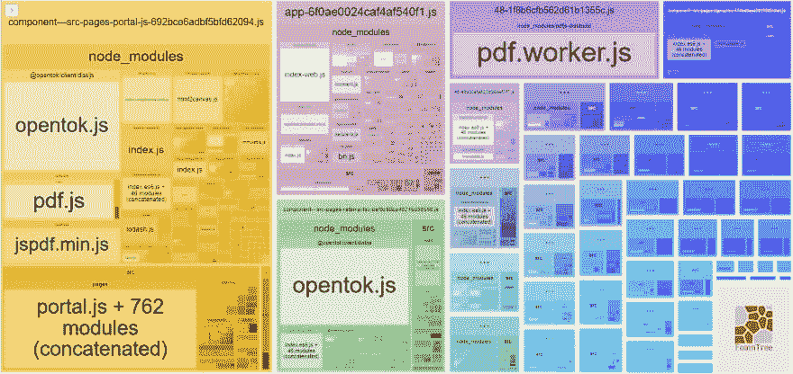](https://res.cloudinary.com/practicaldev/image/fetch/s--Lc629vLZ--/c_limit%2Cf_auto%2Cfl_progressive%2Cq_auto%2Cw_880/https://jsmanifest.s3-us-west-1.amazonaws.com/posts/22-miraculous-tools-for-react-developers-in-2019/webpack_bundle_analyzer1.jpg)

你可以清楚地看到 pdf 包在应用程序中占据了最大的空间。但是它也占据了屏幕上最大的空间。那就是*非常*有用。

不过截图很少。您还可以传入有用的选项来查看更多细节，如`generateStatsFile: true`,还可以选择生成一个静态 HTML 文件，您可以将它保存在开发环境之外的某个地方以备后用。

## 2。反应原型

react-proto 是一款面向开发者和设计者的原型开发工具。这是一个桌面软件，所以你必须在使用前下载并安装软件。

这是一个正在使用的软件的例子:

[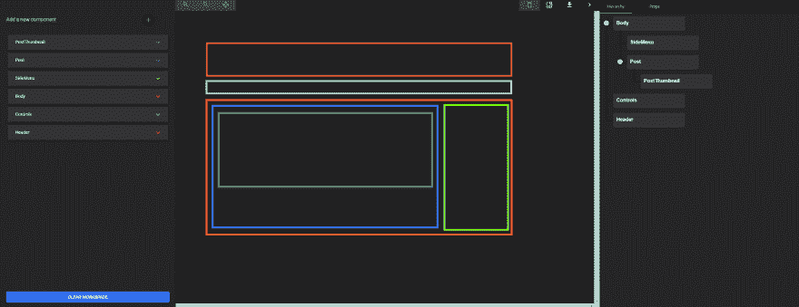](https://res.cloudinary.com/practicaldev/image/fetch/s--EVq6fUPs--/c_limit%2Cf_auto%2Cfl_progressive%2Cq_auto%2Cw_880/https://jsmanifest.s3-us-west-1.amazonaws.com/posts/22-miraculous-tools-for-react-developers-in-2019/react_proto_1.jpg)

该应用程序允许您声明 props 及其类型，在树中查看您的组件，导入背景图像，将它们定义为有状态或无状态，它们的父组件是谁，放大/缩小，以及将您的原型导出到新的或现有的项目中。

然而，这款应用似乎更适合 mac 用户，但对 windows 用户来说仍然很好用。

绘制完用户界面后，您可以选择*将*导出到现有项目或新项目。如果您选择导出到现有项目并选择您的根目录，它会将它们导出到。/src/像这样的组件:

[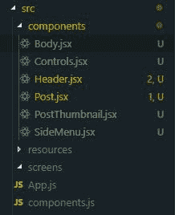](https://res.cloudinary.com/practicaldev/image/fetch/s--aDN1ROyX--/c_limit%2Cf_auto%2Cfl_progressive%2Cq_auto%2Cw_880/https://jsmanifest.s3-us-west-1.amazonaws.com/posts/22-miraculous-tools-for-react-developers-in-2019/react_proto_2.jpg)

这是我们在示例中使用的一个组件的示例:

[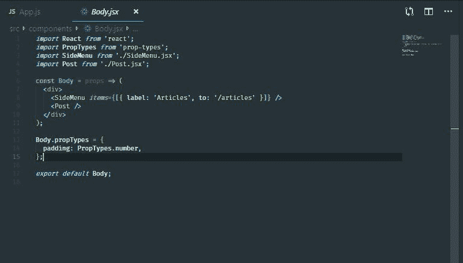](https://res.cloudinary.com/practicaldev/image/fetch/s--U7DAVWNN--/c_limit%2Cf_auto%2Cfl_progressive%2Cq_auto%2Cw_880/https://jsmanifest.s3-us-west-1.amazonaws.com/posts/22-miraculous-tools-for-react-developers-in-2019/react_proto_3.jpg)

react-proto 在 GitHub 上获得了超过 2000 颗恒星。虽然我个人认为这个应用程序需要更新和更多的工作，特别是随着 react hooks 的发布。它也不会缩小，除非你有一个可见的背景图像。换句话说，如果您导入背景图像，缩小，然后继续删除背景图像，您将无法放大，因为按钮是灰色的。放大的唯一方法是重新导入背景图像，然后在放大后移除它。这个缺陷改变了我对这个应用的看法，但它出现在这个列表中，因为我们在其他任何地方都没有看到这个开源的应用。开源是这个应用程序的一个好处，它有可能在未来使趋势开源库列表成为可能(它们的功能很重要，但它们似乎缺乏人力)。

## 3。你为什么更新了

[why-do-you-update](https://github.com/welldone-software/why-did-you-render)monkey 补丁做出反应，通知您可避免的重新渲染。这非常有用，不仅可以指导您修复项目的性能，还可以帮助您理解 react 的工作方式。当你对 react 的工作原理有了更多的了解，这将使你成为一个更好的 react 开发者。

您可以通过声明一个额外的静态属性`whyDidYouRender`，并将其值设置为`true` :
，将监听器附加到任何定制组件上

```
import React from 'react'
import Button from '@material-ui/core/Button'

const Child = (props) => <div {...props} />

const Child2 = ({ children, ...props }) => (
  <div {...props}>
    {children} <Child />
  </div>
)

Child2.whyDidYouRender = true

const App = () => {
  const [state, setState] = React.useState({})

  return (
    <div>
      <Child>{JSON.stringify(state, null, 2)}</Child>
      <div>
        <Button type="button" onClick={() => setState({ hello: 'hi' })}>
          Submit
        </Button>
      </div>
      <Child2>Child #2</Child2>
    </div>
  )
}

export default App 
```

<svg width="20px" height="20px" viewBox="0 0 24 24" class="highlight-action crayons-icon highlight-action--fullscreen-on"><title>Enter fullscreen mode</title></svg> <svg width="20px" height="20px" viewBox="0 0 24 24" class="highlight-action crayons-icon highlight-action--fullscreen-off"><title>Exit fullscreen mode</title></svg>

只有在这样做之后，你的主机才会发出恼人的警告:

[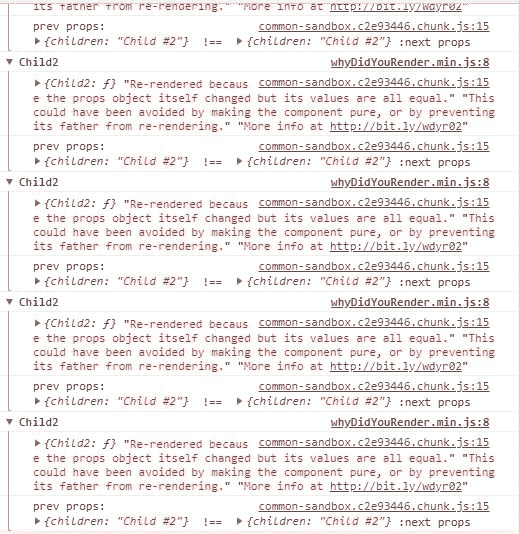](https://res.cloudinary.com/practicaldev/image/fetch/s--dAITzBJ4--/c_limit%2Cf_auto%2Cfl_progressive%2Cq_auto%2Cw_880/https://jsmanifest.s3-us-west-1.amazonaws.com/posts/22-miraculous-tools-for-react-developers-in-2019/why_did_you_render1.jpg)

但是不要误解。把它当成一件好事。利用那些烦人的消息，这样你就可以修复那些浪费的重新呈现器，那些烦人的消息最终会离你而去！

## 4。创建-反应-应用

每个人都知道 [create-react-app](https://github.com/facebook/create-react-app) 是开始开发 react 项目的最快方式(开箱即用，包含现代功能)。还有什么比`npx create-react-app <name>`更容易的呢？

我在 medium 上的所有教程(连同 dev.to)都在用 *create-react-app* 构建 react 接口，仅仅是因为它简单快捷。

我们有些人可能不知道如何使用 CRA 创建一个 typescript 项目。你所要做的就是在
后面加上`--typescript`

```
npx create-react-app <name> --typescript 
```

<svg width="20px" height="20px" viewBox="0 0 24 24" class="highlight-action crayons-icon highlight-action--fullscreen-on"><title>Enter fullscreen mode</title></svg> <svg width="20px" height="20px" viewBox="0 0 24 24" class="highlight-action crayons-icon highlight-action--fullscreen-off"><title>Exit fullscreen mode</title></svg>

这将省去您手动向 CRA 项目添加 typescript 的麻烦。

## 5。反应生命周期可视化工具

react-lifecycle-visualizer 是一个 npm 包，用于跟踪任意 react 组件的可视化生命周期方法的 T2。

与*why-do-you-render*类似，您可以启用您选择的任何组件来显示生命周期可视化工具:

```
import React from 'react'
import {
  Log,
  VisualizerProvider,
  traceLifecycle,
} from 'react-lifecycle-visualizer'

class TracedComponent extends React.Component {
  state = {
    loaded: false,
  }

  componentDidMount() {
    this.props.onMount()
  }

  render() {
    return <h2>Traced Component</h2>
  }
}

const EnhancedTracedComponent = traceLifecycle(TracedComponent)

const App = () => (
  <VisualizerProvider>
    <EnhancedTracedComponent />
    <Log />
  </VisualizerProvider>
) 
```

<svg width="20px" height="20px" viewBox="0 0 24 24" class="highlight-action crayons-icon highlight-action--fullscreen-on"><title>Enter fullscreen mode</title></svg> <svg width="20px" height="20px" viewBox="0 0 24 24" class="highlight-action crayons-icon highlight-action--fullscreen-off"><title>Exit fullscreen mode</title></svg>

这将显示可视化工具，如下所示:

[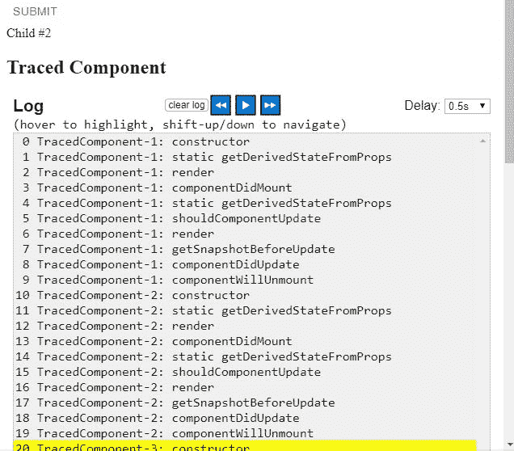](https://res.cloudinary.com/practicaldev/image/fetch/s--nPIuqUIh--/c_limit%2Cf_auto%2Cfl_progressive%2Cq_auto%2Cw_880/https://jsmanifest.s3-us-west-1.amazonaws.com/posts/22-miraculous-tools-for-react-developers-in-2019/react_lifecycle_visualizer1.jpg)

然而，这样做的一个缺点是它目前只对类组件有效，所以钩子还不被支持。(问题是*它们可能是*吗，因为这是关于生命周期的？)

## 6。孔雀鱼

Guppy 是一个友好、免费的应用程序管理器和任务运行器，可以在桌面上运行。他们似乎优先考虑那些在 react 中开发较新的人。然而，它也可能对高级开发人员有用。

它为 react 开发人员经常面临的许多典型任务提供了友好的图形用户界面，例如创建新项目、执行任务和管理依赖关系。

Windows 支持是在 2018 年 8 月添加的，所以你可以放心，它是跨平台的。

下面是孔雀鱼的样子:

[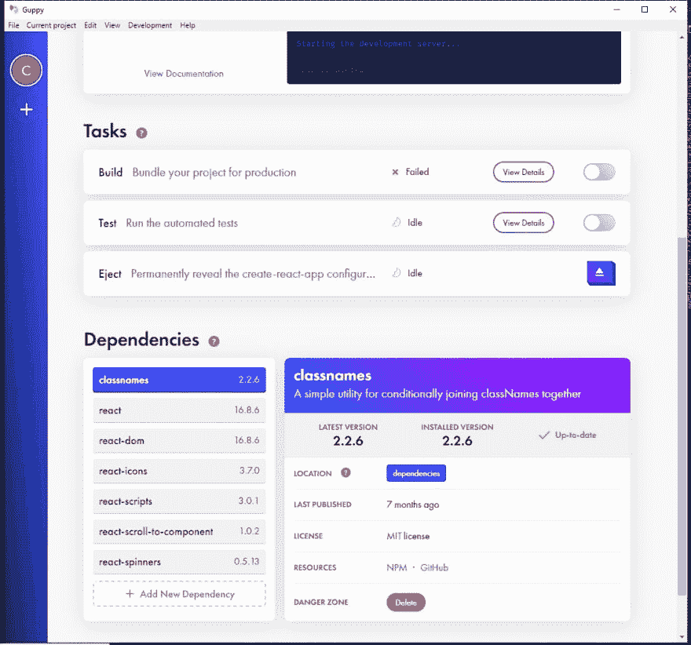](https://res.cloudinary.com/practicaldev/image/fetch/s--ia-WGnnp--/c_limit%2Cf_auto%2Cfl_progressive%2Cq_auto%2Cw_880/https://jsmanifest.s3-us-west-1.amazonaws.com/posts/22-miraculous-tools-for-react-developers-in-2019/guppy1.jpg)

## 7。反应测试库

我一直很喜欢[反应测试库](https://github.com/testing-library/react-testing-library)，因为在编写单元测试时*感觉很好*。这个包提供了鼓励良好测试实践的 react DOM 测试工具。

这个解决方案旨在解决测试实现细节的问题，而不是像用户看到的那样测试 react 组件的输入/输出。

测试实现细节是*而不是*确保你的应用按预期工作的有效方法。当然，在*如何*获取组件所需的数据、使用哪种排序方法等方面，你会更有信心。但是如果你必须改变你实现的方式来指向一个不同的数据库，那么你的单元测试将会失败，因为那些是耦合逻辑的实现细节。

这是一个关于 *react-testing-library* 解决什么的问题，因为理想情况下，你只是希望你的用户界面最终能够正常工作并被正确呈现。*如何*获得这些组件的数据并不重要，只要它们仍然给出预期的输出。

这里有一个示例代码，告诉你如何使用这个库进行测试:

```
// Hoist helper functions (but not vars) to reuse between test cases
const renderComponent = ({ count }) =>
  render(
    <StateMock state={{ count }}>
      <StatefulCounter />
    </StateMock>,
  )

it('renders initial count', async () => {
  // Render new instance in every test to prevent leaking state
  const { getByText } = renderComponent({ count: 5 })

  await waitForElement(() => getByText(/clicked 5 times/i))
})

it('increments count', async () => {
  // Render new instance in every test to prevent leaking state
  const { getByText } = renderComponent({ count: 5 })

  fireEvent.click(getByText('+1'))
  await waitForElement(() => getByText(/clicked 6 times/i))
}) 
```

<svg width="20px" height="20px" viewBox="0 0 24 24" class="highlight-action crayons-icon highlight-action--fullscreen-on"><title>Enter fullscreen mode</title></svg> <svg width="20px" height="20px" viewBox="0 0 24 24" class="highlight-action crayons-icon highlight-action--fullscreen-off"><title>Exit fullscreen mode</title></svg>

## 8。React 开发人员工具

[React 开发者工具](https://github.com/facebook/react-devtools)是一个扩展，允许检查 Chrome 和 Firefox 开发者工具中的 React 组件层次结构。

这是这个列表中最常见的，也是 react 开发人员用来调试应用程序的最有用的工具之一。

## 9。少量

使用像 material-ui 或 semantic-ui-react 这样的组件库的一个很好的替代方案是 [Bit](https://bit.dev/) 。这让您可以探索数以千计的*开源*组件，并让您使用它们来构建您的项目。

[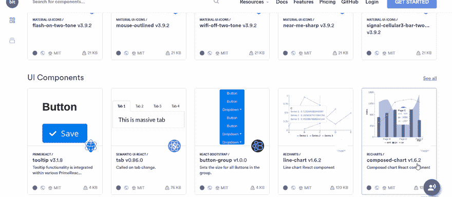](https://res.cloudinary.com/practicaldev/image/fetch/s--4B1xfiLq--/c_limit%2Cf_auto%2Cfl_progressive%2Cq_66%2Cw_880/https://jsmanifest.s3-us-west-1.amazonaws.com/posts/22-miraculous-tools-for-react-developers-in-2019/bit1.gif)

有许多不同的 react 组件可供任何人使用，包括选项卡、按钮、图表、表格、导航栏、下拉菜单、加载微调器、日期选择器、面包屑、图标、布局等。这些是由其他 react 开发者上传的，就像你我一样。

但是也有一些有用的工具，比如格式化日期之间的距离。

## 10。小说

如果你还不知道 [storybook](https://storybook.js.org) 的话，我强烈推荐你开始使用它们，如果你想更容易的体验构建 UI 组件的话。该工具启动一个支持开箱即用的热重装的实时开发服务器，您可以在其中独立地实时开发 react 组件。

另一件很棒的事情是，你可以使用现有的开源插件，将你的开发体验提升到一个全新的水平。例如，使用 [storybook-readme](https://github.com/tuchk4/storybook-readme) 包，您可以在同一个页面上创建 *readme* 文档*，同时开发 react 组件*供生产使用。这足以作为正常的文档页面:

[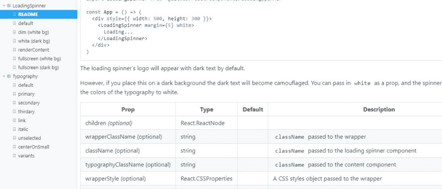](https://res.cloudinary.com/practicaldev/image/fetch/s--DdXckNCA--/c_limit%2Cf_auto%2Cfl_progressive%2Cq_auto%2Cw_880/https://jsmanifest.s3-us-west-1.amazonaws.com/posts/22-miraculous-tools-for-react-developers-in-2019/storybook1.jpg)

## 11。反应视力

你有没有想过你的应用程序在流程图中会是什么样子？嗯， [react-sight](https://www.reactsight.com/) 通过向您呈现整个应用程序的动态组件层次结构树，让您可视化 react 应用程序。它还支持 react 路由器、redux 以及 react 光纤。

使用这个工具，您可以将鼠标悬停在*节点*上，这些节点是指向树中与它们直接相关的组件的链接。

如果你看不到结果，你可以在地址栏输入`chrome:extensions`，找到反应观察框，点击`Allow access to file URLs`开关，如下所示:

[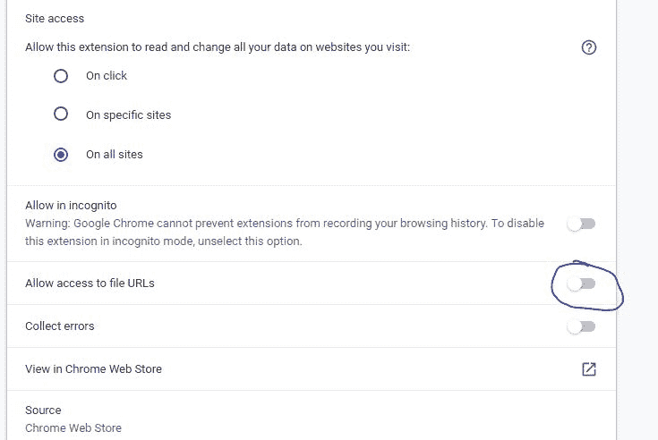](https://res.cloudinary.com/practicaldev/image/fetch/s--uCKsB2uK--/c_limit%2Cf_auto%2Cfl_progressive%2Cq_auto%2Cw_880/https://jsmanifest.s3-us-west-1.amazonaws.com/posts/22-miraculous-tools-for-react-developers-in-2019/react_sight1.jpg)

## 12。反应-宇宙

react-cosmos 是一个用于创建可重用 react 组件的开发工具。

它扫描项目中的组件，使您能够:

1.  在道具、上下文和状态的任意组合下呈现组件
2.  模仿每一个外部依赖(例如 API 响应、本地存储等)
3.  在与正在运行的实例交互时，查看应用状态的实时变化

## 13。CodeSandbox

这无疑是最好的工具之一，可以让你的手脏起来，反应速度比眨眼还快(好吧，也许没那么快)。

这个叫做 [CodeSandbox](https://codesandbox.io) 的工具是一个在线编辑器，可以让你从原型到部署创建 web 应用程序——全部从网站开始！

Codesandbox 最初只支持早期阶段的 React，但他们现在已经扩展到像 Vue 和 Angular 这样的库的附加初学者模板。它们还支持通过使用通用静态站点生成器(如 gatsby 或 nextjs)创建项目来启动下一个 react web 项目。

当谈到 codesandbox 时，有很多很棒的事情可以谈论。其中之一是*异常活跃*。

如果您需要探索一些人们在您方便的时候正在构建的项目，很容易点击*探索*并获得大量代码示例来帮助改造您的下一个项目:

[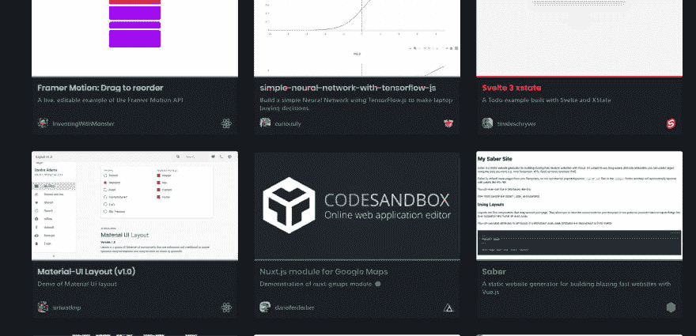](https://res.cloudinary.com/practicaldev/image/fetch/s--IlNwJVFs--/c_limit%2Cf_auto%2Cfl_progressive%2Cq_auto%2Cw_880/https://jsmanifest.s3-us-west-1.amazonaws.com/posts/22-miraculous-tools-for-react-developers-in-2019/codesandbox1.jpg)

一旦你开始在一个项目中编辑，你将开始意识到你将要使用的实际上是 VSCode 编辑器，它是*强大的*。

我很想写一整篇文章，介绍你现在可以在 codesandbox 上做的所有功能，但看起来这项工作已经完成了。

## 14。反应位

[react bits](https://vasanthk.gitbooks.io/react-bits/) 是 React 模式、技术、技巧和诀窍的集合，全部以类似在线文档的格式编写，在这里您可以在同一个选项卡上快速访问不同的设计模式和技术、反模式、样式、UX 变体和其他有用的 React 相关材料。

他们有一个 GitHub repo，目前是 9923 颗星。

一些例子包括像 props 代理、在不同场景中处理各种 UX 的组合这样的概念，甚至暴露了每个 react 开发人员都应该知道的一些问题。

这是他们页面上的样子，你可以在左边的菜单上看到，这里有很多信息:)

[](https://res.cloudinary.com/practicaldev/image/fetch/s--UFqk-VPJ--/c_limit%2Cf_auto%2Cfl_progressive%2Cq_auto%2Cw_880/https://jsmanifest.s3-us-west-1.amazonaws.com/posts/22-miraculous-tools-for-react-developers-in-2019/react-bits1.jpg)

## 15。折叠

[Folderize](https://marketplace.visualstudio.com/items?itemName=ee92.folderize) 是一个不到 7 天前发布的 VSCode 扩展。它让你把一个组件*文件*变成一个组件*文件夹*结构。您的 react 组件仍然是一个组件，只是现在被转换为一个目录。

例如，假设您正在创建一个 react 组件，它将一些`file`作为道具来显示一些有用的信息，比如它们的元数据。元数据组件的逻辑占用了大量的行，所以您决定将它拆分到一个单独的文件中。但是当你决定这样做的时候，现在你有两个相互关联的文件。

因此，如果您有一个如下所示的目录:

[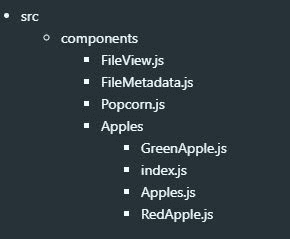](https://res.cloudinary.com/practicaldev/image/fetch/s--yUbeG1pC--/c_limit%2Cf_auto%2Cfl_progressive%2Cq_auto%2Cw_880/https://jsmanifest.s3-us-west-1.amazonaws.com/posts/22-miraculous-tools-for-react-developers-in-2019/folderize1.jpg)

你可能想把`FileView.js`和`FileMetadata.js`抽象成一个目录结构，就像`Apples`一样——特别是如果你想添加更多与像`FileScanner.js`这样的文件相关的组件。这就是 *folderize* 为你做的事情，这样他们就可以得到类似这样的结构:

[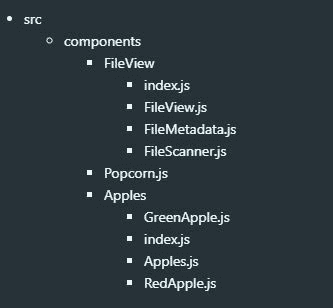](https://res.cloudinary.com/practicaldev/image/fetch/s--JdwsdUCg--/c_limit%2Cf_auto%2Cfl_progressive%2Cq_auto%2Cw_880/https://jsmanifest.s3-us-west-1.amazonaws.com/posts/22-miraculous-tools-for-react-developers-in-2019/folderize2.jpg)T3】

```
import React from 'react'
import FileView from './src/components/FileView'

const App = (props) => <FileView {...props} />

export default App 
```

<svg width="20px" height="20px" viewBox="0 0 24 24" class="highlight-action crayons-icon highlight-action--fullscreen-on"><title>Enter fullscreen mode</title></svg> <svg width="20px" height="20px" viewBox="0 0 24 24" class="highlight-action crayons-icon highlight-action--fullscreen-off"><title>Exit fullscreen mode</title></svg>

## 16。React 启动项目

这里有一个很棒的 [react starter 项目](https://www.javascriptstuff.com/react-starter-projects/)列表，你可以在一个页面上看到所有项目。因此，如果你是那种发现同时出现一大堆可供选择的选项既快捷又有用的人，那么这本书就适合你。

一旦你看到一个你喜欢的启动项目，你可以简单地克隆这个库，并根据你即将发布的应用程序进行你自己的修改。然而，并不是所有的文件都要在克隆存储库时使用，因为有些文件是要安装的，这就成为了项目的一部分。这使得获取更新更容易，并使您的项目更整洁。

页面看起来是这样的:

[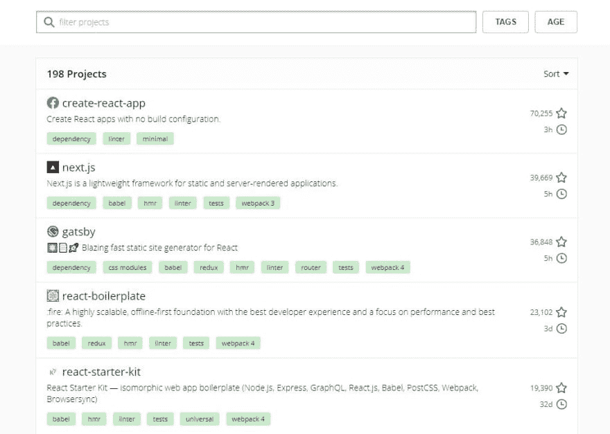](https://res.cloudinary.com/practicaldev/image/fetch/s--cbEDiDuO--/c_limit%2Cf_auto%2Cfl_progressive%2Cq_auto%2Cw_880/https://jsmanifest.s3-us-west-1.amazonaws.com/posts/22-miraculous-tools-for-react-developers-in-2019/react_starter_projects1.jpg)

## 17。突出显示更新

这可以说是任何人的开发工具包中最重要的工具。这是 react devtools 扩展的一个特性，可以看到页面中哪些组件被不必要地重新呈现:

[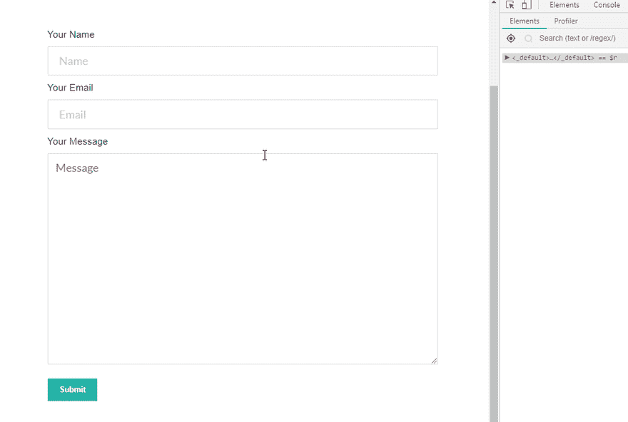](https://res.cloudinary.com/practicaldev/image/fetch/s--AlMOMBES--/c_limit%2Cf_auto%2Cfl_progressive%2Cq_66%2Cw_880/https://jsmanifest.s3-us-west-1.amazonaws.com/posts/22-miraculous-tools-for-react-developers-in-2019/react%2Brender%2Blines.gif)

它有助于您在开发页面时发现瓶颈，并在用橙色/红色对严重的重新渲染问题进行着色时变得更加容易。

除非你的目标是构建一个平庸的应用程序，否则你为什么不想要这个漂亮的东西在你身边呢？

## 18。反应差异查看器

react-diff-viewer 是一个用 diff 和 react 制作的简单漂亮的文本比较查看器。它支持拆分视图、内嵌视图、单词区分、线条高亮等功能。

如果您试图将此功能嵌入到您的笔记中(*咳咳* Boostnote)，并对其进行定制以更好地适应您的应用程序(主题颜色、文档与故事书演示的组合等)，这将非常有用

[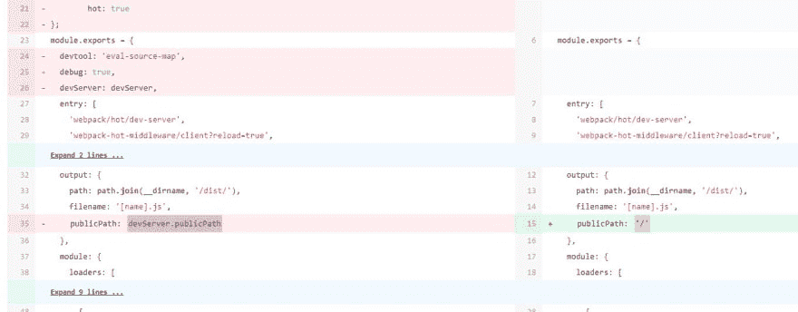](https://res.cloudinary.com/practicaldev/image/fetch/s--sILdHXz2--/c_limit%2Cf_auto%2Cfl_progressive%2Cq_auto%2Cw_880/https://jsmanifest.s3-us-west-1.amazonaws.com/posts/22-miraculous-tools-for-react-developers-in-2019/react-diff-viewer.jpg)

## 19。js.coach

我最常用来寻找 react 相关资料的网站是 [js.coach](https://js.coach/?collection=React) 。现在我不确定为什么我没有看到很多关于这个宝石的报道，但是我已经在这个页面上找到了我需要的任何东西。它快速、简单、不断更新，并且总能为我的所有项目提供我需要的结果。

他们最近增加了 *React VR* 标签，太棒了！

## 20。太棒了-反应

GitHub [awesome-react](https://github.com/enaqx/awesome-react) 开源库是一个与 react 相关的很棒的东西的列表。

我可能不知道其他网站的存在，只是从这个链接中学习反应。您会发现大量有用的资源，它们肯定会帮助您构建出色的 react 应用程序！

## 21。质子原生

[proton-native](https://github.com/kusti8/proton-native) 为您提供一个 react 环境来构建跨平台的原生桌面应用。

它是电子产品的替代品，具有一些简洁的功能，包括:

*   与 React Native 语法相同
*   使用现有的 React 库，如 Redux
*   跨平台
*   本地组件。不再有电子
*   与所有普通 Node.js 包兼容

有兴趣了解更多信息吗？阅读他们的文档。

## 22。Devhints React.js Cheatsheet

对于 react 来说，这是一个非常好的备忘单，尽管它缺少 react 挂钩。别担心，我会为 react 16.8+创建一个备忘单，敬请关注。

## 结论

本帖到此结束！我希望你已经在这里找到了有价值的信息，并期待在未来从我这里得到更多！

在[媒体](https://medium.com/@jsmanifest)上找到我