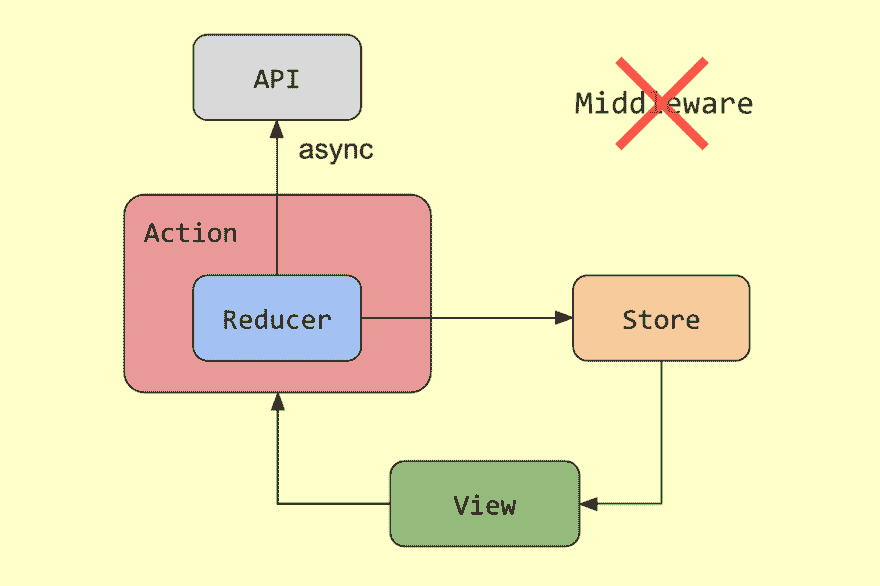

# Async Redux: Flutter 的非样板版本的 Redux

> 原文：<https://dev.to/marcglasberg/async-redux-flutter-s-non-boilerplate-version-of-redux-3c1o>

### Async Redux: Flutter 的非样板版 Redux

AsyncRedux 是 Redux 的特殊版本，它:

1.  很容易学
2.  易于使用
3.  很容易测试
4.  没有样板文件

AsyncRedux 目前正在我参与的一个大型项目中使用，我终于花时间编写了它的文档并发布了它。我假设你已经知道 Redux 和 Flutter，并且需要快速理解 **AsyncRedux** 所提供的一些东西。如果你想要所有的细节和特性，请访问 [AsyncRedux Flutter Package](https://pub.dev/packages/async_redux) 。

AsyncRedux 最明显的特点是没有中间件，因为 reducers 可以是同步的也可以是异步的。但是让我们从头开始。

申报你的**店铺**和**州**，这样:

```
var state = AppState.initialState();

var store = Store<AppState>(
 initialState: state, 
); 
```

如果你想改变存储状态，你必须“分派”一些动作。在**异步还原**中，所有动作都扩展`ReduxAction`。你照常调度动作:

```
store.dispatch(IncrementAction(amount: 3));
store.dispatch(QueryAndIncrementAction()); 
```

动作的缩减器就是动作本身的一个方法，叫做 reduce。所有操作都必须重写此方法。

#### 同步减速器

如果要做一些**同步**的工作，只需声明减速器返回`AppState`，然后改变状态返回即可。例如，让我们从一个简单的动作开始，将一个计数器递增某个值:

```
class IncrementAction extends ReduxAction<AppState> {
 final int amount;
 IncrementAction({this.amount}) : assert(amount != null);

@override
 AppState reduce() {
 return state.copy(counter: state.counter + amount));
 }
} 
```

简单地调度上面的动作就足以运行 reducer 并改变状态。与其他 Redux 版本不同，在商店初始化期间不需要列出中间件功能，也不需要手动连接 reducers。

尝试运行: [Sync Reducer 示例](https://github.com/marcglasberg/async_redux/blob/master/example/main.dart)。

#### 异步减速器

如果你想做一些异步工作，你只需声明动作的 reducer 来返回`Future<AppState>`，然后改变状态并返回它。不需要任何“中间件”，就像其他 Redux 版本一样。

举个例子，假设您想让一个计数器增加一个从数据库中得到的值。数据库访问是异步的，所以必须使用异步缩减器:

```
class QueryAndIncrementAction extends ReduxAction<AppState> {

@override
 Future<AppState> reduce() async {
 int value = await getAmount();
 return state.copy(counter: state.counter + value));
 }
} 
```

尝试运行:[异步减速器示例](https://github.com/marcglasberg/async_redux/blob/master/example/main_increment_async.dart)。

[](https://res.cloudinary.com/practicaldev/image/fetch/s--Wk9NSxvG--/c_limit%2Cf_auto%2Cfl_progressive%2Cq_auto%2Cw_880/https://cdn-images-1.medium.com/max/969/1%2AO34Rwgxfa3NiE7F_QW683Q.png)

#### 改变状态是可选的

对于同步和异步减速器，返回新状态是可选的。你可以返回`null`，和返回状态不变是一样的。

这很有用，因为有些动作可能只是启动其他异步进程，或者分派其他动作。例如:

```
class QueryAction extends ReduxAction<AppState> { 
 @override
 Future<AppState> reduce() async {
 dispatch(IncrementAction(amount: await getAmount()));
 return null;
 }
} 
```

#### 减速器前后

有时，当异步减速器正在运行时，您希望防止用户触摸屏幕。此外，有时您希望检查先决条件，比如是否存在互联网连接，如果不满足这些先决条件，就不要运行 reducer。

为了帮助您处理这些用例，您可以覆盖方法`ReduxAction.before()`和`ReduxAction.after()`，它们分别在缩减器之前和之后运行。

```
Future<void> before() async => await checkInternetConnection(); 
```

如果之前抛出一个错误，那么 reduce 将不会运行。这意味着您可以使用它来检查任何先决条件，并在您想要阻止 reducer 运行时抛出一个错误。这个方法也能够分派动作，所以它可以用来打开一个模态屏障:

```
void before() => dispatch(WaitAction(true)); 
```

`after()`方法在 reduce 之后运行，即使是由`before()`或`reduce()`抛出了一个错误(类似于一个“finally”块)，所以它可以用来做一些事情，比如当 reduce 结束时关闭模态障碍，即使在这个过程中有一些错误:

```
void after() => dispatch(WaitAction(false)); 
```

这是一个完整的动作示例:

```
// Increment a counter by 1, and then get some description text.
class IncrementAndGetDescriptionAction extends ReduxAction\<AppState\> {

 @override
 Future<AppState> reduce() async { 
 dispatch(IncrementAction());
 String description = await read("http://numbersapi.com/${state.counter}"); 
 return state.copy(description: description);
 } 

 void before() => dispatch(WaitAction(true)); 

 void after() => dispatch(WaitAction(false));
} 
```

尝试在减速器示例前后运行:[。](https://github.com/marcglasberg/async_redux/blob/master/example/main_before_and_after.dart)

您还可以为可重用的抽象类提供默认的 before 和 after 方法。例如，任何扩展下面的`BarrierAction`类的动作在运行时都会显示一个模态屏障:

```
abstract class BarrierAction extends ReduxAction\<AppState\> {
 void before() => dispatch(WaitAction(true));
 void after() => dispatch(WaitAction(false));
}

class IncrementAndGetDescriptionAction extends BarrierAction { 
 @override
 Future<AppState> reduce() async { ... } 
} 
```

上述屏障作用在本例的[中演示。](https://github.com/marcglasberg/async_redux/blob/master/example/main_event_redux.dart)

### 处理动作抛出的错误

假设一个注销操作检查是否有互联网连接，然后删除数据库并将存储设置为初始状态:

```
class LogoutAction extends ReduxAction<AppState> { 
 @override
 Future<AppState> reduce() async { 
 await checkInternetConnection(); 
 await deleteDatabase(); 
 return AppState.initialState();
 }
} 
```

在上面的代码中，`checkInternetConnection()`函数检查是否有[互联网连接](https://pub.dev/packages/connectivity)，如果没有，它抛出一个错误:

```
Future<void> checkInternetConnection() async {
 if (await Connectivity().checkConnectivity() == ConnectivityResult.none) 
 throw NoInternetConnectionException();
} 
```

由 action reducers 抛出的所有错误都被发送到`ErrorObserver`，您可以在存储创建期间定义它。比如:

```
var store = Store<AppState>(
 initialState: AppState.initialState(), 
 errorObserver: errorObserver, 
);

bool errorObserver(Object error, ReduxAction action, Store store, Object state, int dispatchCount) {
 print("Error thrown during $action: $error); 
 return true;
} 
```

如果您的错误观察器返回`true`，那么在`ErrorObserver`结束后，将再次抛出错误。如果它返回`false`，错误被认为已经处理，并将被“吞掉”(而不是重新抛出)。

#### 用户异常

为了向用户显示错误消息，让您的操作抛出一个`UserException`。特殊的`UserException`错误类表示“用户错误”,这是对用户的警告，而不是“代码错误”。然后在你的主页上加上`UserExceptionDialog`，在`StoreProvider`和`MaterialApp` :
下面

```
class MyApp extends StatelessWidget {
 @override
 Widget build(BuildContext context) 
 => StoreProvider<AppState>(
 store: store,
 child: MaterialApp(
 home: UserExceptionDialog<AppState>(
 child: MyHomePage(),
 )));
} 
```

上面的代码将确保所有的用户异常都在一个对话框中显示给用户。尝试运行:[显示错误对话框示例](https://github.com/marcglasberg/async_redux/blob/master/example/main_show_error_dialog.dart)。

### 测试

**AsyncRedux** 提供了`StoreTester`类，使得测试同步和异步减速器变得容易。首先创建 store-tester:

```
var storeTester 
 = StoreTester<AppState>(initialState: AppState.initialState()); 
```

然后，调度某个动作，等待它完成，并检查结果状态:

```
storeTester.dispatch(SaveNameAction("Mark"));
TestInfo<AppState> info = await storeTester.wait(SaveNameAction);
expect(info.state.name, "Mark"); 
```

上面的变量 info 将包含在动作减速器**完成**执行后**的信息，无论减速器是同步还是异步。**

虽然上面的例子演示了一个简单动作的测试，但现实世界中的应用程序有调度其他动作的动作，同步和异步。您可以使用许多不同的`StoreTester`方法来预期任意数量的预期动作，检查它们的顺序、它们的结束状态或者动作之间的每个中间状态。比如:

```
TestInfoList<AppState> infos = await storeTester.waitAll([
 IncrementAndGetDescriptionAction,
 WaitAction,
 IncrementAction,
 WaitAction,
]);

var info = infos[IncrementAndGetDescriptionAction];
expect(info.state.waiting, false);
expect(info.state.description, isNotEmpty);
expect(info.state.counter, 1); 
```

尝试运行: [Store Tester 示例](https://github.com/marcglasberg/async_redux/blob/master/example/main_before_and_after_STATE_test.dart)。

### 路线导航

**AsyncRedux** 带有一个`NavigateAction`，你可以调用它来导航你的颤振应用:

```
dispatch(NavigateAction.pop()); 
dispatch(NavigateAction.pushNamed("myRoute")); 
dispatch(NavigateAction.pushReplacementNamed("myRoute")); 
dispatch(NavigateAction.pushNamedAndRemoveAll("myRoute")); 
dispatch(NavigateAction.popUntil("myRoute")); 
```

为此，在应用程序初始化期间，您必须静态地将导航键插入`NavigateAction` :

```
**final** navigatorKey = GlobalKey<NavigatorState>();

**void** main() **async** { 
 NavigateAction.setNavigatorKey(navigatorKey);
 ...
} 
```

尝试运行:[导航示例](https://github.com/marcglasberg/async_redux/blob/master/example/main_navigate.dart)。

### 事件

在一个真正的 Flutter 应用程序中，假设 Redux store 可以保存所有的应用程序状态是不现实的。像`TextField`和`ListView`这样的小部件利用控制器，控制器保存状态，商店必须能够与控制器一起工作。例如，为了响应某个动作的分派，您可能想要清除一个文本字段，或者您可能想要将一个列表视图滚动到顶部。

**AsyncRedux** 通过引入“事件”的概念来解决这些问题:

```
var clearTextEvt = Event(); 
var changeTextEvt = Event<String>("Hello"); 
var myEvt = Event<int>(42); 
```

动作可以使用事件作为状态:

```
class ClearTextAction extends ReduxAction<AppState> { 
 AppState reduce() => state.copy(clearTextEvt: Event()); 
} 
```

而且事件可能会由`StoreConnector`传递给某个`StatefulWidget`，就像其他任何状态一样:

```
class MyConnector extends StatelessWidget { 
 Widget build(BuildContext context) {
 return StoreConnector<AppState, ViewModel>(
 model: ViewModel(),
 builder: (BuildContext context, ViewModel vm) =\> MyWidget(
 initialText: vm.initialText,
 clearTextEvt: vm.clearTextEvt, 
 onClear: vm.onClear,
 ));
 }
} 
```

您的小部件将在其`didUpdateWidget`方法中“消费”事件，并对事件有效负载做一些事情。例如，如果你用一个控制器来控制一个`TextField` :
中的文本

```
@override
void didUpdateWidget(MyWidget oldWidget) {
 super.didUpdateWidget(oldWidget);
 consumeEvents();
}

void consumeEvents() { 
 if (widget.clearTextEvt.consume())
 WidgetsBinding.instance.addPostFrameCallback((_) {
 if (mounted) controller.clear();
 }); 
 } 
```

尝试运行:[事件示例](https://github.com/marcglasberg/async_redux/blob/master/example/main_event_redux.dart)。

这只是对异步还原的一个快速浏览。[包文档](https://pub.dev/packages/async_redux)有更多的细节，并展示了这里没有提到的许多其他特性。

*这条有* [*巴西葡萄牙语版*](https://medium.com/@marcglasberg/async-redux-pt-brasil-e783ceb13c43) *。英语不是我的母语，所以请让我知道任何语法错误或拼写错误。*

AsyncRedux 代码基于布莱恩·伊根和约翰·瑞安的软件包 [*redux*](https://pub.dev/packages/redux) *和*[*flutter _ redux*](https://pub.dev/packages/flutter_redux)*。也使用菲利克斯·安杰洛夫的* [*包中的代码。特别感谢:Eduardo Yamauchi 和 Hugo Passos 帮助我编写异步代码，检查文档，测试一切并提出建议。这项工作开始后*](https://pub.dev/packages/equatable) [*托马斯伯克哈特*](https://github.com/escamoteur) *向我解释了他不喜欢 Redux 的原因。作为动作类方法的 Reducers 由* [*斯科特斯托尔*](https://github.com/ScottS2017) *和* [*西蒙莱特福特*](https://github.com/slightfoot) *展示给我看。*

[*【https://github.com/marcglasberg】*](https://github.com/marcglasberg)

[*https://twitter.com/marcglasberg*](https://twitter.com/marcglasberg)

[*https://stackoverflow.com/users/3411681/marcg*](https://stackoverflow.com/users/3411681/marcg)

[颤振社区](https://www.twitter.com/FlutterComm)

* * *