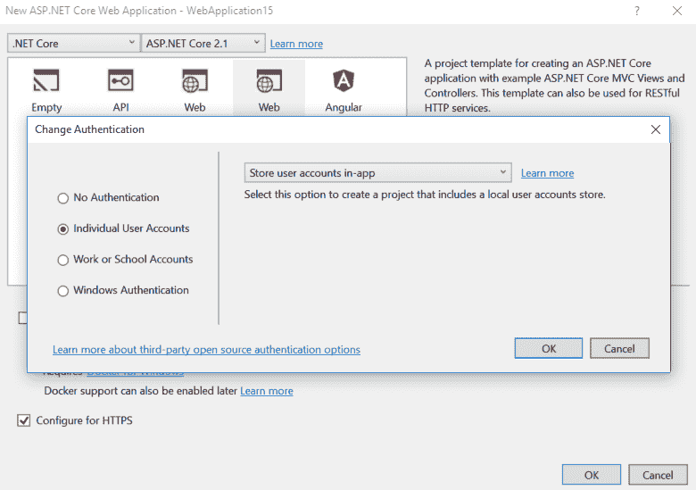
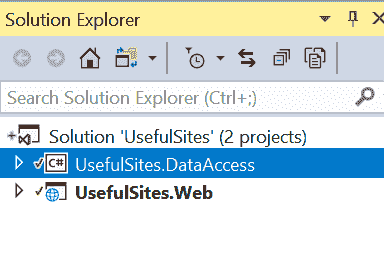
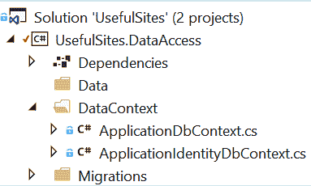

# 在 Asp.Net 核心 2 中分离数据访问

> 原文：<https://dev.to/pcmichaels/separating-data-access-in-asp-net-core-2-3ahd>

在 Asp.Net Core 2 中，就像 Asp.Net 以前的版本一样，有一个向导，它通过一个简单的用户登录/注册系统为您提供领先优势:

[](https://www.pmichaels.net/wp-content/uploads/2018/06/aspnet-core2-id-4.png)

如果您使用向导创建一个单独的用户帐户来设置一个新的项目，您可能会注意到在生成的项目中，似乎缺少任何实现这一点的代码。原因是身份系统的所有代码都藏在剃刀页中。我认为这主要是一件好事，但是有一个例外:我不喜欢在主 web 项目中使用 DB access 代码；这让 DI 很为难。这是一个关于如何将数据库访问部分分离到一个独立项目中的故事。

# 语境

这一点的关键是将上下文移到一个单独的项目中；让我们从一个新项目开始:

[](https://www.pmichaels.net/wp-content/uploads/2018/06/aspnet-core2-id-1.png)

如果您只是想要身份访问，那么您只需要移动
ApplicationIdentityDbContext，然而，在现实生活中，您可能会有两个上下文:

[](https://www.pmichaels.net/wp-content/uploads/2018/06/aspnet-core2-id-2.png)

上下文本身需要分开，因为身份上下文继承自 IdentityDbContext**:

```
public class ApplicationIdentityDbContext : IdentityDbContext
{    
    public     ApplicationIdentityDbContext(DbContextOptions<ApplicationIdentityDbContext> options)
    : base(options)
    {
    }
} 
```

您的第二个上下文应该继承自 DbContext。

# 努格特

这里有几个问题:但是您在 DataAccess 项目中需要的库是:

```
Install-Package Microsoft.EntityFrameworkCore
Install-Package Microsoft.EntityFrameworkCore.SqlServer
Install-Package Microsoft.Entensions.Identity.Stores 
```

# Startup.cs

最后，您需要更改 DI 来注册两个上下文:

```
services.Configure<IdentityOptions>(options =>
{
    options.Password.RequireNonAlphanumeric = false;                
});
services.AddDbContext<ApplicationDbContext>(options =>
    options.UseSqlServer(
        Configuration.GetConnectionString("DefaultConnection")));
services.AddDbContext<ApplicationIdentityDbContext>(options =>
    options.UseSqlServer(
        Configuration.GetConnectionString("DefaultConnection")));

services                
    .AddDefaultIdentity<IdentityUser>()
    .AddEntityFrameworkStores<ApplicationIdentityDbContext>(); 
```

我在这里使用 SqlServer，所以如果你不是，那么你显然需要改变一下。您会注意到我改变了要求，让您的密码包含非字母数字字符——特别是对于开发人员来说，这可能很烦人。我也不一定认为它增加了网站的安全性。

# 迁移

现在您有了多个上下文，当您添加迁移时，您将需要指定要使用的上下文；例如:

```
Add-Migration "InitialUserSetup" -context ApplicationIdentityDbContext 
```

更新数据库也是如此:

```
Update-Database -context ApplicationIdentityDbContext 
```

# 脚注

*好吧——可能还有其他陷阱；但是，如果这适用于 60%的身份验证情况，为什么不把它们都放在一个神奇的黑盒子里呢？当你需要更个性化的东西时，你可以把它撕下来，换成你自己的。

**没有什么可以阻止您让主 DbContext 从 IdentityDbContext 继承，或者只是使用 IdentityDbContext 作为主上下文。

***显然，如果每个人都使用一个 20 位数的代码，并且开始在代码中使用非字母数字字符，这确实会提高网站的安全性；然而，如果他们使用的是密码管理器，他们可能已经生成了这样的代码，如果不是这样，那么你只需要强制“Password123”来！Password123”，所以你很可能收获不大！

# 参考

[https://github.com/aspnet/EntityFrameworkCore/issues/7891](https://github.com/aspnet/EntityFrameworkCore/issues/7891)

[对 Asp.Net 核心 2 默认结构的精彩介绍](https://exceptionnotfound.net/whats-this-and-can-i-delete-it-examining-a-default-asp-net-core-mvc-project/)

原贴[此处](https://www.pmichaels.net/2018/06/30/separating-data-access-in-asp-net-core-2/)。