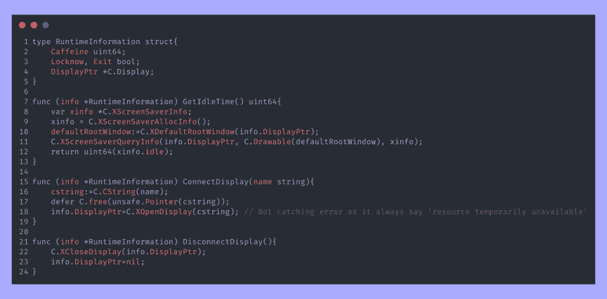
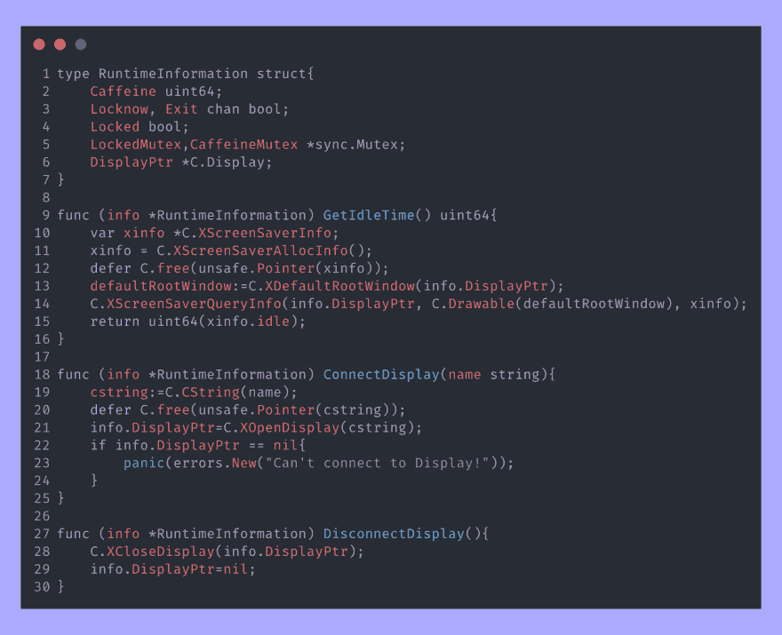

# 用 Go 编写一个新的屏幕自动锁定程序

> 原文：<https://dev.to/__mrvik__/writing-a-new-screen-autolocker-with-go-44l9>

## 最初的想法

嗯，我已经用了几个星期的平铺窗口管理器，但还是有一些我不太适应的地方；*自动锁定器*。我正在使用 *xautolock(1)* ，但是它还没有实现信号处理(USR1 现在锁屏，等等)，所以我正在考虑创建自己的。

## 初始规划

因此，我将编写自己的替代程序来替代 *xautolock(1)* 。新软件应该做什么:

*   观察 X11 空闲时间(应该有接口)
*   收听 USR{1，2}信号
*   发送桌面通知
*   从命令行解析参数
*   低启动时间
*   尽可能少依赖

我开始在 *xautolock(1)* 源代码上查找，看看它是怎么检查空闲时间的，于是我找到了[这一行](https://github.com/l0b0/xautolock/blob/master/src/engine.c#L47)。我知道不是官方来源，但这就够了。现在是时候在`man(1)`页上寻找`XScreenSaver(3)`了。好的，有一个我需要的东西的库，所以我应该使用一种可以调用 C 函数的语言，并且开销合理。

接下来是不可避免的选择正确的语言。我可能的选择是:

*   `Javascript` - >我的第一门编程语言。我首先想到它，但是作为最后的手段。
*   `C` - >调用 C 函数的最佳语言😄。但是我对这门语言不太精通。(现在我更有信心用它写东西了)。还有，线程呢，我该学学怎么用，看起来好复杂。也许下次吧。
*   我用它写了很多(糟糕的)程序，但是我没有也不会用它们。Java 从一开始就被抛弃了。
*   `Rust` - >一个漂亮的 Rust 入门项目，但也许不会是一个生产级的软件。
*   我已经学会了，但是我还没有在正式的项目中使用过。在测试中，一些概念引起了我的注意，比如 goroutines 和 channels 的简单并发。C 和 Go 之间也有一个[简单的调用](https://golang.org/cmd/cgo/)

所以`golang`是被选中的那个。现在是时候设计它了。

让我们从最初的计划开始采取上述步骤。

*   X11 库文档可以在他们的手册页下找到，函数可以用 cgo 调用。
*   使用`os/signal`和`syscall`可以轻松捕捉信号。
*   桌面通知可以用 [go-notify](//github.com/mqu/go-notify) 实现。
*   从命令行解析参数是可能的，但是标准库包太基础了。我以`github.com/akamensky/argparse`结束。
*   Golang 有一个静态链接到最终二进制文件的运行时，但启动时间非常短，不会对性能产生硬影响。
*   嗯，依赖关系。LibX11 用于`XOpenDisplay(3)`和`xscrnsaver`扩展以获取空闲时间信息。也取决于 libnotify。一些发行版将库和头文件分开。编译时需要头文件。

现在，我们开始吧。嗯，我该怎么给这个东西命名呢？不好意思低努力的名字，就叫`goautolock(1)`。好吧，`take goautolock&&git init`。(`take`是在 [oh-my-zsh](https://github.com/robbyrussell/oh-my-zsh) 上定义的函数，用所有参数运行`mkdir`，并在最后一个参数上做 cd)。

## 写作吧

在最初的版本中，我面临了第一次比赛的情况。这些并没有导致意外的行为，但 go 期望内存访问被同步，所以我改进了一些功能，将一些标志转换为通道。这一改变提高了性能(例如，SIGUSR1 后最多等待 2 秒来锁定屏幕，而不是在通道上获得消息后立即锁定)。
这并没有解决最初设计导致的所有竞争问题，所以最近的一个版本实现了 go 标准库提供的互斥锁。从第一次写起，它经历了许多变化。看看调用 C 库的函数。
第一次写:
 
现在看起来是这样的:
 
注意调用`C.free`修复内存泄漏。
当我进入信号处理时，我想:“有 2 个用户定义的信号，没有任何特殊意义，其中一个会立即调用储物柜，但另一个呢？”所以，我决定从 LineageOS(以前的 Cyanogen MOD)那里偷一个概念，你可以添加咖啡因来防止看屏幕一段时间。`goautolock(1)`上的实现很简单:

*   每个 SIGUSR2 增加 X 秒的锁定延迟。取 X 像`--caffeine`选项的值(默认为 10)。
*   经过时间*且*屏幕锁定后，该额外延迟设置为 0。

## 用 golang 写作心得

我的第一印象是 golang 的选项非常有限(来自 JavaScript，允许你做任何你想做的事情)。错误处理(对死机和错误返回的分割)初看起来很混乱，但是习惯了之后，我的体验是最一致的。
此外，它还有一些语法上的好处，比如在表达式前面加上`defer`，让它在实际函数完成后运行。这允许您在分配后立即释放不受 GC 管理的 C 变量，因此当您看到对`C.free`的调用时，您不必找到原始声明。

## 文档

`godoc`是一个从源代码生成文档的非常强大的工具，但是这是一个用户工具，所以文档应该在标准的`man(1)`上。这是最困难的部分，使用`groff(7)`创建一个手册页。有许多宏来格式化输出。现在结果可以在 project 的`/docs`文件夹中获得(底部的链接)。

## 包装

这是一个用于 Linux 的实用程序，每个发行版都有不同的打包系统(对此我不会使用 flatpak 或 ~~spam~~ snap)。我做的第一件事是在 GitLab 管道上构建一个发布二进制文件。
另一方面，当我做`pakku -Syu`的时候，我想在我的笔记本电脑上更新 goautolock，所以我把它上传到了 AUR。使用`ldd`和`namcap`以及在干净的 chroot 上使用`makepkg`进行测试是如此简单。

我使用的另一个发行版是 Fedora。这让我有些头疼。

*   包名与 ArchLinux 既不相同也不相似。
*   Devel 包与主包是分开的。
*   我应该使用哪个实用程序来创建规格文件后的 RPM？rpkg？Makefile？fedpkg？蒂托？
*   Fedora 上的 AUR 对应款(节省距离)是 *COPR* 。我们开始回购吧！
*   等等，我要转速，SRPM 到底是什么？

在发现我应该在 [Fedora Pagure](https://pagure.io) 中创建另一个 repo 来上传规范和源代码 tarball 之后，我开始使用 rpkg 来构建 srpm。经过多次失败的构建后，它最终被上传到*费多拉·COPR*。然后我开始打包一些其他项目，这样每个人都可以很容易地使用它们。

## 链接

如果你想有所贡献或提出建议，这里有这个项目和其他一些项目的链接:

*   [GitLab](https://gitlab.com/mrvik/goautolock)
*   [AUR](https://aur.archlinux.org/packages/goautolock/) 为同道拱用户
*   [图. io](https://pagure.io/goautolock)
*   [Fedora COPR](https://copr.fedorainfracloud.org/coprs/mrvik/goautolock)