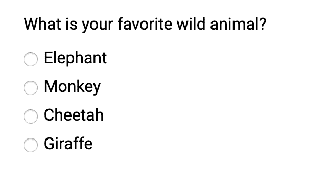
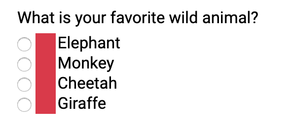
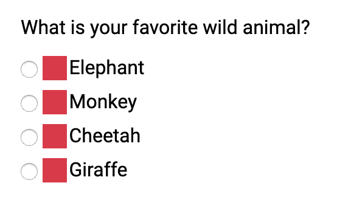
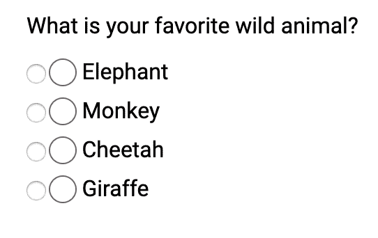
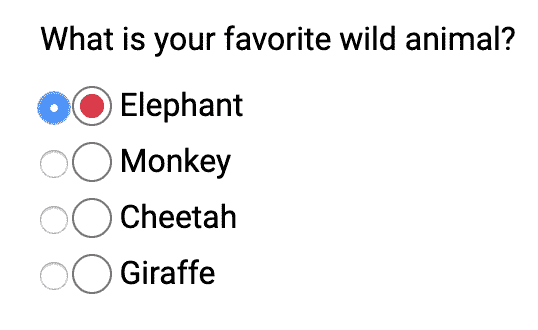
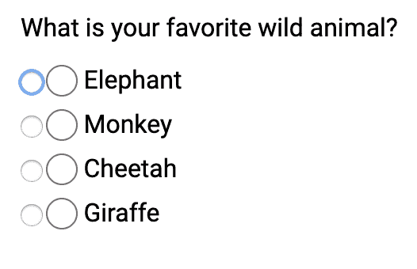
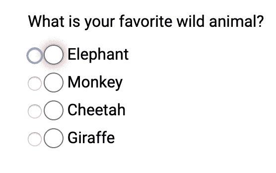
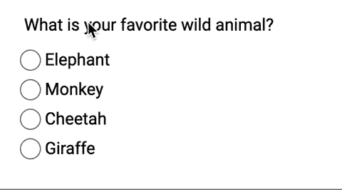

# 创建自定义键盘可访问单选按钮

> 原文：<https://dev.to/lkopacz/create-custom-keyboard-accessible-radio-buttons-22eh>

*最初发布于[a11ywithlindsey.com](https://www.a11ywithlindsey.com/blog/create-custom-keyboard-accessible-radio-buttons)。*

嘿朋友们！今天，我们将创建自定义键盘辅助单选按钮！这篇博客文章是对[我的可访问复选框文章](https://www.a11ywithlindsey.com/blog/create-custom-keyboard-accesible-checkboxes)的后续文章。

我们将回顾:

1.  加价
2.  在 CSS 中的标签上创建伪元素
3.  在 CSS 中添加“选定的”样式
4.  添加焦点样式

## 首发出场

我决定创建一组简单的单选按钮，询问你最喜欢的动物是什么

```
<fieldset>
  <legend>What is your favorite Wild Animal?</legend>
  <div class="radio-wrapper">
    <input type="radio" name="animal" id="elephant" />
    <label for="elephant">Elephant</label>
  </div>
  <div class="radio-wrapper">
    <input type="radio" name="animal" id="monkey" />
    <label for="monkey">Monkey</label>
  </div>
  <div class="radio-wrapper">
    <input type="radio" name="animal" id="cheetah" />
    <label for="cheetah">Cheetah</label>
  </div>
  <div class="radio-wrapper">
    <input type="radio" name="animal" id="giraffe" />
    <label for="giraffe">Giraffe</label>
  </div>
</fieldset> 
```

`fieldset`将所有单选按钮逻辑地组合在一起。无线电输入是`legend`中问题的所有选项。此外，请记住将这些表单标签与单选按钮相关联！

[](https://res.cloudinary.com/practicaldev/image/fetch/s--gm0AvY5---/c_limit%2Cf_auto%2Cfl_progressive%2Cq_auto%2Cw_880/https://thepracticaldev.s3.amazonaws.com/i/uuwpu368vuu876tdhulq.png)

我将添加一些简单的 CSS 来清理一下。

```
@import url('https://fonts.googleapis.com/css?family=Roboto&display=swap');

* {
  font-family: 'Roboto', sans-serif;
}

fieldset {
  border: none;
} 
```

我在这里没做什么；我添加了一个字体，并去掉了`fieldset`的边框。

[](https://res.cloudinary.com/practicaldev/image/fetch/s--Pt4usPcC--/c_limit%2Cf_auto%2Cfl_progressive%2Cq_auto%2Cw_880/https://thepracticaldev.s3.amazonaws.com/i/z8nqescfb1mkwase27n6.png)

现在让我们进入有趣的部分！设计这些单选按钮的样式！

## 在标签上创建一个伪元素

我要做的第一件事是在`label`元素上添加一个`::before`伪元素。我先从一些基本的开始。

```
$muted-red: #db3846;

input[type='radio'] {
  + label {
    position: relative;
    cursor: pointer;
    margin-left: 20px; /* This will be adjusted */

    &::before {
      content: '';
      position: absolute;
      left: -22px; /* This will be adjusted */
      width: 20px;
      height: 20px;
      background: $muted-red;
    }
  }
} 
```

单选按钮现在看起来不会有什么变化。我们只想看到单选按钮，以确保我们正在复制 HTML 功能。

[](https://res.cloudinary.com/practicaldev/image/fetch/s--UlPqY9zl--/c_limit%2Cf_auto%2Cfl_progressive%2Cq_auto%2Cw_880/https://thepracticaldev.s3.amazonaws.com/i/aov9cx78mznxtddkhr4x.png)

我将在`.radio-wrapper`上添加一点点空白。

```
$muted-red: #db3846;

+ .radio-wrapper {
+ margin: 0.5rem 0;
+ } 
input[type='radio'] {
  + label {
    position: relative;
    cursor: pointer;
    margin-left: 20px; /* This will be adjusted */

    &::before {
      content: '';
      position: absolute;
      left: -24px; /* This will be adjusted */
      width: 18px;
      height: 18px;
      background: $muted-red;
    }
  }
} 
```

[](https://res.cloudinary.com/practicaldev/image/fetch/s--JiII96rg--/c_limit%2Cf_auto%2Cfl_progressive%2Cq_auto%2Cw_880/https://thepracticaldev.s3.amazonaws.com/i/dixzy83mlspcdju5kdy6.png)

现在，让我们删除背景颜色和圆形的边缘。

```
input[type='radio'] {
  + label {
    position: relative;
    cursor: pointer;
    margin-left: 20px; /* This will be adjusted */

    &::before {
      content: '';
      position: absolute;
      left: -24px; /* This will be adjusted */
+     border-radius: 50%;
+     border: 1px solid #6f686a;
      width: 18px;
      height: 18px;
+     background: transparent;
    }
  }
} 
```

注意，出于调试目的，我将保留标准单选按钮。

[](https://res.cloudinary.com/practicaldev/image/fetch/s--C65K0iO4--/c_limit%2Cf_auto%2Cfl_progressive%2Cq_auto%2Cw_880/https://thepracticaldev.s3.amazonaws.com/i/n3b1i0r48fmtm5gp8ni4.png)

## 在 CSS 中添加`:checked`样式

如果你读过我在[键盘可访问复选框](https://www.a11ywithlindsey.com/blog/create-custom-keyboard-accesible-checkboxes)上的帖子，你应该知道`:checked`伪类。首先，我们需要在标签上添加一个`::after`伪元素。

```
input[type='radio'] {
  + label {
    position: relative;
    cursor: pointer;
    margin-left: 20px; /* This will be adjusted */

    &::before {
      content: '';
      position: absolute;
      left: -24px; /* This will be adjusted */
      border-radius: 50%;
      border: 1px solid #6f686a;
      width: 18px;
      height: 18px;
      background: transparent;
    }

+   &::after {
+     content: '';
+     position: absolute;
+     left: -20px;
+     top: 4px;
+     border-radius: 50%;
+     width: 12px;
+     height: 12px;
+     background: $muted-red;
+   }
  }
} 
```

现在，看起来是这样的:

[](https://res.cloudinary.com/practicaldev/image/fetch/s--D_SlXhJY--/c_limit%2Cf_auto%2Cfl_progressive%2Cq_auto%2Cw_880/https://thepracticaldev.s3.amazonaws.com/i/qmmubk8irp7jw2upgoz6.png)

现在我们已经有了合适的样式。我们只在无线电输入为`:checked`时添加`::after`伪元素的`background`。

```
input[type='radio'] {
  + label {
    &::after {
      content: '';
      position: absolute;
      left: -20px;
      top: 4px;
      border-radius: 50%;
      width: 12px;
      height: 12px;
    }
  }

+ &:checked {
+   + label::after {
+     background: $muted-red;
+   }
+ } } 
```

所以现在如果我选择一个单选按钮，它会有一个背景色！

[](https://res.cloudinary.com/practicaldev/image/fetch/s--IgRoJAur--/c_limit%2Cf_auto%2Cfl_progressive%2Cq_auto%2Cw_880/https://thepracticaldev.s3.amazonaws.com/i/9877l0h9wgsp1lgzbrt5.png)

如果你注意到，虽然，没有焦点造型。让我们关注下一个(看我在那里做了什么)

## 添加焦点造型

如果我隐藏单选按钮，你不会知道我是否关注它。

[](https://res.cloudinary.com/practicaldev/image/fetch/s--yHw11S-W--/c_limit%2Cf_auto%2Cfl_progressive%2Cq_auto%2Cw_880/https://thepracticaldev.s3.amazonaws.com/i/3kumy7cckffepf4m7uer.png)T3】

```
input[type='radio'] {
  &:focus {
    + label::before {
      box-shadow: 0 0px 8px $muted-red;
    }
  }
} 
```

我决定为焦点造型添加一个类似的柔和红色。

[](https://res.cloudinary.com/practicaldev/image/fetch/s--Jgtictw7--/c_limit%2Cf_auto%2Cfl_progressive%2Cq_auto%2Cw_880/https://thepracticaldev.s3.amazonaws.com/i/1uzppohknmlmykut8adz.png)

最后，我将:

*   从单选按钮本身(输入)上移除`opacity`
*   将标签上的`margin-left`去掉！

```
input[type='radio'] {
  opacity: 0;

  + label {
    position: relative;
    cursor: pointer;
  }
} 
```

瞧！

[](https://i.giphy.com/media/RgzwLbAOB4W4aSUkog/giphy.gif)

## 结论

当我们制作自定义单选按钮时，我们必须确保考虑以下因素:

1.  创建带有相关表单标签的正确 HTML 结构！
2.  使用伪元素创建自定义样式的元素
3.  `:checked`伪类的核算
4.  确保您可以关注新的单选按钮
5.  使用`opacity: 0`隐藏单选按钮

如果你想玩它，这里是完成的代码笔！

[https://codepen.io/littlekope0903/embed/jjgRPL/?height=600&default-tab=result&embed-version=2](https://codepen.io/littlekope0903/embed/jjgRPL/?height=600&default-tab=result&embed-version=2)

保持联系！如果你喜欢这篇文章:

*   在 [Twitter](https://twitter.com/LittleKope) 上让我知道，并与你的朋友分享这篇文章！此外，如果有任何后续问题或想法，请随时发推特给我。
*   在 [patreon](https://www.patreon.com/a11ywithlindsey) 上支持我！如果你喜欢我的工作，可以考虑每月认捐 1 美元。如果你认捐了 5 美元或更多，你将能够对未来的博客文章进行投票！我还为所有顾客做了一个每月一次的“问我任何问题”的会议！
*   [成为第一个了解我的帖子的人](https://pages.convertkit.com/4218bd5fb5/68dc4e412a)以获得更多的可访问性乐趣！

干杯！祝你一周愉快！