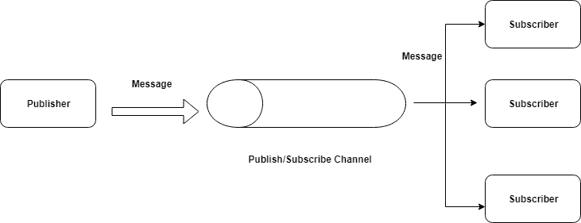

# 在 Node.js 应用程序中实现 Redis 发布/订阅

> 原文：<https://dev.to/ganeshmani/implementing-redis-pub-sub-in-node-js-application-12he>

在本文中，我们将了解如何在节点应用程序中实现 redis 发布订阅。在 Node.js 应用程序中实现 Redis 发布/订阅

[改变你创建对象的方式——Javascript weekly](https://cloudnweb.dev/2019/08/change-the-way-you-create-an-object-javascript-weekly/)

[许诺 indide a loop - Javascript ES6](https://cloudnweb.dev/2019/07/promises-inside-a-loop-javascript-es6/)

[原型继承- Javascript](https://cloudnweb.dev/2019/07/prototypal-inheritance-javascript-weekly/)

在进入实现部分之前，我们将了解什么是发布订阅以及我们为什么需要它。

### 什么是发布/订阅

发布/订阅只不过是一种发布/订阅模型，其中订阅者订阅一个事件。发布者发布事件时通知订阅者。

用一个简单的类比来解释。假设你想在亚马逊买一部最新的 iPhone。但是，由于一个要求。很早就卖完了。Amazon 要求您在有货时得到通知。

在这种情况下，您是订阅活动的订户(当有库存时)。亚马逊是出版商(告诉股票可用)。

当 publisher(Amazon)发布事件时(库存可用)。您(订户)将会收到通知。

[](https://res.cloudinary.com/practicaldev/image/fetch/s--wfLE0kY0--/c_limit%2Cf_auto%2Cfl_progressive%2Cq_auto%2Cw_880/https://cloudnweb.dev/wp-content/uploads/2019/08/pubsub.png)

### 实现发布/订阅

#### 出版者

我们使用的是 Redis publibsub，这是一个流行的内存数据库。你也可以使用其他的 pub 子模型，比如 Kafka，RabbitMQ 等等。

首先，在 Node.js 应用程序中实现 Redis PubSub。你需要在你的机器上安装 [redis](https://redis.io/topics/quickstart) 。其次，您需要在命令行中运行 redis 服务器。

之后，我们需要名为 **redis** 的 npm 包，它通过 redis 与 Express app 连接。

主要是我们要创建三个应用服务器。一个将成为发布者，剩下的两个是订阅者。

```
npm init --yes
npm install express redis
```

创建一个名为 **server.js** 的文件，并添加以下代码。

```
const express = require('express');
const redis = require('redis');

const publisher = redis.createClient();

const app = express();

app.get('/',(req,res) => {
    const user = {
        id : "123456",
        name : "Davis"
    }

    publisher.publish("user-notify",JSON.stringify(user))
    res.send("Publishing an Event using Redis");
})

app.listen(3005,() => {
    console.log(`server is listening on PORT 3005`);
})
```

我们正在从包中导入 redis。

之后，我们将创建一个 redis 客户机来连接 redis 服务器。在 redis 中，我们可以将任意数量的客户机连接到 redis 服务器。

一旦我们连接了它，我们就可以通过调用 **publish** 方法来发布事件

```
publisher.publish("user-notify",JSON.stringify(user))
```

我们需要通过**题目名称**来写数据和**数据**。

#### 订阅者

在不同的文件夹中使用以下代码创建两个 express 服务器。

**server.js**

```
const express = require('express');
const redis = require('redis');

const subscriber = redis.createClient();

const app = express();

subscriber.on("message",(channel,message) => {
    console.log("Received data :"+message);
})

subscriber.subscribe("user-notify");

app.get('/',(req,res) => {
    res.send("Subscriber One");
})

app.listen(3006,() => {
    console.log("server is listening to port 3006");
})
```

**server.js**

```
const express = require('express');
const redis = require('redis');

const subscriber = redis.createClient();

const app = express();

subscriber.on("message",(channel,message) => {
    console.log("Received data :"+message);
})

app.get('/',(req,res) => {
    res.send("subscriber two");
})

subscriber.subscribe("user-notify");

app.listen(3007,() => {
    console.log("server is listening to port 3007");
})
```

现在，您可以同时运行发布者和订阅者。运行发布服务器时，发布服务器会将数据发布给订阅服务器。

#### 演示

[https://www.youtube.com/embed/sc1VY2AOewc](https://www.youtube.com/embed/sc1VY2AOewc)

本文到此为止。在 Node.js 应用程序中实现 Redis 发布/订阅。要了解更多关于 redis 的信息，您可以观看 Brad Traversy 的教程，这是一个很棒的视频。

[https://www.youtube.com/embed/9S-mphgE5fA](https://www.youtube.com/embed/9S-mphgE5fA)

快乐编码:-)