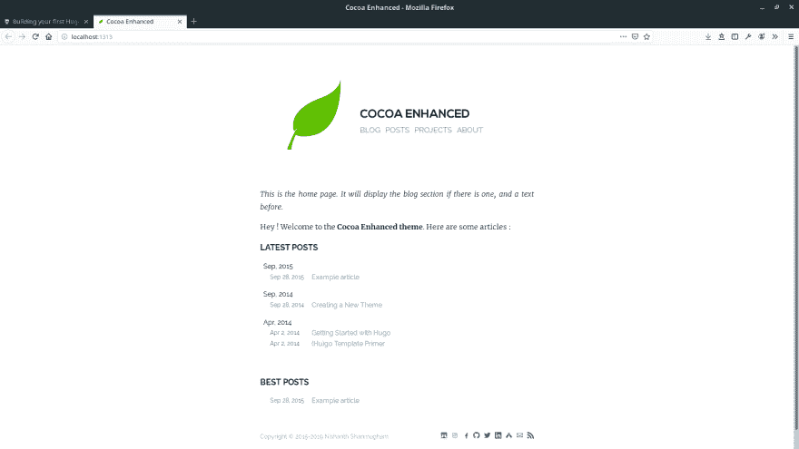
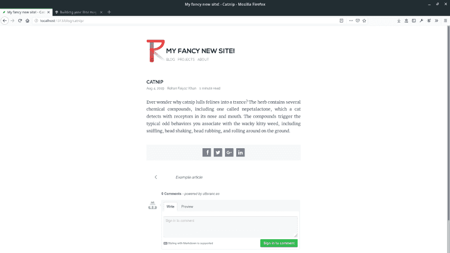

# 建立你的第一个 Hugo 网站

> 原文：<https://dev.to/rohanfaiyazkhan/building-your-first-hugo-site-5230>

***免责声明:此文最初发布于我的[博客](https://rohanfaiyaz.com)***

如果你不熟悉静态站点生成器的概念，它们允许你把你的内容(或者作为降价或者作为来自 CMS 的输入)输出一个静态版本的网站。

静态站点有几个优点。

*   它们非常快，因为不需要动态获取内容。
*   托管它们几乎没有成本，因为它们可以免费提供(例如，我的个人 Hugo 网站托管在 [Netlify](https://www.netlify.com/) 上)
*   它们本质上更安全

还需要什么理由吗？这个怎么样，创造一个不仅仅是简单的网站是可能的。使用自定义 API(或各种可用的第三方 API)，您可以制作一个成熟的 web 应用程序！这个堆栈现在被称为 JAMStack (JAvascript、标记和 API ),是现代网络的一个绝佳选择。例如，once 可以有一个静态网站，并使用 Auth0 进行身份验证，Algolia 进行搜索，Cloudinary 进行图像处理，Shopify 进行支付。可能性是无穷无尽的，所以我将把所有美味的果酱留给下一篇文章。这篇文章将讲述如何建立一个简单的静态网站。

虽然你可以选择使用任何静态站点生成器，比如 Jekyll 或 midminor(如果你喜欢 Ruby ), next . js 或 Gatsby(如果你喜欢 React ),或者 Nust.js 或 Vue Press(如果你喜欢 Vue ),但这篇文章将专注于 [Hugo](https://gohugo.io) ,它是更受欢迎的选择之一，在 [Github](https://github.com/gohugoio/hugo) 上有超过 36k 颗星星。我个人很喜欢 Hugo，因为它非常容易使用，构建速度非常快，这要归功于它是在 go 中构建的，并且它有一个提供预构建主题的大型社区。

## 开始设置

首先确保安装 Hugo。根据您当前的平台，有多种方法可以做到这一点，因此请使用官方[官方文档](https://gohugo.io/getting-started/installing/)作为参考。

接下来使用命令行设置 hugo 项目。

```
hugo new site hugo-starter 
```

<svg width="20px" height="20px" viewBox="0 0 24 24" class="highlight-action crayons-icon highlight-action--fullscreen-on"><title>Enter fullscreen mode</title></svg> <svg width="20px" height="20px" viewBox="0 0 24 24" class="highlight-action crayons-icon highlight-action--fullscreen-off"><title>Exit fullscreen mode</title></svg>

这将建立以下文件结构。

```
├── archetypes
│   └── default.md
├── config.toml
├── content
├── layouts
│   └── partials
│       ├── footer_custom.html
│       └── head_custom.html
├── resources
│   └── _gen
│       ├── assets
│       └── images
├── static
└── themes 
```

<svg width="20px" height="20px" viewBox="0 0 24 24" class="highlight-action crayons-icon highlight-action--fullscreen-on"><title>Enter fullscreen mode</title></svg> <svg width="20px" height="20px" viewBox="0 0 24 24" class="highlight-action crayons-icon highlight-action--fullscreen-off"><title>Exit fullscreen mode</title></svg>

## 安装主题

接下来，我们将设置一个主题。主题是 hugo 网站的基石，因为它们定义了你的内容如何显示。可以创建一个自定义主题，但为了快速设置，我们将从众多可用的[社区构建主题](https://themes.gohugo.io/)中选择一个。

在这个例子中，我们将使用 [Cocoa-Eh](https://themes.gohugo.io/theme/cocoa-eh-hugo-theme/) 。要安装一个主题，我们需要将主题复制到我们的**主题**目录中。我们可以手动或者通过 git 使用命令:
来完成

```
git init
git clone https://github.com/mtn/cocoa-eh-hugo-theme.git themes/cocoa-eh
cp -r ./themes/cocoa-eh/exampleSite/* ./ 
```

<svg width="20px" height="20px" viewBox="0 0 24 24" class="highlight-action crayons-icon highlight-action--fullscreen-on"><title>Enter fullscreen mode</title></svg> <svg width="20px" height="20px" viewBox="0 0 24 24" class="highlight-action crayons-icon highlight-action--fullscreen-off"><title>Exit fullscreen mode</title></svg>

克隆之后，我们使用主题的示例站点文件夹的内容设置了几个示例页面。我们要做的最后一件事是通过设置下面一行代码在 **config.toml** 文件中设置主题:

```
theme="cocoa-eh" 
```

<svg width="20px" height="20px" viewBox="0 0 24 24" class="highlight-action crayons-icon highlight-action--fullscreen-on"><title>Enter fullscreen mode</title></svg> <svg width="20px" height="20px" viewBox="0 0 24 24" class="highlight-action crayons-icon highlight-action--fullscreen-off"><title>Exit fullscreen mode</title></svg>

最后，我们只需在开发模式下运行`hugo server`，构建我们的应用程序，并设置一个本地 web 服务器，我们可以在那里预览我们的网站。Hugo server 默认使用实时重新加载，所以任何更改都会被立即更新(是的，Hugo 构建得很快)。

```
hugo server -D 
```

<svg width="20px" height="20px" viewBox="0 0 24 24" class="highlight-action crayons-icon highlight-action--fullscreen-on"><title>Enter fullscreen mode</title></svg> <svg width="20px" height="20px" viewBox="0 0 24 24" class="highlight-action crayons-icon highlight-action--fullscreen-off"><title>Exit fullscreen mode</title></svg>

就是这样！我们可以通过导航到 [localhost:1313](http://localhost:1313) 来查看我们的站点。

[](https://res.cloudinary.com/practicaldev/image/fetch/s--ndgWWmEX--/c_limit%2Cf_auto%2Cfl_progressive%2Cq_auto%2Cw_880/https://thepracticaldev.s3.amazonaws.com/i/h4indh40xo59bozks8af.png)

## 定制您的内容

所以很明显我们想定制我们的内容。让我们从包含在我们的 **config.toml** 中的元数据开始。将以下值设置为您的名称以及您想要的任何标题。您也可以将自定义图像粘贴到**静态/img** 目录中，作为您的徽标。

```
author = "Rohan Faiyaz Khan"
title = "My fancy new website!"

logofile="/img/new-logo.png 
```

<svg width="20px" height="20px" viewBox="0 0 24 24" class="highlight-action crayons-icon highlight-action--fullscreen-on"><title>Enter fullscreen mode</title></svg> <svg width="20px" height="20px" viewBox="0 0 24 24" class="highlight-action crayons-icon highlight-action--fullscreen-off"><title>Exit fullscreen mode</title></svg>

Hugo 像其他静态站点生成器一样使用 *markdown* 作为内容来源。这也是可能的，而且非常简单，使用 CMS 如 Wordpress，Forestry，Contentful，Netlify CMS 或 Sanity 来设置。使用 CMS 允许使用 GUI 来编辑内容，如果你正在为某人建立一个网站，这是非常理想的。我将在一个单独的地方介绍如何连接到 CMS，但是现在 markdown 就可以了。如果你以前从未用过减价，这里的是一个方便的指南，告诉你如何使用减价。

为了编辑我们的欢迎消息，我们将更改我们的*内容*目录中的 *home.md* 文件。

```
+++
title = "Home"
+++

Hello there. Welcome to my site where I talk about __cat facts__. Feel free to purr through the posts below. 
```

<svg width="20px" height="20px" viewBox="0 0 24 24" class="highlight-action crayons-icon highlight-action--fullscreen-on"><title>Enter fullscreen mode</title></svg> <svg width="20px" height="20px" viewBox="0 0 24 24" class="highlight-action crayons-icon highlight-action--fullscreen-off"><title>Exit fullscreen mode</title></svg>

顶部是静态站点生成器中所指的前沿物质。这个部分包含关于你的内容的元数据，比如标题、作者和日期。`+++`表示 frontmatter 为 *toml* 格式。另一种常见的情况是`---`表示 *yaml* 格式的 frontmatter。接下来，我们可以通过粘贴到我们的*内容/博客*目录或者仅仅通过使用`hugo new`命令来创建一个新帖子。

```
hugo new blog/catnip.md 
```

<svg width="20px" height="20px" viewBox="0 0 24 24" class="highlight-action crayons-icon highlight-action--fullscreen-on"><title>Enter fullscreen mode</title></svg> <svg width="20px" height="20px" viewBox="0 0 24 24" class="highlight-action crayons-icon highlight-action--fullscreen-off"><title>Exit fullscreen mode</title></svg>

我们可以编辑我们关于猫薄荷的新帖子，只要我们愿意！

```
+++
title= "Catnip"
date= 2019-08-04T11:37:13+06:00
author= "Rohan Faiyaz Khan"
+++

Ever wonder why catnip lulls felines into a trance? The herb contains several chemical compounds, including one called nepetalactone, which a cat detects with receptors in its nose and mouth. The compounds trigger the typical odd behaviors you associate with the wacky kitty weed, including sniffing, head shaking, head rubbing, and rolling around on the ground. 
```

<svg width="20px" height="20px" viewBox="0 0 24 24" class="highlight-action crayons-icon highlight-action--fullscreen-on"><title>Enter fullscreen mode</title></svg> <svg width="20px" height="20px" viewBox="0 0 24 24" class="highlight-action crayons-icon highlight-action--fullscreen-off"><title>Exit fullscreen mode</title></svg>

就是这样！我们可以在实时预览中看到我们的编辑。

[](https://res.cloudinary.com/practicaldev/image/fetch/s--06LXZOAB--/c_limit%2Cf_auto%2Cfl_progressive%2Cq_auto%2Cw_880/https://thepracticaldev.s3.amazonaws.com/i/f8ivxszkmxrnd9ci46p8.png)

## 就这些？

耶！这就是你建立网站所需要的一切。你可以随便玩。最棒的是，我们对雨果的能力还只是皮毛！在以后的帖子中，我们将会介绍模板、自定义主题等等！