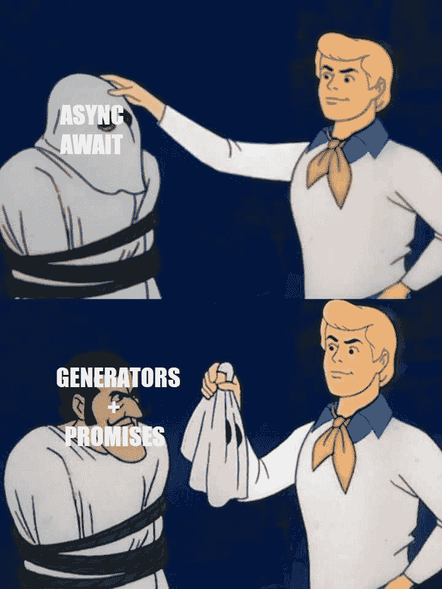

# 如何在没有代数效应的情况下恢复失败的 try 块计算中的流程

> 原文：<https://dev.to/jfet97/how-to-resume-the-flow-inside-a-failed-try-block-computation-without-algebraic-effects-pbo>

## 简介

在读完[丹关于代数效应](https://overreacted.io/algebraic-effects-for-the-rest-of-us/)的精彩文章后，一个问题，也许是错误的问题，萦绕在我的脑海:我们能走多远来尝试恢复一个失败的`try`块计算？

由于它们的性质，我相信答案与发电机有着千丝万缕的联系。它们是一种奇特的函数类型，可以根据需要暂停和恢复多次，而不会丢失前面步骤的结果。这是要点，因为*栈展开*跟随异常的出现。
显然，如果出现未处理的异常，我不知道有什么 JS 魔法可以帮助我们。但是由于一个很好的技巧，我将很快解释，我们至少有可能再次尝试失败的计算，如果是这种情况，用一个后备值替换它的值。

在开始之前，让我强调这样一个事实:如果语言中存在代数效应，那么最终的结果不会像使用代数效应那样强大。

## 承诺+发电机

再来说说 [tj/co](https://github.com/tj/co) :

```
co(function* () {
  var result = yield Promise.resolve(true);
  return result;
})
.then(console.log); // print 'true' 
```

<svg width="20px" height="20px" viewBox="0 0 24 24" class="highlight-action crayons-icon highlight-action--fullscreen-on"><title>Enter fullscreen mode</title></svg> <svg width="20px" height="20px" viewBox="0 0 24 24" class="highlight-action crayons-icon highlight-action--fullscreen-off"><title>Exit fullscreen mode</title></svg>

函数`co`背后的主要思想是执行一个产生承诺的生成器。当一台发电机产出某种东西时，它会暂停。
`co`函数负责处理每个产生的承诺，解析它，并将其结果插入到生成器中。因此，发电机将能够继续其流量，并具有之前包含在承诺中的未来值。

我相信现在你不会再写这种类型的代码了，更喜欢`async/await`语法:

```
;(async function () {
  let result = await Promise.resolve(true);
  return result;
})()
.then(console.log); // print 'true' 
```

<svg width="20px" height="20px" viewBox="0 0 24 24" class="highlight-action crayons-icon highlight-action--fullscreen-on"><title>Enter fullscreen mode</title></svg> <svg width="20px" height="20px" viewBox="0 0 24 24" class="highlight-action crayons-icon highlight-action--fullscreen-off"><title>Exit fullscreen mode</title></svg>

因为可以用同步方式编写异步代码，所以**生成器** + **承诺**模式非常受欢迎，以至于有了专用的语法！

**<笑话>**
[](https://res.cloudinary.com/practicaldev/image/fetch/s--TIdyVJeB--/c_limit%2Cf_auto%2Cfl_progressive%2Cq_auto%2Cw_880/https://thepracticaldev.s3.amazonaws.com/i/w9knw1mdedq7y8fdqiyr.jpg)
**</笑话>**

但是，我听到你问，这和我的目标有什么关系？好吧，如果我们放弃承诺，放弃计算的片段，会怎么样？

## 想法

我一直对**生成器** + **承诺**模式的巧妙着迷。理解并不难，重现也不难，但我承认这是我从未想过的事情。
思考如何解决*试块计算失败*的问题，这启发了我。

我将向你们大致展示我是如何解决这个问题的，它背后的主要思想。那我就尽可能的论证一下。

让我们转换下面的块:

```
let value = null;

try {
    const res1 = itMayThrow();
    const res2 = itMayThrowToo(res1);

    value = res2 / res1;
} catch {} 
```

<svg width="20px" height="20px" viewBox="0 0 24 24" class="highlight-action crayons-icon highlight-action--fullscreen-on"><title>Enter fullscreen mode</title></svg> <svg width="20px" height="20px" viewBox="0 0 24 24" class="highlight-action crayons-icon highlight-action--fullscreen-off"><title>Exit fullscreen mode</title></svg>

使用生成主计算中有问题的部分的生成器:

```
let value = null;

function* mainComputation() {
    const res1 = yield itMayThrow;
    const res2 = yield () => itMayThrowToo(res1);

    value = res2 / res1;
} 
```

<svg width="20px" height="20px" viewBox="0 0 24 24" class="highlight-action crayons-icon highlight-action--fullscreen-on"><title>Enter fullscreen mode</title></svg> <svg width="20px" height="20px" viewBox="0 0 24 24" class="highlight-action crayons-icon highlight-action--fullscreen-off"><title>Exit fullscreen mode</title></svg>

当生成器被执行时，它会给出可能出错的地方。
谁处理生成器，一个 simil `co`函数，将能够执行每个产生的计算，如果没有抛出异常，将结果重新插入到生成器中。否则，它不仅可以再次尝试失败的计算一次或多次，而且还可以用回退值来替换它。

## 第一次尝试

你可以在这里找到我的第一个工作方案[。我不打算在这上面花太多时间，因为，是的，它很强大，但是每一个`try-catch`块都会被转化成](https://github.com/jfet97/recoverabletrycatch)[一首诗](https://github.com/jfet97/recoverabletrycatch#async-example)。由此产生的沉重代码会掩盖使用软件包本身的好处。反对它的另一个标志是需要停止使用`try-catch`语法，转而使用专用的 API。

## 第二次尝试

只关注真正需要的东西，即重试失败的计算或提供回退值的可能性，我编写了一个更简单的包，可以与众所周知的`try-catch`语法结合使用。

这是结果:

*   同步版本

```
const { performSync, computeSync } = require("resumabletcf");

let value = null;

try {
    value = performSync(function*() {
        // computeSync(unitOfWork, howManyTimesToRetry, fallbackValue)
        const res1 = yield computeSync(itMayThrow, 5, 0);
        const res2 = yield computeSync(() => itMayThrowToo(res1), 5);

        return res2 / res1;
    });

} catch(e) {
    console.log(e);
} 
```

<svg width="20px" height="20px" viewBox="0 0 24 24" class="highlight-action crayons-icon highlight-action--fullscreen-on"><title>Enter fullscreen mode</title></svg> <svg width="20px" height="20px" viewBox="0 0 24 24" class="highlight-action crayons-icon highlight-action--fullscreen-off"><title>Exit fullscreen mode</title></svg>

*   异步版本

```
const { performAsync, computeAsync } = require("resumabletcf");

;(async () => {
    let value = null;

    try {
        value = await performAsync(async function*() {
            // computeAsync(unitOfWork, howManyTimesToRetry, fallbackValue)
            const res1 = yield computeAsync(itMayThrow, 5, 0);
            const res2 = yield computeAsync(() => asyncItMayThrowToo(res1), 5);

            return res2 / res1;
        });

    } catch(e) {
        console.log(e);
    }
})(); 
```

<svg width="20px" height="20px" viewBox="0 0 24 24" class="highlight-action crayons-icon highlight-action--fullscreen-on"><title>Enter fullscreen mode</title></svg> <svg width="20px" height="20px" viewBox="0 0 24 24" class="highlight-action crayons-icon highlight-action--fullscreen-off"><title>Exit fullscreen mode</title></svg>

我来解释一下。

`perform`函数在这种模式中，就像`co`函数在**生成器** + **承诺**模式中一样。
`performSync`和`performAsync`函数分别采用一个发生器、一个 *sync* 和一个 *async* 函数，并有任务处理它们产生的结果。只有包含有问题的计算部分的特定类型的函数必须被产生出来，然后由生成器运行程序适当地管理，并且我们可以通过`compute`助手来创建它。
如果发电机到达终点，返回值将由`perform`函数返回，作为`performSync`情况下的正常值或包含在`performAsync`情况下的承诺中。

这些助手需要**三个**参数:要执行的工作单元、失败时重试多少次(默认值为 **0** )以及一个在尝试次数用完时使用的后备值。
如果您不想让`perform`运行程序为特定的计算使用回退值，而宁愿重新抛出导致工作单元失败的异常，那么就不要传递第三个参数。
请注意，将`undefined`作为第三个参数**传递与仅传递两个参数**不同；这确保您可以使用`undefined`作为后备值。

还有三点需要记住:

*   `performAsync`总是返回一个承诺，只有当异步生成器到达终点时，该承诺才会被履行，否则它将被拒绝，并以导致其中断的异常为理由
*   调用`computeAsync`得到的函数总是`await`你传递给助手的工作单元
*   你不会被强迫归还发电机里的东西

## 举个例子

现在我们将看到一个异步计算的例子，其中将调用两个不同的远程 API。每个 HTTP 请求都可能失败或花费太多时间来响应，因此再次尝试的可能性将会很大。此外，将询问用户位置，在最坏的情况下，格林威治坐标将被用作默认值。

```
import { performAsync, computeAsync } from "resumabletcf";

const httpClient = Object.freeze({
    async delay(ms, v) {
        return new Promise(ok => setTimeout(ok, ms, v));
    },
    async get(url, ms = 1000) {
       const res = await Promise.race([fetch(url), this.delay(ms)]);

       if(res === void 0) {
           throw new Error("Out of time");
       }

       // only successfully status (2XX) are allowed 
       if(res.status < 200 || res.status > 299) {
           throw new Error(res);
       }

       return res;
    },
    async post(url, { headers, body, ...otherConfigs }, ms = 1000) {
       const config = {
           ...otherConfigs,
           method: "POST",
           headers,
           body,
       }
       const res = await Promise.race([fetch(url, config), this.delay(ms)]);

       if(res === void 0) {
           throw new Error("Out of time");
       }

       // only successfully status (2XX) are allowed 
       if(res.status < 200 || res.status > 299) {
           throw new Error(res);
       }

       return res;
    },
    async toJSON(res) {
        return await res.json();
    }
});

// wrapping the getCurrentPosition API
const getPosition = function (options) {
  return new Promise(function (resolve, reject) {
    navigator.geolocation.getCurrentPosition(resolve, reject, options);
  });
}

;(async () => {

    try {
        await performAsync(async function* () {

            // ask the user for his location only one time
            // use Greenwich coordinates as default
            const position = yield computeAsync(getPosition, 0, {
               coords: { latitude: 51.47, longitude: 0 }
            });

            const lat = position.coords.latitude;
            const lon = position.coords.longitude;

            const wrappedGetRequestAboutWeather = () => httpClient.get(`
                https://api.openweathermap.org/data/2.5/weather?lat=${lat}&lon=${lon}&APPID=0a80c24ce405d5481c3c5a9c41b9d45c
            `);

            // try to get info about the weather 10 times in total
            // the fallback value is 'null'
            let weatherRes = yield computeAsync(wrappedGetRequestAboutWeather , 9, null);

            if(weatherRes === null) {
                // try to get weather info from another API
                // ...
            }

            // if the 'toJSON' method fail it means that a wrong formatted
            // JSON response was obtained by the server
            // we are not able to do anything: let the exception rise
            const { weather } = await httpClient.toJSON(weatherRes);

            const wrappedPostRequestAboutWeather = () => httpClient.post(`
                https://5d457dedd823c30014771ebb.mockapi.io/resumabletcf/weather
            `, { body: JSON.stringify(weather[0]) }, 2000);

            // try to store info about the weather 10 times in total
            // here it does not make sense to provide a fallback value
            // so if it were not possible, an exception will be thrown
            yield computeAsync(wrappedPostRequestAboutWeather , 9);

        });

    } catch(e) {
        console.log(e);
    }

})(); 
```

<svg width="20px" height="20px" viewBox="0 0 24 24" class="highlight-action crayons-icon highlight-action--fullscreen-on"><title>Enter fullscreen mode</title></svg> <svg width="20px" height="20px" viewBox="0 0 24 24" class="highlight-action crayons-icon highlight-action--fullscreen-off"><title>Exit fullscreen mode</title></svg>

## 史诗失败

正如我已经说过的，这个解决方案与代数效应的力量相差甚远。
我来举个例子；我向丹借:

```
function getName(user) {
  let name = user.name;
  if (name === null) {
    throw new Error('A girl has no name');
  }
  return name;
}

function makeFriends(user1, user2) {
  user1.friendNames.add(getName(user2));
  user2.friendNames.add(getName(user1));
}

const arya = { name: null, friendNames: new Set() };
const gendry = { name: 'Gendry', friendNames: new Set() };

// here the main part
try {
  // this is going to throw because 'arya.name' is 'null'
  makeFriends(arya, gendry);
} catch (err) {
  console.log("Oops, that didn't work out: ", err);
} 
```

<svg width="20px" height="20px" viewBox="0 0 24 24" class="highlight-action crayons-icon highlight-action--fullscreen-on"><title>Enter fullscreen mode</title></svg> <svg width="20px" height="20px" viewBox="0 0 24 24" class="highlight-action crayons-icon highlight-action--fullscreen-off"><title>Exit fullscreen mode</title></svg>

它可以转化为:

```
const { performSync, computeSync } = require("resumabletcf");

function getName(user) {
  let name = user.name;
  if (name === null) {
    throw new Error('A girl has no name');
  }
  return name;
}

function makeFriends(user1, user2) {
  user1.friendNames.add(getName(user2));
  user2.friendNames.add(getName(user1));
}

const arya = { name: null, friendNames: new Set() };
const gendry = { name: 'Gendry', friendNames: new Set() };

// here the main part
try {
  performSync(function*() {
    yield computeSync(() => makeFriends(arya, gendry), ...); 
  });
  ;
} catch (err) {
  console.log("Oops, that didn't work out: ", err);
} 
```

<svg width="20px" height="20px" viewBox="0 0 24 24" class="highlight-action crayons-icon highlight-action--fullscreen-on"><title>Enter fullscreen mode</title></svg> <svg width="20px" height="20px" viewBox="0 0 24 24" class="highlight-action crayons-icon highlight-action--fullscreen-off"><title>Exit fullscreen mode</title></svg>

但这对我们没什么帮助。那是因为`getName`和`makeFriends`是正常函数；引发异常后，它们的堆栈被展开。我们仍然能够在生成器内部替换调用`makeFriends`的结果，但是在这一点上已经没有用了。

也可以修改`computeSync`来进行回退计算，但这似乎不是一个完整的解决方案。我需要考虑一下。你有什么看法？你知道吗？

## 结论

我不得不承认我对[resumablecf](https://github.com/jfet97/resumabletcf)并不完全满意。
我认为它可以在 JavaScript 世界找到自己的位置，但它似乎有点局限和局限。反对栈展开的斗争是艰难的；也许发电机不是正确的答案。
在成本效益增长太快之前，专用 API 还能走多远？
或者也许解决方案就在这里的某个地方，但我看不到。