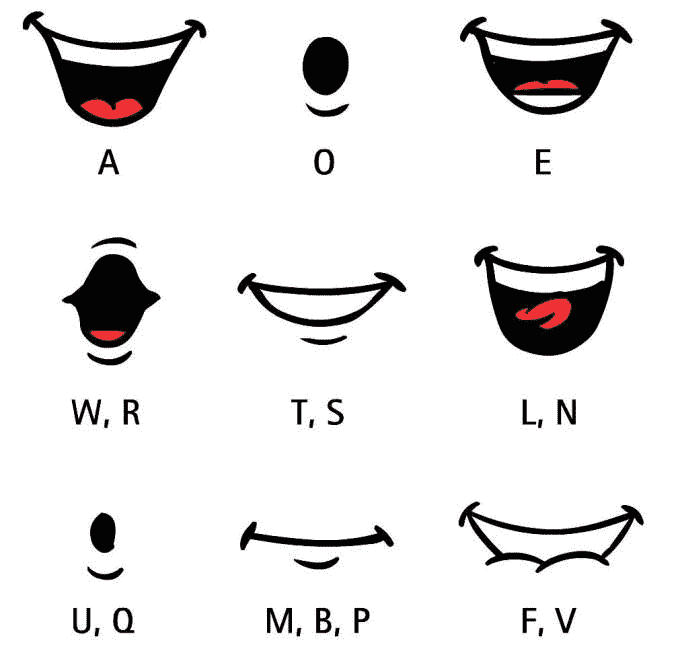
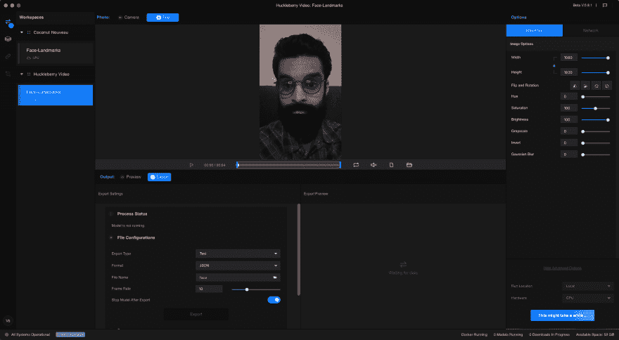

# 使用 RunwayML 创建一个唇同步动画

> 原文：<https://dev.to/vbaknation/using-runwayml-to-create-a-lip-sync-animation-4dbf>

## 相关岗位:

我们的目标是创建一个开源应用程序或库，让音乐人能够加快为他们的音乐创作视觉效果的过程:

*   [第 0 版`animatemusic`](https://dev.to/vbaknation/creating-visuals-for-my-music-using-speech-recognition-javascript-and-ffmpeg-4a6d)
*   [第一版`animatemusic`](https://dev.to/vbaknation/creating-visuals-for-music-using-speech-recognition-javascript-and-ffmpeg-version-1-4mll)

## 假唱

在我研究着色器函数的同时，我一直在探索如何将我的脸(或我希望创建的任何角色)的动画与我的歌曲在 HTML/Canvas 动画中进行口型同步。

这最初是受我使用的强制对齐器( [gentle](https://github.com/lowerquality/gentle) )的输出的启发，它包括单词被说出的时间，以及单词的每个音素的持续时间(音素是单词声音的基本单位)。

例如，gentle 对单词“let”的结果(音素的持续时间以秒为单位显示):

```
{
      "alignedWord": "let",
      "phones": [
        {
          "duration": 0.09,
          "phone": "l_B"
        },
        {
          "duration": 0.09,
          "phone": "eh_I"
        },
        {
          "duration": 0.04,
          "phone": "t_E"
        }
      ]
} 
```

我的第一个计划是在动画的每一帧渲染画布时，将口型坐标映射到每个音素。作为第一次尝试，我使用了我在网上找到的以下图片，它显示了不同字母对应的嘴型:

[](https://res.cloudinary.com/practicaldev/image/fetch/s--v1_xz_Aj--/c_limit%2Cf_auto%2Cfl_progressive%2Cq_auto%2Cw_880/https://thepracticaldev.s3.amazonaws.com/i/iubpy8p58bkfg7vwvxoh.jpg) 
来源:[https://fmspracticumspring 2017 . blogs . bucknell . edu/2017/04/18/odds-ends-lip-syncing/](https://fmspracticumspring2017.blogs.bucknell.edu/2017/04/18/odds-ends-lip-syncing/)

[https://codepen.io/vishalbakshi/embed/Qeqvqj?height=600&default-tab=result&embed-version=2](https://codepen.io/vishalbakshi/embed/Qeqvqj?height=600&default-tab=result&embed-version=2)

我试图在整个代码中用注释来表达我的意图，但本质上，主图像(包括所有的口型)被翻译成显示每个单词所需的音素。

我相信这个案例研究可以扩展到一首完整的歌曲，带有自定义的嘴形坐标(可能会以使用 [vectr](https://vectr.com) 的绘图开始)。这可能是我制作完整歌曲动画的下一步。

但是在我继续走这条路之前，我想尝试一下我几天前遇到的东西: [RunwayML](https://runwayml.com/) ，这是一个提供 GUI 来运行不同开源 ML 模型的软件。RunwayML 被明确地作为面向创作者的软件进行营销。有一个[免费下载](https://runwayml.com/download)，它非常容易使用，所以如果你对使用机器学习进行创造性努力感兴趣，我强烈推荐它。

## 使用 RunwayML

我很高兴利用面部识别的能力来为我做这项工作，而不是使用嘴型的图像，或者自己画。

我先用手机录了一段自己的短视频:

[https://www.youtube.com/embed/uSg3I2y_fx8](https://www.youtube.com/embed/uSg3I2y_fx8)

然后，我在 RunwayML 中创建了一个新的工作区，并向其中添加了 *Face Landmarks* 模型，其作者对该模型的描述如下:

> ResNet-32 网络在大约 300 万张人脸的数据集上从头开始训练。这个数据集是从许多数据集派生出来的。面部磨砂膏数据集 2，VGG 数据集 1，还有我亲自从网上搜集的大量图片。我尽最大努力通过去除标注错误来清理合并后的数据集，这意味着过滤掉很多来自 VGG 的东西。我这样做是通过反复训练一个人脸识别模型，然后使用图聚类方法和大量的人工审查来清理数据集。最后，大约一半的图片来自 VGG 和面部磨砂膏。此外，数据集中个人身份的总数为 7485。我确保避免与 LFW 的身份重叠，这样 LFW 的评估就有效了。

该模型将视频文件作为输入，并输出不同的已识别人脸特征的坐标(x，y 像素)。我选择的输出格式是`.JSON`，结果数据结构是:

```
[
    {
        time: 0.01,
        landmarks: [
           {
               bottom_lip: [[x0,y0], [x1,y1], ...],
               chin: [[x0,y0], [x1,y1], ...],
               left_eye: [[x0,y0], [x1,y1], ...],
               ...
           }
        ]
    }
] 
```

每个`time`值(基于导出的帧速率，在本例中为 10 fps)都有一组对应的界标(面部特征)。面部特征已经被分配了[x，y]像素坐标阵列的阵列。

下面是导出过程中的 RunwayML 接口。顶部面板显示上传的视频，底部面板显示模型输出的导出/预览，侧面板显示模型参数:

[](https://res.cloudinary.com/practicaldev/image/fetch/s--0brVDCpA--/c_limit%2Cf_auto%2Cfl_progressive%2Cq_auto%2Cw_880/https://thepracticaldev.s3.amazonaws.com/i/n2gs60pmub7vqd1np7s8.png)

我将`.JSON`输出复制到一只笔中，并使用面部标志坐标构建了一个 10 fps 的动画:

[https://codepen.io/vishalbakshi/embed/oKoZOW?height=600&default-tab=result&embed-version=2](https://codepen.io/vishalbakshi/embed/oKoZOW?height=600&default-tab=result&embed-version=2)

呜！！考虑到整个过程是如此的顺利，我认为这非常棒。请注意，我没有调整或研究任何模型参数，因此我将在接下来探讨这一点。

> 如果您是 RunwayML 的新手，请注意:如果您正在本地运行模型，请确保下载、安装并打开 [Docker Desktop](https://www.docker.com/products/docker-desktop) 。RunwayML 确实给了你使用远程 GPU 运行模型的学分，我将在本周使用它以更高的输出帧速率运行完整的视频。

## 跟着我

[YouTube](https://www.youtube.com/channel/UCqvA0CVB3QR3TLpGVzkD35g)
T3】insta gramT5[Twitter](https://twitter.com/vbaknation)