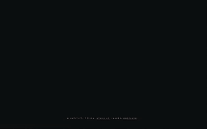
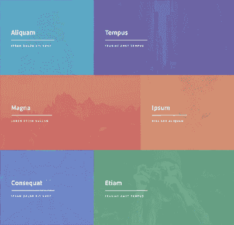
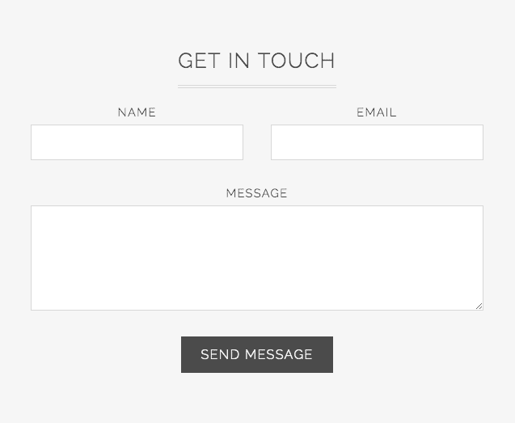
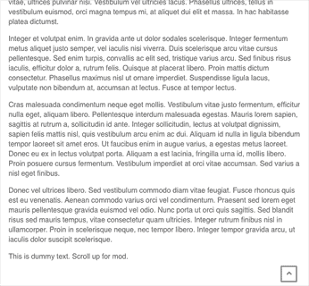

# 模块星期一 50🎉单页应用及更多

> 原文：<https://dev.to/tyrw/module-monday-50-single-page-app-more-lgk>

## 5 个你可以在任何地方使用的开源网站模块

下面的一切都是开源的，可以在你选择的任何项目中免费使用。AnyMod 可让您快速向任何网站或网络应用添加功能。

单击一个 mod 来查看它的运行及其源代码。

## 单页 app mod

一个令人惊叹的单页所需的一切。
[查看 mod](https://anymod.com/mod/single-page-theme-dimension-kdnola?preview=true)
  

## 颜色部分

眨眼之间将 pop 添加到您的页面中。
[查看 mod](https://anymod.com/mod/colors-sections-dkdmmd?preview=true)
  

## 专业侧导航

带有链接和图像的可滚动导航元素。
[查看 mod](https://anymod.com/mod/professional-side-nav-kdrkka?preview=true)
  

## 典型化联系形式

基于模板化典型化主题的现成形式。
[查看 mod](https://anymod.com/mod/contact-form-barodo?preview=true)
  

## 滚动到顶部按钮

当你点击它时，它...滚动到顶部。
[查看 mod](https://anymod.com/mod/scroll-to-top-button-ordbno?preview=true&lorem=true)
  

* * *

我每周一都会在这里发布新的模块，希望你会觉得有用！

快乐编码✌️