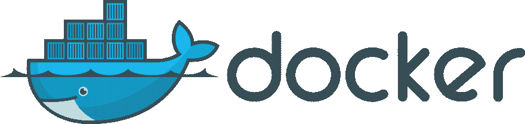
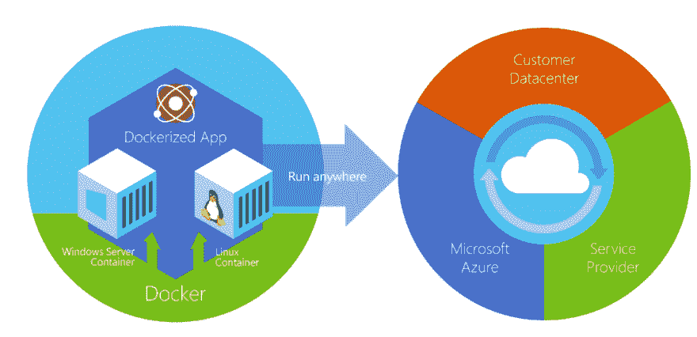
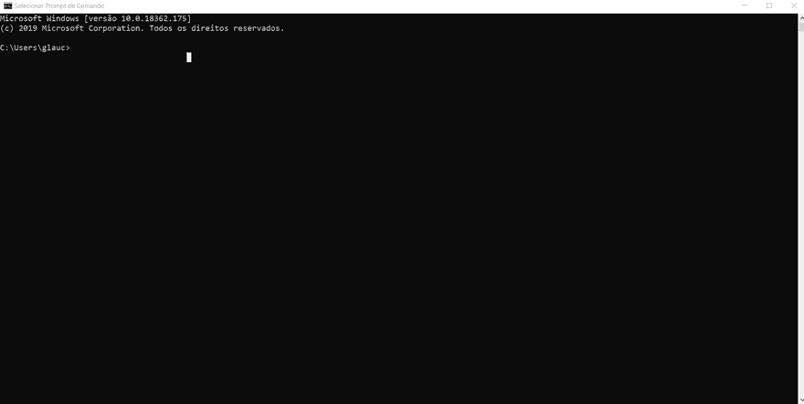

# 坞站简介-基础知识

> [https://dev . to/azure/introduction Cao-a-docker-concepts-4g 19](https://dev.to/azure/introducao-a-docker-conceitos-basicos-4g19)

*原由 Chris Noring - **[在此](https://dev.to/softchris/5-part-docker-series-beginner-to-master-3m1b)*** 撰写的文章

上个月，我们在**[【Twitter】](https://twitter.com/glaucia_lemos86)**和 Facebook 上进行了投票，你们都想学习的话题是什么。而坞站是两个平台中最热门、最热门的话题！

今天我们将开始一系列关于坞站的文章，从基本概念到更高级的概念。这一系列文章是以我的好友[【克里斯·诺林】](https://twitter.com/chris_noring) 的帖子为基础的，他也是云倡导者，和我一样对开源技术极为热情的人！

让我们团结起来，特别是你们所有人！但是，除了他写的文章之外，我还将播放有关每一个教学主题的视频，并有更多的内容来进一步认可我们的系列！

我们开始吧？！

## 码头是什么？！

这是一个很有趣的问题，我想给大家总结一下！

是一个开源项目，旨在自动部署容器等应用程序，可以在云中甚至本地运行！

坞站最有趣的部分是它在混合云的所有层上实现容器。其中，o[【蓝色】](https://docs.microsoft.com/azure/docker/?WT.mc_id=blog-devto-chnoring) 。

还有一点很有趣:您可以在 Linux、Windows 和 MacOs 上运行图像容器。

我想你已经很清楚码头是什么了吧？！如欲了解更多详情，只需访问此处的链接

在本系列中，我将提供链接、资源和免费电子书籍，作为推荐的材料和阅读材料！因为没有什么比通过书籍和文档学习新技术更好的了！

## 连续系列所需资源:【学习对接-零至英雄】

系列中不存在必须遵循的要求。甚至因为这个系列的目的是教你们所有人使用坞站！

但是，我们需要使用一些必需的资源，我们需要下载这些资源，这样我们才能继续进行该系列。他们是:

*   **[下载坞站社区版 CE](https://www.docker.com/community-edition) :** 我们需要下载坞站社区，学习如何执行从最基本到最高级的命令！此版本是免费的，可以轻松下载(适用于 Windows、Linux 和 MacOs 用户)

*   **[【蓝光账户】](https://azure.microsoft.com/pt-br/free/?wt.mc_id=blog-devto-chnoring):在这一系列的过程中，我们将在云中测试一些图像和容器。在这种情况下，我们需要使用云服务。在这种情况下，我们将使用蓝色。**

*   **[蓝色代表学生-免费](https://azure.microsoft.com/pt-br/free/students/?wt.mc_id=blog-devto-gllemos) :** 如果你是某个教育机构的学生-大学或者大学，并且有你大学的一些电子邮件账户，我有好消息要告诉你！你可以从 **[【蓝色为学生】](https://azure.microsoft.com/pt-br/free/students/?wt.mc_id=blog-devto-chnoring)** 那里得到完全免费的账号，不用信用卡，马上就可以赚到 100 美元的馀额来使用蓝色服务 12 个月！#坚持住

*   **[Node.js](https://nodejs.org/en/) :** 随着系列的进展，我们将使用一些示例，说明如何在 Node.js 应用程序中实现图像和容器的使用。

*   **[【Visual Studio 代码】](https://code.visualstudio.com/?WT.mc_id=blog-devto-gllemos) :** 由于代码中将有示例，所以我们将使用 visual studio 代码开发我们的应用程序。

*   **[extenso Docker-Vs Code](https://aka.ms/AA5iz0q):**estaremos usando extenso do Docker que sermuito important para quem USA o Visual Studio Code。

*   **[蓝色扩展工具- Vs 代码](https://aka.ms/AA5if36) :** 我们将如何使用蓝色，没有什么比使用 Visual Studio 代码内置扩展更好的方法，便于简单、快速、动态地创建图像或嵌入蓝色的容器！

设置好您的整个开发环境并确保一切正常后，我们就可以继续进行该系列了！

## 为什么要使用码头？！

docker 将帮助我们创建一个可执行环境。此外，您还可以指定要使用的操作系统、不同库的确切版本、不同的环境变量及其值等等。但是，最重要的是，您可以在此环境中单独运行应用程序。

以下几点让我们思考使用坞站的原因:

*   **on board:**每当团队要接收新开发人员时，都需要设置、安装程序、SDK、开发工具、数据库、添加权限等。这可能需要几天甚至几周的时间。但是，如果开发团队已经通过 dock 获得了该开发人员开始开发所需的所有资源的映像，那么只需一个 docker run 即可在几分钟内完成安装！并且这大大加快了新开发人员(a)的‘T2’on board’T3’过程。

*   **具有标准开发环境:**是的！这点很有趣！因为使用坞站，您可以创建一个**【dev staging】**以及一个标准化且人人平等的生产环境！这真是太棒了！由于坞站/容器可能具有相似的环境，但会有一些小的差异，而且当您尝试查找应用程序中的特定错误时，您可能需要花费大量时间来查找该错误的主要问题。而且错误通常是在源代码中出现的，但是由于环境的某些差异，您可能需要很长时间才能确定问题的原因。坞站将使开发团队在这些情况下变得非常容易，顺便说一句，这些情况在日常生活中非常常见。

*   **啊-我...。在我的机器上工作**:使用码头集装箱，这句话永远不会用到。你知道为什么吗？！因为坞站创建了这些隔离的容器，您可以准确地指定它们必须拥有的内容，所以您可以将容器发送给客户，并且它们的运行方式与在开发/生产环境中的运行方式相同！

## 安装坞站

现在，我们已了解坞站和容器的基本概念，我们将在计算机上安装坞站。

我们要做的第一件事是转动[【对接小区版 ce】](https://www.docker.com/community-edition)。如果您是 Windows 用户，并且不知道如何在计算机上正确安装坞站，则可以使用以下链接逐步了解如何安装坞站:

📺 **[在 Windows 10](https://www.youtube.com/watch?v=Bxepw-C5a-s)** 上安装坞站

在计算机上正确安装坞站后，该信息应如下所示:

如果一切都像上面的 gif 一样工作，那么我们准备使用 docker 来开发应用程序！

## 结语

如上所述，我们将帮助您了解坞站-从基本概念到高级概念，因此我们将提供免费链接、内容和课程，以补充您的学习。

以下是其中的一些功能:

*   **[使用坞站](https://docs.microsoft.com/pt-br/learn/modules/intro-to-containers/?WT.mc_id=blog-devto-gllemos)** 创建集装箱式 Web 应用程序
*   **[部署并运行与 Azure 应用服务](https://docs.microsoft.com/pt-br/learn/modules/deploy-run-container-app-service/?WT.mc_id=blog-devto-chnoring)** 托管的 Web 应用程序
*   **[在数据科学虚拟机](https://docs.microsoft.com/pt-br/learn/modules/interactive-deep-learning/?WT.mc_id=blog-devto-gllemos)** 中与 Jupyter、docker 和 PyTorch 进行了深入的交互学习
*   **[用](https://docs.microsoft.com/pt-br/learn/modules/build-and-store-container-images/?WT.mc_id=blog-devto-chnoring)** 蓝容器记录创建和存储容器图像
*   **[【运行带有蓝方容器实例的码头容器】](https://docs.microsoft.com/pt-br/learn/modules/run-docker-with-azure-container-instances/?WT.mc_id=blog-devto-gllemos)**
*   **[入门- Docker 文档](https://docs.docker.com/get-started/)**

另一个重要的问题是，每次写完帖子后，我都会在 Youtube 频道上提供视频，通过视频进行讲解和教学。因为有些人喜欢通过视频学习新技术。

如果你们想知道录像时间表，我将通过 GitHub 的存储库提供

如果您对职位有任何疑问，请将您的疑问留在下面的评论中，如有任何建议，也请告知我们！因为这个系列是为社区里的每个人制作的！

在下一篇文章中，我将介绍如何使用 docker 来开发 node . js express 应用程序。这将是一个更多的手。等一下！

如果你想了解更多信息，请跟我来 twitter！

下次见！