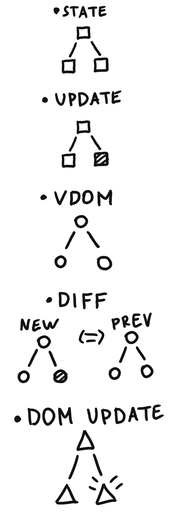
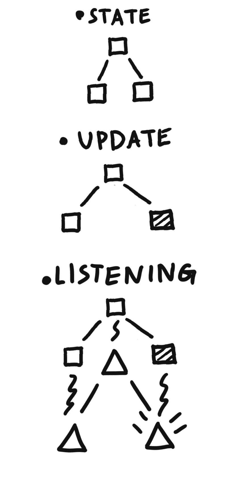

# 制作普通应用程序

> 原文：<https://dev.to/mikeskoe/making-vanilly-app-3m46>

能够使用 Reaction、View、Angler 制作应用程序真是太棒了。但是如果你能用纯 JS 做一个小的应用程序就更好了。

今天我将向你展示我做香草应用的方法。

...

我称之为“面向属性的发布订阅模式”。但是在我解释这个想法之前，我们先来看一些要点。

每个应用都有三个基本部分:状态、动作和表示层。
**状态**是一个拥有一切可变信息的物体。通常，每个应用程序都有一个全局状态，对于应用程序的小部分，还有可选的小状态。
**动作**是改变状态的功能。通常在一些按钮按下或任何其他更新时触发。
**表示层**或“视图”，是一种将状态漂亮地呈现给用户的方式。

React+Redux 循环看起来是这样的:

*   通过按下按钮触发状态更新(例如)。
*   基于新的状态，我们创建了新的 VDOM (JS-object 作为未来 DOM 的表示)。
*   新 VDOM 与旧的相比。
*   基于真正改变的部分，React 更新只需要 DOM 元素。

[](https://res.cloudinary.com/practicaldev/image/fetch/s--YdveaXzE--/c_limit%2Cf_auto%2Cfl_progressive%2Cq_auto%2Cw_880/https://thepracticaldev.s3.amazonaws.com/i/7p7wu2i5oufmusk7oaya.jpg)

propertyorientedpubsubpattern 的流程要简单得多。动作改变状态并列出所有改变的属性。基于改变的状态键，订阅的功能被触发。

[](https://res.cloudinary.com/practicaldev/image/fetch/s--fzO5DmWG--/c_limit%2Cf_auto%2Cfl_progressive%2Cq_auto%2Cw_880/https://thepracticaldev.s3.amazonaws.com/i/s010l14x8e4sc5ysf9v4.jpg)

把一切都说清楚，先学会怎么用，然后我们再做。

例如，我们有一个状态“字符”。

```
const initialState = {
   name: 'Jake',
   age: 32,
   about: 'hi, im jake, yo',
} 
```

<svg width="20px" height="20px" viewBox="0 0 24 24" class="highlight-action crayons-icon highlight-action--fullscreen-on"><title>Enter fullscreen mode</title></svg> <svg width="20px" height="20px" viewBox="0 0 24 24" class="highlight-action crayons-icon highlight-action--fullscreen-off"><title>Exit fullscreen mode</title></svg>

我们把它放入某个“init”函数中，这个函数给了我们“pub”和“sub”来处理。

```
const {pub, sub} = init(initialState); 
```

<svg width="20px" height="20px" viewBox="0 0 24 24" class="highlight-action crayons-icon highlight-action--fullscreen-on"><title>Enter fullscreen mode</title></svg> <svg width="20px" height="20px" viewBox="0 0 24 24" class="highlight-action crayons-icon highlight-action--fullscreen-off"><title>Exit fullscreen mode</title></svg>

然后我们制作几个组件。

```
const c = document.createElement.bind(document); // alias for createElement
const q = document.querySelector.bind(document); // alias for querySelector
const Name = c('div');
const Age = c('div');
const MakeOlder = c('button');
MakeOlder.innerText = 'Make a person older!';
const App = c('div');
App.append(Name, Age, MakeOlder); 
```

<svg width="20px" height="20px" viewBox="0 0 24 24" class="highlight-action crayons-icon highlight-action--fullscreen-on"><title>Enter fullscreen mode</title></svg> <svg width="20px" height="20px" viewBox="0 0 24 24" class="highlight-action crayons-icon highlight-action--fullscreen-off"><title>Exit fullscreen mode</title></svg>

然后用那些酒吧的东西。

```
sub(
   ['age'],
   age => Age.innerText = `age: ${age}`,
);
sub(
   ['name'],
   name => Name.innerText = `name: ${name}`,
);
const OLDER = pub(
   ['age'],
   state => ({...state, age: state.age + 1}),
);

MakeOlder.onclick = OLDER; 
```

<svg width="20px" height="20px" viewBox="0 0 24 24" class="highlight-action crayons-icon highlight-action--fullscreen-on"><title>Enter fullscreen mode</title></svg> <svg width="20px" height="20px" viewBox="0 0 24 24" class="highlight-action crayons-icon highlight-action--fullscreen-off"><title>Exit fullscreen mode</title></svg>

现在我们有一个小计数器，伪装成一个帐户应用程序。如你所见，我们明确列出了所有公共的和订阅的属性。当某些属性被更新时，某些功能被触发。很简单。

因此，让我们建立这个“初始化”函数的和平。

```
const init = state => { // 1.
   const callbacks = {}; // 2.
   return {
      sub: (keys, fn) => { // 3.
         fn.args = keys; // 4.
         keys.forEach(key => {
            callback[key] = callback[key] || []; // 5.
            callbacks[key].push(fn);
         };
         fn(...fn.args.map(arg => state[arg])); // 6.
      },
      pub: (keys, update) => () => {
         initialState = update(initialState); // 7.
         keys.forEach(key => { // 8.
            (callback[key] || []).forEach(cb => { // 9.
               cb(...(cb.args || []).map(arg => state[arg]) // 10.
            });
         });
      }
   }
} 
```

<svg width="20px" height="20px" viewBox="0 0 24 24" class="highlight-action crayons-icon highlight-action--fullscreen-on"><title>Enter fullscreen mode</title></svg> <svg width="20px" height="20px" viewBox="0 0 24 24" class="highlight-action crayons-icon highlight-action--fullscreen-off"><title>Exit fullscreen mode</title></svg>

现在让我一行一行地解释一切。

1.  状态保存在闭包中。
2.  “回调”是一个对象，包含所有订阅的函数。Key 是依赖于该键的状态属性字符串 value - function。
3.  正如你已经知道的，sub 需要状态键和一个函数来触发。
4.  当在几个键上订阅函数时，该函数会在“回调”对象的几个键上的不同数组中列出。为了保存与函数相关的所有键，我们将它们放在“args”属性中，因为“函数是 JS 中的对象。
5.  如果回调对象已经有了那个键=我们什么都不做，否则我们创建一个空数组。
6.  立即调用，将参数作为状态的键。
7.  将函数追加到回调对象。
8.  我们通过从闭包重新分配' initialState '来更新状态。
9.  为了安全，如果那个键上没有数组，我们使用空数组(不做任何事情)。
10.  与第(6)行相同。)，触发需要的功能。

这段代码有很多缺陷，因为我想让它尽可能的简单，但是它已经是制作小程序的有用工具了！

如果你想玩这个，下面是 codesandbox 的例子:
[https://codesandbox.io/embed/dhoev](https://codesandbox.io/embed/dhoev)

一切都很好，但是:

*   有些函数可以被调用两次
*   直接通过“文档”对象创建和更新元素并不酷
*   我们没有办法取消订阅功能
*   自然灾难仍在发生

在下一集，我们将解决其中的一些问题，所以下次再见！

lib: [回购](https://github.com/MikeSkoe/q23rp98u)；
app: [回购](https://github.com/MikeSkoe/tasktimer)
[gh-pages 版本](https://mikeskoe.github.io/tasktimer/)