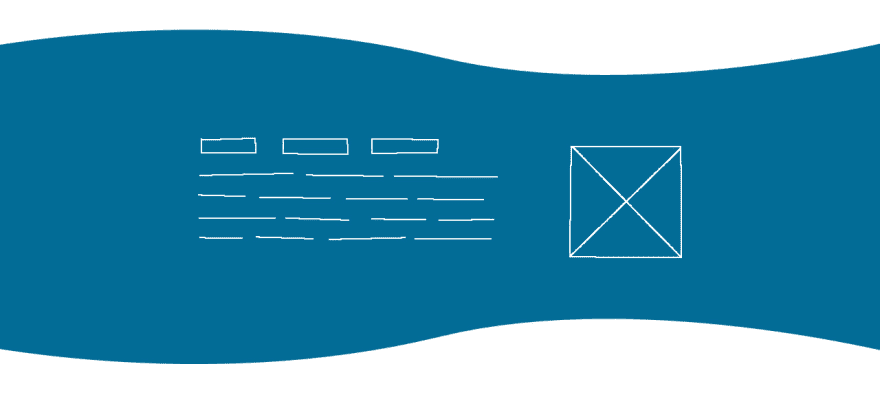
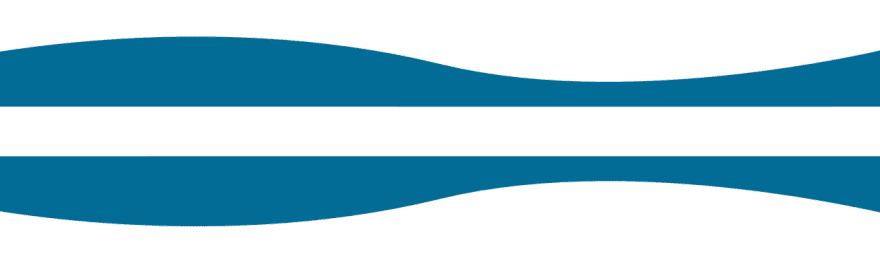
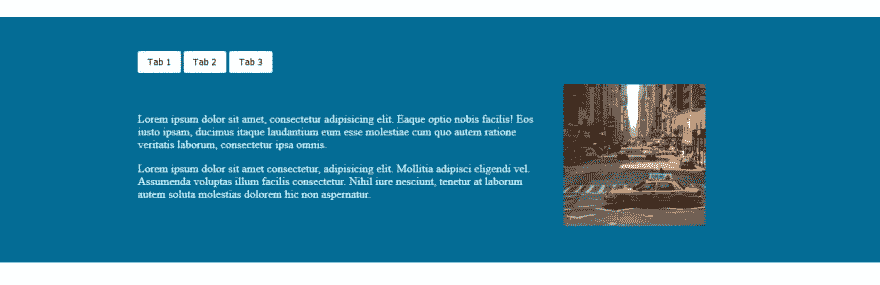
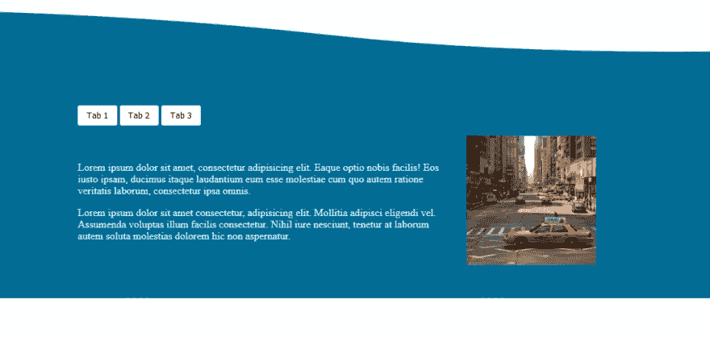
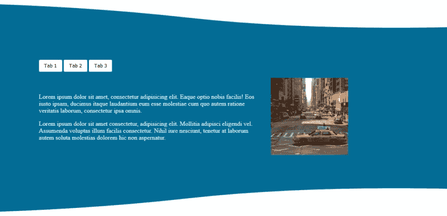
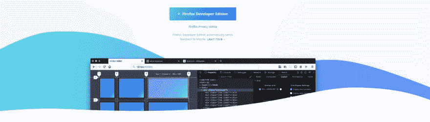
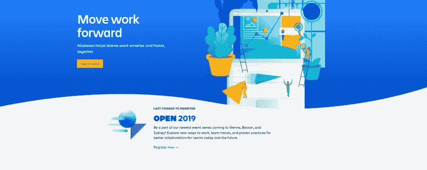

# 如何给你的网站添加曲线

> 原文：<https://dev.to/dzhavat/how-to-add-curves-to-your-website-28l4>

这篇文章最初发表在我的博客上。

* * *

作为前端开发人员，我们通常负责将设计转化为代码。有时设计师想尝试一些有创意的东西，打破我们习以为常的矩形。所以他/她决定添加一些曲线。我们现在的工作是变魔术，让它们出现在页面上。

几周前，我得到了一个和这个大致相似的设计:

[](https://res.cloudinary.com/practicaldev/image/fetch/s--NPqE7XbL--/c_limit%2Cf_auto%2Cfl_progressive%2Cq_auto%2Cw_880/https://thepracticaldev.s3.amazonaws.com/i/yguof85zxi2t62rzdd3k.jpg) 

<figure>

<figcaption>示例样机(请问我的基本[光感](https://www.photopea.com/)技能)</figcaption>

</figure>

在这篇文章中，我将向你展示如何在一个元素的顶部和底部添加曲线。我将分享我的解决方案。你可能有一个不同的。那也行！如果你有，请在下面的评论中告诉我。

### 在写任何代码之前

花点时间思考设计是很重要的。试着想出一个你将如何实现它的策略。你可能会面临什么样的挑战？它在移动设备上会是什么样子？在桌面上？在宽屏上？能不能让它在其他地方灵活可重用？您想要使用的技术是否得到了很好的支持，或者您是否应该考虑有一个后备方案？

让我们简单分析一下当前的任务:

*   模型可以分为三个部分-顶部曲线，内容，底部曲线。上下曲线纯粹是为了装饰。万一发生了什么事情而它们没有出现，主要内容元素应该以直线结束。其他任何东西都不应该损坏。
*   更仔细地看这些曲线，我可以看到它们实际上是相同的。唯一不同的是，其中一个是垂直翻转的。这对我很有帮助，因为我可以只导出曲线一次，然后在顶部和底部重复使用。我们一会儿就知道怎么做了。

[](https://res.cloudinary.com/practicaldev/image/fetch/s--C-k2xr1X--/c_limit%2Cf_auto%2Cfl_progressive%2Cq_auto%2Cw_880/https://thepracticaldev.s3.amazonaws.com/i/c06mijv9b28v78n7mapn.jpg) 

<figure>

<figcaption>上下曲线</figcaption>

</figure>

*   在更宽的屏幕上，曲线必须从边缘到边缘，而内容可以居中。

不错！现在让我们看一些代码。

### 添加主要内容

这个非常简单，你可能已经做过很多次了。有一个全宽的包装器`.container`，可以用来设置背景颜色和添加曲线。`.tabs-container`用于保存内容。该元素将在更宽的屏幕上居中显示。

```
<div class="container">
  <div class="tabs-container">
    <!-- Some content here -->
  </div>
</div> 
```

<svg width="20px" height="20px" viewBox="0 0 24 24" class="highlight-action crayons-icon highlight-action--fullscreen-on"><title>Enter fullscreen mode</title></svg> <svg width="20px" height="20px" viewBox="0 0 24 24" class="highlight-action crayons-icon highlight-action--fullscreen-off"><title>Exit fullscreen mode</title></svg>

```
.container {
  background-color: #026b96;
}

.tabs-container {
  color: white;
  padding: 1.5rem;
}

@media (min-width: 980px) {
  .tabs-container {
    margin-left: auto;
    margin-right: auto;
    padding: 3rem 2rem;
    width: 800px;
  }
} 
```

<svg width="20px" height="20px" viewBox="0 0 24 24" class="highlight-action crayons-icon highlight-action--fullscreen-on"><title>Enter fullscreen mode</title></svg> <svg width="20px" height="20px" viewBox="0 0 24 24" class="highlight-action crayons-icon highlight-action--fullscreen-off"><title>Exit fullscreen mode</title></svg>

以下是目前为止的结果( [CodePen](https://codepen.io/dzhavat/full/WVEJva) ):

[](https://res.cloudinary.com/practicaldev/image/fetch/s--ZWmp-xyR--/c_limit%2Cf_auto%2Cfl_progressive%2Cq_auto%2Cw_880/https://thepracticaldev.s3.amazonaws.com/i/zrxuauss3snjcmfuuiat.jpg) 

<figure>

<figcaption>第一步</figcaption>

</figure>

目前这是一个很好的基线。即使我不添加曲线，一切看起来仍然很好。

### 添加顶部曲线

我已经说过曲线只是为了装饰和使元素看起来更有机。因此，我将在前使用[:](https://developer.mozilla.org/en-US/docs/Web/CSS/::before)[:](https://developer.mozilla.org/en-US/docs/Web/CSS/::after)后使用[:](https://developer.mozilla.org/en-US/docs/Web/CSS/::before)[:`img`伪元素，而不是将它们作为`img`元素添加。为了在更宽的屏幕上呈现边对边的曲线，我将它导出为 3000x103px 的 SVG 图像。这仍然会在超宽屏幕上引起问题，但这足以说明这篇文章的目的。](https://developer.mozilla.org/en-US/docs/Web/CSS/::after)

现在剩下的是将曲线添加到元素:

```
.container {
  /* ... */
  position: relative;
}

.container::before {
  background: url("path/to/curve.svg") center bottom no-repeat;
  bottom: 100%;
  content: '';
  height: 103px;
  position: absolute;
  width: 100%;
} 
```

<svg width="20px" height="20px" viewBox="0 0 24 24" class="highlight-action crayons-icon highlight-action--fullscreen-on"><title>Enter fullscreen mode</title></svg> <svg width="20px" height="20px" viewBox="0 0 24 24" class="highlight-action crayons-icon highlight-action--fullscreen-off"><title>Exit fullscreen mode</title></svg>

这里有几点:

*   因为`::before`元素有`position: absolute`，所以在`.container`上设置`position: relative`是个好主意。这将使`::before`元素留在`.container`内，从而更容易四处移动。
*   `background`宣言很有趣。有一些事情，但定位(由`center bottom`定义)是关键。这指定了相对于元素边缘放置图像的位置。`center`将把图像放在 x 轴的中心，而`bottom`将把它放在 y 轴的底部。你可以玩不同的组合。`left bottom`或`right bottom`也有效。你也可以指定[背景尺寸](https://developer.mozilla.org/en-US/docs/Web/CSS/background-size)。试试看，看看效果。
*   这个`content: ''`相当重要。没有它，就不会生成元素。
*   `height: 103px`是 SVG 图像的高度。在你的情况下，这个数字可能是不同的。
*   `bottom: 100%`将元素的下边缘放置在`.container`的上边缘。这通过使用相对于容器高度的[百分比值](https://developer.mozilla.org/en-US/docs/Web/CSS/bottom#Values)来实现。感谢[安德鲁·伯恩](https://dev.to/link2twenty/comment/dn6f)分享这个技巧。

以下是目前为止的结果( [CodePen](https://codepen.io/dzhavat/full/NQarrp) ):

[](https://res.cloudinary.com/practicaldev/image/fetch/s--CmOIwf_L--/c_limit%2Cf_auto%2Cfl_progressive%2Cq_auto%2Cw_880/https://thepracticaldev.s3.amazonaws.com/i/qjyyfouh7c4qewi9gdxo.jpg) 

<figure>

<figcaption>第二步</figcaption>

</figure>

### 添加底部曲线

最后一部分时间到了。这会很有趣的。

我在开头已经说过，底部曲线和顶部曲线是一样的。不同的是，最下面的是翻转的。幸运的是，有一个 CSS 属性可以帮助我们实现这一点。让我们看一看。

```
.container::before,
.container::after {
  background: url("path/to/curve.svg") center bottom no-repeat;
  content: '';
  height: 103px;
  position: absolute;
  width: 100%;
}

.container::before {
  bottom: 100%;
}

.container::after {
  top: 100%;
  transform: rotateX(180deg);
} 
```

<svg width="20px" height="20px" viewBox="0 0 24 24" class="highlight-action crayons-icon highlight-action--fullscreen-on"><title>Enter fullscreen mode</title></svg> <svg width="20px" height="20px" viewBox="0 0 24 24" class="highlight-action crayons-icon highlight-action--fullscreen-off"><title>Exit fullscreen mode</title></svg>

这里也重复了上一步中的许多代码。我已经将`::before`和`::after`元素之间的所有公共声明放在了一起。这样我只能在一个地方进行调整。

这里最重要的代码是`::after`元素中的`transform`属性。

使用 [`rotateX()`](https://developer.mozilla.org/en-US/docs/Web/CSS/transform-function/rotateX) 功能我可以沿其水平轴旋转图像。这感觉很直观，因为该值是一个角度，将`180deg`指定为一个值会翻转它。

*注意*:在这段代码的前一个版本中，我使用了`scaleY(-1)`来实现同样的事情。这也可以，但是正如[安德鲁·伯恩](https://dev.to/link2twenty/comment/dn6f)指出的那样，`rotateX()`可读性更强，也更容易理解。

这里有一件奇怪的事情值得一提。您可能已经注意到了`::after`元素的背景图像被设置为`center bottom`。这有点奇怪，因为有人会认为正确的位置应该是`center top`，因为我们向下移动元素，但希望将其背景图像尽可能靠近顶部。在这种情况下，`center bottom`实际上是正确的，因为元素被翻转了(还记得`rotateX(180deg)`？)，所以它的底部现在在顶部。您可以通过将`height`和`bottom`设置为 150px 来观察这一点，这样元素就会比它的背景图像大。

下面是最终结果( [CodePen](https://codepen.io/dzhavat/full/jgGrgv) ):

[](https://res.cloudinary.com/practicaldev/image/fetch/s--sgChLvu2--/c_limit%2Cf_auto%2Cfl_progressive%2Cq_auto%2Cw_880/https://thepracticaldev.s3.amazonaws.com/i/70vrrz23u5bofnmfm2yy.jpg) 

<figure>

<figcaption>最终结果</figcaption>

</figure>

就是这样！现在你知道如何在你的网站上添加曲线或其他奇怪的形状了。现在去发挥创造力吧！以下是我找到的几个启发灵感的例子。

##### 火狐开发者版([链接](https://www.mozilla.org/en-US/firefox/developer/)

[](https://res.cloudinary.com/practicaldev/image/fetch/s--wczfwF1e--/c_limit%2Cf_auto%2Cfl_progressive%2Cq_auto%2Cw_880/https://thepracticaldev.s3.amazonaws.com/i/vqdno6vckpah1nzsf7h3.jpg) 

<figure>

<figcaption>火狐开发者版</figcaption>

</figure>

##### 大西洋([链接](https://www.atlassian.com/)

[](https://res.cloudinary.com/practicaldev/image/fetch/s--71xOWoe1--/c_limit%2Cf_auto%2Cfl_progressive%2Cq_auto%2Cw_880/https://thepracticaldev.s3.amazonaws.com/i/a1dbcj9ml8w4fsntliun.jpg) 

<figure>

<figcaption>大西洋</figcaption>

</figure>

你有其他添加曲线/形状的技巧吗？请在下面的评论中告诉我。