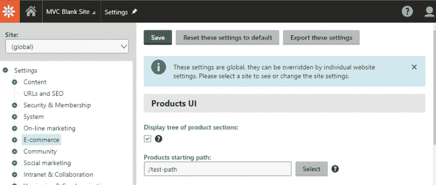
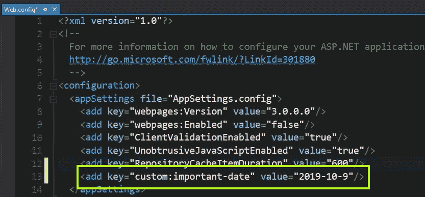
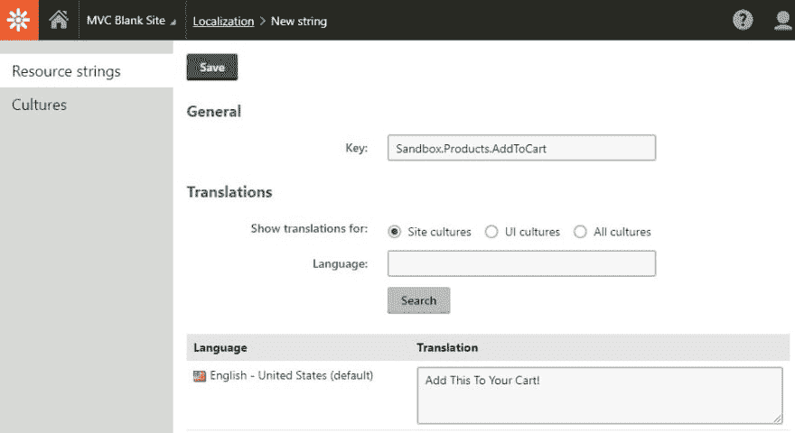
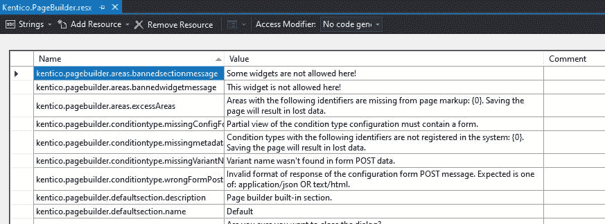
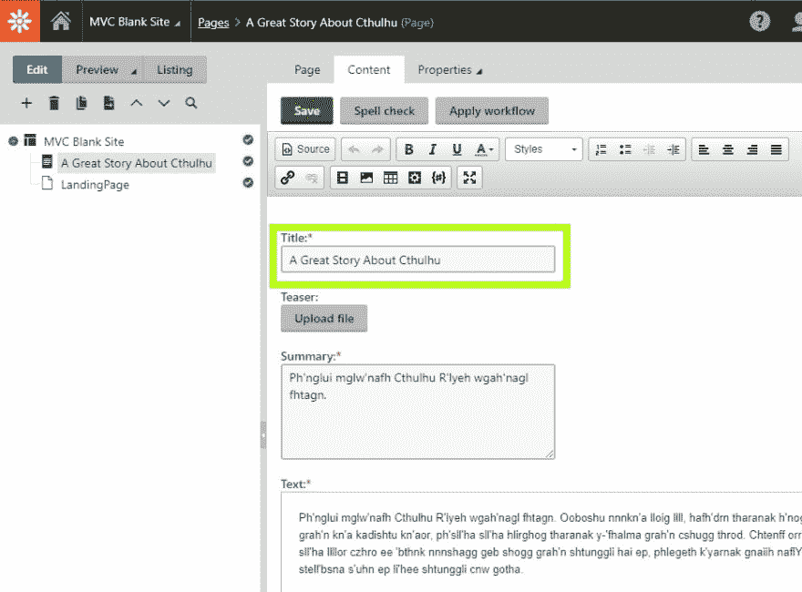
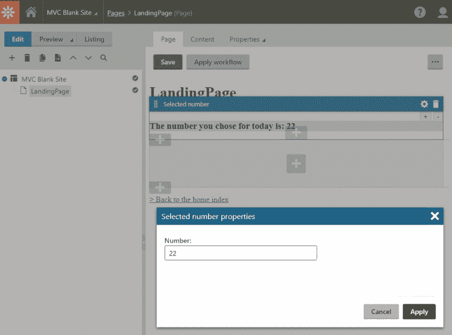

# Kentico 12:设计模式第 9 部分——在 Kentico 12 MVC 中存储内容的不同方式

> 原文：<https://dev.to/seangwright/kentico-12-design-patterns-part-9-the-different-ways-to-store-content-in-kentico-12-mvc-52je>

<figure>

[](https://res.cloudinary.com/practicaldev/image/fetch/s--oTKKi4Cz--/c_limit%2Cf_auto%2Cfl_progressive%2Cq_auto%2Cw_880/https://thepracticaldev.s3.amazonaws.com/i/9fkq74z9v0k8yox0uuk5.jpg)

<figcaption>Photo by [Ján Jakub Naništa](https://unsplash.com/@janjakubnanista) on [Unsplash](https://unsplash.com)</figcaption>

</figure>

在我们的 Kentico 12 MVC 应用程序中，有许多不同的方法来存储和显示内容——可能有无限多种！🤯

我想介绍一下我认为最流行和最有用的模式。我还想给出一些可能使用这些模式的示例场景，并提供每种模式的优缺点列表。

我们将从更简单的选项开始，以更新、更复杂、更灵活的选项结束。👌

## 内容存储模式

*   [硬编码](#hard-coded)
*   [应用程序设置或 Kentico 设置模块](#settings)
*   [资源(resx)文件或 Kentico 本地化模块](#resource)
*   [自定义表格或自定义模块类](#custom-table-module)
*   [自定义页面类型](#custom-page-type)
*   [`PageBuilder`功能性(章节/小部件)](#page-builder)

### 🔸硬编码！！🤘🎸🔥

我们可以将内容直接放入 C#代码或 Razor 视图文件中的变量或参数中。这些可以是单词、日期、URL 或其他任何东西。

#### 优点:

*   ✅无疑是最简单的方法。
*   ✅不需要数据库查询。
*   由源代码管理对✅进行版本控制。

#### 缺点:

*   ❌变更要求开发人员部署代码更新。
*   ❌没有为使用不同语言的访问者本地化。
*   ❌没有集成到文档工作流需求中。
*   ❌不保证内容是集中的-不同的值可以在整个网站上使用。

对于概念验证和模型，或者对于不需要本地化并且您知道很少会改变的内容，我只推荐采用这种方法。

如果我们首先需要使用 Kentico，那么我们就不会有太多符合这些要求的内容。👍

#### 举例:

```
// ProductController.cs

public ActionResult Index()
{
    string title = "Product Listing";

    return View(new { Title = title });
} 
```

<svg width="20px" height="20px" viewBox="0 0 24 24" class="highlight-action crayons-icon highlight-action--fullscreen-on"><title>Enter fullscreen mode</title></svg> <svg width="20px" height="20px" viewBox="0 0 24 24" class="highlight-action crayons-icon highlight-action--fullscreen-off"><title>Exit fullscreen mode</title></svg>

```
<!-- ~\Views\Product\Index.cshtml -->

<h1>@Model.Title</h1> 
```

<svg width="20px" height="20px" viewBox="0 0 24 24" class="highlight-action crayons-icon highlight-action--fullscreen-on"><title>Enter fullscreen mode</title></svg> <svg width="20px" height="20px" viewBox="0 0 24 24" class="highlight-action crayons-icon highlight-action--fullscreen-off"><title>Exit fullscreen mode</title></svg>

### 🔸应用程序设置或 Kentico 设置模块

我们可以使用`ConfigurationManager.AppSettings["key"]`或`SettingsKeyInfoProvider.GetValue("key")`来显示它。

#### 优点:

*   内容的✅集中存储。
*   ✅很容易更新(假设它在 Kentico 的设置表中)。
*   ✅与内容树中的特定页面或页面类型无关，这可能使它更加灵活。

#### 缺点:

*   ❌不可本地化为。NET 和 Kentico 不支持这些存储方法。
*   ❌不直观的显示在网站上的内容存储在设置中。
*   对于内容编辑来说，❌不是一个很好的编辑体验。
*   ❌没有集成到文档工作流需求中。
*   ❌没有版本控制(如果在 CMS 中完成)。

一般来说，我不建议在设置中存储公开显示的内容，但在一些情况下(不需要本地化，内容是用于技术用途的)，它可能会有用。

#### 举例:

```
// ProductController.cs

public ActionResult Index()
{
    string saleEndDateSettingValue = SettingsKeyInfoProvider.GetValue("Sale_End_Date");

    DateTime saleEndDate = DateTime.Parse(saleEndDateSettingValue);

    return View(new { SaleEndDate = saleEndDate });
} 
```

<svg width="20px" height="20px" viewBox="0 0 24 24" class="highlight-action crayons-icon highlight-action--fullscreen-on"><title>Enter fullscreen mode</title></svg> <svg width="20px" height="20px" viewBox="0 0 24 24" class="highlight-action crayons-icon highlight-action--fullscreen-off"><title>Exit fullscreen mode</title></svg>

```
<!-- ~\Views\Product\Index.cshtml -->

<h3>The current sale ends on 
    <span class="highlight">@Model.SaleEndDate.ToShortDateString()</span>
</h3> 
```

<svg width="20px" height="20px" viewBox="0 0 24 24" class="highlight-action crayons-icon highlight-action--fullscreen-on"><title>Enter fullscreen mode</title></svg> <svg width="20px" height="20px" viewBox="0 0 24 24" class="highlight-action crayons-icon highlight-action--fullscreen-off"><title>Exit fullscreen mode</title></svg>

<figure>

[](https://res.cloudinary.com/practicaldev/image/fetch/s--MXQVyP3D--/c_limit%2Cf_auto%2Cfl_progressive%2Cq_auto%2Cw_880/https://thepracticaldev.s3.amazonaws.com/i/0kq6kitk8c9kbz3jrcei.jpg)

<figcaption>Here is the Kentico Settings module where settings values can be stored.</figcaption>

</figure>

<figure>

[](https://res.cloudinary.com/practicaldev/image/fetch/s--wEclwIaP--/c_limit%2Cf_auto%2Cfl_progressive%2Cq_auto%2Cw_880/https://thepracticaldev.s3.amazonaws.com/i/cmuzgovby9k3lccr3rh9.jpg)

<figcaption>Here is the node in the MVC site web.config file where settings can be stored.</figcaption>

</figure>

### 🔸资源(。resx)文件或 Kentico 本地化模块

。NET 提供了从资源文件中存储和读取数据的方法。

Kentico 还通过各种方法提供对资源字符串的快速访问

*   `ResHelper.GetString("ResourceKey")`在 C#中
*   `@ResHelper.GetString("ResourceKey")`在剃刀看来
*   `"{$ResourceKey$}"`在属性中

> 你可以在 Kentico 的文档中阅读更多关于使用资源字符串的内容:[设置多语言用户界面](https://docs.kentico.com/k12sp/multilingual-websites/setting-up-a-multilingual-user-interface)

#### 优点:

*   ✅可以存储在 CMS 中，因此可由内容编辑人员进行编辑。
*   ✅ .NET 提供了本地化内容的机制，因此实现更简单。
*   ✅内容是集中的，这有助于保证一致性。

#### 缺点:

*   ❌如果存储在一个资源文件中，而不是 CMS 中，就需要开发人员来改变它。
*   ❌并不总是清楚显示的值是在哪里配置的。
*   ❌没有集成到文档工作流需求中。
*   ❌没有版本控制(如果在 CMS 中完成)。

资源文件和本地化模块非常适合需要翻译的不经常变化的内容，或者不应该硬编码的内容，因为这些内容在我们的网站中会重复使用。

即使我们只为一种语言编写内容，确保“登录”不会变成整个站点中的“登录”、“登录”、“登录”或“登录”，可以使这种模式有价值。😉

#### 举例:

```
<!-- Any .cshtml file -->

<button type="submit">@ResHelper.GetString("Sandbox.Products.AddToCart")</button> 
```

<svg width="20px" height="20px" viewBox="0 0 24 24" class="highlight-action crayons-icon highlight-action--fullscreen-on"><title>Enter fullscreen mode</title></svg> <svg width="20px" height="20px" viewBox="0 0 24 24" class="highlight-action crayons-icon highlight-action--fullscreen-off"><title>Exit fullscreen mode</title></svg>

<figure>

[](https://res.cloudinary.com/practicaldev/image/fetch/s--KYs1Wmkj--/c_limit%2Cf_auto%2Cfl_progressive%2Cq_auto%2Cw_880/https://thepracticaldev.s3.amazonaws.com/i/nh98n36vexl8c2q2qsng.jpg)

<figcaption>Here is the Kentico Locationlization module in the CMS where resource keys and values can be defined for different languages.</figcaption>

</figure>

<figure>

[](https://res.cloudinary.com/practicaldev/image/fetch/s--h_SLECt8--/c_limit%2Cf_auto%2Cfl_progressive%2Cq_auto%2Cw_880/https://thepracticaldev.s3.amazonaws.com/i/32uqw0m6ldv82w2mk5n7.jpg)

<figcaption>Here is a .resx file being edited in Visual Studio for centralized content / translation management for UI elements in the CMS.</figcaption>

</figure>

### 🔸自定义表格或自定义模块类

定制表和模块类与我们将要讨论的下一个选项非常相似，定制页面类型，但是没有所有与文档相关的功能。

没有内容树，没有文档版本或关系，只有表、行和 API 来访问数据。🤔

#### 优点:

*   ✅没有页面/文档的开销，所以它的伸缩性很好。
*   ✅灵活和自定义的数据库模式。
*   ✅强类型(自定义模块类)。
*   如果站点权限允许，内容编辑者可以编辑✅。
*   ✅ UX 可以设计为理想的编辑体验(自定义模块类)。

#### 缺点:

*   ❌没有版本控制或工作流。
*   ❌没有翻译。
*   ❌与特定页面/文档没有明显的联系。
*   ❌不清楚这些内容可能会出现在网站的什么地方。
*   ❌额外开发人员的努力，使内容编辑用户体验愉快。

从开发人员的角度来看，定制表和模块类之间的主要区别是强类型化——定制模块类有，定制表没有。

从内容编辑器的角度来看，它将进入用户界面来管理数据。定制表提供了现成的数据网格管理屏幕，但是它非常有限。定制模块类需要配置它们的 UI，但是在这方面更加强大和灵活。

定制表确实最适合批量数据，虽然它们很灵活，但并没有提供很好的开发人员工效学。

[自定义模块类](https://docs.kentico.com/k12sp/custom-development/creating-custom-modules)允许开发人员定义数据库表模式，并自动生成数据访问代码，以强类型方式检索、插入、更新和删除存储在该表中的数据。⚡

这些类还支持 CMS 中强大的 UI 构建功能，允许开发人员创建全新的 Kentico 特性和管理这些特性的屏幕。

我发现这些选项最常见的用例是在集成不需要存储在内容树文档中的外部数据时。

#### 示例-自定义表格:

```
// ProductController.cs

public ActionResult Detail(int productDataId)
{
    CustomTableItem item = CustomTableItemProvider
        .GetItem(productDataId, "Sandbox.ProductData");

    int inventory = item.GetValue<int>("WarehouseCount", 0);

    return View(new { Inventory = inventory });
} 
```

<svg width="20px" height="20px" viewBox="0 0 24 24" class="highlight-action crayons-icon highlight-action--fullscreen-on"><title>Enter fullscreen mode</title></svg> <svg width="20px" height="20px" viewBox="0 0 24 24" class="highlight-action crayons-icon highlight-action--fullscreen-off"><title>Exit fullscreen mode</title></svg>

```
<!-- ~\Views\Product\Detail.cshtml -->

<h3>We only have @Model.Inventory items left in stock</h3> 
```

<svg width="20px" height="20px" viewBox="0 0 24 24" class="highlight-action crayons-icon highlight-action--fullscreen-on"><title>Enter fullscreen mode</title></svg> <svg width="20px" height="20px" viewBox="0 0 24 24" class="highlight-action crayons-icon highlight-action--fullscreen-off"><title>Exit fullscreen mode</title></svg>

#### 示例-自定义模块类:

```
// ProductController.cs

public ActionResult Detail(int productDataId)
{
    WarehouseItem item = WarehouseItemProvider
        .GetWarehouseItem(productDataId);

    int inventory = item.Inventory;

    return View(new { Inventory = inventory });
} 
```

<svg width="20px" height="20px" viewBox="0 0 24 24" class="highlight-action crayons-icon highlight-action--fullscreen-on"><title>Enter fullscreen mode</title></svg> <svg width="20px" height="20px" viewBox="0 0 24 24" class="highlight-action crayons-icon highlight-action--fullscreen-off"><title>Exit fullscreen mode</title></svg>

```
<!-- ~\Views\Product\Detail.cshtml -->

<h3>We only have @Model.Inventory items left in stock</h3> 
```

<svg width="20px" height="20px" viewBox="0 0 24 24" class="highlight-action crayons-icon highlight-action--fullscreen-on"><title>Enter fullscreen mode</title></svg> <svg width="20px" height="20px" viewBox="0 0 24 24" class="highlight-action crayons-icon highlight-action--fullscreen-off"><title>Exit fullscreen mode</title></svg>

### 🔸自定义页面类型

创建带有字段的自定义页面类型来存储数据可能是最直观、最灵活的方法，也是最常用的方法。

这种方法从数据库中查询特定页面类型实例的数据，并将其字段值传递给 Razor 视图进行呈现。

这些页面类型实例构成了 CMS 页面模块内容树中存储的一些项目。

#### 优点:

*   ✅·肯蒂科的内容管理功能就是围绕这一模式构建的。
*   ✅内容关联清楚地链接到内容树中的特定页面实例。
*   使用 Kentico 自动生成的自定义页面类型代码，✅检索很容易。
*   ✅内容更改受文档工作流要求的约束。
*   ✅内容可以集中在一个地方(页面)，并在整个网站的许多不同视图中重用。
*   ✅内容编辑可以自己管理所有内容。

#### 缺点:

*   ❌需要一些架构和规划，因为新的类需要编译到 MVC 代码库中，页面类型字段配置需要深思熟虑。
*   ❌所有数据都存储在数据库中，因此在没有缓存或优化数据访问的情况下，性能可能会成为一个问题。
*   ❌很难使用页面类型字段来更改设计元素，即使这种方法可行，更改值对页面设计的影响对于内容管理者来说也是不直观的。

我们的大多数 Kentico 内容存储将使用自定义页面类型及其字段来执行。

页面类型层次结构限制和字段表单控件选择可以帮助开发人员确保内容在网站的生命周期内保持良好的组织。🤠

自定义页面类型是与传统门户引擎技术最相似的内容存储和显示模式。

#### 举例:

```
// Article.cs - the auto-generated custom Page Type code for an Article

public partial class Article : TreeNode
{
    [DatabaseField]
    public string ArticleTitle
    {
        get => ValidationHelper.GetString(GetValue("ArticleTitle"), @"");
        set => SetValue("ArticleTitle", value);
    }
}

// ArticleController.cs

public ActionResult Article(Guid nodeGuid)
{
    Article article = ArticleProvider
        .GetArticle(nodeGuid, "en-us", SiteContext.CurrentSiteName);

    return View(new { Title = article.ArticleTitle });
} 
```

<svg width="20px" height="20px" viewBox="0 0 24 24" class="highlight-action crayons-icon highlight-action--fullscreen-on"><title>Enter fullscreen mode</title></svg> <svg width="20px" height="20px" viewBox="0 0 24 24" class="highlight-action crayons-icon highlight-action--fullscreen-off"><title>Exit fullscreen mode</title></svg>

```
<!-- ~\Views\Article\Index.cshtml -->

<h1>@Model.Title</h1> 
```

<svg width="20px" height="20px" viewBox="0 0 24 24" class="highlight-action crayons-icon highlight-action--fullscreen-on"><title>Enter fullscreen mode</title></svg> <svg width="20px" height="20px" viewBox="0 0 24 24" class="highlight-action crayons-icon highlight-action--fullscreen-off"><title>Exit fullscreen mode</title></svg>

<figure>

[](https://res.cloudinary.com/practicaldev/image/fetch/s--8t-vPp87--/c_limit%2Cf_auto%2Cfl_progressive%2Cq_auto%2Cw_880/https://thepracticaldev.s3.amazonaws.com/i/4zoo7c65qa1v6dgqixs7.jpg)

<figcaption>Here is the content form shown in the CMS Pages module for editing the value associated with the ArticleTitle field above.</figcaption>

</figure>

### 🔸`PageBuilder`功能(部分/部件)

`PageBuilder`是最新的 Kentico 特性，用于在我们的网站上显示内容，是一个仅支持 MVC 的特性，不能与版本 12 之前的 Kentico 的 MVC 实现一起使用。

小部件和节允许内容编辑器将内容直接存储在`CMS_Document`表的`DocumentPageBuilderWidgets`列中，作为序列化的 JSON。🤓

内容编辑器使用一个漂亮的 UI，开发人员使用一个强大的 API，Kentico 处理 CMS UI 中的所有事情。

#### 优点:

*   ✅直接在页面内容流中提供复杂而灵敏的编辑界面。
*   ✅小部件的用户体验和功能可以完全由开发者定制。
*   ✅很容易看到内容的变化如何影响网页的设计和显示。
*   ✅内容更改受文档工作流要求的约束。
*   ✅内容编辑可以更改设计和布局，而不需要开发人员的支持。

#### 缺点:

*   ❌增加了创建、设计和集成`PageBuilder`组件(部件/部分)的复杂性。
*   ❌ [通过页面生成器小部件在 MVC 页面上添加和显示的文本不会被翻译服务处理，也不会包含在页面搜索索引中。](https://docs.kentico.com/k12sp/developing-websites/defining-website-content-structure/choosing-the-format-of-page-content)。
*   ❌内容编辑可以对布局和设计进行过多的控制。
*   ❌ [开发者(和 Kentico 社区)负责](https://devnet.kentico.com/marketplace)构建小部件的用户体验和功能，因为现有的小部件并不多(还没有!)!).
*   ❌的内容不能在网站的其他页面上重复使用——它直接绑定到添加小部件的特定页面。

`PageBuilder`新的热门 Kentico 技术是 Kentico 12 MVC 的特色吗？😎

它的目标是提供门户引擎站点在以前版本的 Kentico 中提供的一些功能。

如果内容编辑需要在布局中移动内容的能力，那么`PageBuilder`可能是一个不错的选择。

此外，如果在整个网站中有重复的 UX 模式(思考，号召行动按钮，英雄图像，两列文本段落)，并且这些模式需要在没有开发人员干预的情况下混合和匹配，那么`PageBuilder`可以帮助满足这些要求。

也就是说，考虑到以上缺点部分列出的限制，有些地方定制页面类型肯定是更好的选择(可重用内容是主要选择)。

#### 举例:

```
// From the "LearningKit" sample site

// NumberWidgetController.cs

public class NumberWidgetController : WidgetController<NumberWidgetProperties>
{
    // Default GET action used to retrieve the widget markup
    public ActionResult Index()
    {
        // Retrieves the properties as a strongly typed object
        NumberWidgetProperties properties = GetProperties();

        // Creates a new model and sets its value
        var model = new NumberWidgetViewModel
        {
            Number = properties.Number
        };

        return PartialView("Widgets/_NumberWidget", model);
    }
} 
```

<svg width="20px" height="20px" viewBox="0 0 24 24" class="highlight-action crayons-icon highlight-action--fullscreen-on"><title>Enter fullscreen mode</title></svg> <svg width="20px" height="20px" viewBox="0 0 24 24" class="highlight-action crayons-icon highlight-action--fullscreen-off"><title>Exit fullscreen mode</title></svg>

```
<!-- ~\Views\Shared\Widgets\_NumberWidget.cshtml -->

@model ComponentViewModel<NumberWidgetProperties>

<h3 style="background-color: #dddddd;">
    The number you chose for today is: @Model.Properties.Number</h3>

@if (Context.Kentico().PageBuilder().EditMode)
{
    Html.RenderPartial("InlineEditors/_NumberEditor", new NumberEditorModel
    {
        PropertyName = nameof(NumberWidgetProperties.Number),
        Number = Model.Properties.Number
    });
} 
```

<svg width="20px" height="20px" viewBox="0 0 24 24" class="highlight-action crayons-icon highlight-action--fullscreen-on"><title>Enter fullscreen mode</title></svg> <svg width="20px" height="20px" viewBox="0 0 24 24" class="highlight-action crayons-icon highlight-action--fullscreen-off"><title>Exit fullscreen mode</title></svg>

<figure>[](https://res.cloudinary.com/practicaldev/image/fetch/s--tj_I0DMi--/c_limit%2Cf_auto%2Cfl_progressive%2Cq_auto%2Cw_880/https://thepracticaldev.s3.amazonaws.com/i/d37l2emoa88a85sw7es9.jpg) 

<figcaption>这里是 CMS Pages 模块中显示的对话框，用于编辑上面 NumberWidget 局部视图显示的值。</figcaption>

</figure>

## 对比自定义页面类型和`PageBuilder`内容

Kentico 的文档有一个很棒的页面,可以帮助我们决定是使用自定义页面类型字段还是使用`PageBuilder`功能。🧐

我认为这两个选项在它们覆盖的用例方面都是灵活的，并且都可以在某种程度上进行定制。

我们可以向自定义页面类型添加字段，在 Razor 视图中切换设计和布局相关的值。

想象一个切换 CSS 中定义的`border`的复选框，或者一个改变部分标题的`font-size`的数字。🤔

我们可以从当前定制页面类型的一个字段中访问内容，在`PageBuilder`组件中为该字段配置一个小部件。

想象一个有自定义`Controller`的`PageBuilder`部分，它返回一个视图模型，当前页面的`DocumentName`作为一个`Title`属性。然后，section Razor 视图可以将内容呈现在节标记中某个位置。🤔

这里肯定有重叠，我认为，作为一个社区，我们将找出舒适的极限在哪里，甚至可能开发一些创造性的解决方案来推动这些极限或结合这两种模式。

根据经验，我会说从定制页面类型开始，对于单个或重复的内容项，在客户要求灵活性的情况下，使用`PageBuilder`功能增强内容编辑体验。

如果您正在从运行在先前版本的 Kentico 上的门户引擎站点过渡，那么比正常情况下更多的`PageBuilder`功能可能有助于简化内容编辑器的过渡，因为它“感觉”更像门户引擎。

## 总结

我们研究了在 Kentico 12 MVC 站点中存储内容的多种方式中的一些，以及每种方式的各种优点和缺点。

*   硬编码
*   存储在应用程序设置或 Kentico 的设置模块中
*   存储在资源文件或 Kentico 的本地化模块中
*   使用自定义表或自定义模块类
*   使用自定义页面类型及其字段
*   对部分和小部件使用`PageBuilder`功能

对于一般的内容存储来说，这些模式中最常见和最有用的是定制页面类型和`PageBuilder`组件，但是最好还有其他可用的选项。

Kentico 关于[内容存储结构和选项](https://docs.kentico.com/k12sp/developing-websites/defining-website-content-structure)的文档是一个很好的地方，可以阅读和深入了解这里涉及的所有内容的细节。

我一直在研究这些内容存储模式的有趣组合和使用案例，希望在未来与大家分享，但现在...

感谢阅读！🙏

* * *

如果您正在寻找更多的 Kentico 内容，请在 DEV:

## # [肯蒂科](https://dev.to/t/kentico) <button name="button" type="button" data-info="{&quot;className&quot;:&quot;Tag&quot;,&quot;style&quot;:&quot;full&quot;,&quot;id&quot;:5339,&quot;name&quot;:&quot;kentico&quot;}" class="crayons-btn follow-action-button whitespace-nowrap c-btn--secondary fs-base " aria-label="Follow tag: kentico" aria-pressed="false">跟随</button>

或者我的 Kentico 博客系列:

*   [Kentico 12:设计模式](https://dev.to/search?q=Kentico%2012%20-%20Design%20Patterns)
*   [Kentico CMS 快速提示](https://dev.to/search?q=Kentico%20CMS%20Quick%20Tip)