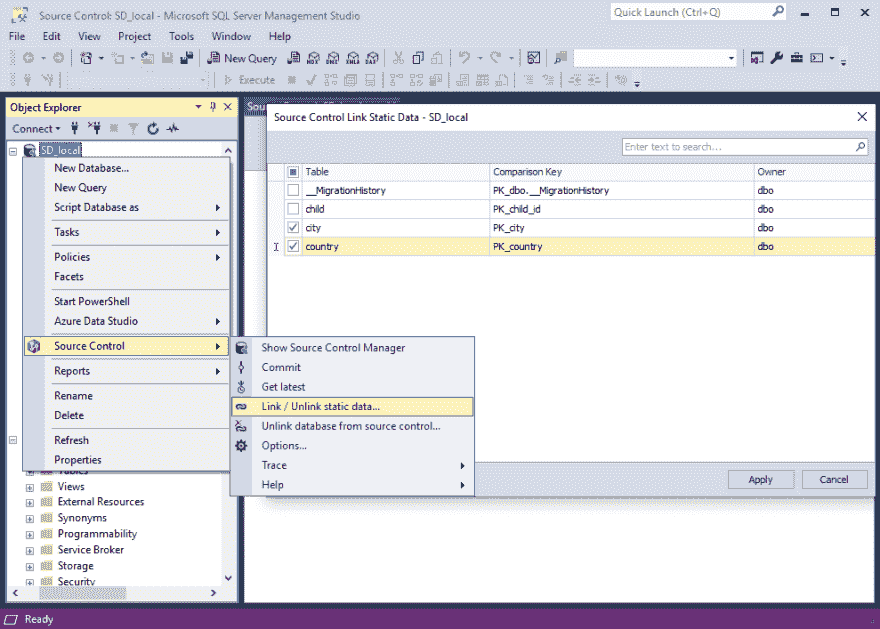

# dbForge 源代码控制现在允许静态数据的版本控制

> 原文：<https://dev.to/devartsoftware/dbforge-source-control-now-allows-version-controlling-of-static-data-klb>

*Devart 宣布发布其 MS SSMS 插件的新版本，用于轻松跟踪和部署变更，for SQL Server 源代码控制，v 2.0。*

专业数据库管理软件的公认供应商 Devart 发布了其 MS SSMS 插件的新版本，即用于 SQL Server 的[dbForge 源代码控制 v2.0。更新后的产品允许静态数据的版本控制，支持最新的 SQL Server 和 Microsoft SQL Server Management Studio 等。](https://www.devart.com/dbforge/sql/source-control/)

主要更新包括:

**静态数据控制** —允许跟踪表格静态数据的变化。特别是，客户可以:
——将静态数据链接到一个存储库；
-提交、恢复并获得对其静态数据的最新更改；
-处理静态数据冲突。
**跟踪支持** —帮助记录任何问题，并将请求发送给 Devart，以便更快地进行调查。
**支持 MS SSMS 2018** —与最新的 Microsoft SQL Server Management Studio 2018 完全兼容和集成。
**对最新 SQL Server 2019 的连接支持**

**dbForge 源代码控制**是一个方便的 SSMS 插件，用于流行版本控制系统中的 SQL Server 数据库变更管理，包括 Git(包括 GitHub)、TFS、SVN、Mercurial。点击链接了解其更多功能—【https://www.devart.com/dbforge/sql/source-control/ T2】

**关于德瓦特**

Devart 是数据库工具和管理软件、ALM 解决方案、各种数据库服务器的数据提供商、数据集成和备份解决方案的领先开发商之一。该公司还实施网络和移动开发项目。
欲了解更多关于德瓦特的信息，请访问[https://www.devart.com/](https://www.devart.com/)