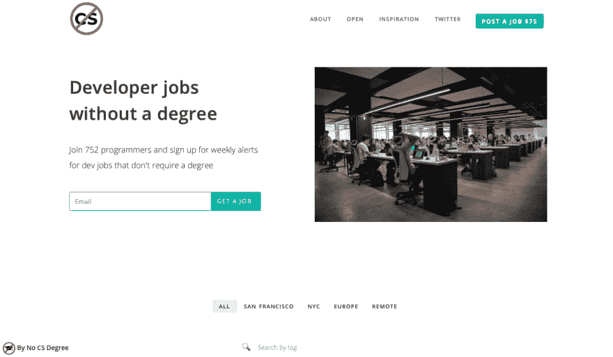
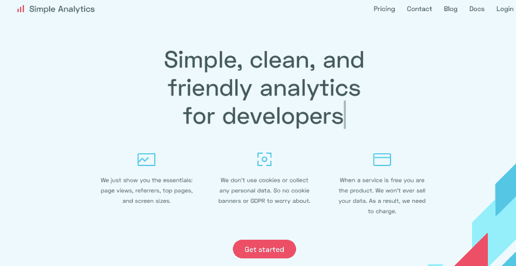

# 这位开发人员如何在没有计算机科学学位的情况下开发隐私分析 web 应用程序

> 原文：<https://dev.to/petecodes/how-this-developer-made-a-privacy-analytics-web-app-without-a-cs-degree-584h>

我很高兴采访了阿德里安·范·罗森(Adriaan van Rossum)(T1)，他开发了[简单分析(Simple Analytics)](https://simpleanalytics.com/?ref=nocsdegree.com)，这是一款专注于隐私的分析工具，不会跟踪访问你网站的人的个人数据。我对这个网站使用简单的分析，所以听到他如何在没有学位的情况下学习编程，黑进他的学校考试系统，并挑战谷歌，真是太棒了。

## 所以我爱简单分析！你到底是如何着手制作它的？

我从 15 岁开始写代码。这是一个你可以窃取 Internet Explorer 用户的剪贴板并保存到你自己的数据库中的时代。作为一名开发者，你比普通互联网用户更清楚你能用浏览器做什么。那也是我开始对隐私感兴趣的时候。

一年前，我和我的女朋友在西班牙特内里费岛。我在那里远程为一个客户做自由职业。因为你不能连续工作 8 小时，你需要休息，在这些休息时间里，我通常会有很多关于新产品的想法。这一次，我漫无边际地谈论谷歌通过他们的分析脚本收集的大量数据。当我意识到大多数人只是盲目地将那个脚本添加到他们的网站上时，我几乎要生气了。我向我的女朋友发泄，说这可能是一个攻击谷歌老大哥的好开始。击败谷歌搜索是我多年来的梦想，但我也知道我应该从更小众的东西开始。

我记得 Pieter Levels 在 [WIP Telegram group](https://www.wip.chat) 中预测简单的分析会失败。这是你开始的时候所期望的吗？

我还记得皮特.里维斯说过。他说这可能是 WIP 中最大的一项。如果是这样的话，我将不胜荣幸。在那之前，我会确保尽我所能创造一个令人惊叹的企业。有趣的是，这更像是一个数字游戏，而不是一个目标。我认为这永远不会结束，但我的第一个最大目标将是 7 万美元(税后每月 2500 欧元)。这个数目让我可以舒适地生活，而不用担心下一份自由职业。

## [没有 CS OK——没有学位的开发者的工作板](https://nocsok.com)

## 我知道你没有 CS 学位。你的背景是什么？

如果你问我的朋友，他们会笑我的学习。我很难找到合适的课程来学习。当我开始我的第一个学位，工业产品设计，我搬到了海牙，在那里我住了 2 年。在这个课程之后，我学了多媒体设计，信息和多媒体管理，以及媒体信息和传播。从技术上来说，我完成了更多的课程，但这是为了获得免费的公共交通和政府贷款。如果你参加非全日制学习，你就没有这些额外津贴，但是第二个课程是免费的。所以我确实是半工半读结合全日制学习。

当我在学习的时候，我确实建立了很多网站，开了一些公司，并试图以尽可能少的努力通过考试。通常学习一个晚上，直到考试，效果最好。第二天你会忘记你所学的一切，但这足以通过你的考试。

## **想要一份开发人员的工作却没有学位？通过 [Triple Byte 的测验](https://triplebyte.com/a/Ww4mbM6/d)，直接进入顶级科技公司的最终现场面试**

## 你到底是怎么开始编码的，为什么？

由于我从 15 岁就开始编程，我不需要在学校或大学学习任何编程就能有效地工作。我的第一个网站是我高中同学的网站。每次我们考试时，都会给班上的每个人发一份试卷。许多班级参加同样的考试。第一个参加考试的班级会把考试上传到我的网站上，其他班级可以知道那个特定考试的答案。几个月后，我不得不向学校董事会解释，并关闭了网站。

## 没有 CS 学位的你是怎么学会编程的？你是否使用过 Udemy 或其他课程提供商，或者只是在网上搜索你的问题的答案？

我从 2004 年开始，那时还没有 Udemy 之类的东西。那是你用 iframes 创建网站页脚和页眉的时候。我使用了 PHP 文档和我那些热衷于计算机编程的兄弟们的知识。那一刻我才明白我需要什么。我记得我哥哥说过:“你应该学习数组”，这是我现在非常熟悉的东西，但在那些日子里，这是下一步要学习的东西。只要弄清楚你需要构建什么，并学习完成这些事情(不一定要编码)。

所以很明显，荷兰有一些真正成功的制造商，他们没有 CS 学位，比如 Pieter Levels of Nomad List，Marc Kohlbrugge of Beta List 和 WIP，还有你自己！为什么你认为你的国家擅长培养自学成才的独立制作人，或者只是随机的？

我可以谈谈我们的文化是如何允许我们犯错误的。但是我认为无论我在这里说什么都是不公平或不现实的。我只能说一些与我自己背景相关的事情，我的父母总是说我应该做我喜欢的事情。他们从未督促我去学习或工作。他们让我自己决定，对我来说，这是探索我创业精神的最好方式。

## 除了从事简单的分析工作，你还从事承包工作吗？

只要我没有达到我的 70.000 美元的 ARR，我将需要做一些合同。现在一周一天就够了，以后会越来越少。因此，有足够的时间专注于简单的分析，并使其成为网站所有者的最佳和最隐私友好的分析工具。

## 阿德里安，谢谢你的采访！你可以看看他的[推特](https://twitter.com/AdriaanvRossum)，当然一定要试试[简单分析](https://simpleanalytics.com/?ref=nocsdegree.com)！