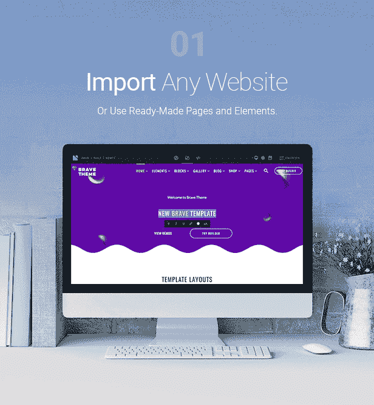
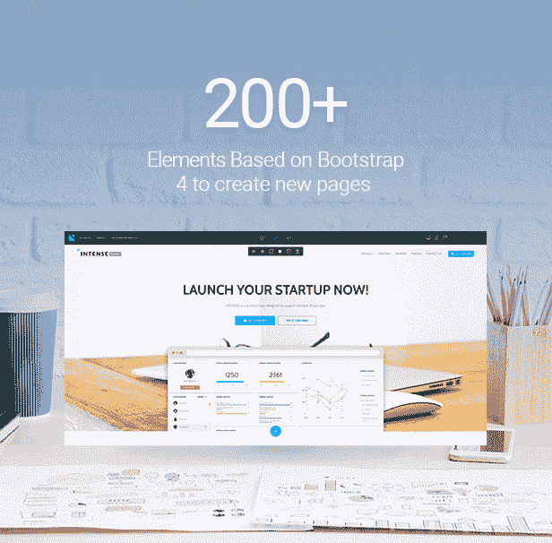

# Novi 工具:值得关注的 HTML 可视化编辑器？

> 原文：<https://dev.to/templatemonster/novi-tool-html-visual-editor-worth-attention-43la>

嗯，今天我要和你分享，在我看来，这件事会让你的生活变得更容易。

我给你介绍一下 *Novi Builder* 。所以在这篇文章中，我将分享我自己使用 [Novi 会员资格](https://novibuilder.com/?aff=devto)的经验，并尝试揭示它的所有优点和缺点。

# Novi Builder 是什么？

基本上，Novi Builder 是一个 HTML 拖放生成器。

正如你已经猜到的，这个工具旨在帮助你不用编码就能建立一个网站，这真的很酷。从我自己使用 Novi 会员的经验来看，我可以告诉你，这并不意味着你**不用编码就能建立一个功能齐全的网站**。

然而，这个工具确实使创建网站的过程更加容易和快捷。此外，拖放式构建器并不是 Novi 的全部功能。

# Novi 会员到底能得到什么？

Novi Builder 会员资格**不仅仅是一个可视化编辑器**。
除了拖放构建器本身，您还将获得:

*   大量免费的 HTML 模板；
*   一些基本的必备插件(比如社交插件、联系人表单、倒计时、滑块、谷歌地图)。

嗯，我确实认为这是一个相当不错的赠品，因为创建一个带有模板的网站也会节省你大量的时间，而且我想不出一个网站没有一些漂亮的插件。拥有 Novi 会员资格，您将可以免费获得这一切。

就我个人而言，我真的很喜欢使用这项服务提供给我的免费网站模板。所有的模板都设计精美，看起来很专业。

所以这肯定是这项服务的一大优势。

# Novi Builder 特性

在我看来，Novi Builder 提供了一组非常好的特性。例如，其功能包括:

1.  页面管理器
2.  页面设置
3.  设计模式
4.  预览模式
5.  编辑方式
6.  展示工具
7.  配置(图层工具)
8.  内容编辑器(基本工具)
9.  文字编辑器
10.  拖放工具
11.  代码编辑器。

您可以在这里找到更多关于 [Novi Builder 特性以及如何使用它们的信息](https://novibuilder.com/documentation/pages/features.html?aff=devto)。

我个人最喜欢拖放工具、代码编辑器和超级易用的编辑模式。

# 诺维价格

第一个计划是**启动，每年仅花费 29 美元**。通过该计划，您将获得:

*   Novi HTML 可视化编辑器；
*   Novi 插件；
*   开发者支持；
*   30 天退款保证；
*   多用途 HTML 模板；
*   免费更新。

Novi 会员提供的下一个定价计划是**提前到每年 49 美元**。该定价计划将为您提供:

*   Novi 可视化 HTML 编辑器；
*   Novi 插件；
*   不限项目；
*   开发者支持；
*   30 天退款保证；
*   超过 20 个 HTML 模板；
*   免费更新。

而最后一个定价方案，**开发者，是最贵的一个，需要 149 美元**。然而，这个计划可能是最有益的，因为你只需支付 149 美元，就可以永远使用这项服务。该计划将使您具备:

*   终身访问 Novi 可视化 HTML 编辑器；
*   终身访问 Novi 插件；
*   终身无限项目；
*   终身开发者支持；
*   30 天退款保证；
*   终身访问所有 Novi 模板；
*   终身免费更新。#文档

Novi Builder 会员资格带有清晰易懂的文档，即使对于没有经验的用户也是如此。

[Novi Builder 文档](https://novibuilder.com/documentation/pages/features.html?aff=devto)提供了关于产品、其功能以及使用方法的所有必要信息。

此外，还有一个非常酷的视频，直观地展示了如何安装和使用该工具。

除此之外，还有很多关于 Novi Builder 特性和插件的概述，所以我认为你不会有任何问题。嗯，我没有任何问题是我自己无法解决的，所以我敢说你也不会有任何问题。

# Novi Builder 社区

除了上面提到的，Novi Builder 还有一个友好的脸书社区。在这个脸书小组中，其他用户分享了他们的 Novi 会员经验，以及如何充分利用它的一些提示和技巧。我认为这些社区真的很有帮助，尤其是对初学者来说，因为你可以在那里寻求建议或者只是阅读其他开发者关于网站建设的帖子。所以 Novi Builder 有一个真的很棒。

# 最后的想法

是否成为 Novi 会员完全是你的决定。我刚刚决定告诉你这件事，因为我对它的体验是(现在仍然是)棒极了。

那么，下一个测试的是谁呢？:D