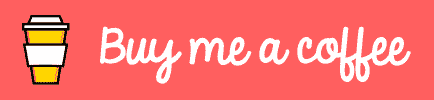

# 反应:用生命周期方法解释使用效果

> 原文：<https://dev.to/prototyp/react-useeffect-explained-with-lifecycle-methods-296n>

React 的`useEffect`钩子结合了`componentDidMount`、`componentDidUpdate`和`componentWillUnmount`生命周期方法。这非常有用，原因如下:它减少了代码量，简化了代码，并允许在单个组件中调用多个`useEffect`钩子。

你可以在这里阅读更多关于`useEffect`钩子的内容: [React docs](https://reactjs.org/docs/hooks-effect.html)

有时，我们希望只运行其中一个生命周期方法。下面的备忘单将帮助你达到你所期待的效果。

## componentidmount 当量

为了让这个钩子只运行一次(当一个组件被挂载时)，我们需要设置一个空数组作为钩子依赖。

```
useEffect(() => {
  /* ComponentDidMount code */
}, []); 
```

<svg width="20px" height="20px" viewBox="0 0 24 24" class="highlight-action crayons-icon highlight-action--fullscreen-on"><title>Enter fullscreen mode</title></svg> <svg width="20px" height="20px" viewBox="0 0 24 24" class="highlight-action crayons-icon highlight-action--fullscreen-off"><title>Exit fullscreen mode</title></svg>

## componentDidUpdate 等价

为了让这个钩子在组件更新时运行(这包括挂载)，我们需要设置至少一个变量作为钩子的依赖(在本例中是`var1`和`var2`)。

```
useEffect(() => {
  /* componentDidUpdate code */
}, [var1, var2]); 
```

<svg width="20px" height="20px" viewBox="0 0 24 24" class="highlight-action crayons-icon highlight-action--fullscreen-on"><title>Enter fullscreen mode</title></svg> <svg width="20px" height="20px" viewBox="0 0 24 24" class="highlight-action crayons-icon highlight-action--fullscreen-off"><title>Exit fullscreen mode</title></svg>

## 组件将卸载等效

为了让这个钩子在组件卸载时运行，我们需要从钩子返回一个函数。如果我们希望清理功能只在组件被卸载时运行，我们需要设置一个空数组。如果我们在依赖数组中设置了一个或多个变量，清理将在每次重新渲染时运行。

```
useEffect(() => {
  return () => {
   /* componentWillUnmount code */
  }
}, []); 
```

<svg width="20px" height="20px" viewBox="0 0 24 24" class="highlight-action crayons-icon highlight-action--fullscreen-on"><title>Enter fullscreen mode</title></svg> <svg width="20px" height="20px" viewBox="0 0 24 24" class="highlight-action crayons-icon highlight-action--fullscreen-off"><title>Exit fullscreen mode</title></svg>

## 三者总和

```
useEffect(() => {

  /* componentDidMount code + componentDidUpdate code */

  return () => {
   /* componentWillUnmount code */
  }
}, [var1, var2]); 
```

<svg width="20px" height="20px" viewBox="0 0 24 24" class="highlight-action crayons-icon highlight-action--fullscreen-on"><title>Enter fullscreen mode</title></svg> <svg width="20px" height="20px" viewBox="0 0 24 24" class="highlight-action crayons-icon highlight-action--fullscreen-off"><title>Exit fullscreen mode</title></svg>

* * *

这些文章以咖啡为燃料。所以，如果你喜欢我的工作，觉得它很有用，请考虑给我买杯咖啡吧！我真的很感激。

[](https://www.buymeacoffee.com/ubnZ8GgDJ)

感谢你花时间阅读这篇文章。如果你觉得这很有用，请给它一个❤️或🦄，分享评论。