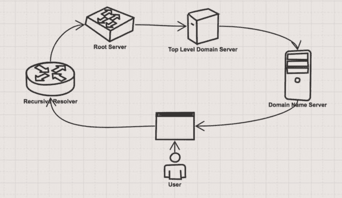

# 当你在 www.xyz.com 打字时会发生什么

> 原文：<https://dev.to/veebuv/what-happens-when-you-type-in-www-xyz-com-j4p>

### 域名系统是如何工作的？

互联网是如何知道该给你什么，如何给你你的网站？

这篇博客相对来说比大多数博客都要短，因为它解释起来很简单，考虑到一些步骤将被跳过，只解释主要的必要逻辑点！

我们走吧！🚀

旁注:看一下图表，这应该会简化你的事情😀

### 当你在浏览器中输入 www.xyz.com 的 T2 时，会发生什么？

您设置一个“查询”或问题发送到服务器。您的查询遇到的第一个服务器称为递归解析器，它通常由您的互联网服务提供商(沃达丰、Telstra)运营。递归解析器知道要问哪个其他 DNS 服务器或域名系统服务器“什么是 [www.xyz.com"](http://www.xyz.com%E2%80%9D) 的 IP”这个原始问题——IP 代表互联网协议，把它想象成一个地址，或者也许像你的电话号码。

递归解析器与之对话的第一个 DNS 服务器是根服务器，它是运行在世界各地的服务器，拥有顶级域名的信息，如。所以递归解析器向根服务器请求关于. com 的 DNS 信息——注意有 1000 个服务器支持根，DNS 的工作是快速找到你的查询的答案！

顶级域名 DNS 服务器存储有关二级域名的信息。com 服务器存储有关 xyz.com 的信息。也就是说，TLD 的 DNS 服务器用域名服务器的 IP 地址来回应，这给了我们下一个线索！

递归解析器然后获取这个 IP 并向域名服务器发送查询，这个 DNS 服务器知道我们网站的 IP 地址[www.xyz.com](http://www.xyz.com)，并向递归解析器返回我们网站的 IP 地址。

做完这一切后，网站出现在我们的浏览器中，瞧，完成了！
PS 这一切都发生在瞬间！

编程没有什么神奇的。除了 CSS...