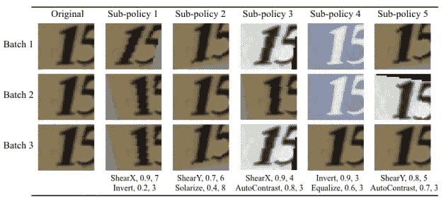
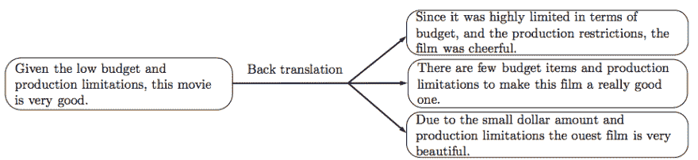
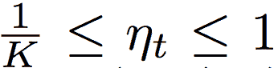
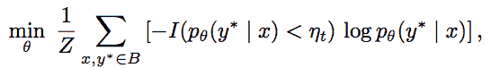
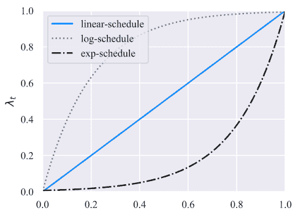

# 无监督数据扩充

> 原文：<https://dev.to/makcedward/unsupervised-data-augmentation-3ico>

 

<figcaption>照片由上[下](https://unsplash.com/?utm_source=medium&utm_medium=referral)</figcaption>

#### 一看数据增强| [走向人工智能](https://towardsai.net)

我们拥有的数据越多，我们能够实现的性能就越好。然而，注释大量的训练数据是非常奢侈的。因此，适当的数据扩充有助于提高模型性能。[无监督数据增强](https://arxiv.org/pdf/1904.12848.pdf)(谢等，2019)的作者提出无监督数据增强(UDA)帮助我们通过利用几种数据增强方法来建立更好的模型。

> 在自然语言处理领域，由于语言的高度复杂性，对文本进行扩充是非常困难的。不是每一个词我们都可以用其他词来代替，比如 a，an，the。另外，不是每个单词都有同义词。即使改变一个单词，上下文也会完全不同。另一方面，在计算机视觉领域生成增强图像相对容易。即使引入噪声或裁剪掉图像的一部分，模型仍然可以对图像进行分类。

谢等对图像分类(自动增强)和文本分类(基于和 TF-IDF 的单词替换)进行了多次数据增强实验。在生成足够大的模型训练数据集后，作者注意到模型很容易过度拟合。因此，他们引入训练信号退火(TSA)来克服它。

### 增强策略

本节将介绍计算机视觉(CV)和自然语言处理(NLP)领域中的三种数据增强。

#### 图像分类的自动增强

自动增强是谷歌在 2018 年发现的。这是一种自动增强图像的方法。与传统的图像增强库不同，AutoAugment 旨在找到自动操作数据的最佳策略。

你可以访问[这里](https://github.com/tensorflow/models/tree/master/research/autoaugment)的模型和实现。

 

<figcaption>自动增强生成的结果(Cubuk et al .，2018)</figcaption>

#### 反向翻译用于文本分类

反向翻译是一种利用翻译系统生成数据的方法。假设我们有一个将英语翻译成粤语的模型，反之亦然。可以通过将原始数据从英语翻译成粤语，然后再翻译回英语来检索扩充数据。

> [Sennrich et al. (2015)](https://arxiv.org/pdf/1511.06709.pdf) 使用反向翻译方法生成更多的训练数据来提高翻译模型的性能。

 

<figcaption>【例子】(谢等，2019)</figcaption>

#### 基于 TF-IDF 的文本分类单词替换

虽然反向翻译有助于生成大量数据，但不能保证关键字在翻译后会被保留。一些关键字比其他关键字携带更多的信息，翻译后可能会被遗漏。

因此，谢等人使用 [TF-IDF](https://towardsdatascience.com/3-basic-approaches-in-bag-of-words-which-are-better-than-word-embeddings-c2cbc7398016) 来解决这一限制。TF-IDF 的概念是高频可能不能提供太多的信息增益。换句话说，稀有词对模型贡献了更多的权重。如果在同一文档(即培训记录)中出现的次数增加，单词的重要性将增加。另一方面，如果它出现在语料库(即其他训练记录)中，它将被减少。

IDF 分数由 DBPedia 语料库计算。将为每个令牌计算 TF-IDF 分数，并根据 TF-IDF 分数替换它。TF-IDF 分数低的会有很大概率被换下。

如果您对使用基于 TF-IDF 的单词替换进行数据扩充感兴趣，您可以访问 [nlpaug](https://github.com/makcedward/nlpaug) 了解 python 实现。

### 训练信号退火(TSA)

在使用上述技巧生成大量数据后，谢等人注意到该模型容易过拟合。因此，他们引入了 TSA。在模型训练期间，具有高置信度的样本将从损失函数中移除，以防止过度训练。

下图显示了ηt 的取值范围，而 K 是类别数。如果概率高于ηt，它将从损失函数中移除。

 

<figcaption>去除高概率门槛的例子(谢等，2019)</figcaption>

 

<figcaption>TSA 的目标函数(谢等，2019)</figcaption>

3ηt 的计算考虑了不同的场景。

*   线性时间表:持续增长
*   Log-schedule:训练初期成长较快。
*   Exp-schedule:在训练结束时成长更快。

 

<figcaption>三个赛程中间训练流程(谢等，2019)</figcaption>

### 推荐

*   上述方法旨在解决作者在他们的问题中所面临的问题。如果你了解你的数据，你应该量身定做增强方法。请记住，数据科学的黄金法则是垃圾进垃圾出。

### 喜欢学习？

我是湾区的数据科学家。专注于数据科学、人工智能，尤其是 NLP 和平台相关领域的最新发展。在 [LinkedIn](https://www.linkedin.com/in/edwardma1026) 或 [Github](https://github.com/makcedward) 上随时联系 [me](https://makcedward.github.io/) 。

### 延伸阅读

*   [自然语言处理中的数据扩充](https://towardsdatascience.com/data-augmentation-in-nlp-2801a34dfc28)
*   [文本的数据扩充](https://towardsdatascience.com/data-augmentation-library-for-text-9661736b13ff)
*   [音频数据增强](https://dev.to/makcedward/data-augmentation-for-audio-5fii)
*   [声谱图数据增强](https://dev.to/makcedward/data-augmentation-for-speech-recognition-bfc)
*   你的自然语言处理模型能够防止恶意攻击吗？
*   [非官方自动增强实现](https://github.com/DeepVoltaire/AutoAugment)

### 引用

*   R.森里奇，b .哈多和一棵桦树。[用单语数据改进神经机器翻译模型](https://arxiv.org/pdf/1511.06709.pdf)。2015
*   E.D. Cubuk、B. Zoph、D. Mane、V. Vasudevan 和 Q. V. Le。自动增强:从数据中学习增强策略。2018
*   谢，戴，贺维，梁明堂，乐庆伟。[无监督数据增强](https://arxiv.org/pdf/1904.12848.pdf)。2019

* * *