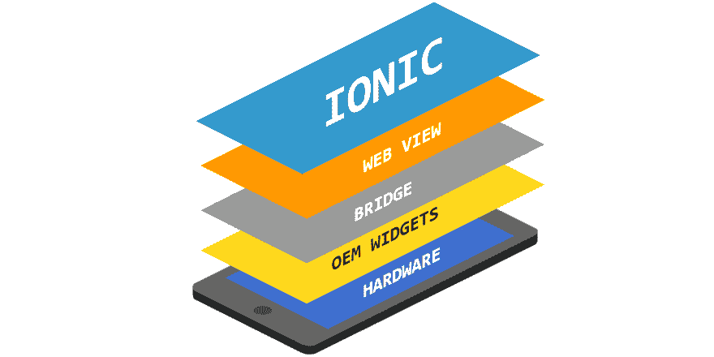
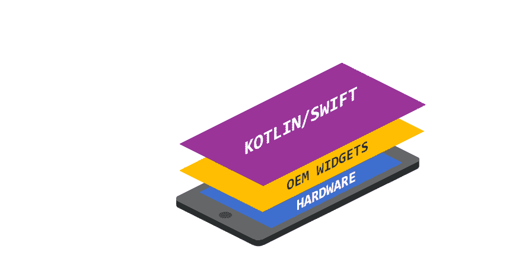
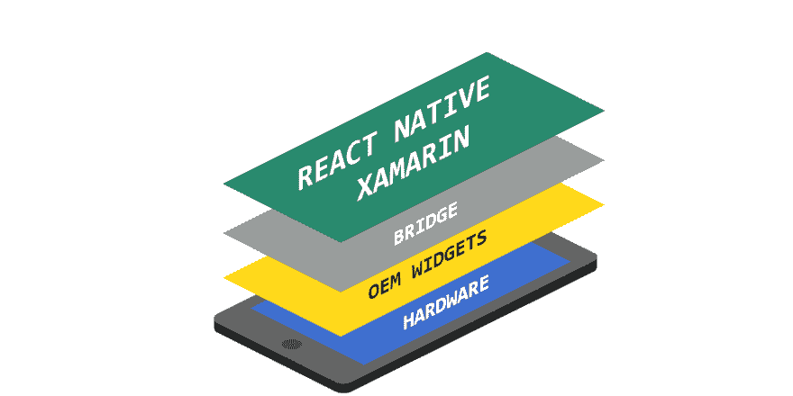

# 颤振，反应原生，离子和原生平台:视觉指南

> 原文：<https://dev.to/rubensdemelo/flutter-react-native-ionic-and-native-platform-a-visual-guide-2ff8>

跨平台开发还有另一个大玩家:Flutter，这是谷歌的工具包，允许我们为 iOS 和 Android(很快也会为桌面和网络)创建应用程序。

构建移动应用是一项挑战。尤其是因为我们需要针对两个不同的平台。与 web 不同，HTML、CSS 和 JS 的目标是在每种浏览器中工作(不管设备的大小)，iOS 和 Android 平台有自己的环境(语言、工具、方法等)。

一些跨平台工具，如 React Native、Ionic 和 Flutter，来帮助我们构建一次并在两个平台上部署。

在这篇文章中，我将向你展示一个直观的指南来说明它们之间的区别。我们开始吧！

**离子**

就像做梦一样，用 HTML，CSS，JS 写代码，部署到 iOS，Android。这个应用程序是一个网站。为了实现这一点，Ionic、Cordova 和 PhoneGap 等工具使用 WebView 来呈现代码。但是有一个瓶颈:性能。如果应用程序需要访问硬件服务(全球定位系统，传感器等)，它需要通过一个著名的桥梁。但是如果你的应用不需要这些服务，这项技术应该在你的雷达上。

**原生平台**

你的代码(kotlin/swift)直接与平台交互。如果你需要一个按钮，平台提供了那个按钮。接触摄像头吗？也不用担心。这是移动开发的最佳选择！但是你不能一次编码就部署到两个平台上。你需要写一个 app 给 iOS，其他给 Android，这就使得这个选择成本很高。

**React Native**

由脸书提供支持的工具是迄今为止跨平台开发最受欢迎的选择。它有一个庞大的社区，被许多公司广泛使用，使用 Javascript。如果你是一个前端开发者，React Native 确实提供了一个构建高质量移动应用的好方法。但是对于硬件服务和本地组件(按钮、文本字段),它广泛地使用了桥，这会带来一些性能问题，尤其是对于动画。

**Flutter**

跨平台开发最年轻的选择(由 Google 提供)，有一个奇特的方面:它使用 Dart 语言(也由 Google 提供)，这使得代码能够被编译(AOT)到 arm/x86，这是直接在硬件上运行的(如果你需要一个按钮，Flutter 在屏幕上绘制它，如果你需要与硬件交互，Flutter 提供一个插件)。它的知识库中有 71k 多颗恒星，逐渐被大公司(阿里巴巴、腾讯、宝马)采用。它有一些弱点，如 7k+问题和您必须学习 Dart 的事实(但如果您了解 JS、Java 或任何 C 风格的语言，这没有意义)。

* * *

我希望你现在知道每个选项之间的区别，并且更清楚地选择一个来学习或者在你的下一个项目中使用。