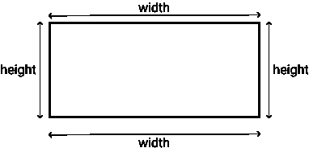

# 用 Getters 和 Setters 在 JS 中实施规则

> 原文：<https://dev.to/gksander/enforcing-rules-in-js-with-getters-and-setters-1plk>

## TL；速度三角形定位法(dead reckoning)

JavaScript Getters 和 Setters 可用于提供自定义对象属性和实施业务规则。参见示例[此处](https://codesandbox.io/embed/special-rectangle-3p1lx)，或下面的嵌入。

[https://codesandbox.io/embed/special-rectangle-3p1lx](https://codesandbox.io/embed/special-rectangle-3p1lx)

## 简介

大多数生产应用程序都有*至少*几个“业务规则”(通常情况下，*有很多*)。在客户端应用程序中实施这些规则可能很有挑战性，而且有些乏味。我想介绍一种使用 JS getters 和 setters 来执行这些规则的方法。

## 我们将建造什么

为了演示这个想法，我创建了一个非常简单的应用程序，它围绕着“特殊矩形”(我刚刚编造了这个短语)。在这种情况下,“特殊矩形”是一个总是具有相同周长(或其外部周围的距离)的矩形。因此，如果矩形的宽度增加，高度必须相应缩小。看看上面的嵌入，感受一下矩形的行为。

## getter 和 Setters

Getters 和 Setters(也称为“访问器”)允许我们定义自定义的对象属性行为。

### 吸杂

MDN 以下面的方式定义了“getter ”:

> `get`语法将一个对象属性绑定到一个函数，当查找该属性时将调用该函数。

基本上，这允许您在对象上创建一个“自定义”可读属性。这里有一个非常简单的例子:

```
const obj = {
  x: 7,
  // Double the value of x
  get doubleX() {
    return 2*this.x;
  }
};

console.log(obj.doubleX); // -> 14

obj.x = 12.3;
console.log(obj.doubleX); // -> 23.6 
```

Getters 允许我们轻松地创建“计算”属性。这太棒了——在上面的例子中，每当你更新`obj.x`时，`obj.doubleX`就会相应地“更新”——而且你永远不必手动更新。

**注意**:getter 只影响*访问*一个属性。也就是说，我们可以读取`obj.doubleX`，但是此时，试图设置这个属性的值不会像您预期的那样起作用。

### 设定者

MDN 以下列方式定义 setter:

> set 语法将对象属性绑定到试图设置该属性时要调用的函数。

现在，我们不提供属性被读取时的行为，而是提供属性被设置时的行为。让我们调整一下我们之前的例子:

```
const obj = {
  x: 7,

  // Double the value of x
  get doubleX() {
    return 2*this.x;
  },

  // Setting doubleX: x will be *half* of the value
  set doubleX(val) {
    this.x = val/2;
  }
};

console.log(obj.doubleX); // -> 14

obj.doubleX = 70;
console.log(obj.x); // -> 35 
```

这真是很酷的东西！我们可以创建自定义属性，而不必跟踪过多的值。这对于添加自定义/计算属性非常有用，但对于实施业务规则也非常有用！

我喜欢在 setters 内部执行业务规则。这样，您可以编写一次规则，然后像平常一样设置属性。让我们来看一个例子。

## 举例:周长固定的矩形

### 一点点擦伤的工作

在我们开始写代码之前，让我们确保理解我们的问题空间。我们希望制作一个周长固定的矩形，当矩形的宽度或高度改变时，另一个维度也会随之改变。请记住，对于任何矩形，

```
(2 * width) + (2 * height) = perimeter 
```

作为参考，这里有一个图表，展示了矩形的宽度、高度和周长之间的关系。

[](https://res.cloudinary.com/practicaldev/image/fetch/s--JE5W-b_f--/c_limit%2Cf_auto%2Cfl_progressive%2Cq_auto%2Cw_880/https://thepracticaldev.s3.amazonaws.com/i/38qe9jxi3wkh3p1pcg3r.png)

如果我们去掉矩形的两条“宽”边，就剩下两条“高”边。所以一个“高”边是周长减去两个“宽”:

```
height = (perimeter - (2 * width)) / 2 
```

宽度也是一样:

```
width = (perimeter - (2 * height)) / 2 
```

如果我们改变矩形的宽度，我们需要使用上面的第一条规则来调整高度。如果我们改变高度，我们使用第二个规则设置宽度。

### 编码我们的矩形规则

我们将创建一个 ES6 类来应用我们的新工具并执行我们的规则。如果你不熟悉 ES6 中的职业，[看看 MDN 的指南](https://developer.mozilla.org/en-US/docs/Web/JavaScript/Reference/Classes)。我们将创建一个名为`SpecialRectangle.class.js`的文件来保存这个特殊的 Rectangle 类。

```
// Create class
export default class SpecialRectangle {} 
```

对于本例，我们将实例化一个 SpecialRectangle 实例，其周长和初始宽度将用作矩形的固定周长。如果我们知道宽度，我们就可以确定相应的高度。让我们现在做那件事。

```
// Create class
export default class SpecialRectangle {
  // Constructor
  constructor(perimeter, width) {
    // Set the perimeter and width
    this.perimeter = perimeter;
    this.width = width;
    // Set the height using the perimeter and width
    this.height = (this.perimeter - 2*this.width)/2;
  }
} 
```

每当我们设置矩形的宽度时，我们都会相应地更新高度，所以让我们将其抽象为一个方法，并在我们的构造函数中使用它。

```
// Create class
export default class SpecialRectangle {
  // Constructor
  constructor(perimeter, width) {
    // Set the perimeter and width
    this.perimeter = perimeter;
    // Set the width (which will update the height)
    this.setWidth(width);
  }

  // Set width
  setWidth(val) {
    this.width = width;
    // Set the height using the perimeter and width
    this.height = (this.perimeter - 2*this.width)/2;
  }
} 
```

现在，让我们在类定义中使用 getters 和 setters，这样我们就可以获取/设置我们的宽度并自动执行这些规则。因为我们已经有了一个`width`属性，我们将创建一个名为`_width`的新属性，它将“包装”实际的`width`属性。`_width`这个名字没什么特别的，随便你怎么叫。

```
// Create class
export default class SpecialRectangle {
  // Constructor
  constructor(perimeter, width) {/* ... */}

  // Set width
  setWidth(val) {/* ... */}

  // Get/set the width. Use the helper method we already defined.
  get _width() {
    return this.width;
  }
  set _width(val) {
    this.setWidth(val);
  }
} 
```

现在我们可以访问并“绑定”任何`SpecialRectangle`实例的`_width`属性，并自动执行我们的规则！我们也可以把它扩展到 height 属性——逻辑是一样的:

```
// Create class
export default class SpecialRectangle {
  // Constructor
  constructor(perimeter, width) {/* ... */}

  // Set width
  setWidth(val) {/* ... */}

  // Set the height
  setHeight(val) {
    this.height = val;
    this.width = (this.perimeter - 2*this.height)/2;
  }

  // Get/set the width. Use the helper method we already defined.
  get _width() {/* ... */}
  set _width(val) {/* ... */}

  // Get/set the width. Use the helper method we already defined.
  get _height() {
    return this.height;
  }
  set _height(val) {
    this.setHeight(val);
  }
} 
```

好了，这处理了这个类的基本逻辑！现在我们可以用它来创建“特殊矩形”。这里有一个简单的例子:

```
// Import SpecialRectangle class

// Create rectangle with 600 unit perimeter, initial width of 75 units.
const rect = new SpecialRectangle(600, 75);

// Let's set the width
rect._width = 200;
console.log(rect._height); // -> 100 
```

### 给我们的尺寸增加“保险杠”

我们的矩形的宽度和高度永远不能小于 0，并且任何一个维度最多只能是总周长的一半。像这样的规则在计算时很常见，因此我几乎总是创建一个效用函数来给一个数字加上“缓冲区”——这样我们就不会低于最小值，或者高于最大值。

下面是这样一个函数的例子:

```
// Utility function
const keepBetween = (x, min, max) => {
  if (min !== null && x < min) return min;
  if (max !== null && x > max) return max;
  return x;
}; 
```

这里的逻辑非常简单:只要不允许`x`小于`min`或者大于`max`就行。如果`x`在`min`和`max`之间，我们使用`x`的值。

我们可以在设置值的时候使用这个函数(甚至访问值！)来确保我们不会做数学上的淘气事(比如把矩形的宽度设为负数)。如果我们将这个因素考虑到我们的`SpecialRectangle`类中，它可能看起来像下面这样:

```
/**
 * Utility function to keep a number between two other numbers
 */
const keepBetween = (x, min, max) => {
  if (min !== null && x < min) return min;
  if (max !== null && x > max) return max;
  return x;
};

/**
 * "SpecialRectangle" class
 * - Has a fixed perimeter
 */
export default class SpecialRectangle {
  /**
   * Instantiate a Photo instance
   * @param number perimeter
   * @param number width
   */
  constructor(perimeter, width) {
    // Set the perimeter
    this.perimeter = keepBetween(perimeter, 0, null);

    // Set the width
    this.setWidth(width);
  }

  /**
   * Method to set the width.
   * - Width can be at most half of the perimeter
   * - Compute height based on what's left
   */
  setWidth(val) {
    // Set the length. Can be at most half the perimeter
    this.width = keepBetween(val, 0, this.perimeter / 2);

    // Width is half of what we have left after removing two "lengths" from the perimeter
    this.height = keepBetween(
      (this.perimeter - 2 * this.width) / 2,
      0,
      this.perimeter / 2
    );
  }

  /**
   * Method to set the height.
   * - Works effectively the same as setWidth
   */
  setHeight(val) {
    // Set the width. Can be at most half the perimeter
    this.height = keepBetween(val, 0, this.perimeter / 2);

    // Length is half of what we have left after removing two "lengths" from the perimeter
    this.width = keepBetween(
      (this.perimeter - 2 * this.height) / 2,
      0,
      this.perimeter / 2
    );
  }

  /**
   * Handle getting/setting length
   */
  get _width() {
    return this.width;
  }
  set _width(val) {
    this.setWidth(val);
  }

  /**
   * Handle getting/setting width
   */
  get _height() {
    return this.height;
  }
  set _height(val) {
    this.setHeight(val);
  }
} 
```

## 用 Vue 使用我们的类

让我们用 Vue 创建一个真正简单的用户界面。JS 来展示我们的新班级。我们将用下面的 JS 创建一个组件:

```
import SpecialRectangle from "@/assets/SpecialRectangle.class";

export default {
  name: "App",

  data: () => ({
    rect: new SpecialRectangle(100, 10)
  })
}; 
```

我们所做的就是创建一个我们将在模板/标记中使用的`SpecialRectangle`类的实例。因为我们有`SpecialRectangle`实例的`_width`和`_height`属性的 getters 和 setters，我们可以使用 Vue 的`v-model`指令将权限绑定到这些属性。例如，我们可以创建一个滑块来控制矩形的宽度:

```
<input
  name="length"
  type="range"
  :min="0"
  :max="rect.perimeter/2"
  step="0.1"
  v-model="rect._width"
> 
```

完整的代码显示在下面的嵌入。尝试使用结果中的滑块来查看它的运行情况！

[https://codesandbox.io/embed/special-rectangle-3p1lx](https://codesandbox.io/embed/special-rectangle-3p1lx)

使用这种方法，我们可以将业务规则推入类定义中。这使我们的 Vue 逻辑保持干净，并允许我们一遍又一遍地重复使用这些规则！

## 结论

如果您有一个包含大量业务/数据规则的大型应用程序，将您的逻辑移出 UI 组件并移入类定义(使用 getters 和 setters)可以使您的代码库更整洁，并使这些规则可重用。

我确信这种方法有一些缺点，我很想听听这些缺点！让我知道你的想法。