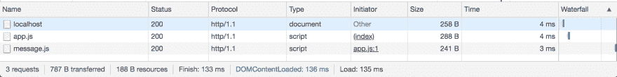
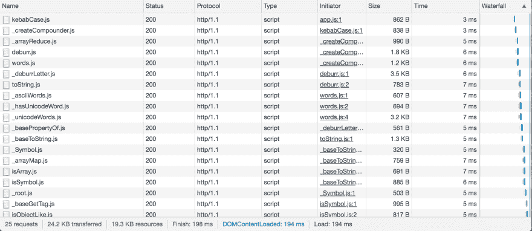
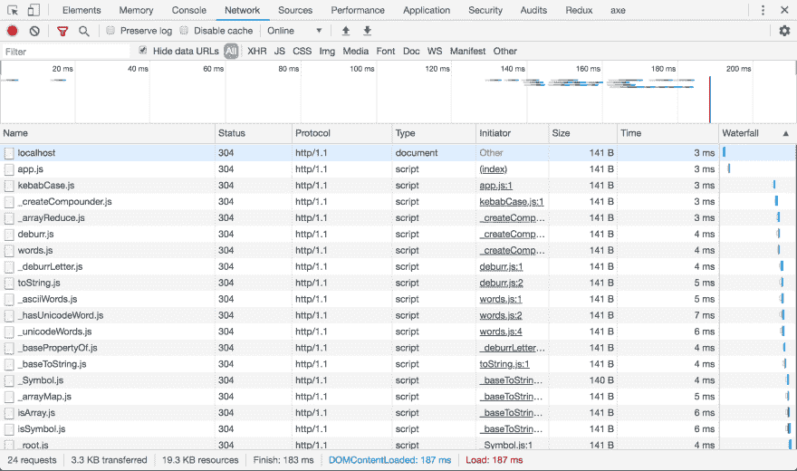

# 没有构建的开发(1):简介

> 原文：<https://dev.to/open-wc/developing-without-a-build-1-introduction-26ao>

# 开发无构建:简介

本文是关于无构建开发的系列文章的一部分:

1.  [简介(本文)](https://dev.to/open-wc/developing-without-a-build-1-introduction-26ao)
2.  [es-dev-server](https://dev.to/open-wc/developing-without-a-build-2-es-dev-server-1cf5)
3.  测试(即将推出！)

在本文中，我们探讨了为什么以及是否应该在没有构建步骤的情况下进行开发，并且给出了使这成为可能的当前和未来浏览器 API 的概述。在接下来的文章中，我们将研究`es-dev-server`如何帮助我们，以及如何处理测试。

## 现代网络发展

在 web 开发的早期，我们需要的只是一个简单的文件编辑器和一个 web 服务器。新人很容易理解这个过程，并开始制作自己的网页。从那以后，Web 开发发生了很大的变化:我们用于开发的工具的复杂性与我们在 web 上构建的东西的复杂性一样增长。

想象一下，如果你完全是一个 web 开发新手，会是什么样子:

*   你首先需要学习许多不同的工具，并理解它们是如何改变你的代码的，然后代码才能在浏览器中运行。
*   你的 IDE 和 linter 可能不理解一个朋友推荐给你的这个框架的语法，所以你需要找到合适的插件组合来使它工作。
*   如果您希望有机会在浏览器中调试代码，那么需要为链中的所有工具正确配置源映射。让他们和你的测试一起工作是另一回事。
*   您决定保持简单，不使用 typescript。你按照教程，但不能让这个装饰的东西工作，错误信息是没有帮助的。结果是你没有按照正确的顺序配置你的 babel 插件...

这听起来可能有些夸张，我知道有非常好的入门项目和教程，但是这种经历对于很多开发人员来说是很常见的。你自己可能也经历过类似的困境。

我觉得那真的很可惜。网络的一个关键卖点是它是一种简单而开放的格式。不需要太多的配置和仪式，马上开始应该很容易。

我不是在批评构建工具本身，它们都有自己的角色和目的。很长一段时间以来，使用 build 是在 web 上实际创建复杂应用程序的唯一真正的方法。Web 标准和浏览器实现并不支持现代 web 开发。构建工具确实有助于推动 web 开发。

但是浏览器在过去的几年里已经有了很大的改进，在不久的将来会有很多令人兴奋的事情发生。我认为现在是考虑我们是否可以去除大部分工具复杂性的好时机，至少在开发期间。也许还不是所有类型的项目，但让我们看看我们能走多远。

## 在浏览器中加载模块

这不是一个循序渐进的教程，但是您可以通过使用任何 web 服务器来遵循任何示例。例如来自 npm 的`http-server`。用`-c-1`运行它来禁用基于时间的缓存。

```
npx http-server -o -c-1 
```

<svg width="20px" height="20px" viewBox="0 0 24 24" class="highlight-action crayons-icon highlight-action--fullscreen-on"><title>Enter fullscreen mode</title></svg> <svg width="20px" height="20px" viewBox="0 0 24 24" class="highlight-action crayons-icon highlight-action--fullscreen-off"><title>Exit fullscreen mode</title></svg>

### 加载模块

可以使用带有`type="module"`属性的常规脚本标签在浏览器中加载模块。我们可以直接内联编写模块代码:

```
<!DOCTYPE html>
<html>
<head></head>

<body>
  <script type="module">
    console.log('hello world!');
  </script>
</body>

</html> 
```

<svg width="20px" height="20px" viewBox="0 0 24 24" class="highlight-action crayons-icon highlight-action--fullscreen-on"><title>Enter fullscreen mode</title></svg> <svg width="20px" height="20px" viewBox="0 0 24 24" class="highlight-action crayons-icon highlight-action--fullscreen-off"><title>Exit fullscreen mode</title></svg>

从这里我们可以使用静态导入来加载其他模块:

```
<script type="module">
  import './app.js';

  console.log('hello world!');
</script> 
```

<svg width="20px" height="20px" viewBox="0 0 24 24" class="highlight-action crayons-icon highlight-action--fullscreen-on"><title>Enter fullscreen mode</title></svg> <svg width="20px" height="20px" viewBox="0 0 24 24" class="highlight-action crayons-icon highlight-action--fullscreen-off"><title>Exit fullscreen mode</title></svg>

请注意，我们需要使用显式文件扩展名，因为浏览器不知道要请求哪个文件。

如果我们使用`src`属性:
，情况也是如此

```
<script type="module" src="./app.js"></script> 
```

<svg width="20px" height="20px" viewBox="0 0 24 24" class="highlight-action crayons-icon highlight-action--fullscreen-on"><title>Enter fullscreen mode</title></svg> <svg width="20px" height="20px" viewBox="0 0 24 24" class="highlight-action crayons-icon highlight-action--fullscreen-off"><title>Exit fullscreen mode</title></svg>

### 加载依赖项

我们不仅仅在一个文件中编写代码。导入初始模块后，我们可以导入其他模块。例如，让我们创建两个新文件:

`src/app.js` :

```
import { message } from './message.js';

console.log(`The message is: ${message}`); 
```

<svg width="20px" height="20px" viewBox="0 0 24 24" class="highlight-action crayons-icon highlight-action--fullscreen-on"><title>Enter fullscreen mode</title></svg> <svg width="20px" height="20px" viewBox="0 0 24 24" class="highlight-action crayons-icon highlight-action--fullscreen-off"><title>Exit fullscreen mode</title></svg>

`src/message.js` :

```
export const message = 'hello world'; 
```

<svg width="20px" height="20px" viewBox="0 0 24 24" class="highlight-action crayons-icon highlight-action--fullscreen-on"><title>Enter fullscreen mode</title></svg> <svg width="20px" height="20px" viewBox="0 0 24 24" class="highlight-action crayons-icon highlight-action--fullscreen-off"><title>Exit fullscreen mode</title></svg>

将两个文件放在一个`src`目录中，并从 index.html:
中导入`app.js`

```
<!DOCTYPE html>
<html>
<head></head>

<body>
  <script type="module" src="./src/app.js"></script>
</body>

</html> 
```

<svg width="20px" height="20px" viewBox="0 0 24 24" class="highlight-action crayons-icon highlight-action--fullscreen-on"><title>Enter fullscreen mode</title></svg> <svg width="20px" height="20px" viewBox="0 0 24 24" class="highlight-action crayons-icon highlight-action--fullscreen-off"><title>Exit fullscreen mode</title></svg>

如果您运行这个并检查网络面板，您将看到两个模块都被加载。因为导入是相对解析的，`app.js`可以使用相对路径引用`message.js`:

[](https://res.cloudinary.com/practicaldev/image/fetch/s--IO8qPFlM--/c_limit%2Cf_auto%2Cfl_progressive%2Cq_auto%2Cw_880/https://thepracticaldev.s3.amazonaws.com/i/yp0n86hkkxilbp29k974.png)

这看起来微不足道，但它非常有用，是我们以前在经典脚本中没有的。我们不再需要在某个中心协调依赖关系或维护一个基本 URL。模块可以声明自己的依赖关系，我们可以导入任何模块，而不知道它们的依赖关系是什么。浏览器负责请求正确的文件。

### 动态导入

当构建任何严肃的 web 应用程序时，我们通常需要进行某种形式的延迟加载以获得最佳性能。像我们之前看到的静态导入不能有条件地使用，它们总是需要存在于顶层。

例如，我们不能写:

```
if (someCondition) {
  import './bar.js';
} 
```

<svg width="20px" height="20px" viewBox="0 0 24 24" class="highlight-action crayons-icon highlight-action--fullscreen-on"><title>Enter fullscreen mode</title></svg> <svg width="20px" height="20px" viewBox="0 0 24 24" class="highlight-action crayons-icon highlight-action--fullscreen-off"><title>Exit fullscreen mode</title></svg>

这就是动态导入的用途。动态导入可以随时导入模块。它返回一个用导入的模块解析的承诺。

例如，让我们更新上面创建的`app.js`示例:

```
window.addEventListener('click', async () => {
  const module = await import('./message.js');

  console.log(`The message is: ${module.message}`);
}); 
```

<svg width="20px" height="20px" viewBox="0 0 24 24" class="highlight-action crayons-icon highlight-action--fullscreen-on"><title>Enter fullscreen mode</title></svg> <svg width="20px" height="20px" viewBox="0 0 24 24" class="highlight-action crayons-icon highlight-action--fullscreen-off"><title>Exit fullscreen mode</title></svg>

现在我们没有立即导入消息模块，而是延迟它，直到用户点击页面上的任何地方。我们可以等待从导入中返回的承诺，并与返回的模块进行交互。任何导出的成员在模块对象上都可用。

### 懒评

这就是没有捆绑器的开发具有显著优势的地方。如果您在将应用程序提供给浏览器之前对其进行捆绑，那么捆绑器需要评估所有的动态导入，以进行代码分割并输出单独的块。对于具有大量动态导入的大型应用程序，这可能会增加大量开销，因为整个应用程序是在您可以在浏览器中看到任何内容之前构建和捆绑的。

当服务未捆绑的模块时，整个过程是懒惰的。浏览器只做加载实际请求的模块的必要工作。

最新版本的 Chrome、Safari 和 Firefox 支持动态导入。当前版本的 Edge 不支持它，但基于 Chromium 的新 Edge 将支持它。

[阅读有关 MDN 动态导入的更多信息](https://developer.mozilla.org/en-US/docs/Web/JavaScript/Reference/Statements/import#Dynamic_Import)

### 非相对请求

并非所有的浏览器 API 都解析相对于模块位置的请求。例如，当使用 fetch 或在页面上呈现图像时。

为了处理这些情况，我们可以使用`import.meta.url`来获取关于当前模块位置的信息。

`import.meta`是一个特殊的对象，它包含关于当前正在执行的模块的元数据。`url`是这里公开的第一个属性，它的工作方式很像 NodeJS 中的`__dirname`。

`import.meta.url`指向模块导入时使用的 URL:

```
console.log(import.meta.url); // logs http://localhost:8080/path/to/my/file.js 
```

<svg width="20px" height="20px" viewBox="0 0 24 24" class="highlight-action crayons-icon highlight-action--fullscreen-on"><title>Enter fullscreen mode</title></svg> <svg width="20px" height="20px" viewBox="0 0 24 24" class="highlight-action crayons-icon highlight-action--fullscreen-off"><title>Exit fullscreen mode</title></svg>

我们可以使用`URL` API 来轻松构建 URL。例如请求一个 JSON 文件:

```
const lang = 'en-US';

// becomes http://localhost:8080/path/to/my/translations/en-US.json
const translationsPath = new URL(`./translations/${lang}.json`, import.meta.url);

const response = await fetch(translationsPath); 
```

<svg width="20px" height="20px" viewBox="0 0 24 24" class="highlight-action crayons-icon highlight-action--fullscreen-on"><title>Enter fullscreen mode</title></svg> <svg width="20px" height="20px" viewBox="0 0 24 24" class="highlight-action crayons-icon highlight-action--fullscreen-off"><title>Exit fullscreen mode</title></svg>

[在 MDN 上阅读有关 import.meta 的更多信息](https://developer.mozilla.org/en-US/docs/Web/JavaScript/Reference/Statements/import.meta)

### 加载其他包

当构建一个应用程序时，您很快就会遇到必须包含来自 npm 的其他包的情况。这在浏览器中也能正常工作。例如，让我们安装和使用 lodash:

```
npm i -P lodash-es 
```

<svg width="20px" height="20px" viewBox="0 0 24 24" class="highlight-action crayons-icon highlight-action--fullscreen-on"><title>Enter fullscreen mode</title></svg> <svg width="20px" height="20px" viewBox="0 0 24 24" class="highlight-action crayons-icon highlight-action--fullscreen-off"><title>Exit fullscreen mode</title></svg>

```
import kebabCase from '../node_modules/lodash-es/kebabCase.js';

console.log(kebabCase('camelCase')); 
```

<svg width="20px" height="20px" viewBox="0 0 24 24" class="highlight-action crayons-icon highlight-action--fullscreen-on"><title>Enter fullscreen mode</title></svg> <svg width="20px" height="20px" viewBox="0 0 24 24" class="highlight-action crayons-icon highlight-action--fullscreen-off"><title>Exit fullscreen mode</title></svg>

Lodash 是一个非常模块化的库，`kebabCase`函数依赖于许多其他模块。这些依赖项会被自动处理，浏览器会为您解析并导入它们:

[](https://res.cloudinary.com/practicaldev/image/fetch/s--Yslx7pcG--/c_limit%2Cf_auto%2Cfl_progressive%2Cq_auto%2Cw_880/https://thepracticaldev.s3.amazonaws.com/i/w6mk8ox4pnotaa1gxzu7.png)

将显式路径写入节点模块文件夹有点不寻常。虽然它是有效的并且可以工作，但是大多数人习惯于编写所谓的简单导入说明符:

```
import { kebabCase } from 'lodash-es';
import kebabCase from 'lodash-es/kebabCase.js'; 
```

<svg width="20px" height="20px" viewBox="0 0 24 24" class="highlight-action crayons-icon highlight-action--fullscreen-on"><title>Enter fullscreen mode</title></svg> <svg width="20px" height="20px" viewBox="0 0 24 24" class="highlight-action crayons-icon highlight-action--fullscreen-off"><title>Exit fullscreen mode</title></svg>

这样你就不用特别说明一个包的位置，只需要说明它的名字。NodeJS 经常使用这种方法，它的解析器会遍历文件系统，寻找那个名字的`node_modules`文件夹和包。它读取`package.json`来知道使用哪个文件。

浏览器无法承受发送一堆请求，直到它停止获得 404，这将是太昂贵了。开箱即用，当浏览器看到一个裸导入时会抛出一个错误。有一个新的浏览器 API 叫做 import maps ，它可以让你指示浏览器如何解析这些导入:

```
<script type="importmap">
  {
    "imports": {
      "lodash-es": "./node_modules/lodash-es/lodash.js",
      "lodash-es/": "./node_modules/lodash-es/"
    }
  }
</script> 
```

<svg width="20px" height="20px" viewBox="0 0 24 24" class="highlight-action crayons-icon highlight-action--fullscreen-on"><title>Enter fullscreen mode</title></svg> <svg width="20px" height="20px" viewBox="0 0 24 24" class="highlight-action crayons-icon highlight-action--fullscreen-off"><title>Exit fullscreen mode</title></svg>

目前[在 chrome 中在一个标志](https://developers.google.com/web/updates/2019/03/kv-storage#import_maps)后面实现，很容易在其他浏览器[上用 es-module-shims](https://www.npmjs.com/package/es-module-shims) 填充。在我们获得广泛的浏览器支持之前，这可能是开发过程中一个有趣的选择。

现在导入地图还为时尚早，对于大多数人来说，它们可能仍然有点太前沿了。如果你对这个工作流程感兴趣，我推荐你阅读这篇文章

在正确支持导入映射之前，推荐的方法是使用 web 服务器，在将模块提供给浏览器之前，动态地将裸导入重写为显式路径。有一些服务器可以做到这一点。我推荐 [es-dev-server](https://www.npmjs.com/package/es-dev-server) ，我们将在下一篇文章的[中探讨它。](https://dev.to/open-wc/developing-without-a-build-2-es-dev-server-1cf5)

### 缓存

因为我们没有将所有代码捆绑到几个文件中，所以我们不需要设置任何复杂的缓存策略。如果文件没有更改，您的 web 服务器可以使用文件系统的上次修改时间戳返回 304。

您可以在您的浏览器中通过关闭`Disable cache`并刷新来测试:

[](https://res.cloudinary.com/practicaldev/image/fetch/s--lKRABR-e--/c_limit%2Cf_auto%2Cfl_progressive%2Cq_auto%2Cw_880/https://thepracticaldev.s3.amazonaws.com/i/ikcy8cjivd1c5zr4j2nd.png)

## 非 js 模块

到目前为止，我们只研究了 javascript 模块，这个故事看起来相当完整。看起来我们已经拥有了大规模编写 javascript 所需的大部分东西。但是在网络上，我们不仅仅是写 javascript，我们还需要处理其他语言。

好消息是，HTML、CSS 和 JSON 模块已经有了具体的提案，所有主要的浏览器供应商似乎都支持它们:

*   [json 模块](https://github.com/whatwg/html/issues/4315)
*   [html 模块](https://github.com/w3c/webcomponents/issues/645)
*   [css 模块](https://github.com/w3c/webcomponents/issues/759)

坏消息是它们还没有上市，也不清楚什么时候会上市。与此同时，我们必须寻找一些解决办法。

### JSON

在 Node JS 中，可以从 javascript 导入 JSON 文件。这些成为可用的 javascript 对象。在 web 项目中，这也经常使用。有许多构建工具插件可以实现这一点。

在浏览器支持 JSON 模块之前，我们可以只使用导出对象的 javascript 模块，也可以使用 fetch 来检索 JSON 文件。关于使用 fetch 的示例，参见`import.meta.url`部分。

### HTML

随着时间的推移，web 框架已经用不同的方式解决了 HTML 模板，例如将 HTML 放在 javascript 字符串中。JSX 是在 javascript 中嵌入动态 HTML 的一种非常流行的格式，但是如果不进行某种转换，它就不能在浏览器中自然运行。

如果你真的想在 HTML 文件中创作 HTML，在我们得到 HTML 模块之前，你可以使用`fetch`下载你的 HTML 模板，然后在你使用的渲染系统中使用它。我不推荐这样做，因为很难针对生产进行优化。您需要一些可以被捆绑器静态分析和优化的东西，这样您就不会在生产中产生大量的请求。

幸运的是，有一个很好的选择。借助 es2015/es6，我们可以使用带标签的模板字符串在 JS 中嵌入 HTML，并使用它进行高效的 DOM 更新。因为 HTML 模板经常伴随着大量的动态性，所以我们可以使用 javascript 来表达这一点，而不是学习一个全新的元语法，这实际上是一个很大的好处。它在浏览器中本地运行，具有出色的开发人员体验，并与您的模块图集成，因此可以针对生产进行优化。

有一些非常好的生产就绪和功能完整的库可用于此:

*   [htm，JSX 使用模板文字。与使用 JSX 的库一起工作，例如 react](https://www.npmjs.com/package/htm)
*   [lit-html，一个 html 模板库](https://www.npmjs.com/package/lit-html)
*   [lit-element，集成 lit-html 和 web 组件](https://www.npmjs.com/package/lit-element)
*   [haunted，一个带有类似 react 钩子的功能性 web 组件库](https://www.npmjs.com/package/haunted)
*   [hybrids，另一个功能 web 组件库](https://www.npmjs.com/package/hybrids)
*   [hyperHTML，一个 HTML 模板库](https://www.npmjs.com/package/hyperhtml)

对于语法高亮显示，您可能需要配置您的 IDE 或安装一个插件。

### CSS

对于 HTML 和 JSON，有足够的选择。不幸的是，使用 CSS 要复杂得多。CSS 本身并不是模块化的，因为它会影响整个页面。一个常见的抱怨是，这就是 CSS 如此难以扩展的原因。

有许多不同的方法来编写 CSS，这超出了本文的范围。如果你把普通的样式表加载到你的 index.html 中，它会工作得很好。如果你正在使用某种 CSS 预处理器，你可以在运行你的 web 服务器之前运行它，并且只加载 CSS 输出。

如果库发布了可以导入的 es 模块格式，JS 解决方案中的许多 CSS 也应该可以工作。

#### 阴影 dom

对于真正的模块化 CSS，我推荐研究一下 [Shadow dom](https://developer.mozilla.org/en-US/docs/Web/Web_Components/Using_shadow_DOM) ，它修复了 CSS 的许多作用域和封装问题。我已经在许多不同类型的项目中成功地使用了它，但是值得一提的是，它还不是一个完整的故事。标准中仍然缺少正在制定的功能，因此它可能还不是所有场景中的[正确解决方案](https://dev.to/webpadawan/beyond-the-polyfills-how-web-components-affect-us-today-3j0a)。

这里值得一提的是[lit-element 库](https://www.npmjs.com/package/lit-element)，它在创作模块化 CSS 时无需构建步骤，提供了出色的开发人员体验。为你做大部分繁重的工作。您使用带标签的模板文字创作 CSS，这只是创建可构造样式表的语法糖。这样你就可以在你的组件之间编写和共享 CSS。

这个系统也将与 CSS 模块很好地集成在一起。我们可以通过使用 fetch 来模拟 CSS 模块，但是正如我们在 HTML 中看到的那样，很难针对生产应用进行优化。我不是 JS 中 CSS 的粉丝，但是 lit-element 的解决方案与众不同，非常优雅。您正在 JS 文件中编写 CSS，但它仍然是有效的 CSS 语法。如果您喜欢将事情分开，您可以创建一个 my-styles.css.js 文件，并使用默认的样式表导出。

### 库支持

幸运的是，发布 es 模块格式的库的数量正在稳步增长。但是仍然有一些流行的库只提供 UMD 或 CommonJS。如果没有某种代码转换，这些就无法工作。我们能做的最好的事情就是公开这些项目的问题，让他们知道有多少人对支持本机模块语法感兴趣。

我认为这个问题会很快消失，尤其是在 Node JS 完成他们的 es 模块实现之后。许多项目已经使用 es 模块作为他们的创作格式，我认为没有人真的喜欢不得不发布多个不完美的模块格式。

## 最后的想法

本文的目标是探索我们不需要为开发做任何构建的工作流，我认为我们已经展示了存在真正的可能性。对于很多用例，我认为我们可以去掉大部分开发工具。在其他情况下，我认为它们仍然有用。但是我觉得我们的出发点应该反过来。我们应该编写在浏览器中运行的标准代码，并且只在我们认为必要的时候执行轻微的转换，而不是试图在开发过程中让我们的产品构建工作。

重要的是要重申，我不认为构建工具是邪恶的，我也不是说这是每个项目的正确方法。这是每个团队应该根据自己的需求做出的选择。

## es-dev-server

您可以使用任何常规的 web 服务器完成本文中描述的几乎所有事情。也就是说，仍然有 web 服务器特性可以真正帮助开发体验。特别是如果我们想在旧的浏览器上运行我们的应用程序，我们可能需要一些帮助。

在`open-wc`我们创建了 [es-dev-server](https://www.npmjs.com/package/es-dev-server) ，这是一个可组合的 web 服务器，在没有构建步骤的情况下进行开发时，它关注开发人员的生产力。

[看看我们的下一篇文章](https://dev.to/open-wc/developing-without-a-build-2-es-dev-server-1cf5),看看我们如何设置它！

## 入门

要在没有任何构建工具的情况下开始开发，您可以使用`open-wc`项目脚手架来设置基础:

```
npm init @open-wc 
```

<svg width="20px" height="20px" viewBox="0 0 24 24" class="highlight-action crayons-icon highlight-action--fullscreen-on"><title>Enter fullscreen mode</title></svg> <svg width="20px" height="20px" viewBox="0 0 24 24" class="highlight-action crayons-icon highlight-action--fullscreen-off"><title>Exit fullscreen mode</title></svg>

它用 web 组件库`lit-element`设置项目。您可以将它替换为您选择的任何库，该设置并不特定于 web 组件。