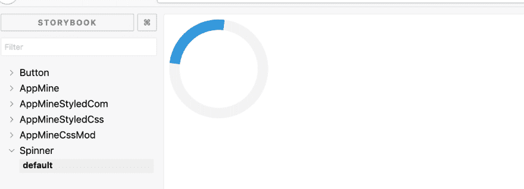

# 样式用样式化组件反应组件:第 1 部分

> 原文：<https://dev.to/destro_mas/style-react-component-with-styled-components-part-1-19fl>

对 React 组件进行样式化是任何真实应用程序的重要部分。我们可以用几种方法来设计 react 组件的样式。比如——

1.  内嵌样式
2.  CSS 模块
3.  情绪
4.  样式组件

我们将在本文中讨论样式化组件。

[](https://res.cloudinary.com/practicaldev/image/fetch/s--bKuhM-o8--/c_limit%2Cf_auto%2Cfl_progressive%2Cq_auto%2Cw_880/https://thepracticaldev.s3.amazonaws.com/i/6r80pvlcli6fb5hrnl62.png)

我们将创建一个简单的动画加载微调组件。

我们可以使用 npm 或 yarn cli 从 npmjs 安装包。
`npm i styled-components --save`
或
`yarn add styled-components`

我们可以将它导入到我们的组件模块中，如
`import styled from "styled-components";`

现在，我将使用样式化的 API 来创建微调器。我们使用一个 DIV 作为微调器的目标。

```
const StyledSpinner = styled.div`
  border: 16px solid #f3f3f3;
  border-radius: 50%;
  border-top: 16px solid #3498db;
  width: 120px;
  height: 120px;
  -webkit-animation: spin 2s linear infinite; /* Safari */
  animation: spin 2s linear infinite;</code>

  @keyframes spin {
  0% { transform: rotate(0deg); }
  100% { transform: rotate(360deg); }
}
`; 
```

Enter fullscreen mode Exit fullscreen mode

现在我们可以像使用 react 组件一样使用它。

```
class Spinner extends Component {
  render() {
    return (
      <StyledSpinner />
    );
  }
} 
```

Enter fullscreen mode Exit fullscreen mode

我们不需要任何其他工具或 webpack 来构建这个 css。它会工作得很好。

我将继续撰写更多关于样式化组件的文章。

**更新第二部分可在**
[使用样式化组件的样式反应组件:第二部分](https://dev.to/destro_mas/style-react-component-with-styled-components-part-2-3d78)

干杯！
👋

当我试图在网络上贡献内容时，你可以为我在这些❤️上花费的时间买一杯咖啡😊🌸
[T3】](https://www.buymeacoffee.com/destromas)

PS:你也可以看看我的博客网站 [https://shahjada.me](https://shahjada.me)