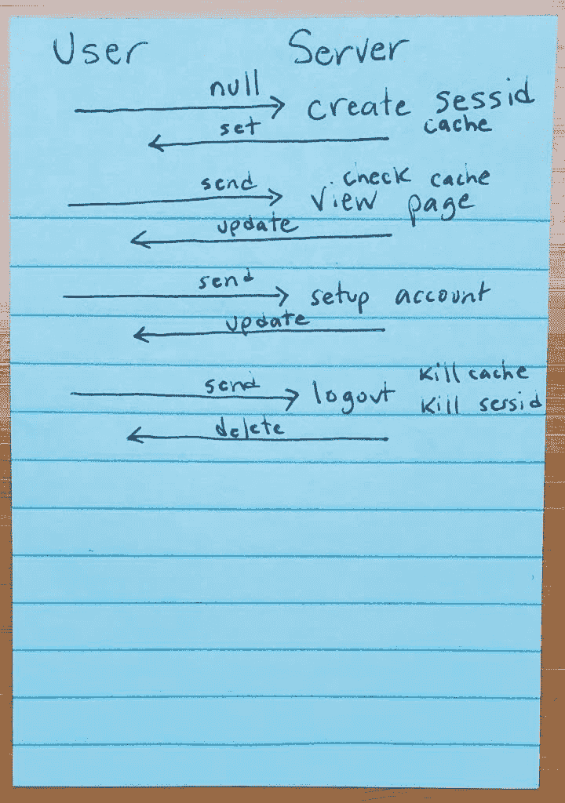

# 使用 AWS 进行 Rust Web App 会话管理

> 原文：<https://dev.to/jculverhouse/rust-web-app-session-management-with-aws-webapp-5-26a0>

<figure>[](https://res.cloudinary.com/practicaldev/image/fetch/s--YMXdkrum--/c_limit%2Cf_auto%2Cfl_progressive%2Cq_auto%2Cw_880/https://i1.wp.com/rust.graystorm.com/wp-content/uploads/2019/08/writing-number-sign-key-door-security-1095191-pxhere.com_.jpg%3Fresize%3D840%252C560%26ssl%3D1) 

<figcaption>也没人提饼干！？我的饼干呢！？</figcaption>

</figure>

我用我的虚拟网络应用程序做了更多的工作，我在几个帖子前介绍了这个应用程序。考虑到让用户注册并稍后登录所需的技术，[会话管理](https://en.wikipedia.org/wiki/Session_(computer_science))似乎是一个不错的开端。我也想把这些会话存储在亚马逊的 [DynamoDB](https://aws.amazon.com/dynamodb/) 中，只是为了好玩和体验。最近，我已经向[库](https://github.com/jculverhouse/pinpoint_shooting)提交了几个提交，所以让我来看一下通过 AWS DynamoDB 启用 Rust web app 会话管理的一些更改。

首先，我搜索并阅读了一些关于会话管理的最佳实践。我从 [OWASP](https://www.owasp.org/index.php/Main_Page) 找到了一份[会话管理备忘单](https://cheatsheetseries.owasp.org/cheatsheets/Session_Management_Cheat_Sheet.html)。此外，[在](https://cloud.google.com/blog/products/gcp/12-best-practices-for-user-account)[谷歌云博客](https://cloud.google.com/blog/)上还有关于用户账户、授权和密码管理的12 个最佳实践。我还没有解决其中的许多问题，但是将来我会多次提到类似的资源。我试图找到关于 web 应用程序会话管理的独立于语言的白皮书或指南…以及不到十年前的东西。如果有人对此有明确的资源，请分享！

## 鲁索托前来救援

首先，让我们的 web 应用程序与 AWS 接口。 [Rusoto](https://www.rusoto.org/) 是使用 AWS 服务的一大套[板条箱](https://crates.io/)。Rusoto [Core](https://crates.io/crates/rusoto_core) (当然)和 [DynamoDB](https://crates.io/crates/rusoto_dynamodb) 是我现在需要的全部，但我确定我会回来买更多！为了进行设置，我在我的 [AWS](https://aws.amazon.com/) 控制台中创建了一个`sessions`表，并创建了一个名为`pinpointshooting`的可编程的 [IAM 角色](https://docs.aws.amazon.com/IAM/latest/UserGuide/id_roles.html)，它可以完全访问该表。当创建一个编程角色时，您会得到[凭证访问键](https://docs.aws.amazon.com/IAM/latest/UserGuide/id_credentials_access-keys.html)，我将它放入到我的`.env`文件中，该文件位于`pinpointshooting`项目的根目录下。首先，用这些访问键连接到我的 AWS 帐户是一件简单的事情:

```
DynamoDbClient::new(Region::UsEast1) 
```

[](https://res.cloudinary.com/practicaldev/image/fetch/s--vPTFXq98--/c_limit%2Cf_auto%2Cfl_progressive%2Cq_auto%2Cw_880/https://i2.wp.com/rust.graystorm.com/wp-content/uploads/2019/08/session-cookie-life.jpg%3Ffit%3D720%252C1024%26ssl%3D1)

我必须考虑将`session id`存储在 cookie 中的过程，以及何时/如何创建、验证、更新和删除它。我想出了一个简单的草图，让它在我的脑海中更加清晰。注意，我在我的草图和一些评论中都提到了一个`cache`，但是我还没有做任何事情。

*   当用户到达时没有带任何 cookie——我们需要用一些适当的默认值创建一个会话，将其写入数据库，并在结果响应中发送 cookie。
*   如果用户带着一个 cookie 到达**——我们需要从数据库中提取会话(如果它真的存在),并做一些验证和到期检查。如果一切正常，我们将会话细节放入我们的`struct`。否则，我们删除无效会话数据并创建一个新的会话，如上所示。**
*   当用户选择注销时，我们再次检查以确保会话有效，但随后删除会话、删除 cookie 并注销用户。

这里是上面的那些步骤，因为我现在已经把它们写在代码里了！

## 第一步:搜索或创建会话

```
// Check for sessid cookie and verify session or create new
// session to use - either way, return the session struct

pub fn get_or_setup_session(cookies: &mut Cookies) -> Session {
    let applogger = &LOGGING.logger;
    let dynamodb = connect_dynamodb();

    // if we can pull sessid from a cookie and validate it,
    // pull session from cache or from storage and return
    if let Some(cookie) = cookies.get_private("sessid") {
        debug!(applogger, "Cookie found, verifying"; "sessid" => cookie.value());
        // verify from dynamodb, update session with last-access if good
        if let Some(mut session) = 
        verify_session_in_ddb(&dynamodb, &cookie.value().to_string()) {
            save_session_to_ddb(&dynamodb, &mut session);
            return session;
        }
     }
     // otherwise, start a new, empty session to use for this user
    let mut hasher = Sha256::new();
    let randstr: String = thread_rng()
        .sample_iter(&Alphanumeric)
        .take(256)
        .collect();
    hasher.input(randstr);
    let sessid = format!("{:x}", hasher.result());
    cookies.add_private(Cookie::new("sessid", sessid.clone()));
    let mut session = Session {
        sessid: sessid.clone(),
        ..Default::default(),
    };
    save_session_to_ddb(&dynamodb, &mut session);
    session
} 
```

这将检查(私有)cookie `sessid`，如果它伴随着 http 请求，并尝试从 DynamoDB 获取它，然后验证它(见下文)。如果成功，我们更新会话(用更新的`last-access`时间戳)并返回`session struct`。否则，我们创建一个新的`session id`，通过获取一个随机字符串的散列，现在使用一些适当的缺省值。嗯，我应该确保我没有碰巧在这一点上与现有的`sessid`相交！无论如何，我们只需添加(或更新)与 http 响应一起返回的`sessid` cookie。由于我们使用的是 [Rocket](https://rocket.rs/) 的[私有 cookie](https://api.rocket.rs/v0.4/rocket/http/enum.Cookies.html#private-cookies) 特性，该值实际上是加密的。用户看不到他们真正的`session id`是什么，或者试图制造一个。最后，如果我们刚刚创建了一个新的会话，我们将它保存到会话表中并返回它。

## 第二步:验证会话

```
// Search for sessid in dynamodb and verify session if found
// including to see if it has expired
fn verify_session_in_ddb(dynamodb: &DynamoDbClient, sessid: &String) -> Option<Session> {
    let applogger = &LOGGING.logger;
    let av = AttributeValue {
        s: Some(sessid.clone()),
        ..Default::default(),
    };
    let mut key = HashMap::new();
    key.insert("sessid".to_string(), av);
    let get_item_input = GetItemInput {
        table_name: "session".to_string(),
        key: key,
        ..Default::default()
    };
    match dynamodb.get_item(get_item_input).sync() {
        Ok(item_output) => match item_output.item {
            Some(item) => match item.get("session") {
                Some(session) => match &session.s {
                    Some(string) => {
                        let session: Session = serde_json::from_str(&string)
                            .unwrap();
                        match session.last_access {
                            Some(last) => {
                                if last > Utc::now() - 
                                Duration::minutes(CONFIG.sessions.expire) {
                                    Some(session)
                                } else {
                                    debug!(applogger, "Session expired";
                                        "sessid" =\> sessid); 
                                    delete_session_in_ddb(dynamodb, sessid);
                                    None
                                }
                            }
                            None => {
                                debug!(applogger, "'last_access' is blank for stored session"; "sessid" => sessid);
                                delete_session_in_ddb(dynamodb, sessid);
                                None
                            }
                        }
                    }
                    None => {
                        debug!(applogger, "'session' attribute is empty for stored session"; "sessid" => sessid);
                        delete_session_in_ddb(dynamodb, sessid);
                        None
                    }
                },
                None => {
                    debug!(applogger, "No 'session' attribute found for stored session"; "sessid" => sessid);
                    delete_session_in_ddb(dynamodb, sessid);
                    None
                }
            },
            None => {
                debug!(applogger, "Session not found in dynamodb"; "sessid" => sessid);
                None
            }
        },
        Err(e) => {
            crit!(applogger, "Error in dynamodb"; "err" => e.to_string());
            panic!("Error in dynamodb: {}", e.to\_string());
        }
    }
} 
```

这是一些深层嵌套——我在`Rust`编码方面还是个新手，所以可能有更好的方式来写这个。如果我不关心记录问题，我可能会通过使用“？”来缩短它每个步骤结束时的运算符。也许我最终会改变这一点，但现在我需要调试日志，看看事情是否正常。

这个链试图检索与`sessid`(cookie 中编码的会话 id)相关联的`session`属性，现在，只是确保它不是太旧。如果这个简单检查没问题，我们反序列化并返回那个`Some(session struct)`。在所有其他情况下，我们返回`None`，将生成一个新的会话。对于会话存在，但被确定为无效或过期的情况，我们也会从 DynamoDB 中删除该会话。

## 第三步:保存(或更新)会话

```
// Write current session to dynamodb, update last-access date/time too
fn save_session_to_ddb(dynamodb: &DynamoDbClient, session: &mut Session) {
    let applogger = &LOGGING.logger;
    session.last_access = Some(Utc::now());
    let sessid_av = AttributeValue {
        s: Some(session.sessid.clone()),
        ..Default::default()
    };
    let session_av = AttributeValue {
        s: Some(serde_json::to_string(&session).unwrap()),
        ..Default::default()
    };
    let mut item = HashMap::new();
    item.insert("sessid".to_string(), sessid_av);
    item.insert("session".to_string(), session_av);
    let put_item_input = PutItemInput {
        table_name: "session".to_string(),
        item: item,
        ..Default::default()
     };
     match dynamodb.put_item(put_item_input).sync() {
         Ok(_) => {}
         Err(e) => {
             crit!(applogger, "Error in dynamodb"; "err" => e.to_string());
             panic!("Error in dynamodb: {}", e.to_string());
         }
     };
} 
```

这里，我们简单地获取传递给我们的会话数据，将`last_access`更新为`now()`，然后将`serialized session struct`写入 DynamoDB。还要注意，我将会话 id 存储在会话数据本身中。我还不确定这是否是方便的复制，是安全问题，还是无关紧要。

## 第四步:收拾残局

<figure>[](https://res.cloudinary.com/practicaldev/image/fetch/s--a78E_N7c--/c_limit%2Cf_auto%2Cfl_progressive%2Cq_auto%2Cw_880/https://i1.wp.com/rust.graystorm.com/wp-content/uploads/2019/08/work-man-person-repair-profession-dad-713854-pxhere.com_.jpg%3Fresize%3D512%252C342%26ssl%3D1) 

<figcaption>嘿！你是安全隐患吗？？</figcaption>

</figure>

为了完整起见，这里有一个函数，一旦我们确定一个会话无效(过期)，就从 DynamoDB 中删除它。

```
// Delete session from dynamodb
fn delete_session_in_ddb(dynamodb: &DynamoDbClient, sessid: &String) {
    let applogger = &LOGGING.logger;
    let av = AttributeValue {
        s: Some(sessid.clone()),
        ..Default::default()
    };
    let mut key = HashMap::new();
    key.insert("sessid".to_string(), av);
    let delete_item_input = DeleteItemInput {
        table_name: "session".to_string(),
        key: key,
        ..Default::default()
    };
    match dynamodb.delete_item(delete_item_input).sync() {
        Ok(_) => {
            debug!(applogger, "Deleted invalid session from ddb";
                "sessid" => sessid);
        }
        Err(e) => {
            crit!(applogger, "Error in dynamodb"; "err" => e.to_string());
            panic!("Error in dynamodb: {}", e.to_string());
        }
    };
} 
```

还有很多很多事情要做——但我乐在其中。如果我真的对这个 web 应用程序的实际功能有一个计划，它可能会更快。我的意思是，我有一个想法，但我还没有模拟出一个页面，所以我进展缓慢，只是喜欢边走边编写代码！谢谢你陪我一起来！

帖子[Rust Web App Session Management with AWS](https://rust.graystorm.com/2019/08/04/rust-web-app-session-management-with-aws/)最早出现在 [Learning Rust](https://rust.graystorm.com) 上。