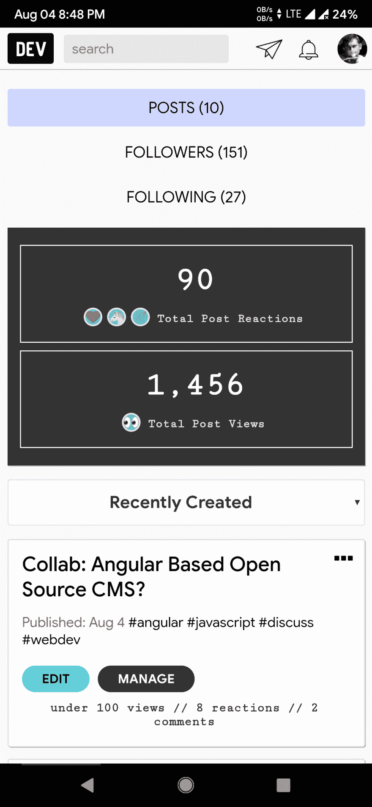

# 这正常吗？我有点吓坏了！

> 原文：<https://dev.to/th3n00bc0d3r/is-this-normal-i-am-kinda-freaked-out-1i5a>

首先，感谢你们所有的反应，特别是那些选择跟随我的人。我被这个奇妙的社区压扁了，它非常有帮助，最重要的是高度倾向于积极推广和支持它的用户。我从未经历过这样的反应。

我是在 8 月 2 日加入的，差不多两天前，有将近 150 多人关注我，这真的让我有点害怕。我只是想给社区写封信。