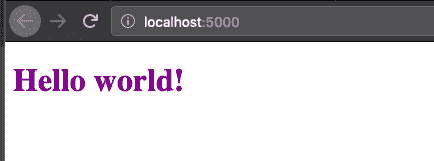

# 苗条简介🦄⚡️🧡

> 原文：<https://dev.to/sendilkumarn/intro-to-svelte-460b>

# 为什么还要学习另一种框架？🤦‍♂️🤦‍♀️

> 如果你担心大量的前端框架和它们的变种，为什么还要另一个框架呢？

像 Angular、ReactJS 或 VueJS 这样的框架可以更容易、更快地启动应用程序。团队中更健壮和高效的应用程序开发。

他们改变了我们设计、开发和交付应用的方式。

越来越多的框架改进了框架，使得开发简单、快速、高效的应用程序变得更加容易。

**棱角分明** ❤️

Angular 是一个完整的套件，但它很臃肿。

**反应**💙

React 是一个`view only`库，使用`virtual DOM`，但是 React 变得复杂了。

视图💚

VueJS 易于编写，并且具有 React 和 Angular 的最佳部分。

苗条的🧡

Svelte 是一种构建用户界面的新方法。苗条的没有虚拟的 DOM。

苗条让你写更少的代码和`uses the platform`。

Svelte 没有虚拟 DOM 和`uses the platform`。

Svelte 在构建过程中优化了应用程序，提高了应用程序的性能。

# 获取 app，开始运行

(无聊的)框架介绍已经够多了，让我们开始编码吧。

*从哪里开始？*

【你好世界】T0

```
npx degit sveltejs/template hello-world
cd hello-world 
```

您已经从`sveltejs/template`克隆了一个模板。现在安装依赖项，并使用
旋转服务器

```
npm i
npm run dev 
```

您应该会看到一个简单的`Hello World`应用程序运行在 [localhost:5000](http://localhost:5000) 上。

[](https://res.cloudinary.com/practicaldev/image/fetch/s--IzLsujJ0--/c_limit%2Cf_auto%2Cfl_progressive%2Cq_auto%2Cw_880/https://thepracticaldev.s3.amazonaws.com/i/21gxwk0tva19m4awtm8p.png)

让我们深入研究一下，看看产生了什么。

`Svelte`组件在`.svelte`文件中定义。生成的应用程序有`App.svelte`。

`Svelte`组件只不过是一个简单的`HTML`文件。所有细长组件都可以有以下三个部分:

*   脚本——定义 JavaScript
*   样式-定义 CSS
*   简单的 HTML -只有你的 HTML 和苗条的元素

如果您曾经使用过上面列出的任何框架，那么您可能知道什么是`props`。

> `Props`是你沿着`Components`传递的属性。

标签`script`中的`export let name`表示`name`是从组件中导出的，我们可以通过属性向它发送信息。

附加到组件上的`props`将首先从组件中`exported`出来。

```
<script>
        export let name;
</script>

<style>
        h1 {
                color: purple;
        }
</style> 
```

我们在`<script>`组件中定义的任何变量(包括道具)都可以用`{variable_name}`符号在`HTML component`中使用。`{}`用于定义在`script`标签中定义的值。

```
<h1>Hello {name}!</h1> 
```

应用程序在`main.js`中启动。我们导入`App.svelte`(这里定义了`App`组件)。

```
import App from './App.svelte'; 
```

然后我们从导入的`App`组件创建一个 App 对象。然后我们定义`target`，并把`props`传递给组件的构造函数。

`target`定义了组件在 HTML 文档中的呈现位置。

`props`是我们定义属性的地方。

```
const app = new App({
        target: document.body,
        props: {
                name: 'world'
        }
}); 
```

最后，从`main.js`中导出`app`。

```
export default app; 
```

还有负责捆绑和构建应用程序的`rollup.config.js`。

```
import App from './App.svelte'; 
```

想要一个更短的选择，叉这个`codesandbox`

[https://codesandbox.io/embed/magical-gates-vfhbg](https://codesandbox.io/embed/magical-gates-vfhbg)

# Tic Tac Toe

让我们从带有`Svelte`的 react(官方)示例中重新创建经典的`Tic Tac Toe`。

创建一个组件文件夹，在这里我们将定义除了`App.svelte`之外的所有`Svelte`组件。

我们将需要以下组件:

*   `Square.svelte` -井字游戏中的每个方块都是一个独立的`svelte`组件。
*   `Board.svelte` -电路板组件将容纳所有方形组件。这个组件将负责将数据传递给它的子组件`square`,并决定游戏是继续还是结束。
*   `Game.svelte` -游戏组件是围绕`Board`组件的一个整体包装器。

让我们首先创建`Game.svelte`组件。游戏组件将持有`Board`组件。

```
<div class="game">
    <Board />
</div> 
```

现在我们需要导入`Board`组件。

```
<script> 
    import Board from './Board.svelte';
</script> 
```

让我们稍微设计一下板子的样式。

```
<style>
.game {
    display: flex;
    flex-direction: row;
}
</style> 
```

* * *

棋盘组件有三排，每排三个方块。

```
<div class="board-row">
    <Square />
    <Square />
    <Square />
</div>
<div class="board-row">
    <Square />
    <Square />
    <Square />
</div>
<div class="board-row">
    <Square />
    <Square />
    <Square />
</div> 
```

我们需要在`<script>`部分导入`Square`组件。

```
<script>
import Square from './Square.svelte';
</script> 
```

让我们给它们设计一点风格。

```
<style>
.board-row:after {
    clear: both;
    content: "";
    display: table;
}
</style> 
```

* * *

然后我们将在`Square.svelte`中定义`Square`组件。

```
<style>
 .square {
    background: #fff;
    border: 1px solid #999;
    float: left;
    font-size: 24px;
    font-weight: bold;
    line-height: 34px;
    height: 34px;
    margin-right: -1px;
    margin-top: -1px;
    padding: 0;
    text-align: center;
    width: 34px;
  }

 .square:focus {
    outline: none;
 }

 .square:focus {
    background: #ddd;
 }
</style>

<script>
let value = "";
</script>

<button class="square"> {value} </button> 
```

我们定义了`value`并在`button`元素中使用了它。

当我们单击按钮时，它应该将值更改为`X`。我们将使用`on:click`事件处理程序。

```
<button class="square" on:click={() => handleClick}> {value} </button> 
```

`Svelte`中的事件处理程序被定义为`on:<event>`。

让我们在`<script>`标签中定义`handleClick`。

```
function handleClick() {
   value = 'X';
} 
```

现在点击按钮，你应该看到按钮的值变成了`X`。

> 没有`this`，没有复杂的绑定，只有简单的变量声明和改变。

* * *

在子组件中维护状态并将其传播给父组件并不容易。相反，我们可以将状态转移到父组件，然后让父组件决定如何维护子组件。为此，让我们更改`Board`组件，并通过`Board`组件发送`value`和`on:click`事件处理程序。

让我们认为`on:click`和`value`都是`Square`组件的`prop`。

```
<script> 
export let value; 
export let handleClick;
</script>

<button class="square" on:click={handleClick}> {value} </button> 
```

现在我们将修改`Board`组件。我们将定义一个数组`squares`并使用它，而不是定义每个`Board`。

```
<script>
    let squares = Array(9).fill('');
</script> 
```

并将 HTML 更改为

```
 <div class="board-row">
    <Square value={squares[0]} handleClick={() => handleClick(0)}/>
    <Square value={squares[1]} handleClick={() => handleClick(1)}/>
    <Square value={squares[2]} handleClick={() => handleClick(2)}/>
  </div>

  <div class="board-row">
    <Square value={squares[3]} handleClick={() => handleClick(3)} />
    <Square value={squares[4]} handleClick={() => handleClick(4)} />
    <Square value={squares[5]} handleClick={() => handleClick(5)} />
  </div>

  <div class="board-row">
    <Square value={squares[6]} handleClick={() => handleClick(6)} />
    <Square value={squares[7]} handleClick={() => handleClick(7)} />
    <Square value={squares[8]} handleClick={() => handleClick(8)} />
  </div> 
```

我们还需要定义`handleClick`方法。

```
function handleClick(i) {
    squares[i] = 'X';
} 
```

👏恭喜太棒了。让我们建立真正的游戏。

* * *

游戏交替进行，即一名玩家用`X`标记，另一名玩家用`O`标记。让我们将该条件添加到`Board`组件中。

```
<!-- Board.svelte -->
let isXTurn = true;

function handleClick(i) {
   squares[i] = isXTurn ? 'X' : 'O';
   isXTurn = !isXTurn;
} 
```

酷，现在我们要计算赢家。

```
function calculateWinner(squares) {
    const lines = [
      [0, 1, 2],
      [3, 4, 5],
      [6, 7, 8],
      [0, 3, 6],
      [1, 4, 7],
      [2, 5, 8],
      [0, 4, 8],
      [2, 4, 6]
    ];
    for (let i = 0; i < lines.length; i++) {
      const [a, b, c] = lines[i];
      if (squares[a] && squares[a] === squares[b] && squares[a] === squares[c]) {
        return squares[a];
      }
    }
    return null;
} 
```

如果有赢家，上述函数将返回`X`或`O`，否则只返回一个`null`。

我们将不得不在每次用户点击方块时检查这一点。此外，一旦玩家点击一个方块，我们不应该允许任何其他点击该方块。

```
function handleClick(i) {
    if (calculateWinner(squares) || squares[i] !== '') {
      return;
    }
   squares[i] = isXTurn ? 'X' : 'O';
   isXTurn = !isXTurn;
} 
```

* * *

我们需要向玩家展示游戏状态。游戏状态信息是动态的。也就是说，它会改变，应该有人听它，并改变一旦更新的看法。

在 React 世界中，我们将拥有`state`。在 Svelte 中，我们用`$`绑定组件。这些值将被更新。

```
$: winner = calculateWinner(squares)

$: status =  winner ? "Winner: " + winner :"Next player:" + (xIsNext ? "X" : "O"); 
```

我们将使用`HTML`中的状态。

```
 <div class="status"> {status} </div>

<style>
.status {
    margin-bottom: 10px;
  }
</style> 
```

现在，只要有变化，就会重新计算状态。

[https://codesandbox.io/embed/heuristic-spence-bvzun](https://codesandbox.io/embed/heuristic-spence-bvzun)

* * *

苗条的组件是苗条的，没有额外的样板，没有`this`,它更接近平台。其实他们无非就是简单的`HTML`。

查看[苗条的例子网站](https://svelte.dev/examples)获得更多精彩的演示。

点击查看更多文档[。](https://svelte.dev/docs)

我们将继续关于`Svelte`的更深入的教程。

如果你喜欢这篇文章，请留下赞或评论。❤️

如果您觉得文章中有错误/遗漏之处，请随时评论:)

你可以在推特上关注我。