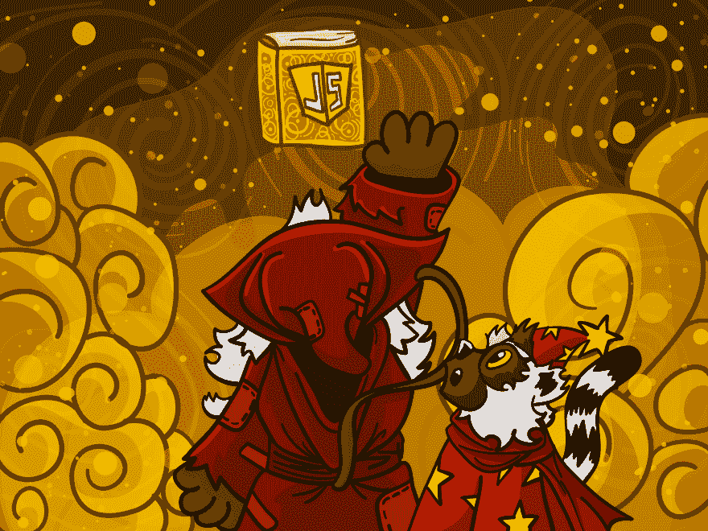
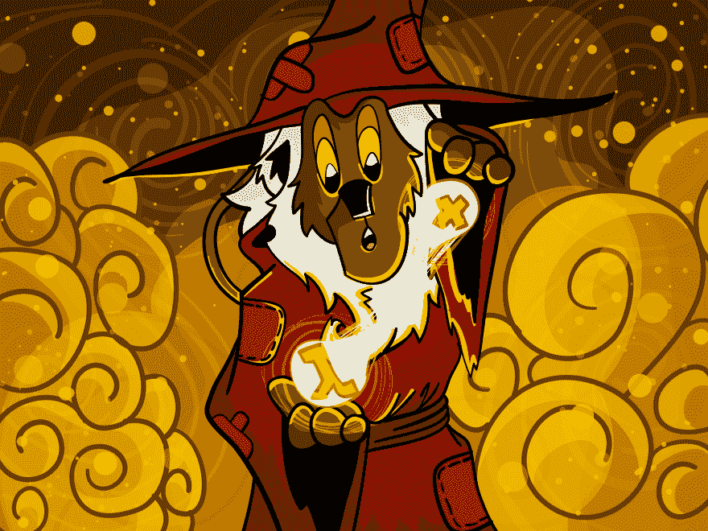

# 红宝石魔法书的故事-第三部分 Javascript 的狐猴

> 原文：<https://dev.to/baweaver/tales-of-the-ruby-grimoire-part-three-the-lemurs-of-javascript-5ac9>

这是东南红宝石 2019 演讲的文本版本，也是传奇红宝石魔法书的许多故事中的第一个，这是一本关于红宝石黑暗魔法的伟大而可怕的书。

我把它分成几个部分，这样就不会让人不知所措，因为最初的演讲非常形象。如果您想跳到其他部分，目录在这里:

**目录**

1.  第一部分——魔法书
2.  第二部分——斯卡拉狐猴
3.  [第三部分 Javascript 的狐猴](https://dev.to/baweaver/tales-of-the-ruby-grimoire-part-three-the-lemurs-of-javascript-5ac9)
4.  第四部分——哈斯克尔的狐猴
5.  [第五部分——论魔法的本质](https://dev.to/baweaver/tales-of-the-ruby-grimoire-part-five-on-the-nature-of-magic-g63)

# 红宝石魔法书的故事——第三部 Javascript 的狐猴

其中 Red 从 Javascript 的狐猴那里学到了解构的艺术和 Ruby proc 函数的秘密。

## Javascript 的狐猴介绍

[](https://res.cloudinary.com/practicaldev/image/fetch/s--OPEZLyfb--/c_limit%2Cf_auto%2Cfl_progressive%2Cq_auto%2Cw_880/https://thepracticaldev.s3.amazonaws.com/i/9coe8r5s9bhyhn5nqrcm.png)

在我的旅程中，在离这里不远的地方，我发现了 Javascript 的狐猴，迷人的大师，他们的课程甚至更迷人！

[](https://res.cloudinary.com/practicaldev/image/fetch/s--ahE8-aGb--/c_limit%2Cf_auto%2Cfl_progressive%2Cq_auto%2Cw_880/https://thepracticaldev.s3.amazonaws.com/i/qnto1usj015ekjz88ofm.png)

Javascript 的狐猴是时尚大师，拥有各种形式的配件、颜色、设计和装饰。为什么，他们甚至通过巴别塔艺术，在一个最奇妙的系统中，改变了他们通过配件交流的语言。

他们带来了我们在 Ruby 中所不知道的破坏艺术。

## 化腐朽为神奇

[](https://res.cloudinary.com/practicaldev/image/fetch/s--PmkXoyP1--/c_limit%2Cf_auto%2Cfl_progressive%2Cq_auto%2Cw_880/https://thepracticaldev.s3.amazonaws.com/i/tvfx0z5o1iic18eog6mu.png)

它允许他们通过名字从对象中提取值！

```
function moveNorth({ x, y }) {
  return { x: x, y: y + 1 };
}

moveNorth({ x: 1, y: 2 })
=> { x: 1, y: 3 } 
```

<svg width="20px" height="20px" viewBox="0 0 24 24" class="highlight-action crayons-icon highlight-action--fullscreen-on"><title>Enter fullscreen mode</title></svg> <svg width="20px" height="20px" viewBox="0 0 24 24" class="highlight-action crayons-icon highlight-action--fullscreen-off"><title>Exit fullscreen mode</title></svg>

`moveNorth`函数可以从传递给它的对象中提取`x`和`y`值，这种技术被称为析构。在这个函数内部，`x`的值是`1`，而`y`的值是`2`，所以我们可以用这些值将`1`加到`y`上，使其“向北”移动。

```
function moveNorth({ x, y }) {
  return { x, y: y + 1 };
}

moveNorth({ x: 1, y: 2 })
=> { x: 1, y: 3 } 
```

<svg width="20px" height="20px" viewBox="0 0 24 24" class="highlight-action crayons-icon highlight-action--fullscreen-on"><title>Enter fullscreen mode</title></svg> <svg width="20px" height="20px" viewBox="0 0 24 24" class="highlight-action crayons-icon highlight-action--fullscreen-off"><title>Exit fullscreen mode</title></svg>

Javascript 还有另一种魔力，我还没有找到模仿的方法，叫做双关语。当然，我们喜欢 Ruby 中的双关语，是的，一些著名的 Ruby 爱好者喜欢双关语，但是这种类型的双关语是不同的，超越了我们。

它允许我们在不改变`x`的情况下创建一个新对象，并在`y`的基础上添加一个对象，但这是另一种艺术。也就是说，在我弄清楚如何让它工作，以及要付出什么代价之后*抱怨道*

不管怎样，这不是重点，我们需要一些小技巧来实现它。

## 提取参数

[](https://res.cloudinary.com/practicaldev/image/fetch/s--_5mRyjbD--/c_limit%2Cf_auto%2Cfl_progressive%2Cq_auto%2Cw_880/https://thepracticaldev.s3.amazonaws.com/i/l0uwsw7203lrzkifw58p.png)

我们可以在 Ruby 中进行析构，但是首先我们必须学习从一个过程，或者说是一个函数中提取参数的艺术。

假设我们有一个函数。因为我们只需要看它的参数:

```
-> x, y {} 
```

<svg width="20px" height="20px" viewBox="0 0 24 24" class="highlight-action crayons-icon highlight-action--fullscreen-on"><title>Enter fullscreen mode</title></svg> <svg width="20px" height="20px" viewBox="0 0 24 24" class="highlight-action crayons-icon highlight-action--fullscreen-off"><title>Exit fullscreen mode</title></svg>

有一个关于过程或函数的方法，称为参数。它返回一个数组对，第一项是参数的类型，第二项是它的实际名称:

```
fn = -> x, y {}
fn.parameters
=> [[:req, :x], [:req, :y]] 
```

<svg width="20px" height="20px" viewBox="0 0 24 24" class="highlight-action crayons-icon highlight-action--fullscreen-on"><title>Enter fullscreen mode</title></svg> <svg width="20px" height="20px" viewBox="0 0 24 24" class="highlight-action crayons-icon highlight-action--fullscreen-off"><title>Exit fullscreen mode</title></svg>

如果我们要得到每一项的最后一项，我们有函数参数的名字:

```
fn = -> x, y {}
fn.parameters.map(&:last)
=> [:x, :y] 
```

<svg width="20px" height="20px" viewBox="0 0 24 24" class="highlight-action crayons-icon highlight-action--fullscreen-on"><title>Enter fullscreen mode</title></svg> <svg width="20px" height="20px" viewBox="0 0 24 24" class="highlight-action crayons-icon highlight-action--fullscreen-off"><title>Exit fullscreen mode</title></svg>

## 在红宝石中解构

[](https://res.cloudinary.com/practicaldev/image/fetch/s--N4IFDWeU--/c_limit%2Cf_auto%2Cfl_progressive%2Cq_auto%2Cw_880/https://thepracticaldev.s3.amazonaws.com/i/ecekv69sa9n9b88w6nxb.png)

这就是我们创造自己的解构所需要的一切。如果我们知道参数的名称，我们就可以使用它们。

假设我们有一个点，一个简单的结构:

```
Point = Struct.new(:x, :y) 
```

<svg width="20px" height="20px" viewBox="0 0 24 24" class="highlight-action crayons-icon highlight-action--fullscreen-on"><title>Enter fullscreen mode</title></svg> <svg width="20px" height="20px" viewBox="0 0 24 24" class="highlight-action crayons-icon highlight-action--fullscreen-off"><title>Exit fullscreen mode</title></svg>

对于那些不熟悉的人来说，它相当于这个，但我更愿意写上面的:

```
class Point
  attr_accessor :x, :y

  def initialize(x, y)
    @x = x
    @y = y
  end
end 
```

<svg width="20px" height="20px" viewBox="0 0 24 24" class="highlight-action crayons-icon highlight-action--fullscreen-on"><title>Enter fullscreen mode</title></svg> <svg width="20px" height="20px" viewBox="0 0 24 24" class="highlight-action crayons-icon highlight-action--fullscreen-off"><title>Exit fullscreen mode</title></svg>

为了简单起见，我们将从一个点开始，这个点叫做`0`的`x`和`0`的`y`:

```
Point = Struct.new(:x, :y)
origin = Point.new(0, 0) 
```

<svg width="20px" height="20px" viewBox="0 0 24 24" class="highlight-action crayons-icon highlight-action--fullscreen-on"><title>Enter fullscreen mode</title></svg> <svg width="20px" height="20px" viewBox="0 0 24 24" class="highlight-action crayons-icon highlight-action--fullscreen-off"><title>Exit fullscreen mode</title></svg>

让我们创建自己的方法 destructure，它接受一个对象和一个块函数。我们现在可以假设物体是我们的原点，我们的函数将有参数`x`和`y`

```
def destructure(obj, &fn)
end 
```

<svg width="20px" height="20px" viewBox="0 0 24 24" class="highlight-action crayons-icon highlight-action--fullscreen-on"><title>Enter fullscreen mode</title></svg> <svg width="20px" height="20px" viewBox="0 0 24 24" class="highlight-action crayons-icon highlight-action--fullscreen-off"><title>Exit fullscreen mode</title></svg>

第一步是从传入的块函数中获取参数的名称:

```
def destructure(object, &fn)
  argument_names = fn.parameters.map(&:last)
end 
```

<svg width="20px" height="20px" viewBox="0 0 24 24" class="highlight-action crayons-icon highlight-action--fullscreen-on"><title>Enter fullscreen mode</title></svg> <svg width="20px" height="20px" viewBox="0 0 24 24" class="highlight-action crayons-icon highlight-action--fullscreen-off"><title>Exit fullscreen mode</title></svg>

如果函数碰巧有`x`和`y`作为参数，就像上面说的一样:

```
argument_names = [:x, :y] 
```

<svg width="20px" height="20px" viewBox="0 0 24 24" class="highlight-action crayons-icon highlight-action--fullscreen-on"><title>Enter fullscreen mode</title></svg> <svg width="20px" height="20px" viewBox="0 0 24 24" class="highlight-action crayons-icon highlight-action--fullscreen-off"><title>Exit fullscreen mode</title></svg>

它允许我们获取任何函数的参数名，这非常方便。

接下来，我们需要通过从对象中提取值来做一些实际的析构:

```
def destructure(object, &fn)
  argument_names = fn.parameters.map(&:last)
  values = argument_names.map { |a| object.send(a) }
end 
```

<svg width="20px" height="20px" viewBox="0 0 24 24" class="highlight-action crayons-icon highlight-action--fullscreen-on"><title>Enter fullscreen mode</title></svg> <svg width="20px" height="20px" viewBox="0 0 24 24" class="highlight-action crayons-icon highlight-action--fullscreen-off"><title>Exit fullscreen mode</title></svg>

我们使用`map`将参数名转换为使用`send`的同名对象的值。在我们的原点和`x/y`函数的情况下，这意味着这条线最终会这样做:

```
values = [object.x, object.y] 
```

<svg width="20px" height="20px" viewBox="0 0 24 24" class="highlight-action crayons-icon highlight-action--fullscreen-on"><title>Enter fullscreen mode</title></svg> <svg width="20px" height="20px" viewBox="0 0 24 24" class="highlight-action crayons-icon highlight-action--fullscreen-off"><title>Exit fullscreen mode</title></svg>

现在我们有了值，剩下的就是用它调用原始函数:

```
def destructure(object, &fn)
  argument_names = fn.parameters.map(&:last)
  values = argument_names.map { |a| object.send(a) }

  fn.call(*values)
end 
```

<svg width="20px" height="20px" viewBox="0 0 24 24" class="highlight-action crayons-icon highlight-action--fullscreen-on"><title>Enter fullscreen mode</title></svg> <svg width="20px" height="20px" viewBox="0 0 24 24" class="highlight-action crayons-icon highlight-action--fullscreen-off"><title>Exit fullscreen mode</title></svg>

再次假设原点和那个函数，我们得到这样的结果:

```
-> x, y {}.call(*[0, 0]) 
```

<svg width="20px" height="20px" viewBox="0 0 24 24" class="highlight-action crayons-icon highlight-action--fullscreen-on"><title>Enter fullscreen mode</title></svg> <svg width="20px" height="20px" viewBox="0 0 24 24" class="highlight-action crayons-icon highlight-action--fullscreen-off"><title>Exit fullscreen mode</title></svg>

如果我们在原点上使用这种解构方法，我们甚至可以将它向北移动:

```
Point = Struct.new(:x, :y)
origin = Point.new(0, 0)

destructure(origin) { |x, y|
  Point.new(x, y + 1)
}
=> Point(0, 1) 
```

<svg width="20px" height="20px" viewBox="0 0 24 24" class="highlight-action crayons-icon highlight-action--fullscreen-on"><title>Enter fullscreen mode</title></svg> <svg width="20px" height="20px" viewBox="0 0 24 24" class="highlight-action crayons-icon highlight-action--fullscreen-off"><title>Exit fullscreen mode</title></svg>

该函数的`x`和`y`值现在被有效地绑定到我们的原点的`x`和`y`。

我们甚至可以做一些非常愚蠢的事情，比如使用`to_s`作为名称，这将返回给我们字符串表示。不知道为什么，但想想很有趣！

现在，一只聪明的狐猴可能能够使用这些相同的技巧来重新定义方法，添加一个`destructure`装饰器，它可以区分对象和预期的参数，但另一个章节恐怕暂时超出了我们的范围。

## 注意事项

这时，瑞德很担心，不得不说些什么。

“但这肯定是邪恶的，`send`是元编程！元编程是 Ruby 中万恶之源，不是吗？”瑞德反对道

“元编程有其用途，这是一个广阔的、很少被很好理解和探索的领域。自然有危险，但是一个人必须仅仅为了危险而放弃这种力量吗？也许是，也许不是，这取决于上下文和持用者的智慧。邪恶这个词太过强烈，不足以形容那些没有准备好的人所误解和滥用的东西。”克瑞森回答道。

瑞德点点头，考虑到自己显然已经准备好接受这样的艺术，他们继续往前走。

# 第三部分结束

第三部分到此结束，随之而来的是更多的资源。我不能说 Ruby 已经正式采用了这种类型的代码，但是也许有一天。

*   [Ruby Tapas-Param destructing](https://www.rubytapas.com/2019/02/25/parameter-destructuring/)
*   [Ruby 中的析构](https://medium.com/rubyinside/destructuring-in-ruby-9e9bd2be0360)
*   [Qo -析构分支匹配器](https://github.com/baweaver/qo/blob/bdd92b56cd7cc7f71f978d6b3cbb035c95b4b707/lib/qo/destructurers/destructurer.rb)

**目录**

1.  第一部分——魔法书
2.  第二部分——斯卡拉狐猴
3.  [第三部分 Javascript 的狐猴](https://dev.to/baweaver/tales-of-the-ruby-grimoire-part-three-the-lemurs-of-javascript-5ac9)
4.  第四部分——哈斯克尔的狐猴
5.  [第五部分——论魔法的本质](https://dev.to/baweaver/tales-of-the-ruby-grimoire-part-five-on-the-nature-of-magic-g63)