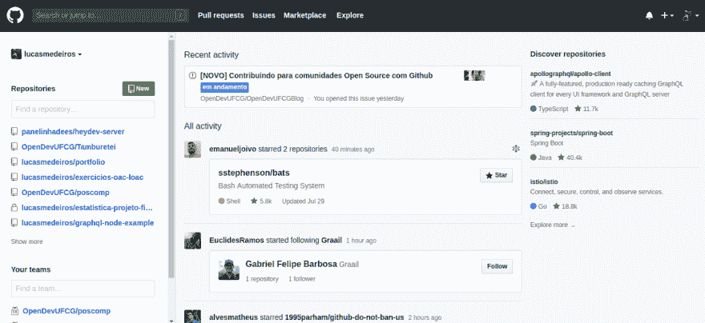
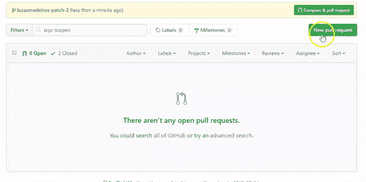
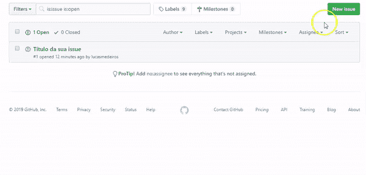
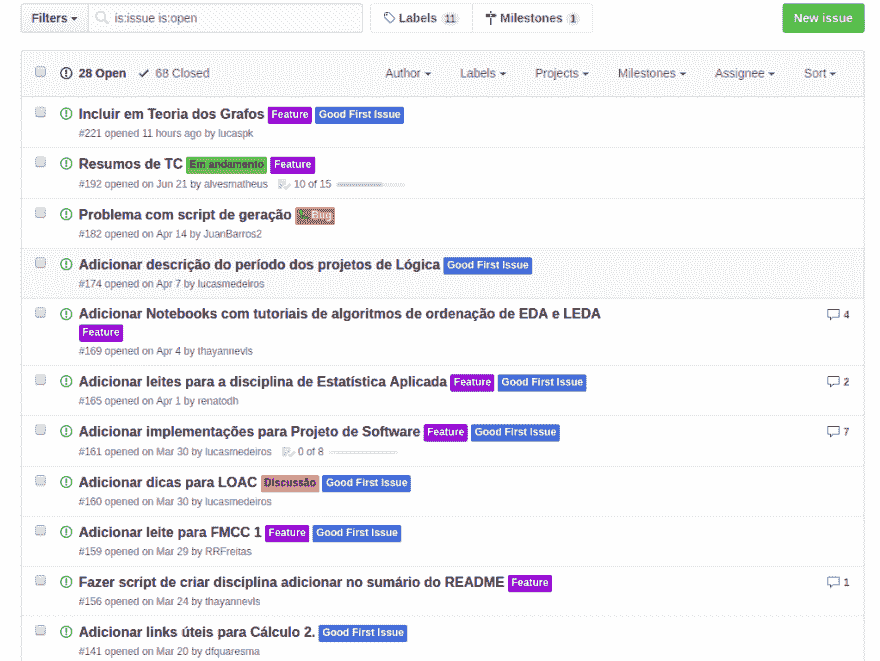

# 为 GitHub 的开源项目做出贡献

> [https://dev . to/openevufcg/为项目捐款-开源 com-github-3i76](https://dev.to/opendevufcg/contribuindo-para-projetos-open-source-com-github-3i76)

GitHub 创建于 2008 年，此后得到了很好的增强，不仅是目前最知名的 web 服务，它提供了适用于 Git 的各种源代码托管和版本控制功能，同时也是开源计划和团队协作的主要驱动因素。该平台越来越具有社交网络的性质，旨在吸引更多的人参与开源项目，参与各自社区的活动，并提高这些项目的知名度。之所以能够做到这一点，是因为 GitHub 为实现这些目标而采用和实施了许多功能，其中一些功能将在此帖子中介绍。

<figcaption>Screenshot da página inicial do GitHub atualmente.</figcaption>

## 开源社区

在继续 post 之前，您需要为开源社区澄清一个概念。一个社区由**用户**、**贡献者**和**维护者**组成。用户组(“T6【users】由将要使用开源系统的人组成，他们活跃在社区中，报告开发过程中可能出现的错误，并提出改进建议和新功能*。此外，根据项目使用的许可，用户可以自由地进行修改，例如将系统的某些部分更改为个人使用、用作其他项目中的组件，甚至将其推向市场。要知道可以做什么和不能做什么，总是最好检查存储库中的文件**并检查权限。***

 ***用户与贡献者(*贡献者*的区别在于对牵头组织的有效性。贡献者对组织进行更深入、更有用的讨论，直接更改代码，并请求将其内容附加到原始内容。促使某人对组织做出贡献的原因可能有很多:希望改进自己使用的应用程序、对组织的所有权、实际应用技术知识、通过有用和实际的贡献获得可见性等等。这就是开源的精神。

值得强调两点:第一，纳税人与组织无关。这意味着有人可能突然出现投稿，同样，也可能随时停止。第二，本组织制定捐款规则是很常见的，在开始之前，捐款者必须在所有规则之内，这一点非常重要。因此，他应仔细阅读 **README.md** 、 **CONTRIBUTING.md** 和**【code _ of _ conduct . MD】(如果有的话)文件中的内容。**

最后，我们有保管员(*保管员*。这些管理员负责维护“实时”项目并使其保持最新状态，因为他们是组织中有效的“**”成员，并且在 GitHub 存储库中具有管理员权限。他们应参与项目讨论、执行错误修复、实施功能、审核参与者的请求，并负责维护项目的组织:在存储库中排列文件和目录、分配“*任务”(*tasks)，以及对 t 台进行分类**

现在，有了更清晰的开源社区概念，我们可以开始讨论 GitHub 如何推动这些社区，以及如何利用平台成为其中的一部分。

## 星辰 e 叉

访问 GitHub 上的公共存储库时，可以给出类似于最著名社交网络的**、*功能，也可以做出**fork】，即创建一条狗主页屏幕上显示了您所关注的人在公共存储库中提供的‘T6’stars’和 **forks** ，这是一项旨在扩大开源项目范围的功能。*****

 *****## 拉式请求(PR)e 问题

从**fork**开始，在完成您认为必要的更改后，您可以提交请求，将修改后的内容附加到所选存储库中的原始内容。该申请为**拉式申请**，这是对平台上某个项目的最典型贡献形式，将由维护者审查。请注意以下打开新 PR 的过程:

还必须记住，对开源项目的贡献不仅仅是对源代码的直接修改。反馈、正在开发的软件中的错误警报、讨论项目的下一步行动、交换想法和建议，都可能对项目乃至整个组织的未来产生深远影响。因此，一个组织必须时刻关注其社区所说的话，这一点至关重要。

在此背景下，GitHub 提供了“问题”，这是一个可供普通用户和维护者使用的空间，用于上述所有点的用途，并用于确定要执行的任务的优先级和组织。请注意以下打开新问题的过程:

## 发现存储库并作出贡献

在开源世界的“探险”开始之际，从哪里开始投稿还不是很清楚，这是很常见的。为了最大限度地减少这一困难，您可以查看“t0”[【发现存储库】](https://github.com/discover) ，它根据您给 star 的其他存储库，为您所从事的最新技术带来了非常有趣的项目建议

找到您标识的项目后，您可以浏览“**readme . MD**”文件以获取有关该项目的信息，以及该项目使用的技术，如在计算机上运行、主页链接等。请记住，此文件中信息的可用性在很大程度上取决于创建项目的组织以及项目组织活动的方式。

了解此项目并决定要为其做出贡献后，一个很好的起点是查看未解决的问题，并检查其“T0”标签，该标签是一种问题分类和优先排序的方式，PR 有助于组织工作。为了让你更舒适地开始投稿，有趣的是，最初的搜索是以**好的第一个问题**、**容易**和**想要帮助**为例的标签。还应指出的是，按标签对问题和 PR 进行分类也取决于您的组织如何“组织”。

<figcaption>Screenshot da página de issues do [Tamburetei](https://github.com/OpenDevUFCG/Tamburetei) com suas labels.</figcaption>

您可以在讨论任何问题时提出新的想法，也可以做一个公关来解决这些问题。稍后，当您在组织中更方便时，可以打开新问题或尝试解决一些更复杂的问题。

## 探索 o GitHub

访问开源项目新闻的另一种方法是访问 GitHub 页 ，该页除了显示推荐项目外(如上一主题所示)，还允许这些项目的社区之间建立联系。您可以浏览受托人内容、按主题和标签搜索项目、访问与推荐技术相关的帖子、文章、事件和会议信息，以及其他信息。

这些是 GitHub 发现的一些主要方法，可让您了解开源项目并促进开发人员之间的协作。你可以深入了解 Git 和 GitHub 的运作，在另一篇文章中获得更多的技术信息，同时马上开始支持开源！

非常感谢你的阅读！注意:很快，我们将在 **dev.to** 收到来自 opendevufcg 投稿人的新文章。陪同 openevufcg no[Twitter](https://twitter.com/OpenDevUFCG)、no [Instagram](https://instagram.com/OpenDevUFCG) 当然还有 [GitHub](https://github.com/OpenDevUFCG) 。********