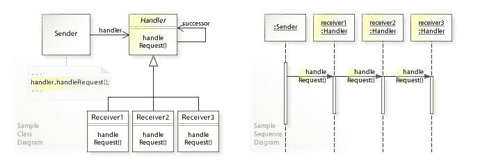

# 用责任链模式简化 React 组件设计

> 原文：<https://dev.to/xavios5/simpler-react-component-design-with-the-chain-of-responsibility-pattern-319o>

React 是一个非常棒的前端开发库，它以光速工作，很容易拿起并开始使用它。它利用简单的概念，主要使用常见的 JavaScript 知识来构建单页面应用程序，而不是在众所周知的前端层之上创建奇异的抽象。React 使用基于组件的架构来构建 UI。您的应用程序将是一个组件，它可以包含相互嵌套的其他组件。

像 Angular 或 Vue 这样的框架在你的代码上强制执行一个结构，有了 React 你就不会被库绑定到文件夹或最佳实践。这意味着，如果你不小心行事，你可能会得到一个嵌套很深的、相互依赖的组件图，这将很难进行单元测试，更不用说维护了。

关于如何将不同类型的逻辑分离到不同类型的容器中，有一些基于丰富经验的有趣想法。这解决了数据获取逻辑和数据呈现逻辑的耦合问题。这些方法背后的主要思想是使部分应用程序代码独立且小，以防止过于复杂。

# 我所面临的问题

我认为自己是一个相当有经验的全栈 web 开发人员，最初是从基于微软的栈开始的，但是从那以后我扩展了我的技能。尽管我学习 React 才 20 天，但我已经在其他领域看到过几次类似的问题。

为了学习 React，我开始尽可能多地获取相关信息。我已经开始听播客，阅读讨论，甚至浏览一本书。在我认为我已经拥有了激发我的好奇心所需要的东西之后，我开始建立一个项目来解决真正的问题。我的应用程序是一个新闻门户，到处都是文章。

导致这篇文章的问题是关于我的一个组件，它本来是用来显示文章标题和关于文章的元数据的。在我应用程序中，一篇文章可以有三种不同的状态:

*   一篇文章可以**不可见** -通过搜索从展示中过滤掉
    *   一篇文章仍然可以被**加载** -为了练习，我决定把框架文章放在那些仍然没有被加载的文章的地方。
    *   并且最后 And 文章可以**完整呈现**在 app 上。

让我们来看一些简化的代码示例:

```
import React from 'react';
class Article extends React.Component {

  constructor(props) {
    super(props);
    this.state = { articles : [] };
  }

  async componentDidMount() {
    const result = await fetch('http://sample.com/');
    const articles = await result.json();
    this.setState({articles: articles});
  }

  render() {
    return this.state.articles.map( article => {
      if (!article.visible) return <React.Fragment />;
      else if (article.loading) {
        return <div className="article skeleton" />;
      }
      else {
        return (
          <div className="article">
            {article.title}
          </div>);
      }
    });
  }
}
export default Article; 
```

<svg width="20px" height="20px" viewBox="0 0 24 24" class="highlight-action crayons-icon highlight-action--fullscreen-on"><title>Enter fullscreen mode</title></svg> <svg width="20px" height="20px" viewBox="0 0 24 24" class="highlight-action crayons-icon highlight-action--fullscreen-off"><title>Exit fullscreen mode</title></svg>

当然，框架和完全渲染的文章要比上面这个虚拟的例子复杂一点，这个组件的渲染方法总共超过 100 行！大量的行意味着比我喜欢一次处理的更高的复杂性。

# 模式到来，化险为夷...

当我看到这一点时，我开始构思，也许是时候使用责任链模式来使组件一目了然了。正如 [RefactoringGuru](https://refactoring.guru/design-patterns/chain-of-responsibility) 所说:

> **责任链**是一种行为设计模式，让你沿着处理程序链传递请求。收到请求后，每个处理程序决定是处理请求还是将请求传递给链中的下一个处理程序。

这看起来真的像是我们可以用来简化这个复杂的渲染函数的东西。假设有以下处理程序:

1.  不可见的文章处理程序——如果文章不可见，它会呈现一个空片段，否则它会传递请求。
2.  加载文章处理程序——如果文章正在加载，它将呈现框架，否则它将传递请求。
3.  完整文章处理程序-呈现完整文章。

因此，我们需要创建这些处理程序，并想办法将它们一个接一个地链接起来。考虑下面来自 [Wikipedia](https://en.wikipedia.org/wiki/Chain-of-responsibility_pattern) 的 UML 图，以理解实现是如何工作的:
[](https://res.cloudinary.com/practicaldev/image/fetch/s--6a1ezsRv--/c_limit%2Cf_auto%2Cfl_progressive%2Cq_auto%2Cw_880/https://upload.wikimedia.org/wikipedia/commons/6/6a/W3sDesign_Chain_of_Responsibility_Design_Pattern_UML.jpg)**处理程序**将按顺序保存所有处理程序的列表，它将尝试处理来自**发送方**的传入请求(在我们的例子中，发送方是呈现方法)。一旦**接收器 1** 收到请求，它将决定是否能够处理它。如果没有，那么它将回调**处理程序**以将请求传递给下一个处理程序(图片上的接收者)。这种情况一直持续到一个接收者真正处理请求。

在实现中，我想尽可能多地使用 ES6 的特性——这样我就可以从中了解更多。

# 解

让我们首先创建实际的处理程序，它将处理请求，然后关注将它们链接在一起的机制。

如果文章不可见，首先编写一个处理程序来处理请求，如果不可见，就回调父对象来处理请求。

```
import React from 'react';
class InvisibleArticleHandler extends ArticleHandler {
  handleRequest = article => {
    if (!article.visible) {
      return <React.Fragment />;
    }
    return super.handleRequest(article);
  }
}
export default InvisibleArticleHandler; 
```

<svg width="20px" height="20px" viewBox="0 0 24 24" class="highlight-action crayons-icon highlight-action--fullscreen-on"><title>Enter fullscreen mode</title></svg> <svg width="20px" height="20px" viewBox="0 0 24 24" class="highlight-action crayons-icon highlight-action--fullscreen-off"><title>Exit fullscreen mode</title></svg>

接下来，如果文章正在加载，编写一个处理程序来处理请求，如果没有，就回调父对象来处理请求。

```
import React from 'react';
class LoadingArticleHandler extends ArticleHandler {
  handleRequest = article => {
    if (article.loading) {
      return <div className="article skeleton" />;
    }
    return super.handleRequest(article);
  }
}
export default LoadingArticleHandler; 
```

<svg width="20px" height="20px" viewBox="0 0 24 24" class="highlight-action crayons-icon highlight-action--fullscreen-on"><title>Enter fullscreen mode</title></svg> <svg width="20px" height="20px" viewBox="0 0 24 24" class="highlight-action crayons-icon highlight-action--fullscreen-off"><title>Exit fullscreen mode</title></svg>

最后，编写一个处理程序，在文章满载的情况下处理请求。

```
import React from 'react';
class FullArticleHandler extends ArticleHandler {
  handleRequest = article => (
        <div className="article">
          {article.title}
        </div>
  );
}
export default FullArticleHandler; 
```

<svg width="20px" height="20px" viewBox="0 0 24 24" class="highlight-action crayons-icon highlight-action--fullscreen-on"><title>Enter fullscreen mode</title></svg> <svg width="20px" height="20px" viewBox="0 0 24 24" class="highlight-action crayons-icon highlight-action--fullscreen-off"><title>Exit fullscreen mode</title></svg>

现在是时候编写父类了，它是在具体的处理程序中扩展的。这个类保持对处理程序的跟踪。

```
class ArcticleHandler {

  constructor() {
    this.handlers = [];
    }

  addHandler = handler => { this.handlers.push(handler); }

  empty = () => { this.handlers = []; }

  handleRequest(arcticle) {
    // FIFO - get the first handler from the array of handlers.
    const nextHandler = this.handlers.shift();

    // Pass the list of handlers to the concrete reciever object,
    // as when it is calling into it's parent's method, the call
    // is on that object, not on the original handler!
    nextHandler.handlers = this.handlers;
    return nextHandler.handleRequest(arcticle);
  }
}
export default ArcticleHandler; 
```

<svg width="20px" height="20px" viewBox="0 0 24 24" class="highlight-action crayons-icon highlight-action--fullscreen-on"><title>Enter fullscreen mode</title></svg> <svg width="20px" height="20px" viewBox="0 0 24 24" class="highlight-action crayons-icon highlight-action--fullscreen-off"><title>Exit fullscreen mode</title></svg>

利用这一点，我们最终可以用可读性更强的文章组件来呈现新闻:

```
import React from 'react';
import ArcticleHandler from './ArcticleHandler';
import InvisibleArticleHandler from './InvisibleArticleHandler';
import LoadingArticleHandler from './LoadingArticleHandler';
import FullArticleHandler from './FullArticleHandler';

class Article extends React.Component {

  constructor(props) {
    super(props);
    this.state = { articles : [] };
  }

  async componentDidMount() {
    const result = await fetch('http://sample.com/');
    const articles = await result.json();
    this.setState({articles: articles});
  }

  render() {
    const articleHandler = new ArticleHandler();
    return this.state.articles.map( article => {
      // Reset the handlers for each article
      articleHandler.empty();
      articleHandler.addHandler(new InvisibleArticleHandler());
      articleHandler.addHandler(new LoadingArticleHandler());
      articleHandler.addHandler(new FullArticleHandler());
      return arcticleHandler.handleRequest(arcticle);
    });
  }
}
export default Article; 
```

<svg width="20px" height="20px" viewBox="0 0 24 24" class="highlight-action crayons-icon highlight-action--fullscreen-on"><title>Enter fullscreen mode</title></svg> <svg width="20px" height="20px" viewBox="0 0 24 24" class="highlight-action crayons-icon highlight-action--fullscreen-off"><title>Exit fullscreen mode</title></svg>

利用**责任链**模式，render 方法可以用特定领域的语言编写，所以下次你使用这个方法时，你会看到，它会尝试按照所描述的顺序根据规则来呈现一篇文章。

我真的希望我给了你一些有价值的东西，给了你我从解决一个复杂性相关的问题中得到的洞察力。将来我会继续在这里张贴我在学习正确反应的旅程中的下一个发现。

任何评论/反馈都非常受欢迎，无论是在这里还是在我的 Twitter 上 [@xavios5](https://dev.to/xavios5) ！