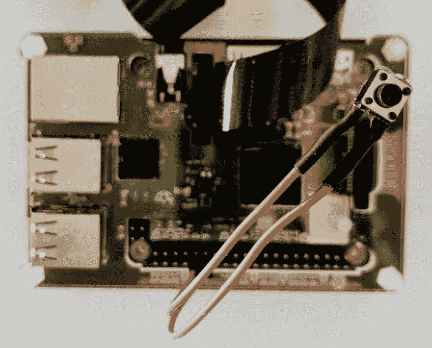
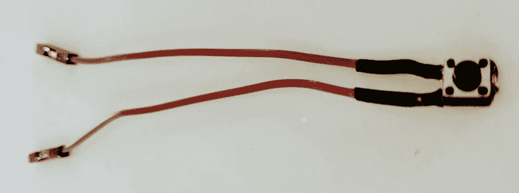

# 建立一个安全的方法，用一个小按钮关闭一个无头的树莓派。

> 原文：<https://dev.to/stephaniecodes/build-a-safe-way-to-shutdown-a-headless-raspberry-pi-with-a-tiny-button-2ca3>

当您使用 raspberry pi 处理硬件项目时，务必优雅地关闭 pi 以防止 pi 的 SD 卡数据损坏。

在我最新的项目中，我将 RPI 3B+用在一个附着在我身上的可穿戴设备上。为了安全地关闭它，而不必从我的笔记本电脑上 SSH 到它，我创建了这个插入 GPIO 头的小按钮，它可以在该关闭它的时候触发 Pi 的安全和优雅的关闭。

[](https://res.cloudinary.com/practicaldev/image/fetch/s--81Xynbe8--/c_limit%2Cf_auto%2Cfl_progressive%2Cq_auto%2Cw_880/https://thepracticaldev.s3.amazonaws.com/i/htiqzm2cq2262bdjmfeh.jpg)

### 1。制作按钮:

*   将母-母跨接电缆切成两半。
*   剥去两端，分别焊接到按钮一侧的一个引脚上。
*   剪掉按钮另一侧的针脚。
*   将两端插入 pi 上的 1 个接地和 1 个 GPIO 引脚。我用的是 GPIO #12 &旁边的地。

我的焊接按钮:
[](https://res.cloudinary.com/practicaldev/image/fetch/s--ii-UW9XJ--/c_limit%2Cf_auto%2Cfl_progressive%2Cq_auto%2Cw_880/https://thepracticaldev.s3.amazonaws.com/i/ypmdaevmbiacw31avxmw.jpg)

[附π](https://res.cloudinary.com/practicaldev/image/fetch/s--XDfWq6W9--/c_limit%2Cf_auto%2Cfl_progressive%2Cq_auto%2Cw_880/https://thepracticaldev.s3.amazonaws.com/i/v8vw600t1a81sw1nieme.jpg)

### 2。为按钮编写一个程序:

感谢 Alex Glow 关于创建类似按钮的文章,我能够使用提到的脚本并为我的 pi 修改它。

(我创建这个程序是通过输入`touch shutdown_pi.py`，然后打开文件:`sudo nano shutdown_pi.py`粘贴下面的代码并保存(CTRL+X)。

```
#!/bin/python 
# Simple script for shutting down the raspberry Pi at the press of a button. 
# by Inderpreet Singh 
import RPi.GPIO as GPIO  
import time  
import os

# Use the Broadcom SOC Pin numbers 
# Setup the Pin with Internal pullups enabled and PIN in reading mode. GPIO.setmode(GPIO.BCM)  
GPIO.setup(12, GPIO.IN, pull_up_down = GPIO.PUD_UP)

# Our function on what to do when the button is pressed def Shutdown(channel):  
   os.system("sudo shutdown -h now")  

# Add our function to execute when the button pressed event happens GPIO.add_event_detect(12, GPIO.FALLING, callback = Shutdown, bouncetime = 2000)  

# Now wait! while 1:  
   time.sleep(1) 
```

### 3。创建一个 cronjob:

我们希望这个程序在启动时运行，并在后台运行
，以便当按钮被按下时，程序将触发
关机脚本运行。你可以在 pi 上以几种不同的方式触发程序在引导时运行
，但是我已经使用了 cronjobs，所以我编辑了那个文件。

*   运行`crontab -e`(如果是第一次，我会选择选项 2，用 nano 编辑文件)。
*   在文件底部，添加`@reboot python /home/pi/shutdown_pi.py &`(提示:末尾的`&`告诉 pi 在后台运行程序)
*   按 CTRL+X 保存并退出。

### 4。测试一下！

*   运行`sudo shutdown -r now`重新启动 pi。
*   重启后按下按钮，现在应该可以安全关闭 pi 了！🎉

#### 更新(2019 年 8 月 4 日):

我在构建这个的时候并没有意识到，但是有一个潜在的更简单的解决方案！

焊接按钮，但将其插入 GPIO #3 (I2C-SCL)和接地(引脚 5 和 6)。将行`dtoverlay=gpio-shutdown,gpio_pin=3`添加到`/boot/config.txt`文件并重启。应该允许启动和关闭。

根据我的经验，只有启动可以工作，关机不行，所以我坚持使用上面的 cronjob！✌️