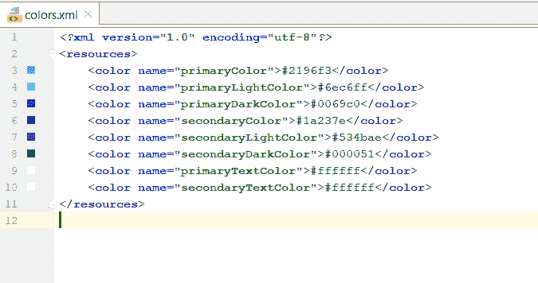
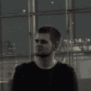
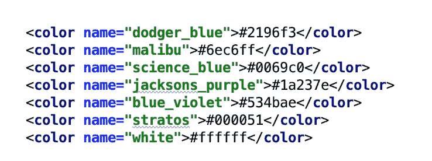
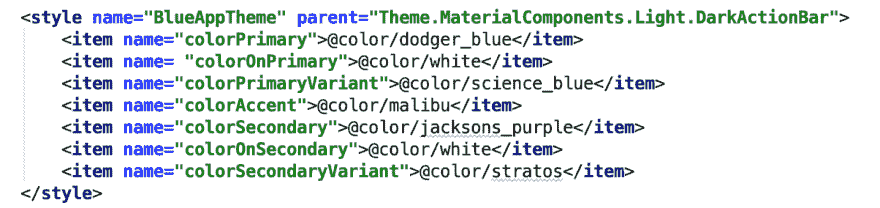

# Android 主题再探:第 1 部分

> 原文：<https://dev.to/pabiforbes/theming-in-android-revisited-part-1-21m7>

去年七月的某个时候，我写了一篇关于 Android 主题化的博文。这个帖子收到了一些好的评论，所以我决定用新获得的信息重新讨论这个话题，与社区分享。但是在我们开始讨论如何应用主题之前，让我们看看为什么要考虑主题。

# 什么是主题化？🤷🏿

一个主题可以被描述为*统一一个想法，而主题化就是设计或者将这个想法赋予一个物体、应用或者空间*。主题是用来创建一个整体的外观和感觉。

我们应该关心我们的应用程序看起来怎么样吗？嗯，你会想为你的最终用户创造一个难忘的体验。并创建一组可重用的属性来应用于整个应用程序。主题化也使我们能够在应用程序中创造视觉一致性。 [Smashing Magazine](https://www.smashingmagazine.com/2018/02/comprehensive-guide-to-mobile-app-design/) 这样描述视觉一致性——*“整个 app 的字体、按钮、标签需要一致”*。

让我们进入主题，在这篇文章中，我们将使用材料组件。将以下内容添加到您的 gradle 文件中:

`com.google.android.material:material:$material_version`

## 颜色🎨

颜色是我上一篇关于主题化的文章的主题。我还包括了一些有用的工具，比如[材质设计调色板](https://www.materialpalette.com/)和[颜色工具](https://material.io/tools/color/#!/?view.left=0&view.right=0)。从这些工具中提取颜色可能如下所示:

正如在之前的文章中所指出的，

## [阿列克谢多尔吉](/adolgiy) <button name="button" type="button" data-info="{&quot;className&quot;:&quot;User&quot;,&quot;style&quot;:&quot;full&quot;,&quot;id&quot;:139969,&quot;name&quot;:&quot;Aleksey Dolgiy&quot;}" class="crayons-btn follow-action-button whitespace-nowrap c-btn--secondary fs-base " aria-label="Follow user: Aleksey Dolgiy" aria-pressed="false">跟随</button>

[/adolgiy](/adolgiy)there seems to be a duplication of color from the exported file from the Material Color Tool. So how do we solve the duplication issue? Well, it is quite simple, we name our colors. A cool online tool you can make use of is [Name that Color](http://chir.ag/projects/name-that-color), and the result looks like this:

这帮助我们摆脱了重复的颜色，我们给我们的颜色命名，因为颜色有名字。如果我们需要为应用程序定义多个主题，这将特别有用。这就是我们如何使用颜色来定义应用程序主题的样式:

### 在颜色上

“开”色——即原色、二次色、背景色、表面色、错误色，如上图所示，通常用于图标、文字和笔画。

## 酷资源👀

*   [材料设计-颜色系统](https://material.io/design/color/the-color-system.html)
*   [材料设计](https://material.io/)
*   [Uplabs](https://www.uplabs.com/) *寻求一些灵感*
*   [砸弹匣](https://www.smashingmagazine.com/2018/02/comprehensive-guide-to-mobile-app-design/)

*快乐主题化*