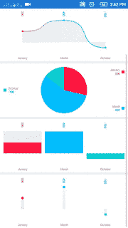
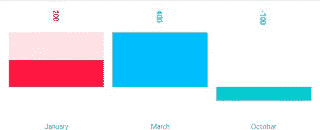
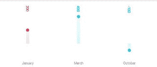
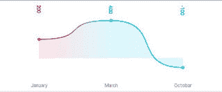
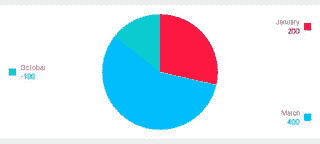
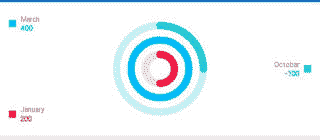
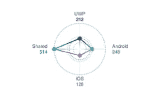
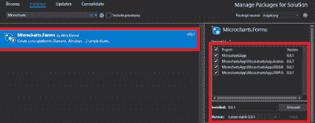

# Xamarin 表单应用程序中的图表

> 原文：<https://dev.to/logeshpalani98/charts-in-xamarin-forms-app-4hcn>

**简介**在移动应用程序中显示图表一直是向用户提供数字数据清晰概览的好方法。我希望这项任务像编写几行代码一样简单，但是我找不到一种简单的方法来实现这一点。这就是为什么我开始探索 SkiaSharp，并创造微图表。

*NuGet 包:Xamarin。Forms = search”微图表。表单"*

这个简单的插件可以在 Xamarin.Forms 中显示微型图表。

[](https://1.bp.blogspot.com/-AtohAacfQss/XUXMPY-RUlI/AAAAAAAAOzI/IkhGYk2fZW4zkYx38rxyh1uepuT3P04ggCLcBGAs/s1600/result.gif)

**可用图表微图表。表单插件**

*   Barchart
*   点图
*   线性图表
*   东纳特哈特
*   径向标尺
*   拉达尔沙特

**图表类型**

1.  BarChart

2.  图表视图。Chart = new 条形图(){ Entries = Entries }；

[](https://1.bp.blogspot.com/-J43kF7Cv-tc/XUXNCE9nlJI/AAAAAAAAOzU/7LP35uJjVugEgWRaO__5yJAfnZYyx8RnwCLcBGAs/s1600/BarChartNew.jpg)

1.  点图

2.  图表视图。chart = new point chart(){ Entries = Entries }；

[](https://1.bp.blogspot.com/-tBioRZZBfUA/XUXNuT66BvI/AAAAAAAAOzc/P4-xsw9g-JAf4iAIF-j4_JQCx-gA7w0bQCLcBGAs/s1600/PointChartNew.jpg)

1.  线性图表

2.  图表视图。chart = new LineChart(){ Entries = Entries }；

[](https://1.bp.blogspot.com/-BL-q_8ZuIWo/XUXOD0TvkbI/AAAAAAAAOzk/hkSv03UqgAEAbCMtKUwHAUPy2pjV6QIVwCLcBGAs/s1600/LineChartNew.jpg)

1.  东纳特哈特

2.  图表视图。chart = new DonutChart(){ Entries = Entries }；

[](https://1.bp.blogspot.com/-p9V3FMg_KNk/XUXOwN1j0-I/AAAAAAAAOzw/TmE9HCFrKw0wTeFKKGC8O4OiVXt3rdtewCLcBGAs/s1600/DonutChartNew.jpg)

1.  径向标尺

2.  图表视图。chart = new radial gaugechart(){ Entries = Entries }；

[](https://1.bp.blogspot.com/-CrmRh2Ede74/XUXPDH9RZdI/AAAAAAAAOz4/DoNpNDIwy0kDHpeHpCXcT_k2C_iHF8sIgCLcBGAs/s1600/RadiaGuageChartNew.jpg)

1.  拉达尔沙特

2.  图表视图。chart = new RadartChart(){ Entries = Entries }；

[](https://1.bp.blogspot.com/-v7XG5-634QY/XUXQ69wjuXI/AAAAAAAAO0E/w_UswtsnnwIvFXoo1ju7vxEItPhogd4AACLcBGAs/s1600/RadarChartNew.png)

**第 1 步**你可以创建 Xamarin。表单 app 通过去文件> >新建> > Visual C# > >跨平台> >跨平台 App (Xamarin。原生或 Xamarin。表单)，给出应用程序名称并按 OK。

(项目名称:MicrochartsApp)

现在，为您的项目添加下面的 NuGet 包。

*   微型汽车。形式

为此，请转到解决方案资源管理器并选择您的解决方案。右键单击并选择“管理解决方案的 NuGet 包”。现在，选择下面的 NuGet 包，选择您的项目，并安装它。

*   微型汽车。形式

[](https://1.bp.blogspot.com/-PAHaRFeYwo4/XUXRTwtyYFI/AAAAAAAAO0M/wvY4VytH8F8eFYwMDfa5wiB6tF09NJeaQCLcBGAs/s1600/Nuget.png)

**第三步**

要显示一个图表，我们需要将它放在一个图表视图中。

```
After installing NuGet packages, add a ChartView control to your project. For that, go to Solution Explorer \>\> MicrochartsApp(PCL) \>\>\> Double-click on MainPage.xaml. After opening this, you can add assembly and XAML code to your project. Here is the code for this page. 
```

**组装**

1.  xmlns:forms = " clr-namespace:Microcharts。表单；assembly=Microcharts。表单"

**XAML 电码**

2.  <contentpage http:="">http://xamarin.com/schemas/2014/forms"</contentpage>
3.  xmlns:x = "[http://schemas.microsoft.com/winfx/2009/xaml](http://schemas.microsoft.com/winfx/2009/xaml)
4.  xmlns:local = " clr-namespace:MicrochartsApp "
5.  x:Class="MicrochartsApp。主页"
6.  xmlns:forms = " clr-namespace:Microcharts。表单；assembly=Microcharts。表单">

8.  <stacklayout orientation="Vertical"></stacklayout>

10.  < forms:ChartView x:Name="Chart1 "
11.  HeightRequest="150"/>
12.  <chartview x:name="Chart2" heightrequest="150"></chartview>
13.  < forms:ChartView x:Name="Chart3 "
14.  HeightRequest="150"/>
15.  < forms:ChartView x:Name="Chart4 "
16.  HeightRequest="150"/>
17.  < forms:ChartView x:Name="Chart5 "
18.  HeightRequest="150"/>
19.  <chartview x:name="Chart6" heightrequest="160"></chartview>

**第 4 步**在这一步中，添加数据条目。为此，打开解决方案资源管理器>>MicrochartsApp(PCL)>>点击打开 MainPage.xaml.cs。

```
 Every chart displays via Microcharts and consumes a set of data entries. They will always have the same structure regardless of the chart type that you want to display. 
```

**每个条目**

*   需要表示其值的浮点数。
*   标签-你的条目与什么相关联。
*   值标签-格式化您的值
*   颜色输入

1.  使用微型汽车；
2.  使用 SkiaSharp
3.  使用微型图表。表单；
4.  使用系统；
5.  使用系统。集合。泛型；
6.  使用系统。Linq
7.  使用系统。文本；
8.  使用系统。线程。任务；
9.  使用 Xamarin。表单；
10.  使用 Entry = Microcharts。词条；

13.  命名空间 MicrochartsApp
14.  {
15.  公共分部类主页:内容页
16.  {
17.  列表<entry>条目=新列表</entry>
18.  {
19.  新条目(200)
20.  {
21.  Color=SKColor。解析(" #FF1943 ")，
22.  Label = "一月"，
23.  ValueLabel = "200 "
24.  },
25.  新条目(400)
26.  {
27.  Color = SKColor。Parse("00BFFF ")，
28.  Label = "三月"，
29.  ValueLabel = "400 "
30.  },
31.  新条目(-100)
32.  {
33.  Color = SKColor。解析(" # 00CED1 ")，
34.  Label = "Octobar "，
35.  值标签= "-100 "
36.  },
37.  };
38.  公共主页()
39.  {
40.  initialize component()；

43.  图表 1。chart = new radial gaugechart(){ Entries = Entries }；
44.  图表 2。chart = new LineChart(){ Entries = Entries }；
45.  图表 3。chart = new DonutChart(){ Entries = Entries }；
46.  图表 4。Chart = new 条形图(){ Entries = Entries }；
47.  图表 5。chart = new point chart(){ Entries = Entries }；
48.  //图表 6。chart = new radar chart(){ Entries = Entries }；
49.  }
50.  }
51.  }

**第五步**

现在，进入“构建”菜单，配置你的启动项目。配置完成后，运行您的项目。你会有如下的结果。

[](https://1.bp.blogspot.com/-AtohAacfQss/XUXMPY-RUlI/AAAAAAAAOzM/wMp3tKeKdlgIppsVWbMhyisUvR0qCpySwCEwYBhgL/s1600/result.gif)

最后，我们成功地创造了 Xamarin。表单微图表应用程序。