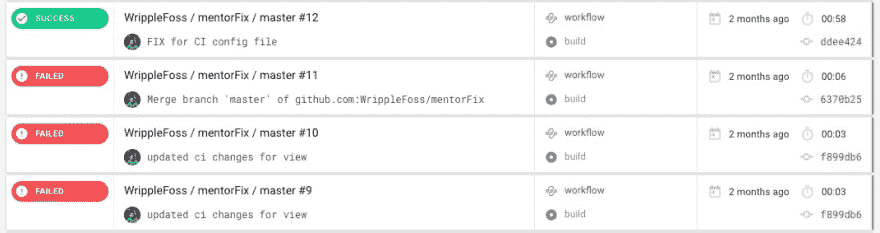
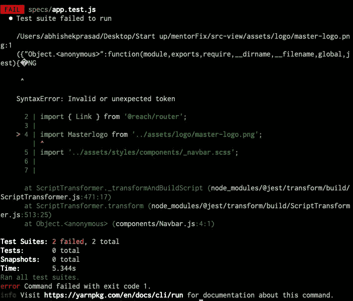
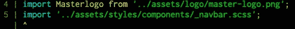
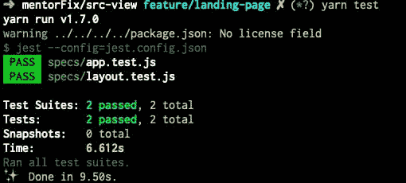

# 照常测试问题...

> 原文：<https://dev.to/abhishek71994/testing-issues-as-usual-pkm>

在经历了为我的 schmol 项目设置 CI/CD 之后，我意识到 TDD 是一个非常酷的东西，它有助于自动化工作，并且不仅给了编码者信心，也给了评审者信心。

说到这里，我已经实现了 Jest 和 Enzyme 来设置测试。现在，作为一名开发人员，我真的很想知道更多关于测试的知识。我工作的公司 Fave(我们正在招聘，链接在这篇文章的末尾)非常重视 TDD，我知道哪里以及为什么需要它。

所以很明显，我不得不选择最受欢迎的选项，Jest 和酶。我仍然不知道我为什么要这么做。但是，嘿，经过这么长时间的设置...

[](https://res.cloudinary.com/practicaldev/image/fetch/s--ofZOhzDQ--/c_limit%2Cf_auto%2Cfl_progressive%2Cq_auto%2Cw_880/https://thepracticaldev.s3.amazonaws.com/i/en98uykzvx1r1xnm92l4.jpeg)

天哪太棒了！😱

我真的很开心，直到我现在重构了我的代码。撞见了这个坏男孩。

[](https://res.cloudinary.com/practicaldev/image/fetch/s--zae-cpX1--/c_limit%2Cf_auto%2Cfl_progressive%2Cq_auto%2Cw_880/https://thepracticaldev.s3.amazonaws.com/i/olizuza30t2jxj7p058m.jpeg)

[](https://i.giphy.com/media/CDJo4EgHwbaPS/giphy.gif)

所以显然 Jest 不能处理导入图像。

`When you import image files, Jest tries to interpret the binary codes of the images as .js, hence runs into errors.`

我做了一些研究，发现有一个叫做`moduleNameMapper`的东西，需要对它进行配置才能解决问题。

嗯嗯嗯看起来工作量太大了...网飞突破！

[](https://i.giphy.com/media/l0HlL96SusHggSo6s/giphy.gif)

*2 集之后*

好吧！我们开始吧！

因为我已经有了一个`jest.config.json`来设置用于测试的 polyfills 和设置酶适配器(我不知道为什么，但它没有工作)。

我所要做的就是添加

```
"moduleNameMapper": {
        "\\.(jpg|ico|jpeg|png|gif|eot|otf|webp|svg|ttf|woff|woff2|mp4|webm|wav|mp3|m4a|aac|oga)$": "<rootDir>/__mocks__/fileMock.js",
        "\\.(css|less)$": "<rootDir>/mocks/fileMock.js"
    } 
```

现在开始嘲笑文件。用简单的
`exports default '';`创建了它们...

[](https://res.cloudinary.com/practicaldev/image/fetch/s---35S9lH1--/c_limit%2Cf_auto%2Cfl_progressive%2Cq_auto%2Cw_880/https://thepracticaldev.s3.amazonaws.com/i/ytxe709w8g1bubcp7at1.jpeg)

[](https://res.cloudinary.com/practicaldev/image/fetch/s--JwodXnMq--/c_limit%2Cf_auto%2Cfl_progressive%2Cq_66%2Cw_880/http://giphygifs.s3.amazonaws.com/media/i8tV2kJB8Gig8/giphy.gif)T3】

```
"moduleNameMapper": {
        "\\.(jpg|ico|jpeg|png|gif|eot|otf|webp|svg|ttf|woff|woff2|mp4|webm|wav|mp3|m4a|aac|oga)$": "<rootDir>/__mocks__/fileMock.js",
        "\\.(css|scss)$": "<rootDir>//__mocks__/fileMock.js"
    } 
```

畸形的 SCSS...好吧，我们再试一次。

[](https://res.cloudinary.com/practicaldev/image/fetch/s--k3sb2iJj--/c_limit%2Cf_auto%2Cfl_progressive%2Cq_auto%2Cw_880/https://thepracticaldev.s3.amazonaws.com/i/9e80q7snlwkjtt5pkxvt.jpeg)

这种感觉就在这里...

[](https://i.giphy.com/media/nDMyoNRkCesJdZAuuL/giphy.gif)

是我成为开发者的原因。

你可以查看我的 itsy bitsy org，地址是[https://github.com/WrippleFoss/](https://github.com/WrippleFoss/)
我们正试图为某些东西建立一个开源平台😉*秘密*。
你也可以用这个[链接](https://discord.gg/7TahF4D)加入 discord 频道。

最喜欢的是招聘，申请[https://careers.myfave.com/](https://careers.myfave.com/)

直到下次...

[](https://i.giphy.com/media/nqYXNf3aK6EvK/giphy.gif)